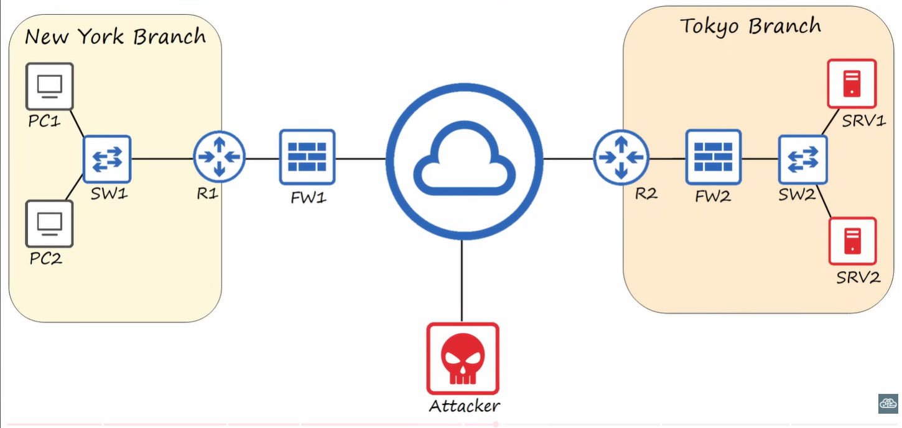
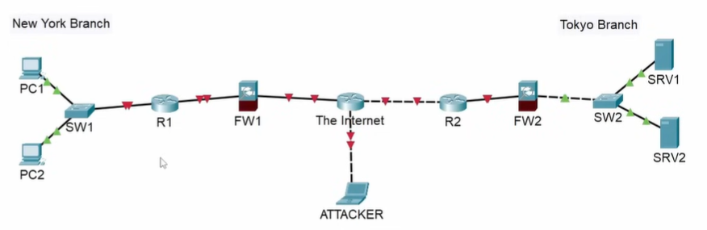

# Lab: Introduction to packet tracer 
## Sources
- **File:** Day 01 Lab - Packet Tracer Introduction.
- **Video:** https://www.youtube.com/watch?v=a1Im6GYaSno&list=PLxbwE86jKRgMpuZuLBivzlM8s2Dk5lXBQ&index=3

---
## Lab
instructions:
- create the network diagram displayed at 16:40 of the day 1 video.
- use the following devices:
cisco 2911 routers (x2)
cisco 2960 switches (x2)
cisco 5505 firewalls (x2)
PC's (x2)
Servers (x2)

(!) use a laptop as the 'attacker' in the diagram.
(!) **connect the devices together using packet tracer's auto choose connection type function**

---
## Solution
