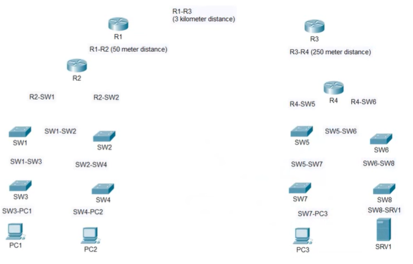
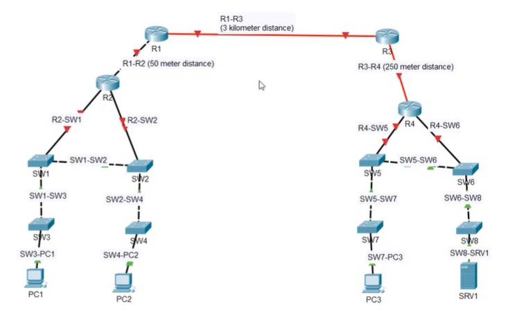

# Lab: Connecting Devices  
**Connect the network devices together according to the labels.**  
Assume **Auto‑MDI‑X is disabled**.  
Packet Tracer maakt geen onderscheid tussen single‑mode en multimode fiber, maar in real‑life moet je dat wél doen.

## 1. End Devices → Switches (straight‑through)

### Verbindingen
- PC1 → SW3  
- PC2 → SW3  
- PC3 → SW7  
- SRV1 → SW8  

### Kabel  
**Straight‑through**

### Waarom?  
**PC’s & servers (end devices):**  
- Tx: pins **1–2**  
- Rx: pins **3–6**

**Switches (intermediate devices):**  
- Tx: pins **3–6**  
- Rx: pins **1–2**

Tx ↔ Rx staan al correct → **straight‑through**.

## 2. Switch ↔ Switch (crossover)

### Verbindingen
- SW3 → SW1  
- SW4 → SW2  
- SW7 → SW5  
- SW8 → SW6  

### Kabel  
**Crossover**

### Waarom?  
Switch ↔ Switch = **zelfde type device**  
→ beide zenden op **3–6**  
→ beide ontvangen op **1–2**

Dus Tx ↔ Rx moet gekruist worden → **crossover**.

## 3. Switch → Router (straight‑through)

### Verbindingen
- SW1 → R2  
- SW2 → R2  
- SW5 → R4  
- SW6 → R4  

### Kabel  
**Straight‑through**

### Waarom?  
Routers gedragen zich elektrisch als **end devices**:  
- Router Tx: **1–2**  
- Router Rx: **3–6**

Switches zijn het omgekeerde → **straight‑through**.

## 4. Router ↔ Router (crossover + juiste media)

### R2 → R1 (50 m)
- **Crossover**
- **UTP** (50 m < 100 m)

### R4 → R3 (250 m)
- **Crossover**
- **Multimode fiber** (250 m > 100 m)

### R1 → R3 (3 km)
- **Crossover**
- **Single‑mode fiber** (3 km > multimode max)

## Samenvattende tabel

| Verbinding | Type devices | Kabel | Media |
|-----------|--------------|--------|--------|
| PC ↔ Switch | verschillend | Straight‑through | UTP |
| Server ↔ Switch | verschillend | Straight‑through | UTP |
| Switch ↔ Switch | zelfde type | Crossover | UTP |
| Switch ↔ Router | verschillend | Straight‑through | UTP |
| Router ↔ Router (50 m) | zelfde type | Crossover | UTP |
| Router ↔ Router (250 m) | zelfde type | Crossover | Multimode fiber |
| Router ↔ Router (3 km) | zelfde type | Crossover | Single‑mode fiber |

## Result
