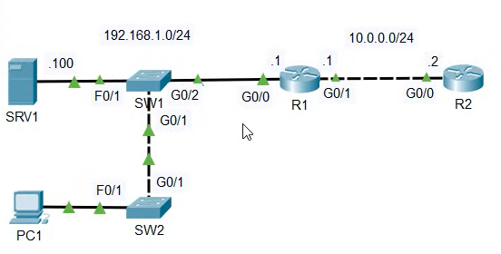

# Lab: Connecting Devices  
## Sources
- **File:** Day 03 Lab - OSI model.
- **Video:** https://www.youtube.com/watch?v=7nmYoL0t2tU

---
## Lab
I recommend viewing the YT demo first, if you don't know how to perform this tasks.

1. use 'simulation mode' to analyse the various traffic being sent throughout the network.
What layers of the OSI model are being used?

2. Release and renew PC1's IP address to generate some layer 7 traffic.
Analyse the traffic with simulation mode.

---
## Notes of observations pt.1
1. STP (Spanning Tree Protocol) and OSPF (Open Shortest Path First) protocols are used in the network.
   - **STP = OSI Layer 2 (Data Link)**  
   - **OSPF = OSI Layer 3 (Network)**  

2. Every component shows **Layer 1 (Physical)** and **Layer 2 (Data Link)** as active in the OSI Model tab, because all devices use physical signaling and Ethernet framing at all times.

3. Based on the simulation, **Layer 1, Layer 2, and Layer 3** are actively used:
   - Layer 1: physical signaling (always active)
   - Layer 2: Ethernet framing + STP
   - Layer 3: IP routing + OSPF

## Notes of observation pt.2

1. Executed the following commands on PC1 to trigger DHCP traffic:
   - `ipconfig /release`
   - `ipconfig /renew`

2. Two new DHCP messages appeared in Simulation Mode:
   - **DHCP Discover**
   - **DHCP Request**

3. Inspecting these packets shows that **Layer 1 t.e.m. Layer 4** are active:
   - **Layer 1 (Physical):** bits transmitted over the cable  
   - **Layer 2 (Data Link):** Ethernet frame, including MAC broadcast (e.g. FF:FF:FF:FF:FF:FF)  
   - **Layer 3 (Network):** IP broadcast (e.g. 255.255.255.255) and later unicast to the DHCP server  
   - **Layer 4 (Transport):** UDP is used (DHCP uses UDP ports 67 and 68)

4. DHCP itself is a **Layer 7 (Application)** protocol, but Packet Tracer only visualizes up to Layer 4 in the OSI inspection window.

5. In the modern **TCP/IP model**, Layers **5, 6, and 7** of the OSI model are combined into a single **Application Layer**.  
   - Therefore, DHCP is considered an **Application Layer protocol** in the TCP/IP model.

After continuing the simulation, additional protocol messages appeared:

- **ARP**: PC1 performs an ARP Request/Reply exchange to learn the MAC address of its default gateway after obtaining a new IP address.
- **ICMP**: Two ICMP messages appear (Echo Request and Echo Reply), triggered by automatic connectivity checks within the network.

These packets confirm that additional OSI layers are active:
- ARP uses Layer 2 and Layer 3 (MAC + IP resolution)
- ICMP operates at Layer 3 (Network)