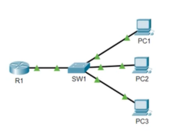

# Lab: Connecting Devices  
## Sources
- **File:** Day 04 Lab - basic device security.
- **Video:** https://www.youtube.com/watch?v=SDocmq1c05s

---
## Lab
1. Change the hostnames of the router and switch to the appropriate names (R1, SW1)
     ##Use the 'hostname' command in global configuration mode##

2.  Configure an unencrypted enable password of 'CCNA' on both devices

3. Exit back to user EXEC mode and test the password

4.  View the password in the running configuration

5. Ensure that the current password, and all future passwords, are encrypted

6. View the password in the running configuration

7. Configure a more secure, encrypted enable password of 'Cisco' on both devices

8. Exit back to user EXEC mode and then return to privileged EXEC mode.
    Which password do you have to use?

9. View the passwords in the running configuration.
     What encryption type number is used for the encrypted 'enable password'?
     What encryption type number is used for the encrypted 'enable secret'?

10. Save the running configuration to the startup configuration



---
1. 
    - ```en``` or ```en``` and then TAB or ```enable```
    - ```config t``` or ```config terminal``` or ```config``` and then type *terminal*
    - ```hostname R1``` (on router)
    - ```hostname SW1``` (on switch)

2. ```enable```, ```config t```, 
```enable password ccna``` *(not encrypted)*
3. ```exit```, ```exit``` (out of config mode, and then out of ... mode)
4. View the password in the running configuration:
   - `do show running-config`
   - The line will appear as:
       enable password ccna
     (This password is **NOT encrypted** and is visible in plain text.)

5. Ensure that the current password, and all future passwords, are encrypted:
   - Enter global configuration mode:
       `conf t`
   - Enable password encryption:
       `service password-encryption`
   - This encrypts all *type 7* passwords (weak reversible encryption).

6. View the password in the running configuration again:
   - `do show running-config`
   - Now the line appears as:
       enable password 7 <encrypted-string>
     (Type 7 encryption applied.)

7. Configure a more secure, encrypted enable password of 'Cisco':
   - Still in global config mode:
       `enable secret Cisco`
   - This creates a **type 5 or type 9** hash (strong, non‑reversible).

8. Exit back to user EXEC mode and return to privileged EXEC mode:
   - `exit`
   - `exit`
   - Now type:
       `enable`
   - **Which password must you use?**
       → You must use **Cisco** (the *enable secret* overrides the enable password).

9. View the passwords in the running configuration:
   - `show running-config` or `do show running-config`
   - You will see:
       enable password 7 <type7string>
       enable secret 5 <type5hash>
     - **enable password** → **type 7** (weak, reversible)
     - **enable secret** → **type 5** (or type 9 on newer IOS) (strong, non‑reversible)

10. Save the running configuration to the startup configuration:
    - `write`
    or
    - `write memory`
    or
    - `copy running-config startup-config`