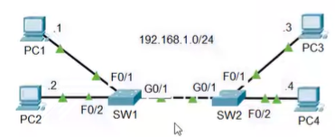
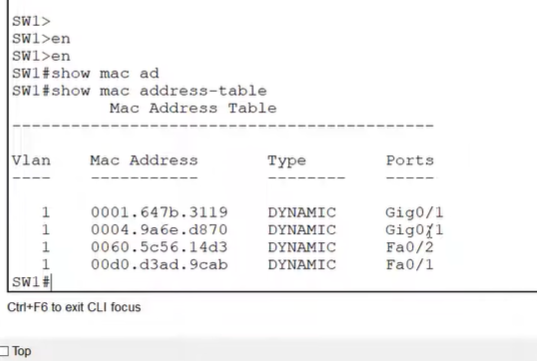

# Lab: Ethernet LAN Switching
## Sources
- **File:** Day 06 Lab - Ethernet LAN Switching
- **Video:** https://www.youtube.com/watch?v=Ig0dSaOQDI8

---
## Lab
Both switches have an empty MAC address table, and all PCs have an empty ARP table.
1. if PC1 pings to PC3, what messages will be sent over the network, and which devices receive them?
2. send the ping and use packet tracer's 'sim mode' to verify the anwsers.
3. use pings to generate network traffic and allow the switches to learn the MAC addresses of all PCs on the network.
4. use 'show' commands on the switches to identify the MAC address of each PC.
5. Clear the dynamic MAC addresses from the MAC address table of each switch.



---
## Notes / Anwsers
(1.) **If PC1 pings PC3, what messages will be sent over the network, and which devices receive them?**

   ### Step-by-step:
   - PC1 wants to ping PC3 → needs MAC address of PC3.
   - ARP table is empty → PC1 sends **ARP Request (broadcast)**.
   - Broadcast MAC: `FF:FF:FF:FF:FF:FF`.
   - All devices in the same LAN receive it:
     - PC1 (self)
     - PC2
     - PC3
     - PC4
     - SW1
     - SW2  
   - Switches **flood** the broadcast out all ports.
   - PC3 recognizes its IP and sends **ARP Reply (unicast)** back to PC1.
   - Switches learn MAC addresses from the **source MAC** of each frame.
   - After ARP is complete:
     - PC1 sends **ICMP Echo Request (unicast)** to PC3.
     - PC3 replies with **ICMP Echo Reply (unicast)**.

(2.) **send the ping and use packet tracer's 'sim mode' to verify the anwsers.**
```ping 192.168.1.3``` on PC1 (command prompt)

(3.) **use pings to generate network traffic and allow the switches to learn the MAC addresses of all PCs on the network.**

- PC1 → ping → PC2
- PC1 → ping → PC3
- PC1 → ping → PC4
- PC2 → ping → PC3
- PC2 → ping → PC4
- PC3 → ping → PC4

(4.) **use 'show' commands on the switches to identify the MAC address of each PC.**
```enable```
```show mac address-table```
The switch displays a table containing:

- **VLAN**  
- **MAC Address** (the source MAC the switch learned)  
- **Type** (dynamic/static)  
- **Port** (the interface where the MAC was learned)



(5.) **Clear the dynamic MAC addresses from the MAC address table of each switch.**

`clear mac address-table dynamic`

This command removes all dynamically learned MAC addresses from the switch’s MAC address table.  
It forces the switch to “forget” all learned MAC-to-port mappings so it must relearn them from new incoming traffic.

*in packet tracer you cannot delete one specific MAC address if you want.*