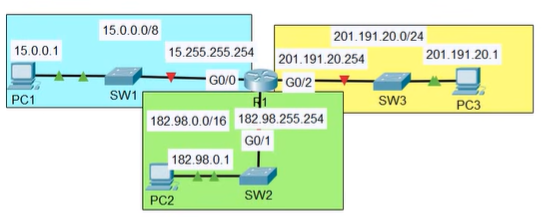
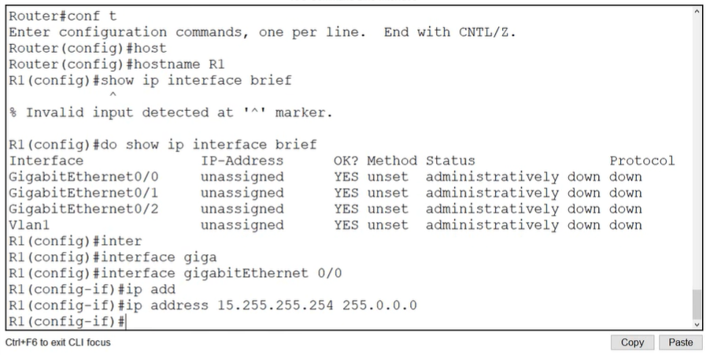
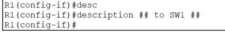
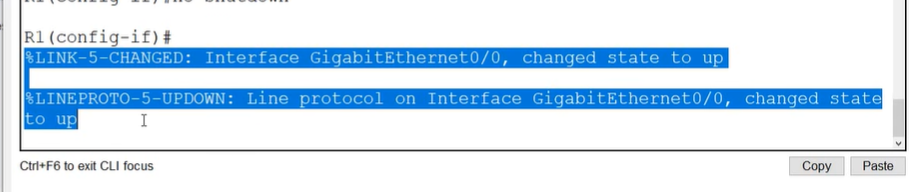
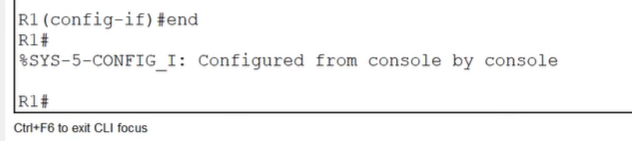
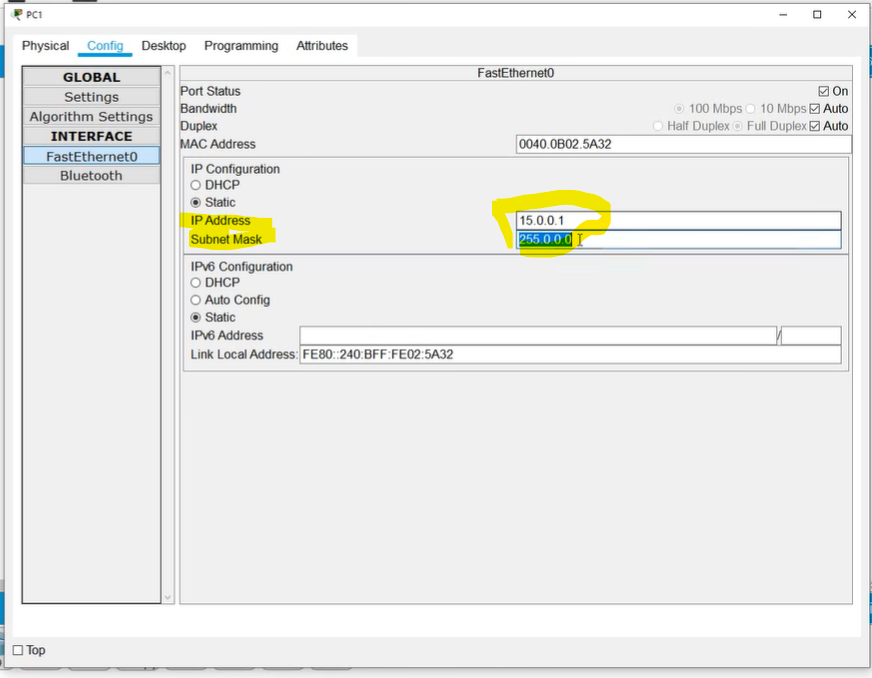

# Lab: Config IPv4 Addresses
## Sources
- **File:** Day 08 Lab - IPv4 addresses
- **Video:** https://www.youtube.com/watch?v=e1jbvyMeS5I

---
## Lab

1. Configure R1's hostname
2. use a 'show' command to view list of R1s interfaces, IP addresses, status etc
3. configure the appropiate IP addresses on R1's interface and enable the interfaces. Configure appropiate interface descriptions.
4. use a 'show' command to verify R1's interfaces again.
5. view the running config to confirm the config changes, then save the config.
6. configure the IP addresses of PC1, PC2, PC3
7. Ping from PC1 to PC2 and PC3 to test connectivity.



---
## Lab solution
(1.) **Configure R1's hostname**
commands:
```
enable
configure terminal
hostname R1
```
(2.) **use a 'show' command to view list of R1s interfaces, IP addresses, status etc**
`show ip interface brief`

(3.) **configure the appropiate IP addresses on R1's interface and enable the interfaces. Configure appropiate interface descriptions.**



`no shutdown` command


etc for the rest...

`end` command


(4.) **use a 'show' command to verify R1's interfaces again.**
`show ip interface brief`

(5.) **view the running config to confirm the config changes, then save the config.**
commands:
```
show running-config
copy running-config startup-config
```

(6.) **configure the IP addresses of PC1, PC2, PC3**

```
copy running-config start
write mem (or wr)
```


same for PC2 and PC3

(7.) **Ping from PC1 to PC2 and PC3 to test connectivity**
Expected behavior:

- First ping triggers ARP (may show 1–2 timeouts)
- After ARP resolution:
  - PC1 → PC2 = **success**
  - PC1 → PC3 = **success**

Because R1 now routes between all three networks.