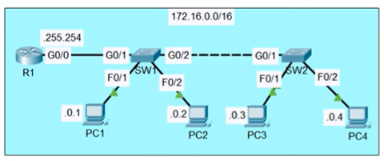

# Lab: Config Switch Interfaces
## Sources
- **File:** Day 09 Lab - Switch interfaces
- **Video:** https://www.youtube.com/watch?v=rzDb5DoBKRk

---

## Lab
1. Configure the hostname of R1, SW1 and SW2
2. COnfigure the appropiate IP addresses on R1, PC1, PC2, PC3, PC4
3. Manually configure the speed and duplex on interfacees connected to other networking devies (not end hosts)
4. Configure appropiate descriptions on each interface
5. disable interfaces which are not connected to other devices
6. Save the configs



---

### 1. Configure Hostnames

### R1
```
enable  
configure terminal  
hostname R1
```

### SW1
```
enable  
configure terminal  
hostname SW1  
```

### SW2
```
enable  
configure terminal  
hostname SW2  
```
### 2. Configure IP Addresses

#### R1 – Interface to SW1
```
interface g0/0  
 ip address 172.16.255.254 255.255.0.0  
 no shutdown  
 description Link to SW1  
```

- `no shutdown` set the interface on and activate the link
- `ip address 172.16.255.254 255.255.0.0` gives interface an IP address and subnetmask. 172.16.255.254 /16
- default gateway for PC1, PC2, PC3, PC4 on router R1
- We set a default gateway so a device knows where to send traffic for destinations outside its own network.
If a PC wants to reach an IP that is not in the same subnet, it cannot deliver the packet directly.
So it sends the packet to the default gateway, which is the router interface in that network.
The router then forwards the packet toward the correct destination.

> ⚠️ **Note:**  
> On real Cisco devices, an interface that is connected and enabled will show **up/up**.  
> In Cisco Packet Tracer, the same interface may show **up/down** until the *other side* is also configured and enabled.  
> This is normal behavior in the simulator.


#### PC1  
IP: 172.16.0.1  
Mask: 255.255.0.0  
Gateway: 172.16.255.254  

#### PC2  
IP: 172.16.0.2  
Mask: 255.255.0.0  
Gateway: 172.16.255.254  

#### PC3  
IP: 172.16.0.3  
Mask: 255.255.0.0  
Gateway: 172.16.255.254  

#### PC4  
IP: 172.16.0.4  
Mask: 255.255.0.0  
Gateway: 172.16.255.254  


### 3. Manually Configure Speed & Duplex (uplinks only)

#### SW1 → R1
```
interface g0/0  
 speed 1000  
 duplex full  
 description Uplink to R1  
 ```

#### SW1 → SW2
```
interface g0/2  
 speed 1000  
 duplex full  
 description Uplink to SW2  
 ```

#### SW2 → SW1
```
interface g0/1  
 speed 1000  
 duplex full  
 description Uplink to SW1  
 ```


### 4. Configure Interface Descriptions

#### SW1
```
interface f0/1  
 description PC1  
 ```
```
interface f0/2  
 description PC2  
```
```
interface g0/0  
 description Link to R1  
```
```
interface g0/2  
 description Link to SW2  
```
#### SW2
```
interface f0/1  
 description PC3  
```
```
interface f0/2  
 description PC4  
```
```
interface g0/1  
 description Link to SW1  
```


### 5. Disable Unused Interfaces

#### SW1
```
interface range f0/3 - 24  
 shutdown  
 description UNUSED  
 ```

#### SW2
```
interface range f0/3 - 24  
 shutdown  
 description UNUSED  
```


### 6. Save Configurations
```
end  
```
```
write memory  
```
-- or --  
```
copy running-config startup-config  
```