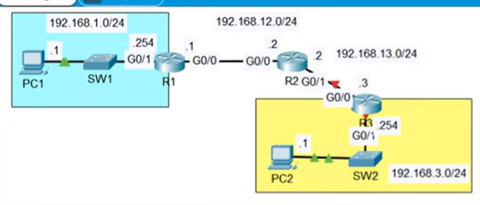

# Lab: Config static routes
## Sources
- **File:** Day 11 Lab - configuration static routes
- **Video:** https://www.youtube.com/watch?v=XHxOtIav2k8

---
## Lab
All devices have NO pre-configurations:
1. configure the PCs and routers according to the network diagram (hostnames, IP addresses, etc.)
(You don't have to configure the switches)
2. Configure static routes on the routers to enable PC1 to succesfully ping PC2.



---

## Solution

### Why we configure IP address, subnet mask, and default gateway
To understand static routing, each device must have these three settings correctly applied.

#### IP Address — “Who am I?”
The IP address uniquely identifies a device in a network.  
Example:  
- PC1 = 192.168.1.1  
- R1 interface = 192.168.1.254  

Without an IP address, a device cannot communicate at Layer 3.

#### Subnet Mask — “Who is in my local network?”
The subnet mask tells a device which IP addresses are considered local.  
Example:  
`255.255.255.0` means:  
- 192.168.1.x is local to PC1  
- 192.168.3.x is not local  

If a destination is not local, the device must send the packet to a router.

#### Default Gateway — “Where do I send traffic that is not local?”
A PC can only directly communicate with devices in the same subnet.  
Everything outside the subnet must be sent to the default gateway, which is the router interface in that network.

Example:  
- PC1 sends non-local traffic to 192.168.1.254 (R1)  
- PC2 sends non-local traffic to 192.168.3.254 (R3)  

The router then forwards the packet toward the correct destination network.

This is essential for end‑to‑end communication:  
PC1 → R1 → R2 → R3 → PC2  
and back.

### Device Configuration

#### PC1
IP: 192.168.1.1  
Mask: 255.255.255.0  
Gateway: 192.168.1.254  

#### PC2
IP: 192.168.3.1  
Mask: 255.255.255.0  
Gateway: 192.168.3.254  

### Router R1
```
enable
configure terminal
hostname R1

interface g0/0
ip address 192.168.1.254 255.255.255.0
no shutdown

interface g0/1
ip address 192.168.12.1 255.255.255.0
no shutdown
```

### Router R2
```
enable
configure terminal
hostname R2

interface g0/0
ip address 192.168.12.2 255.255.255.0
no shutdown

interface g0/1
ip address 192.168.13.2 255.255.255.0
no shutdown
```

### Router R3
```
enable
configure terminal
hostname R3

interface g0/0
ip address 192.168.13.3 255.255.255.0
no shutdown

interface g0/1
ip address 192.168.3.254 255.255.255.0
no shutdown
```

### Static Routes

#### R1 → route to PC2 network (192.168.3.0/24)
`ip route 192.168.3.0 255.255.255.0 192.168.12.2`

**Purpose:** R1 only knows its directly connected networks (192.168.1.0/24 and 192.168.12.0/24).  
To reach PC2’s network (192.168.3.0/24), R1 must forward traffic to R2, which is the next router in the path.  
This route tells R1: *“Send all traffic for 192.168.3.x to R2 (192.168.12.2).”*

#### R2 → route to PC1 network (192.168.1.0/24)
`ip route 192.168.1.0 255.255.255.0 192.168.12.1`

**Purpose:** R2 sits in the middle and must route traffic in both directions.  
This route tells R2 how to reach PC1’s network by sending traffic back toward R1.  
Without this, return traffic from PC2 → PC1 would fail.

#### R2 → route to PC2 network (192.168.3.0/24)
`ip route 192.168.3.0 255.255.255.0 192.168.13.3`

**Purpose:** R2 must also know how to reach PC2’s network.  
This route tells R2 to forward traffic toward R3, which directly connects to 192.168.3.0/24.

#### R3 → route to PC1 network (192.168.1.0/24)
`ip route 192.168.1.0 255.255.255.0 192.168.13.2`

**Purpose:** R3 only knows its directly connected networks (192.168.13.0/24 and 192.168.3.0/24).  
To reach PC1’s network, R3 must send traffic back toward R2.  
This ensures the return path PC2 → PC1 works correctly.

---
Routers only know two types of networks automatically:
1. Directly connected networks (networks on their own interfaces)
2. Local interface addresses

Internet routers can reach everything because they run dynamic routing protocols (like BGP) that constantly exchange routes.
Your lab routers do not run any routing protocol, so they only know their directly connected networks.
Without static routes (or a dynamic protocol), they cannot reach remote networks.