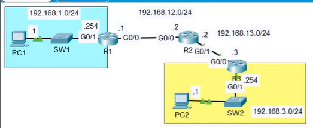

# Lab: Troubleshooting static routes
## Sources
- **File:** Day 11 Lab - troubleshooting static routes
- **Video:** https://www.youtube.com/watch?v=3z8YGEVFTiA

---
## Lab
PC1 and PC2 are unable to ping eachother.
There is one misconfiguration on each router.
Find and fix the misconfigurations.
You have succesfully completed the lab when PC1 and PC2 can ping eachother.

---
## observations & solutions
- show ip iterface brief (R1)
   - botg G0/0 and G0/1 are up/up
- show ip route (R1)
    - 192.168.3.0/24 [1/0] (PC2 network)"via 192.168.12.3" is wrong, should be "via 192.168.12.2" because that's R2 G0/0 port where we want to communicate with.

- show ip iterface brief (R2)
    - all correct
- show ip route (R2)
    - 2 static routes defined
    - 192.168.3.0/24  is directly connected, G0/0
        - is wrong
        - must be G0/1 (outgoing port)
- show ip interface brief (R3)
    - both are up/up
    - misconfiguration is G0/0 should not be 192.168.23.3 but 192.168.13.3 

fixed, ping command works from PC1 to PC2.