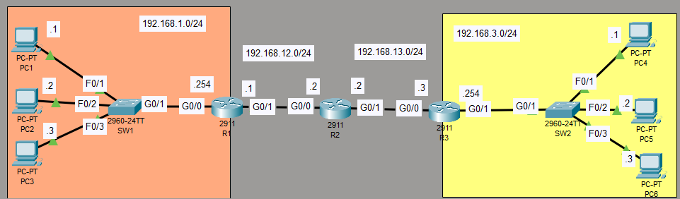

# Lab: Life of a packet
## Sources
- **File:** Day 12 Lab - Life of a packet
- **Video:** https://www.youtube.com/watch?v=bfsEqDeHbpI

---
## Lab
1. PC1 pings PC4.  
Identify the src/dst MAC address at each specified point in the route to PC4.
Identify the MAC address by the device and interface (ie. the MAC of R1 G0/0)
A. Source/Destination MAC at PC1 → SW1 segment
B. Source/Destination MAC at SW1 → R1 segment
C. Source/Destination MAC at R1 → R2 segment
D. Source/Destination MAC at R2 → R3 segment
E. Source/Destination MAC at R3 → SW2 segment
F. Source/Destination MAC at SW2 → PC4 segment

Use the CLI and Packet Tracer's simulation mode to verify your answers.
(Before you enter simulation mode, ping once to complete ARP/the MAC learning process.)

2. PC1 pings PC3.
Identify the src/dst MAC address at each specified point in the route to PC3.
Identify the MAC address by the device and interface (ie. the MAC of R1 G0/0)
A. Source/Destination MAC at PC1 → SW1
B. Source/Destination MAC at SW1 → PC3

Use the CLI and Packet Tracer's simulation mode to verify your answers.
(Before you enter simulation mode, ping once to complete ARP/the MAC learning process.)

3. PC4 pings PC1.
Identify the src/dst MAC address at each specified point in the route to PC1.
Identify the MAC address by the device and interface (ie. the MAC of R1 G0/0).

---

## Observations & Solution
### 1. PC1 pings PC4
PC1 -- SW1 -- R1
- SW1 only has MAC addresses per VLAN (per SVI as VLAN-interface)
- R1 has MAC address per L3-interface
- PC1 has one MAC address (per NIC or network card)

PC1 --> PC4 *(traffic left to right)*
| Segment | Source MAC | Destination MAC |
| --- | --- | --- |
| PC1 → SW1 → R1 | PC1 NIC | **R1 G0/0** |
| R1 → R2 | **R1 G0/1** | R2 G0/0 |
| R2 → R3 | **R2 G0/1** | R3 G0/0 |
| R3 → SW2 → PC4 | **R3 G0/1** | PC4 NIC |

PC's:
- `ping <IP-address>`
- `ip-config /all` (check physical address)

Routers: CLI (PC --> PC4)
- `enable` (priviledged EXEC mode)
- `show interfaces g0/0` 
(dest in every broadcast domain)
- `show interfaces g0/1` 
(src in every broadcast domain)

> (!) SW1 will have PC1 MAC as src and R1 MAC as dest

### 2. PC1 pings PC3

Same broadcast domain.

| Segment | Source MAC | Destination MAC |
| --- | --- | --- |
| A. PC1 → SW1 | **PC1 NIC** | **PC3 NIC** |
| B. SW1 → PC3 | **PC1 NIC** | **PC3 NIC** |

Check only PC1 and PC3 their ipconfig /all.

### 3. PC4 pings PC1 

Think right to left.
interfaces as dest/src switches in other direction than when PC1 --> PC4.

| Segment | Source MAC | Destination MAC |
| --- | --- | --- |
| PC4 → SW2 → R3 | PC4 NIC | **R3 G0/1** |
| R3 → R2 | **R3 G0/0** | **R2 G0/1** |
| R2 → R1 | **R2 G0/0** | **R1 G0/1** |
| R1 → SW1 → PC1 | **R1 G0/0** | PC1 NIC |