# Network Devices

This section introduces the core devices that form a network and explains the role each one plays in moving data.  
You’ll learn what nodes, routers, switches, hubs, and access points do, how they differ, and how they interact within a network.  
The goal is to understand the function of each device at a high level before diving deeper into configuration and protocols.

- **Jeremy's IT Lab** — [Video](https://www.youtube.com/watch?v=H8W9oMNSuwo)

---

## Definition of a Network
**"A computer network is a digital telecommunications network which allows nodes to share resources."** - Wikipedia

## Network Diagram

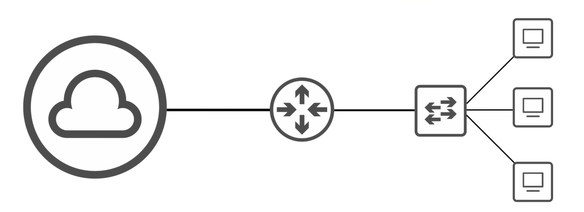

### Network Devices Overview

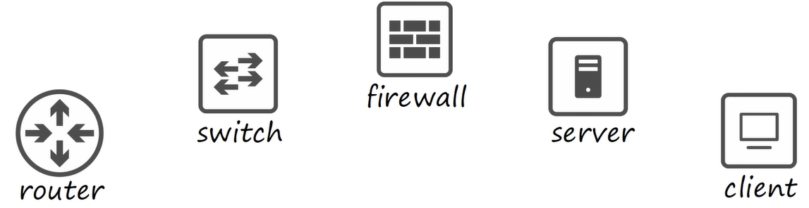

- **Nodes**: Any device that can send or receive data (e.g., computers, smartphones, printers).
- **Client**: A device that requests services or resources from a server.
- **Server**: A device that provides services or resources to clients over a network.
- **Router**: Connects different networks together and directs data between them.
- **Switch**: Connects devices within the same network and manages data traffic to ensure efficient communication.
- **Firewall**: A security device that monitors and controls incoming and outgoing network traffic based on predetermined security rules.
- **Internet**: A global network that connects millions of private, public, academic, business, and government networks.

## Demonstration of Network Devices
### Two Clients
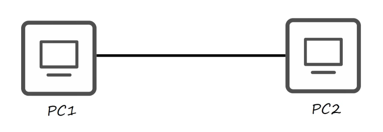

Connect 2 pcs (e.g. nodes) together with a connection, we can see that they can communicate with each other.
They can share resources, such as files or just send messages to each other.

However, if we want to connect more than 2 devices together, we need a device that can manage the communication between them.
This is where a switch comes in. A switch allows multiple devices to connect to each other and manages the communication between them. It ensures that data is sent to the correct device and prevents data collisions.

A client can be a phone, tablet, computer, laptop or any device that can **connect to a network and request services from a server.**

Definition of a client is: 
A client is **a device that accesses a service made available by a server.**

Definition of a server is:
A server is **a device that provides functions or services for clients.**

### Client-Server Model
#### 2 Clients, 1 acts as a server
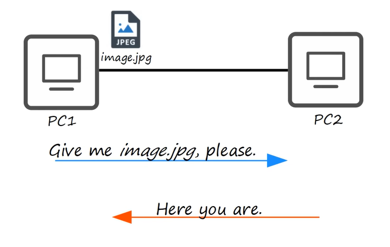

- PC1 and PC2 are clients (e.g. nodes) that are connected to eachother. 

- PC1 requests a service from PC2, which is acting as a server. The server processes the request and sends the appropriate response back to the client.

### Client and Server
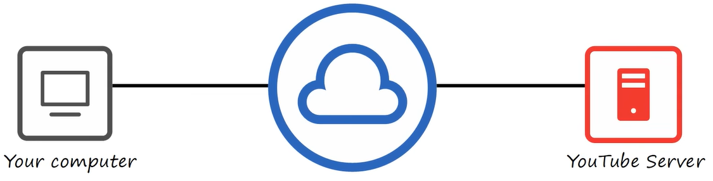

- 'Your Computer' is a client that is connected to the internet. It can access various services provided by servers on the internet, such as websites, email, and cloud storage.
- 'Youtube Server' is a server that hosts the YouTube website and provides video streaming services to clients like 'Your Computer'.

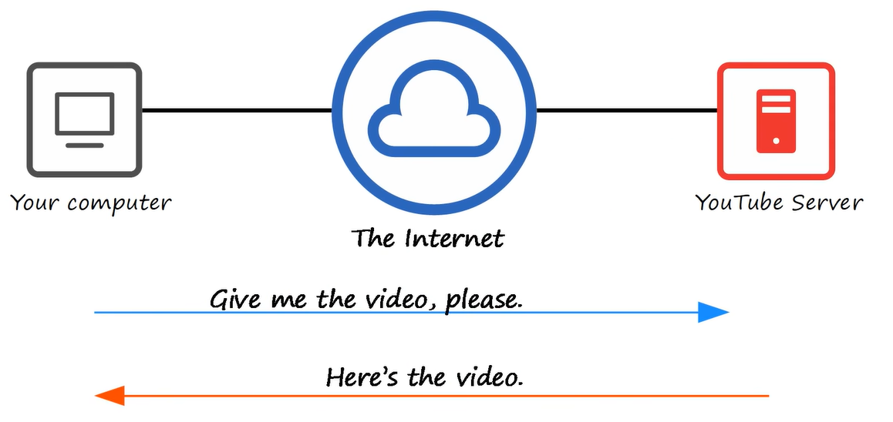
'Your Computer' does the requesting, while 'Youtube Server' does the responding. The client (Your Computer) sends a request to the server (Youtube Server) for a specific video, and the server processes that request and sends the video back to the client for viewing.

### Bluetooth
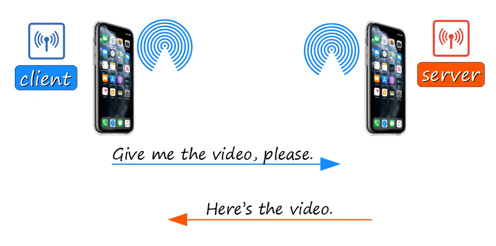
- Bluetooth is a wireless technology that allows devices to connect and communicate with each other over short distances.
- In this example, a smartphone acts as the server, while another acts a client requesting a service from the server. 

### Switches connected to the internet
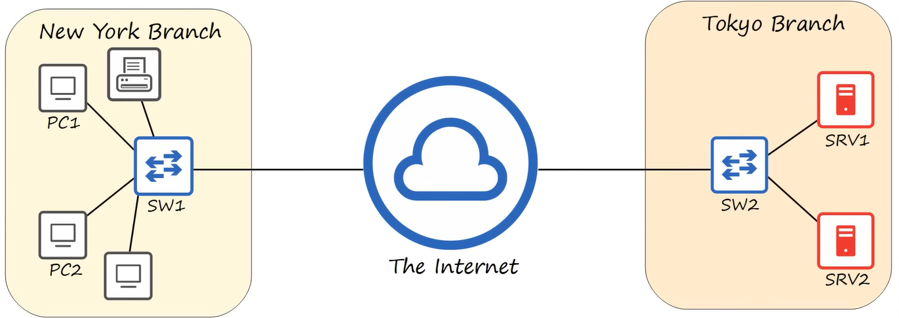
Both branches are having their own local network (LAN = Local Area Network) and they are connected to the internet (WAN = Wide Area Network). The switch in each branch allows the devices within that branch to communicate with each other.

**But without a router, the two branches cannot communicate with each other because they are on different networks. The router is needed to connect the two branches together and allow them to communicate with each other.**

#### Switch
- have many network interfaces/ports for end hosts to connect to (usually 4, 8, 16, 24, or 48 ports)
- provide connectivity between end hosts and other network devices (e.g. routers, firewalls) within the same network (LAN)

### Routers connected to the internet
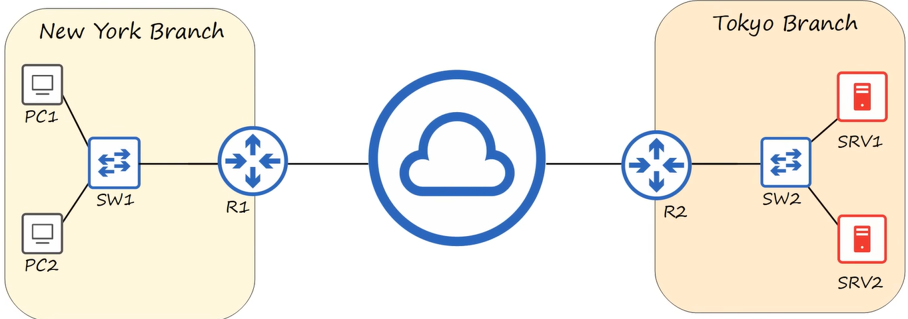

Now 2 LAN networks can communicate with each other through the internet (WAN) because both LAN networks are connected to the internet through their respective routers. The routers allow the devices within each LAN to communicate with devices on the other LAN and with devices on the internet.

The router also manages the traffic between the local network and the internet, ensuring that data is sent to the correct destination and that the local network is protected from unauthorized access.

#### Router
- have fewer network interfaces/ports than switches (usually 2-4 ports)
- provide connectivity between different networks (e.g. LANs, WANs) and manage traffic between them
- often include additional features such as firewall protection, network address translation (NAT), and virtual private network (VPN) support

### Firewall in between the internet and the local network
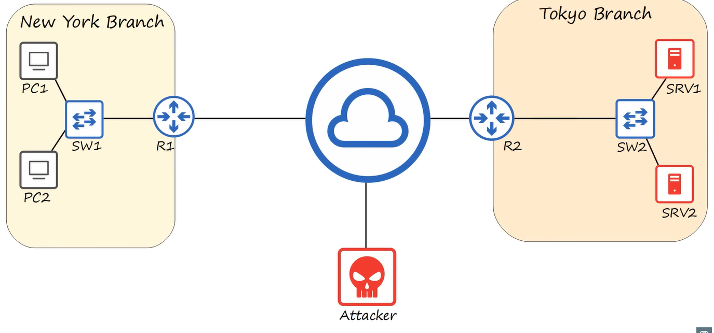

A firewall is a security device that monitors and controls incoming and outgoing network traffic based on predetermined security rules. It acts as a barrier between a trusted internal network (e.g., a local network) and an untrusted external network (e.g., the internet).

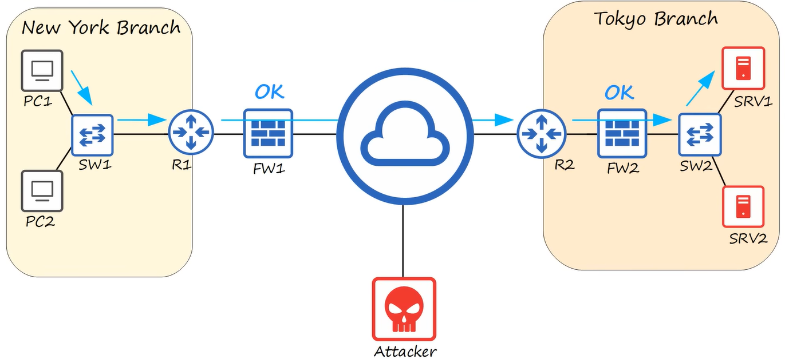
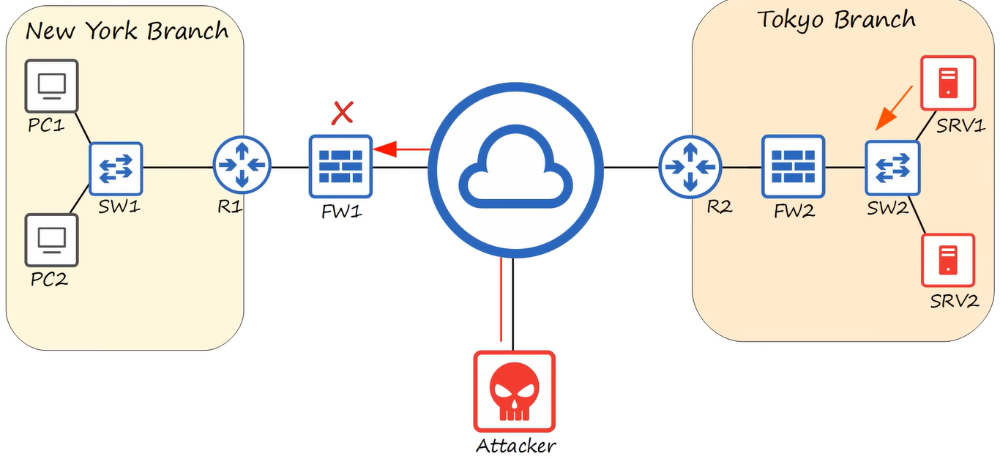

#### Firewall
- monitor and control network traffic based on configured rules.
- can be placed 'inside' or 'outside' the network, depending on the security needs of the organization.µ
- can be implemented as hardware devices, software applications, or a combination of both.
- can be configured to allow or block specific types of traffic based on factors such as source/destination IP address, port number, protocol, and content.
- can be used to protect against various types of cyber threats, such as unauthorized access, malware, and denial-of-service attacks.

- are known as 'Next-generation Firewalls' (NGFW) when they include advanced features such as intrusion prevention, application control, deep packet inspection and advanced filtering capabilities.

##### Host-based firewall
Are software apps installed on individual devices (e.g., computers, servers) to protect them from unauthorized access and threats. They monitor and control incoming and outgoing traffic on the specific device they are installed on.
It filters traffic within the device itself on the entering and exiting a host machine, like a PC.

##### Network-based firewall
Are hardware devices that filter traffic between networks.

