# Interfaces and Cables

This section covers the physical layer fundamentals of networking: the different types of network interfaces, cable categories, connectors, and how devices physically connect to each other.  
You’ll learn what each cable type is used for, how to identify them, and how interfaces operate at Layer 1 of the OSI model.

- **Jeremy's IT Lab** — [Video](https://www.youtube.com/watch?v=ieTH5lVhNaY)

---

## Backside of a switch
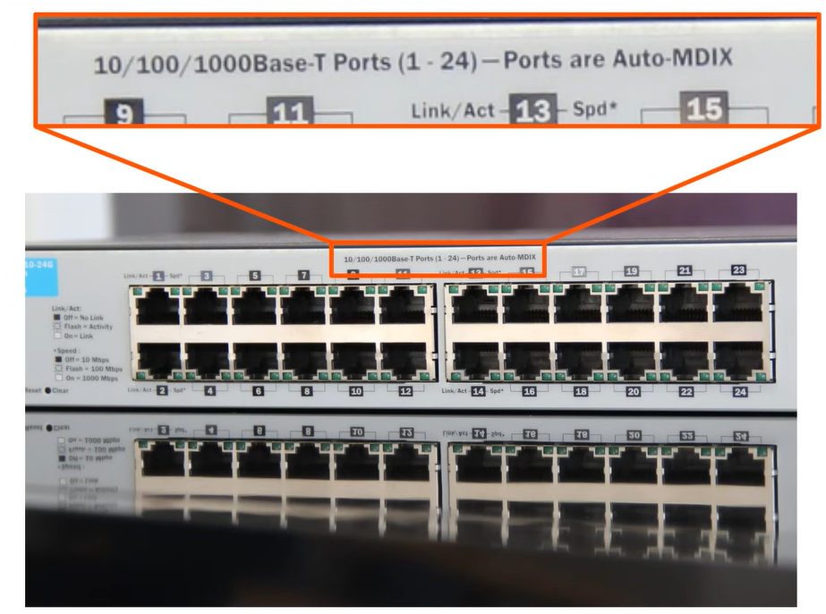

We can see that those ports has the shape of RJ-45 (registered jack 45) ports for Ethernet cables

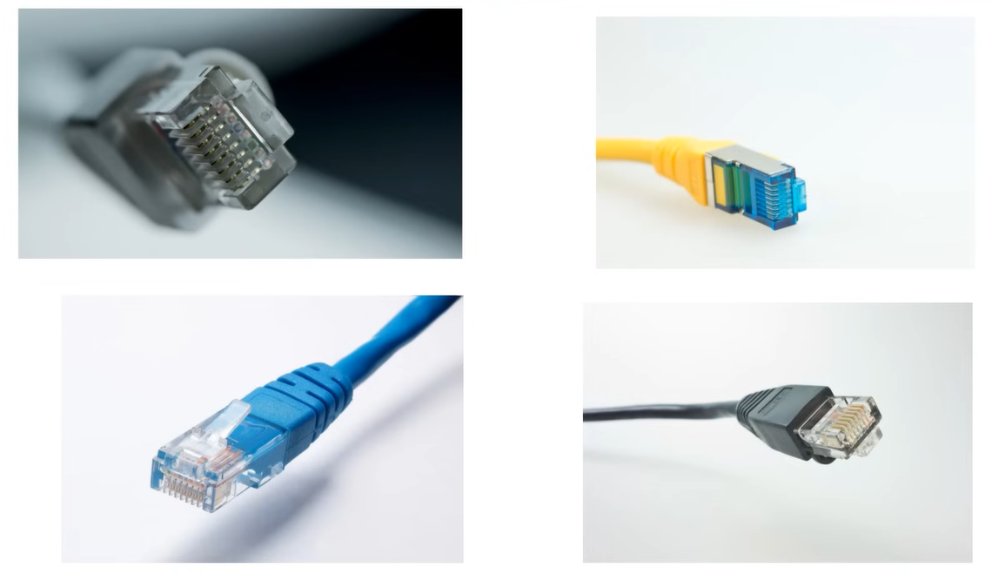

Above in the image we can see the different types of Ethernet cables. All of them has the RJ-45 connector.

Cables can be made out of **copper** (twisted pair cables such as UTP/STP) or **fiber optic**.

- **Copper twisted pair (UTP/STP)** is used for short distances (up to 100 meters) and uses RJ‑45 connectors.
- **Fiber optic cables** are used for long distances and high bandwidth.
- **Coaxial cables** are another type of copper cable, but they are *not* used for modern Ethernet. They were used in older Ethernet standards and are still used for cable TV and modems.

## Ethernet
Ethernet is a collection of network protocols/standards.

## Bits & bytes
- 1 bit = 0 or 1
- 1 byte = 8 bits
- 1 kilobyte (KB) = 1024 bytes
- 1 megabyte (MB) = 1024 KB
- 1 gigabyte (GB) = 1024 MB
- 1 terabyte (TB) = 1024 GB
- 1 petabyte (PB) = 1024 TB
- 1 exabyte (EB) = 1024 PB
- 1 zettabyte (ZB) = 1024 EB
- 1 yottabyte (YB) = 1024 ZB

AND
- 1 kilobits (Kb) = 1000 bits
- 1 megabits (Mb) = 1000 Kb or 1,000,000 bits
- 1 gigabits (Gb) = 1000 Mb or 1,000,000,000 bits
- ...

Speed is measured in bits per second (bps, Mbps, Gbps, etc.), while storage is measured in bytes. For example, a 100 Mbps (megabits per second) connection can transfer 100 million bits per second, which is equivalent to 12.5 MBps (megabytes per second) of data transfer speed.

## Ethernet Standards
Defined in the IEEE 802.3 standard
- IEEE = Institute of Electrical and Electronics Engineers
- 802.3 = Ethernet standard

### Copper
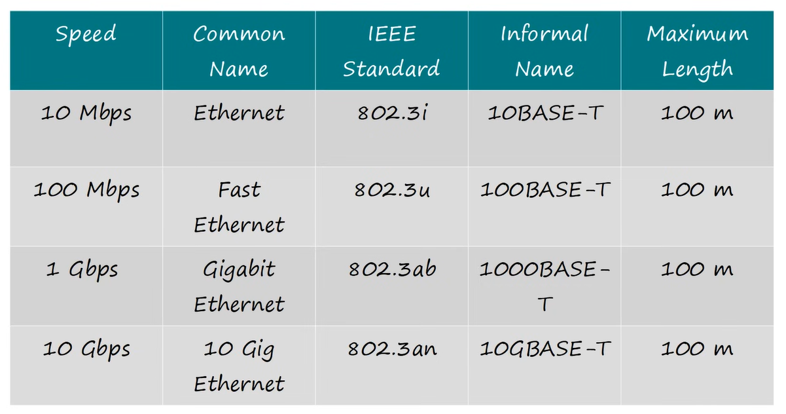

## UTP Cables
UTP = Unshielded Twisted Pair

- Unshielded: no shielding to protect against electromagnetic interference (EMI)
- Twisted Pair: pairs of wires twisted together to reduce crosstalk and EMI
- Commonly used for Ethernet connections in LANs

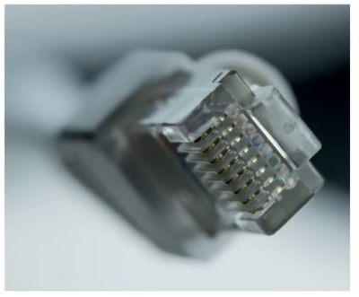
- includes 8 pins on the connector, which are used to transmit and receive data.
- The wires inside the cable are twisted in pairs to reduce interference and crosstalk between the wires. Each pair of wires is color-coded for easy identification.

### Ethernet standards and pinouts
#### 10Base‑T (10 Mbps)
- Uses 2 twisted pairs
- So 4 of the 8 pins
- Pins used: 1, 2, 3, 6

#### 100Base‑T (100 Mbps)
- Same as 10 Mbps
- Uses 2 twisted pairs
- Pins used: 1, 2, 3, 6

#### 1000Base‑T (1 Gbps)
- Uses all 4 twisted pairs
- So all 8 pins
- Pins used: 1 through 8

#### 10GBase‑T (10 Gbps)
- Uses all 4 twisted pairs
- So all 8 pins

### UTP Cables, 10-Base-T & 100-Base-T
#### Full Duplex
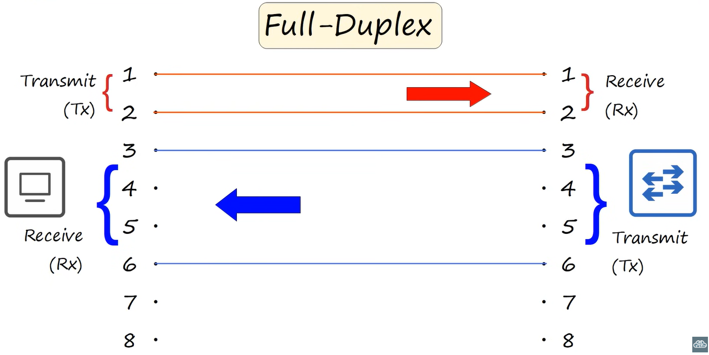
- Full Duplex: can transmit and receive data at the same time
- TX = Transmit
- RX = Receive

PC sends on pins 1 and 2 and receives on pins 3 and 6. The switch does the opposite: it receives on pins 1 and 2 and sends on pins 3 and 6.
Twisted pairs works with 2 cable connections. One for transmitting and one for receiving.

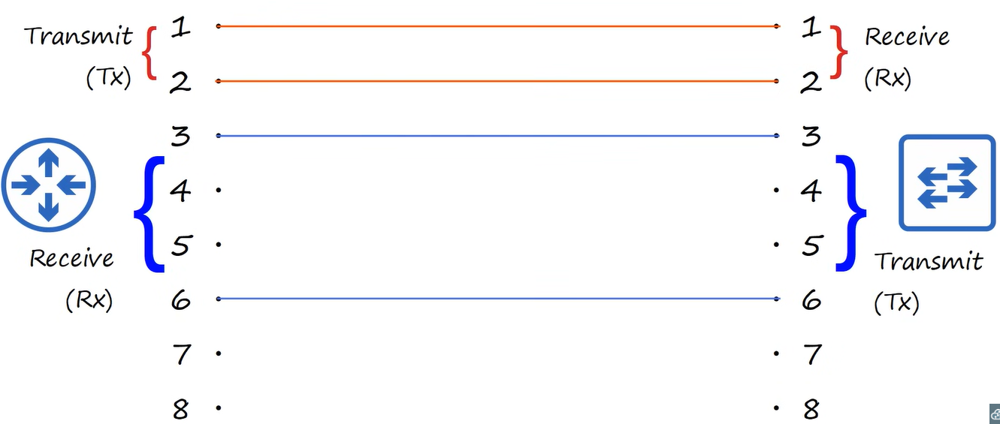
Same thing for Router and Switch connection. Router sends on pins 1 and 2, receives on pins 3 and 6. Switch does the opposite.

#### Straight-trough Cable
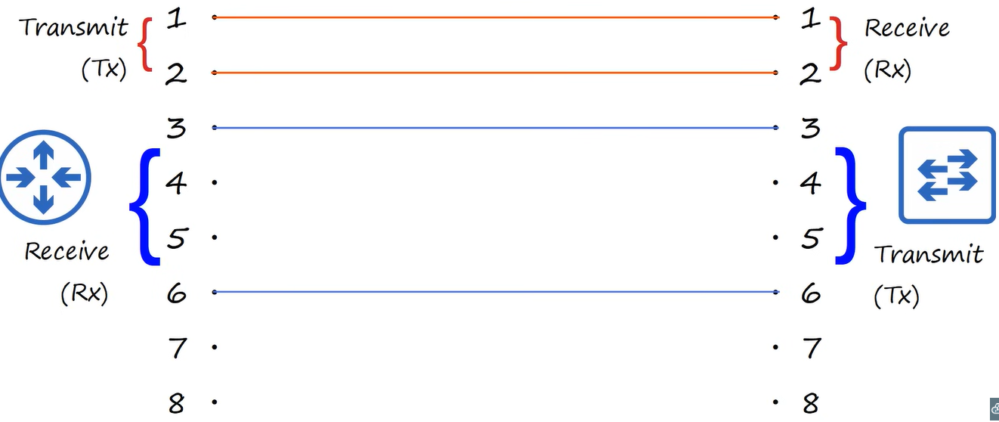

A straight-through cable is a type of Ethernet cable in which **both ends use the same pinout** (T568A → T568A or T568B → T568B).

It is used to connect **different types** of network devices, such as:

- PC → Switch  
- Router → Switch  
- Server → Switch  
- Access Point → Switch  

These devices have **opposite** transmit (Tx) and receive (Rx) pins, so a straight-through cable aligns Tx ↔ Rx automatically.

**Pin behavior (10/100 Mbps):**
- PCs, routers, servers transmit on **pins 1–2** and receive on **pins 3–6**
- Switches do the opposite: receive on **pins 1–2** and transmit on **pins 3–6**

Because Tx and Rx are already opposite, the cable does not need to cross any wires.

#### Crossover Cable
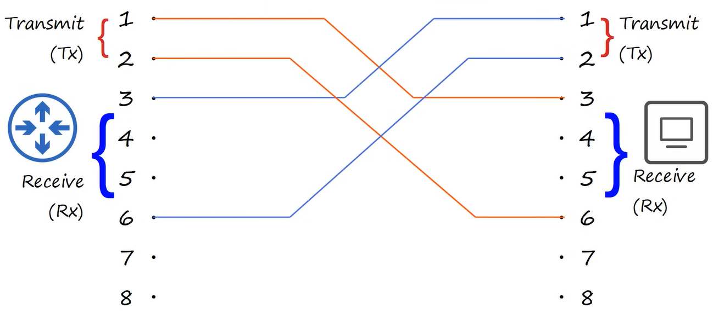
A crossover cable is an Ethernet cable in which the **transmit (Tx)** and **receive (Rx)** pairs are **crossed** between the two ends.

This is used to connect **similar types of devices directly**, such as:

- PC ↔ PC  
- Switch ↔ Switch  
- Router ↔ Router  
- PC ↔ Router  

These devices transmit and receive on the **same pins**, so the cable must cross the pairs to align Tx ↔ Rx.

**Pin behavior (10/100 Mbps):**
- One side transmits on **pins 1–2**, the other side must receive on **pins 3–6**
- One side receives on **pins 3–6**, the other side must transmit on **pins 1–2**

A crossover cable swaps:
- Pin 1 ↔ Pin 3  
- Pin 2 ↔ Pin 6  
- Pin 3 ↔ Pin 1  
- Pin 6 ↔ Pin 2  

Modern devices often support **Auto‑MDI/MDIX**, which automatically flips Tx/Rx internally, making crossover cables rarely needed today.

#### Auto MDI-X
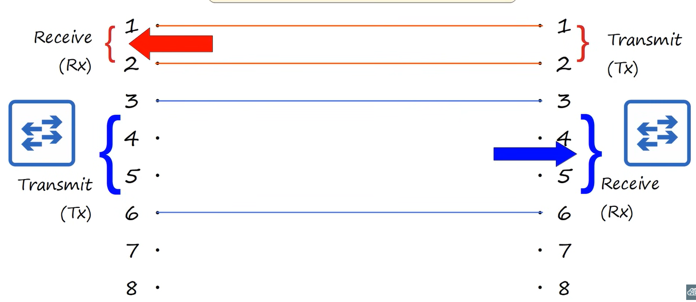

Auto MDI-X (Automatic Medium-Dependent Interface Crossover) is a feature found in modern network devices (switches, routers, PCs) that **automatically swaps the transmit (Tx) and receive (Rx) pins** when needed.

This means the device can detect whether it is connected to:
- a different type of device (PC ↔ Switch), or  
- the same type of device (PC ↔ PC, Switch ↔ Switch)

…and will internally flip the Tx/Rx pairs if required.

Because of Auto MDI-X:
- Straight-through cables work in almost all situations
- Crossover cables are rarely needed today
- The device handles the Tx/Rx switching automatically

#### Transmit and Receive Overview
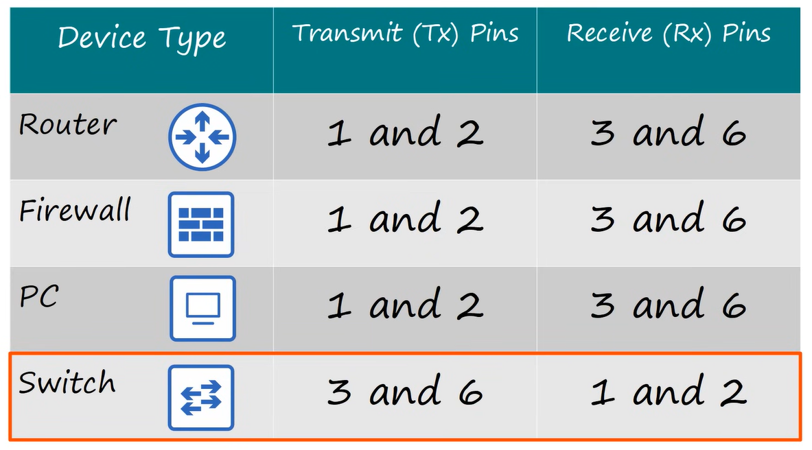

### UTP Cables, 1000Base-T & 10GBase-T
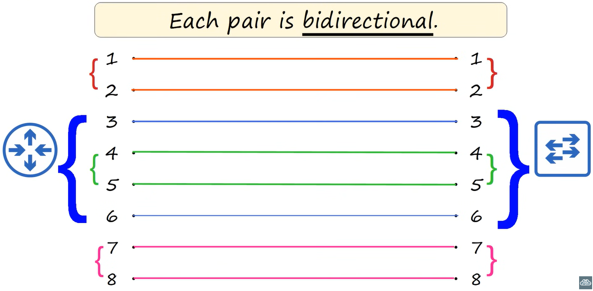
- For 1000Base-T and 10GBase-T, all 4 twisted pairs (8 pins) are used for both transmitting and receiving simultaneously (full duplex).

Why this is better:
- Faster speeds (1 Gbps and 10 Gbps) require more bandwidth, which is achieved by using all 4 pairs.
- Auto MDI-X is still supported, so straight-through cables can be used for all connections, regardless of device type.
- The cable can handle both Tx and Rx on all pairs, allowing for more efficient data transmission and higher speeds.
- This is why crossover cables are not needed for 1000Base-T and 10GBase-T, as the devices can manage Tx/Rx internally on all pairs.

## Fiber-Optic Cables
Fiber optic cables are used to send data using **light** instead of electrical signals.  
They contain extremely thin strands of **glass or plastic** that guide light from one device to another.  
Because light travels very fast and is not affected by electrical interference, fiber is ideal for **high‑speed** and **long‑distance** communication.

Fiber is commonly used in:
- Internet backbone connections  
- Data centers  
- Long-distance links between buildings or cities  
- High-performance enterprise networks  

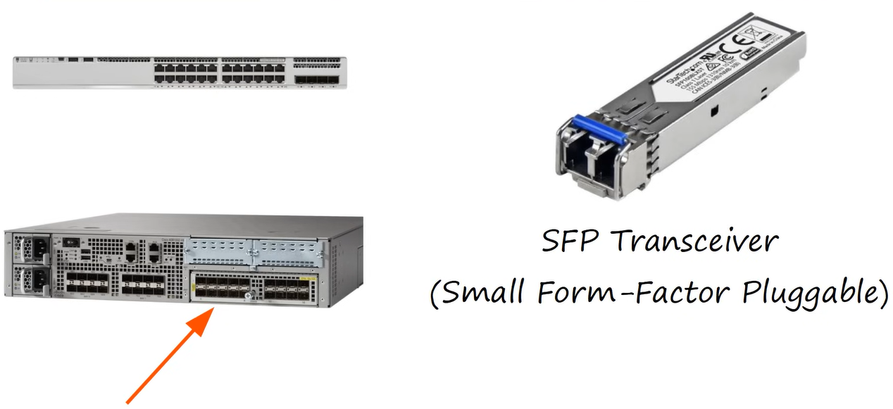
Above in the image we can see the backside of a switch.

2 different types of ports:
- Regular Ethernet ports (RJ‑45)
- SFP ports (Small Form‑Factor Pluggable)

### How Fiber Optic Transmission Works
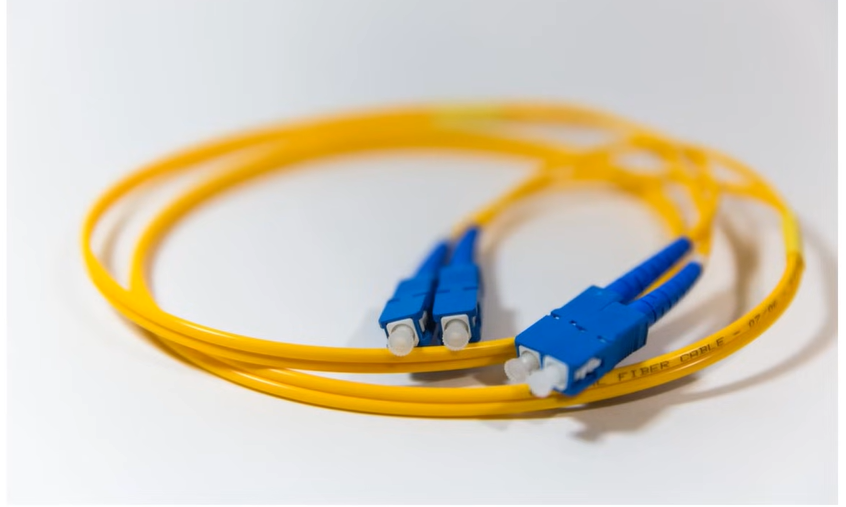
Fiber cables transmit data by turning digital information (1s and 0s) into **light pulses**.

- Light ON = 1  
- Light OFF = 0  

A laser or LED sends these pulses into the fiber.  
The light stays inside the fiber because it reflects off the inner walls — a principle called **total internal reflection**.  
This allows the signal to travel long distances with very little loss.

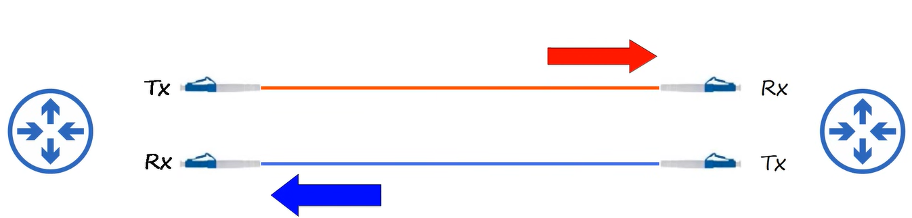

Fiber cables typically use **two separate fibers**:
- One fiber for **Tx (Transmit)**  
- One fiber for **Rx (Receive)**  

This allows full‑duplex communication, meaning devices can send and receive data at the same time.

### Structure of a Fiber Optic Cable
A fiber optic cable is made of several layers:

1. **Core**  
   The thin glass or plastic center where the light travels.

2. **Cladding**  
   A reflective layer surrounding the core.  
   It keeps the light inside the core by reflecting it back inward.

3. **Buffer**  
   A protective layer that shields the core and cladding from damage.

4. **Outer Jacket**  
   The external protective layer that protects the cable from physical impact.

These layers work together to ensure the light signal remains strong, stable, and fast.

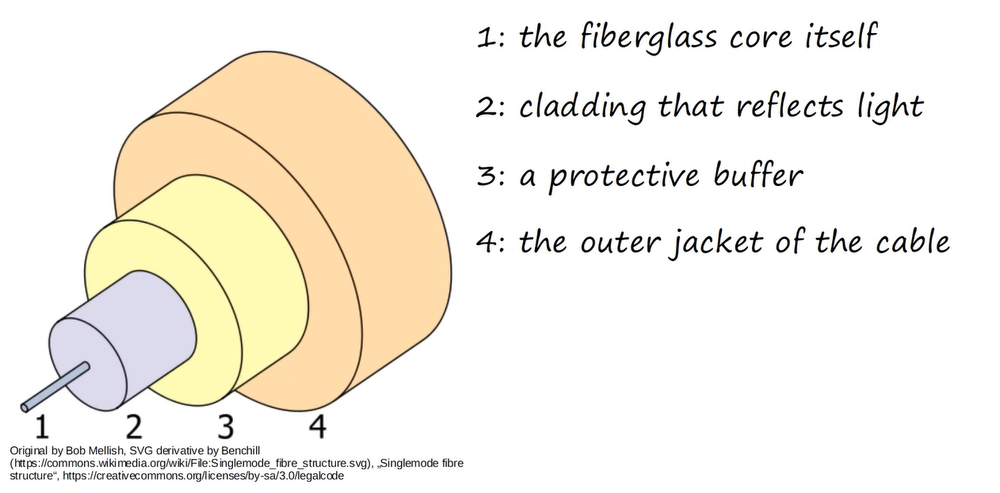

types of cables:
- **single-mode fiber (SMF)**
- **multimode fiber (MMF)**

#### Multimode Fiber
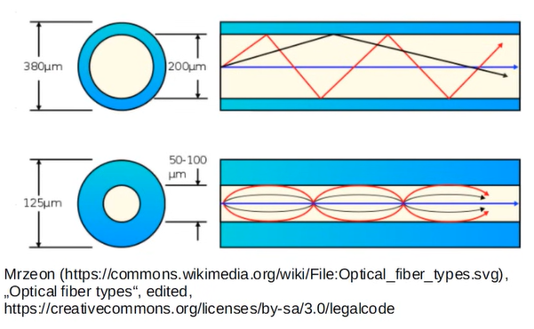

- Core diameter is wider than single-mode fiber (typically 50 or 62.5 microns)
- allow multiple angles (modes) of light waves to enter the fiberglass core.
- allows longer cables than UTP, but shorter cables than single-mode fiber (up to 550 meters for 10 Gbps)
- cheaper than single-mode fiber (due to cheaper LED-based SFP transmitters)

#### Single-Mode Fiber

- Core diameter is very narrow (typically 8–10 microns)
- Light enters at a single angle (mode) from a laser-based transmitter
- allows longer cables than both UTP and multimode fiber (up to 40 km for 10 Gbps)
- More expensive than multimode fiber (due to more expensive laser-based SFP transmitters)

#### Fiber-Optic Cable Standards
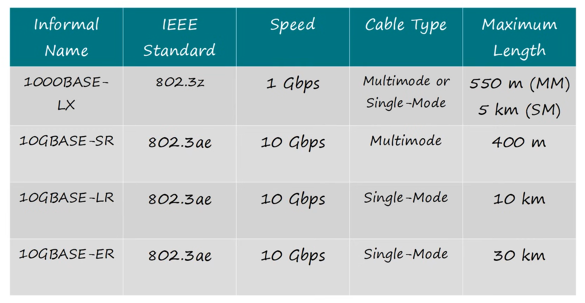

## UTP vs Fiber-Optic Cables
UTP:
- lower cost than fiber optic
- shorter maximum distance (up to 100 meters)
- Can be vulnerable to electromagnetic interference (EMI) and crosstalk
- RJ45 ports used with UTP are cheaper than SFP ports.
- Emit (leak) a faint signal outside of the cable, which can be copied (= security risk)

Fiber-Optic:
- higher cost than UTP
- longer maximum distance (up to 40 km for single-mode fiber)
- No vurnerability to electromagnetic interference (EMI) or crosstalk
- SFP ports used with fiber optic are more expensive than RJ45 ports (single-mode is more expensive than multimode).
- Does not emit any signal outside of the cable, making it more secure against eavesdropping (= no security risk).