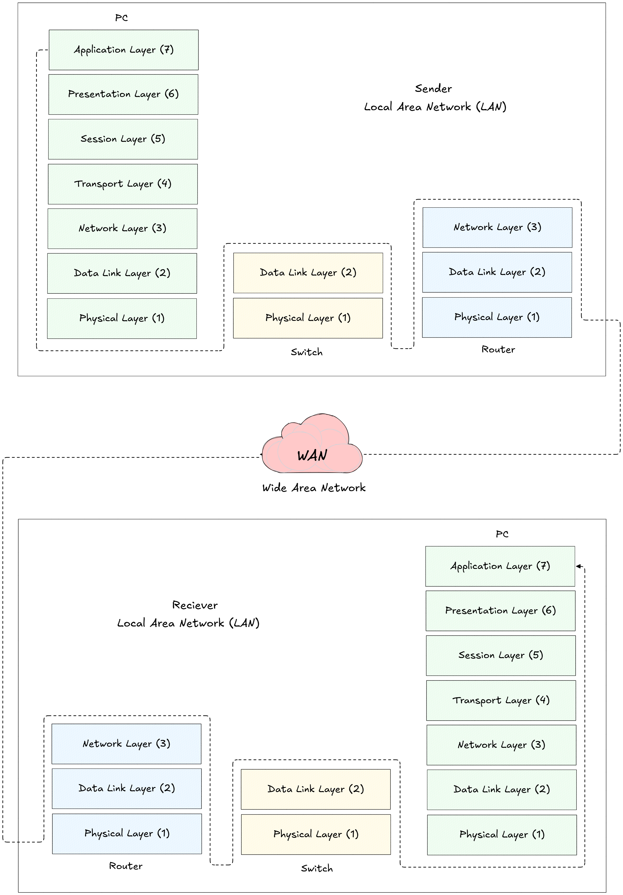
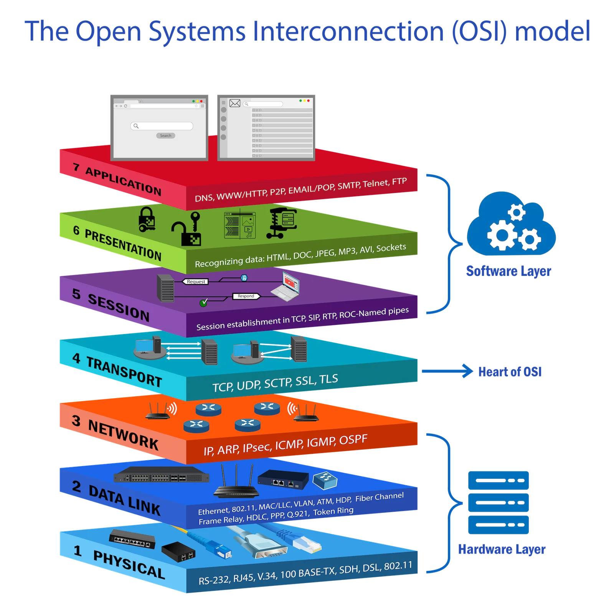
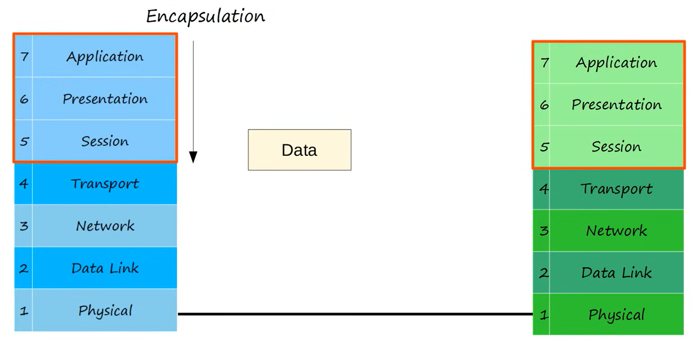
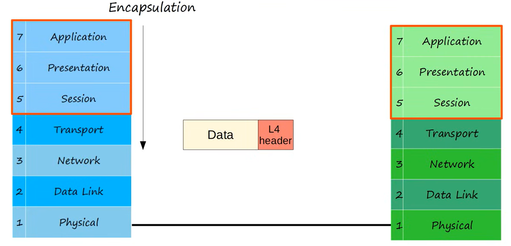
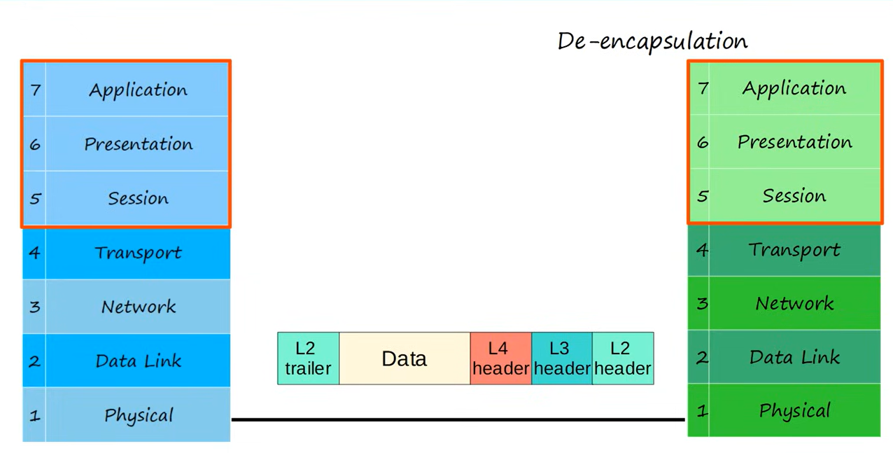
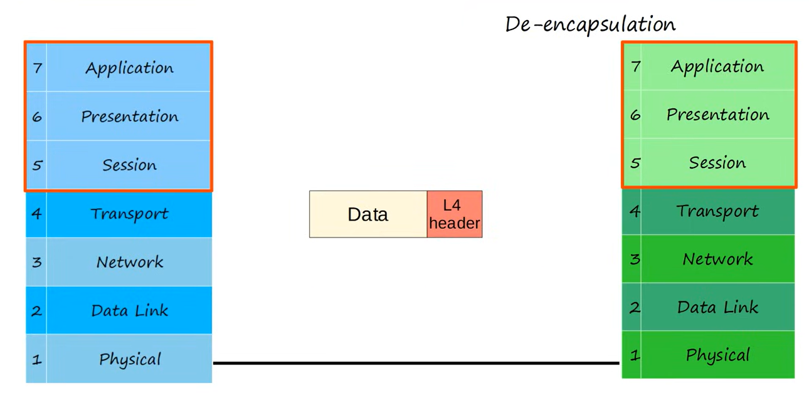
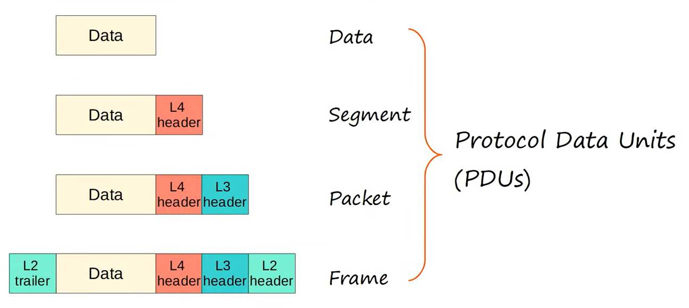

# OSI Model

This section provides a structured explanation of the OSI model, starting with why network models and standardization are necessary, then describing all seven OSI layers in detail, including their functions, examples, and how data moves through them via encapsulation and de‑encapsulation. It explains same‑layer and adjacent‑layer interactions, outlines the responsibilities of each layer from Application to Physical, and includes diagrams showing encapsulation, PDUs, and how devices like switches and routers operate at different layers.

- **Jeremy's IT Lab** — [Video](https://www.youtube.com/watch?v=t-ai8JzhHuY)

---

## Network Models
A **network model** is a structured way to describe how different networking functions work together.  
It helps standardize communication so that devices from different vendors (Cisco, Dell, Apple, HP, etc.) can communicate.

### Protocol
A **protocol** is a set of rules that defines:
- how devices communicate  
- how data is formatted  
- how errors are handled  
- how connections are established and terminated  

Examples: HTTP, TCP, IP, Ethernet, DNS.

### Why Standardization Matters
Without standardization:
- A Dell computer might not understand an Apple computer  
- Routers from different vendors could not exchange data  
- The internet as we know it would not exist  

Standardization ensures **interoperability**.

# OSI Model 
(Open Systems Interconnection Model)

The OSI model is a **conceptual framework** created by the **ISO (International Organization for Standardization)**.  
It divides networking functions into **7 layers**, each with its own responsibilities.

It helps us:
- understand how networks operate  
- troubleshoot issues  
- categorize protocols and technologies 

*Image drawn by Lukas Van der Spiegel*

## The 7 Layers of the OSI Model

### **Layer 7 — Application**
- Closest to the user  
- Provides network services to applications  
- Examples: HTTP, HTTPS, DNS, SMTP, FTP  

### **Layer 6 — Presentation**
- Translates data formats  
- Encryption & decryption  
- Compression  
- Examples: SSL/TLS, JPEG, MP3  

### **Layer 5 — Session**
- Manages sessions between devices  
- Opening, maintaining, and closing communication  
- Examples: NetBIOS, RPC  

### **Layer 4 — Transport**
- End‑to‑end communication  
- Segmentation, flow control, reliability  
- Protocols: **TCP** (reliable), **UDP** (unreliable but fast)  

### **Layer 3 — Network**
- Logical addressing  
- Routing packets between networks  
- Protocols: **IP**, ICMP, OSPF, EIGRP  

### **Layer 2 — Data Link**
- MAC addresses  
- Frames  
- Switches operate here  
- Protocols: Ethernet, ARP  

### **Layer 1 — Physical**
- Bits on the wire  
- Cables, connectors, voltages, light pulses  
- Examples: UTP, fiber, hubs, repeaters  

## Visual Overview

Layer | Name | Function
------|------|---------
7 | Application | User-facing network services
6 | Presentation | Data formatting, encryption
5 | Session | Session management
4 | Transport | TCP/UDP, segmentation
3 | Network | IP addressing, routing
2 | Data Link | MAC addressing, switching
1 | Physical | Cables, signals, bits

---

## Why the OSI Model Matters
- Helps you understand **where** a problem occurs  
- Helps categorize protocols  
- Helps structure your thinking during troubleshooting  
- Used heavily in CCNA exams and real-world networking  

Example:  
If a cable is broken → Layer 1  
If an IP address is wrong → Layer 3  
If a website won’t load → Layer 7  

### Application Layer (Layer 7)

- The closest layer to the end user  
- Interacts directly with software applications (e.g., web browsers, email clients)  
- Provides network services to applications  
- Examples of Layer 7 protocols: **HTTP, HTTPS, DNS, SMTP**

#### Functions
- Identifying communication partners  
- Synchronizing communication  
- Providing interfaces for applications to use the network  

##### Encapsulation & De-encapsulation

When two devices communicate, data moves **down the OSI model**, across the physical medium, and then **up the OSI model** on the receiving device.

###### 1. Encapsulation (Sender)
The sender takes data from the application and passes it **down** through the layers:

- Layer 7 → Layer 6 → Layer 5 → ... → Layer 1  
- Each layer adds its own header (and sometimes trailer)  
- At Layer 1, the data becomes bits on the wire  

###### 2. Transmission
The bits travel across the physical medium (copper, fiber, wireless) from:

- **Physical layer of device A → Physical layer of device B**

This is the only moment where the data leaves the device.

###### 3. De-encapsulation (Receiver)
The receiving device takes the bits and passes them **up** the OSI layers:

- Layer 1 → Layer 2 → Layer 3 → ... → Layer 7  
- Each layer removes its corresponding header  
- Finally, the application receives the original data  

#### Same-layer vs Adjacent-layer Interactions

##### Adjacent-layer interaction
Communication **between layers on the same device**.

Example:  
Layer 7 passes data to Layer 6 → Layer 6 passes data to Layer 5 → etc.

Encapsulation and de-encapsulation are both **adjacent-layer interactions**.

##### Same-layer interaction
Communication **between the same layer on two different devices**.

Example:  
- Application layer on PC1 ↔ Application layer on PC2  
- Transport layer on PC1 ↔ Transport layer on PC2  
- Network layer on PC1 ↔ Network layer on PC2  

Each layer uses its own protocol to communicate with the same layer on the remote device.

### Presentation Layer (Layer 6)

The Presentation Layer is responsible for **how data is represented** so that the receiving device can understand it.  
It acts as a **translator** between the application’s data format and the network’s data format.

#### Key Functions
- **Translation**  
  Converts data from application formats (e.g., text, images, video) into standard network formats, and back again.

- **Encryption & Decryption**  
  Secures data before transmission and restores it upon reception.  
  Examples: TLS/SSL encryption used in HTTPS.

- **Compression & Decompression**  
  Reduces data size to improve transmission speed.  
  Examples: ZIP, JPEG, MP3.

- **Character Encoding Conversion**  
  Converts between formats like ASCII, UTF‑8, Unicode.

#### Why This Layer Exists
Different applications and systems may use different data formats.  
Layer 6 ensures that **both sides speak the same “language”** before the data reaches the Application Layer.

##### Simple Example

You open a website using HTTPS:

1. Your browser creates data (Layer 7)
2. Presentation Layer:
   - Encrypts it (TLS)
   - Formats it properly
3. Transport Layer (TCP) sends it onward

On the receiving side:
- Presentation Layer decrypts it  
- Converts it back into readable format  
- Passes it to the application  

### Session Layer (Layer 5)

The Session Layer is responsible for **starting, managing, and ending communication sessions** between two devices.

A *session* is a long‑lasting communication exchange between applications on two devices.  
Examples: a video call, a file transfer, a remote login session.

#### Key Functions

- **Session Establishment**  
  Creates the communication session between two devices.  
  Example: When you start a video call, a session is established.

- **Session Maintenance**  
  Keeps the session active and manages ongoing data exchange.  
  It can handle interruptions and resume communication if needed.

- **Session Termination**  
  Properly closes the session when communication ends.  
  Example: Ending a video call or logging out of a remote server.

#### Examples of Session Layer Protocols
- **NetBIOS**
- **RPC (Remote Procedure Call)**
- **PPTP**
- Some aspects of **TLS/SSL** (session negotiation)

#### Why the Session Layer Exists
Applications often need **long‑running communication**.  
Layer 5 ensures that both sides agree on:
- when to start  
- how to maintain  
- when to end  

…so the communication is organized and reliable.

#### Simple Example
You connect to a remote server using SSH:

1. Session Layer establishes the session  
2. Transport Layer (TCP) handles reliable delivery  
3. Application Layer (SSH) sends commands  
4. When you log out, the Session Layer terminates the session

### Upper Layer
- Network Engineers don't usually work with these 3 layers.
- Application developers / engineers work with the top layers of the OSI model to connect their applications over networks.
#### Layers
- Layer 7 - Application
- Layer 6 - Presentation
- Layer 5 - Session
#### Schema

### Transport Layer (Layer 4)

The Transport Layer is responsible for **end‑to‑end communication** between hosts.  
It ensures that data is delivered reliably (or unreliably, if needed), in the correct order, and without errors.

#### Key Functions

- **Segmentation & Reassembly**  
  Large chunks of data from the upper layers are broken into smaller pieces called *segments*.  
  On the receiving side, these segments are reassembled into the original data.

- **Host-to-Host Communication**  
  Provides logical communication between two end hosts (PC ↔ server).  
  This is different from Layer 3, which handles network-to-network routing.

- **Reliability (TCP)**  
  TCP provides:  
  - error detection  
  - retransmission of lost data  
  - flow control  
  - ordered delivery  

- **Unreliable Delivery (UDP)**  
  UDP sends data without reliability features.  
  It is faster and used for real-time applications (voice, video, gaming).

- **Port Numbers**  
  Identifies which application should receive the data.  
  Example:  
  - HTTP → port 80  
  - HTTPS → port 443  
  - DNS → port 53  

#### Protocols at Layer 4
- **TCP (Transmission Control Protocol)** — reliable, connection‑oriented  
- **UDP (User Datagram Protocol)** — fast, connectionless  

#### Why Layer 4 Matters
It ensures that:
- data arrives correctly  
- data arrives in order  
- the right application receives the right data  
- communication between hosts is stable and organized  

#### Simple Example
You load a webpage:

1. Application Layer creates the HTTP request  
2. Transport Layer (TCP) breaks it into segments  
3. Each segment gets a TCP header with port numbers  
4. On the server, TCP reassembles the segments  
5. The application receives the complete HTTP request

### Network Layer (Layer 3)

The Network Layer is responsible for **delivering packets between devices on different networks**.  
It provides logical addressing and determines the best path for data to travel across multiple networks.

#### Key Functions

- **Logical Addressing (IP Addresses)**
  Layer 3 assigns logical addresses (IPv4 or IPv6) to devices.  
  These addresses identify the *source* and *destination* across networks.

- **Routing (Path Selection)**
  Determines the best path for packets to travel from the source network to the destination network.  
  Routers use routing tables and routing protocols (OSPF, EIGRP, BGP) to make decisions.

- **Packet Forwarding**
  Moves packets from one network to another based on the destination IP address.

- **Fragmentation**
  Splits packets if they are too large for the next network segment’s MTU.

#### Devices Operating at Layer 3
- **Routers**  
- **Layer 3 switches**  
- **Firewalls (partially)**  

Routers are the primary Layer 3 devices — they connect different networks and forward packets between them.

#### Layer 3 Protocols
- **IPv4**
- **IPv6**
- **ICMP** (ping, traceroute)
- **Routing protocols** (OSPF, EIGRP, BGP)

#### Why Layer 3 Matters
Layer 3 enables communication **outside the local network**.  
Without it, devices could only talk to others in the same LAN.

Example:  
Your PC (192.168.1.10) wants to reach a server on 10.0.0.5 → Layer 3 handles this.

#### Simple Example
You browse a website:

1. Your PC sends a packet to the default gateway (router)  
2. Router checks the destination IP  
3. Router forwards the packet toward the internet  
4. Multiple routers along the path forward it further  
5. The packet reaches the web server’s network  

### Data Link Layer (Layer 2)

The Data Link Layer is responsible for **node‑to‑node communication** on the same network segment.  
It prepares data for transmission over the Physical Layer and ensures that frames are delivered reliably between directly connected devices.

#### Key Functions

- **Node-to-Node Data Transfer**
  Provides communication between devices directly connected on the same link.  
  Examples:  
  - PC → Switch  
  - Switch → Router  
  - Router → Router (serial links)

- **Framing**
  Converts packets from Layer 3 into **frames** by adding Layer 2 headers and trailers.  
  The frame includes:  
  - Source MAC address  
  - Destination MAC address  
  - Error-checking information (FCS)

- **MAC Addressing**
  Uses **physical addresses (MAC addresses)** to identify devices on the same network segment.  
  This is different from Layer 3, which uses IP addresses.

- **Error Detection (and sometimes correction)**
  Uses **Frame Check Sequence (FCS)** to detect errors caused by the Physical Layer.  
  If the frame is corrupted, it is discarded.

- **Media Access Control**
  Determines how devices share the physical medium.  
  Examples: CSMA/CD (Ethernet), CSMA/CA (Wi-Fi).

- **Switch Operation**
  Switches operate at Layer 2.  
  They forward frames based on MAC addresses and build a MAC address table.

#### Layer 2 Protocols and Technologies
- Ethernet (most common)
- Wi-Fi (802.11)
- PPP
- HDLC
- ARP (between Layer 2 and 3)

#### Why Layer 2 Matters
Layer 2 ensures that data can move **within the same local network**.  
Without it, devices could not communicate even if they were physically connected.

#### Simple Example
You send a file to a server on the same LAN:

1. Layer 3 creates an IP packet  
2. Layer 2 wraps it in an Ethernet frame with MAC addresses  
3. Switch forwards the frame based on the destination MAC  
4. The server receives the frame and removes the Layer 2 header/trailer  

### Physical Layer (Layer 1)

The Physical Layer is responsible for the **actual transmission of bits** (0s and 1s) over a physical medium.  
It defines the electrical, optical, and mechanical characteristics needed to send raw data between devices.

#### Key Functions

- **Transmission of Bits**
  Converts frames from Layer 2 into electrical signals, light pulses, or radio waves.  
  These signals represent binary data (0s and 1s).

- **Physical Media**
  Defines the physical components used to transmit data:
  - Copper cables (UTP, coaxial)
  - Fiber optic cables
  - Wireless radio frequencies

- **Connectors & Interfaces**
  Specifies connectors and interfaces such as:
  - RJ‑45 ports
  - Fiber connectors (LC, SC)
  - Wireless antennas

- **Signaling**
  Defines how bits are encoded onto the medium:
  - Voltage levels (copper)
  - Light pulses (fiber)
  - Radio waves (Wi‑Fi)

- **Data Rate & Distance**
  Determines:
  - Maximum cable length (e.g., UTP = 100m)
  - Supported speeds (10/100/1000 Mbps, 10 Gbps, etc.)

- **Topology & Physical Layout**
  Defines how devices are physically connected:
  - Star topology (Ethernet LANs)
  - Point‑to‑point links
  - Wireless coverage areas

#### Devices Operating at Layer 1
- Hubs  
- Repeaters  
- Cables  
- Connectors  
- Network interface transceivers (PHY chips)

Switches and routers do **not** operate at Layer 1 — they use Layer 1 only to send/receive bits.

#### Why Layer 1 Matters
Without a functioning Physical Layer, **no communication is possible**.  
If the cable is broken, unplugged, or damaged, higher layers cannot operate.

#### Simple Example
You send a frame over Ethernet:

1. Layer 2 creates the frame  
2. Layer 1 converts it into electrical signals  
3. The signals travel through the UTP cable  
4. The receiving device converts the signals back into bits  

## Encapsulation schema

## Protocol Data Units (PDUs)
