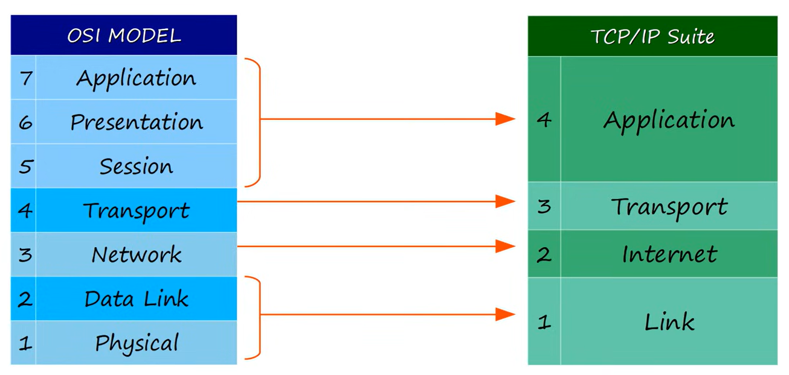

# TCP/IP Suite

This section provides insights into diffrence between TCP/IP Suite and OSI model.

- **Jeremy's IT Lab** — [Video](https://www.youtube.com/watch?v=t-ai8JzhHuY)

---

## OSI vs TCP/IP model

The OSI and TCP/IP models are two frameworks that describe how data moves across a network, but they differ in structure, purpose, and how closely they match real‑world protocols.

The OSI model is a seven‑layer conceptual model created for teaching, standardization, and troubleshooting. It separates networking functions into fine‑grained layers: Application, Presentation, Session, Transport, Network, Data Link, and Physical. The TCP/IP model is a four‑layer practical model that reflects how the internet actually works, combining several OSI layers into broader groups: Application, Transport, Internet, and Network Access. While OSI is descriptive and idealized, TCP/IP is implementation‑based and directly tied to real protocols such as TCP, UDP, IP, and Ethernet.