# CLI

CLI stands for command-line interface.

- **Jeremy's IT Lab** — [Video](https://www.youtube.com/watch?v=IYbtai7Nu2g)

---

## What is it?
- The interface you use to configure Cisco devices

CLI = command-line interface
GUI = Graphical user interface

## How to connect to a Cisco device?
To configure a Cisco router or switch, you connect to the console port.
This is an out‑of‑band management port used for initial setup, troubleshooting, or recovery.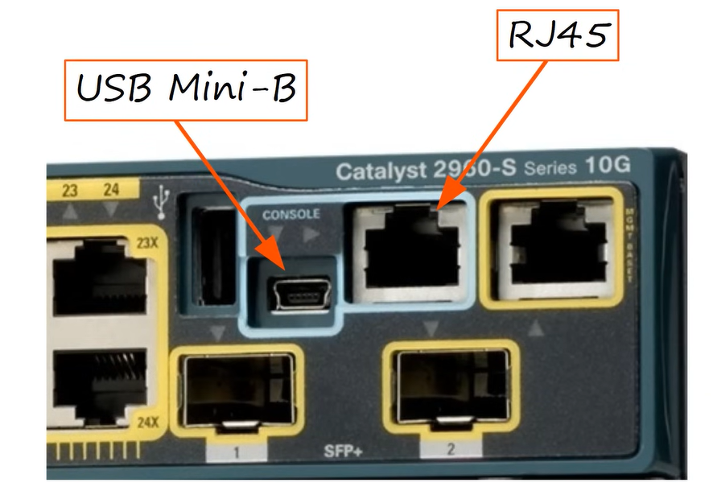

Required cables are: 
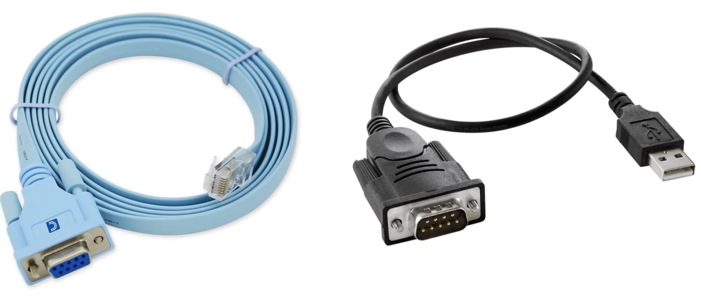
1. Rollover (Console) Cable — the left cable in the image above
    
    - Light‑blue Cisco console cable
    - One side: RJ‑45
    - Other side: DB9 (serial)
    - Used to connect PC → Cisco console port

Older laptops/desktops had a DB9 serial port, so this cable could be plugged in directly.

2. USB‑to‑Serial Adapter — the cable on the right side of the image above
Modern laptops no longer have DB9 serial ports, so you need an adapter:

    - One side: USB‑A
    - Other side: DB9 male serial

This adapter allows your laptop to use the rollover cable even without a built‑in serial port.

### Rollover cable
Pins are connected as following:
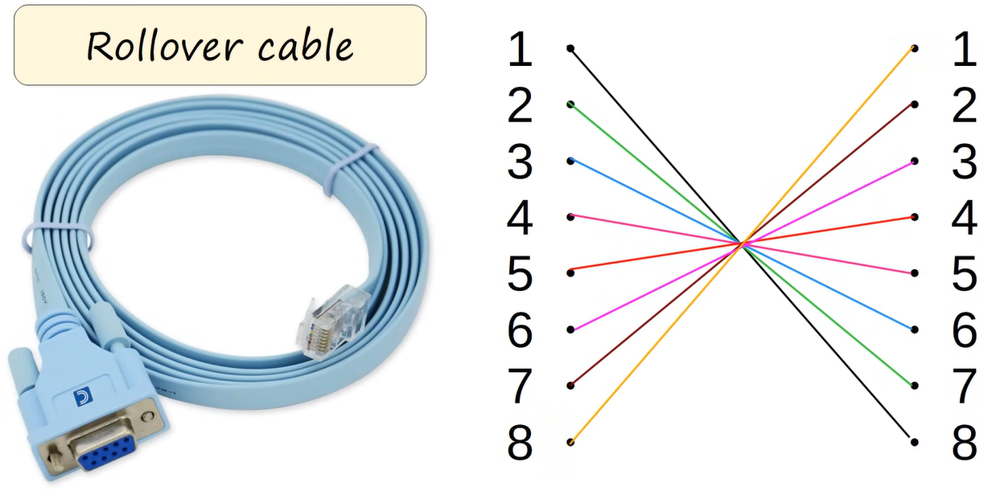

### Terminal Emulator (PuTTy)
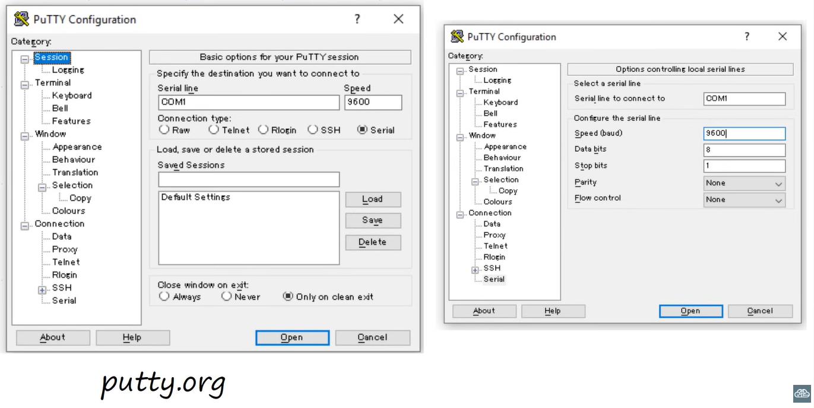
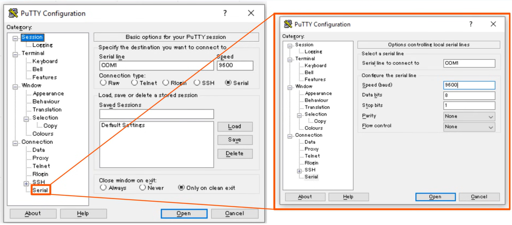

Connect using (default settings):
- 9600 baud
- 8 data bits
- No parity
- 1 stop bit
- No flow control

When connected, you see this terminal:
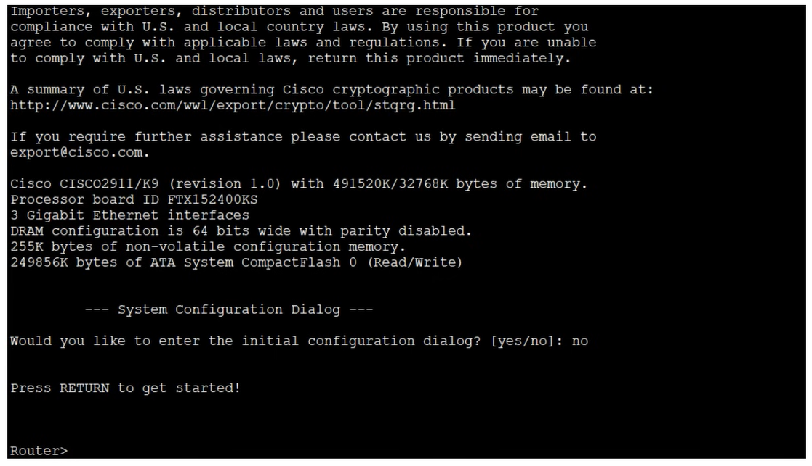
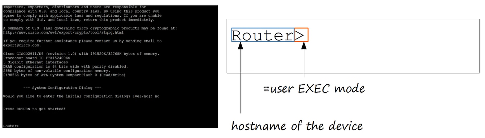
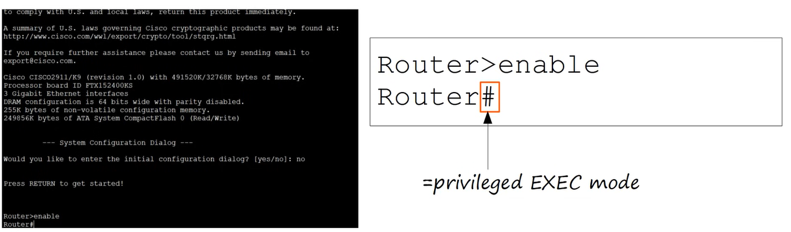

EXEC in Cisco IOS stands for EXtended ECho, but in practice it simply refers to the command‑execution environment of the device.
So “EXEC” basically means the shell where commands are executed on a Cisco device.

- User EXEC mode is very limited (only basic monitoring commands)
- Users can look at some things, but can't make any changes to the configuration.
- Alse called 'user mode'
- Privileged EXEC mode → full access to configuration and advanced commands

#### Commands
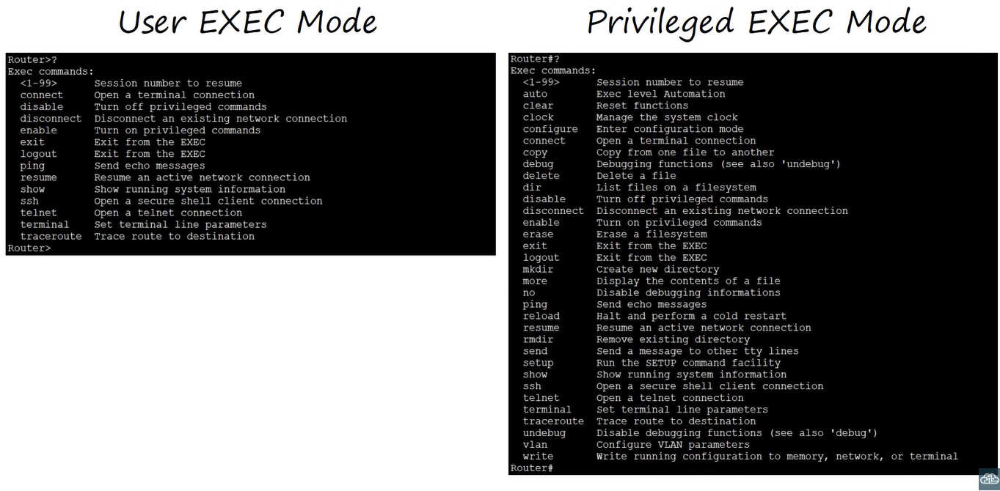

#### Shortcuts
- type "en" then use TAB key, it will write 'enable'
OR
- type 'en' then execute command, it will run the command 'enable', won't work with 'e' because there are more commands starting with 'e'
- type 'e?' and then execute. We get all possible commands (e.g. enable and exit commands)

#### Global configuration mode
Global configuration mode is the mode on a Cisco device where device‑wide settings are made.
It is entered from privileged EXEC mode and allows configuring anything that affects the router or switch as a whole.

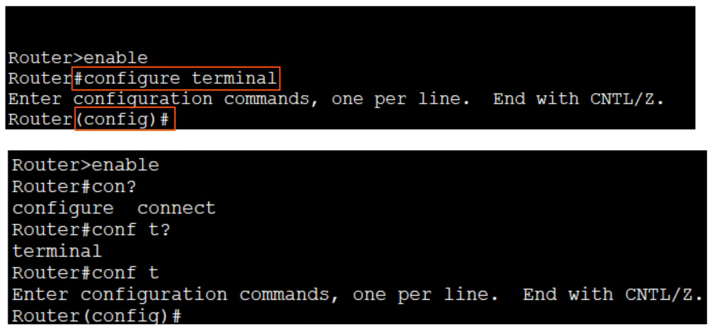

#### Enable password
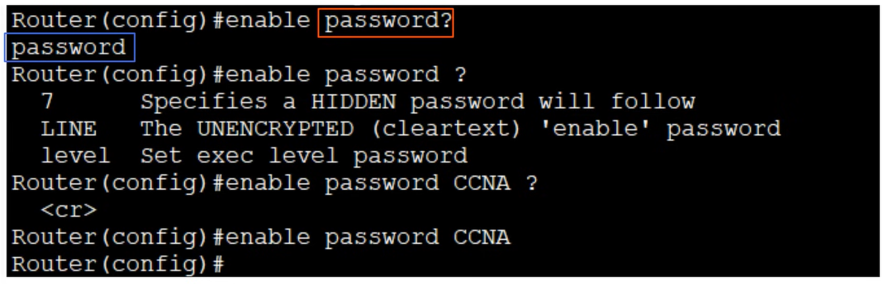
Passwords are case-sensitive!
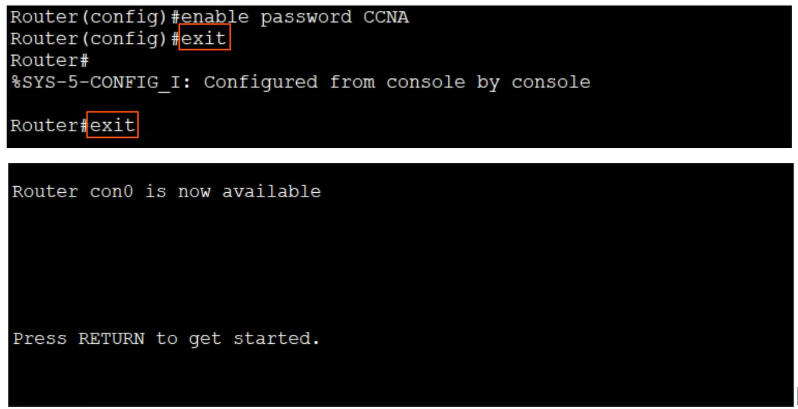
- exit config mode
- exit router
- press ENTER key 

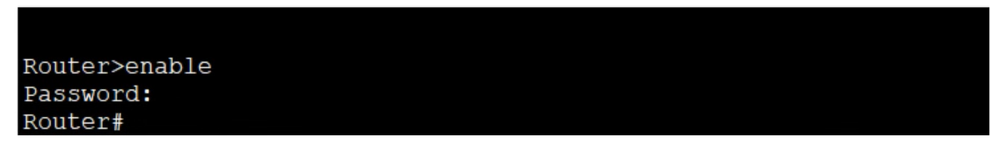
- need password to get into priviliged EXEC mode
- password is not display while typing 
(also no use of *)
- 3 times --> 'Bad secrets error'

## Running vs Startup config
There are 2 seperate config files kept on the device at once.

- **Running-config =** the current, active configuration file on the device. As you enter commands in the CLI, you edit the active configuration.
- **Startup-config =** the configuration file that will be loaded upon restart of the device.

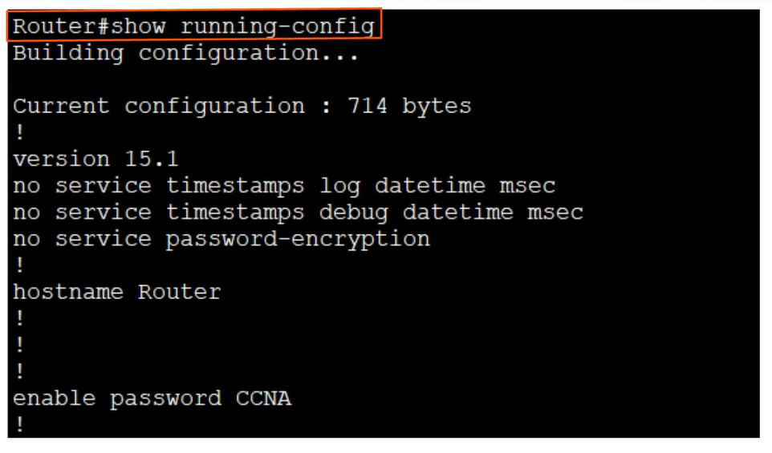
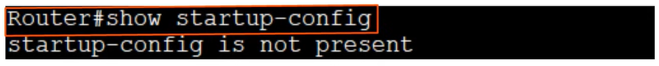
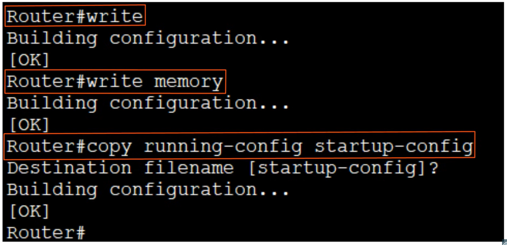
- 'write' or 'write memory' command does ...
- 'copy running-config startup-config', This command copies the current active configuration (running‑config)  
→ to the file that loads at boot (startup‑config).

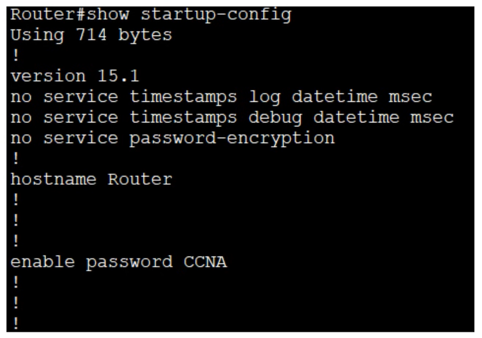

BUT there's one problem, the password 'CCNA' is shown when showing the file. This is a security risk.

Can be fixed with:
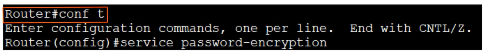
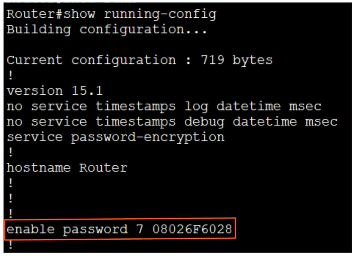

- now the password is encrypted with type 7.
- When a password is shown as type 7, it means it is encrypted using Cisco’s proprietary reversible encryption algorithm.

But a type 7 can be easily be cracked by searching on google 'type 7 cisco password encrypted password crack'
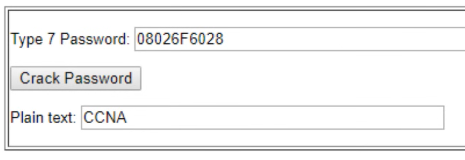

A more secure method is using the `enable secret` command, which stores the password as a strong, non‑reversible hash. After running `enable secret Cisco` and checking with `do show running-config`, the password appears encrypted.

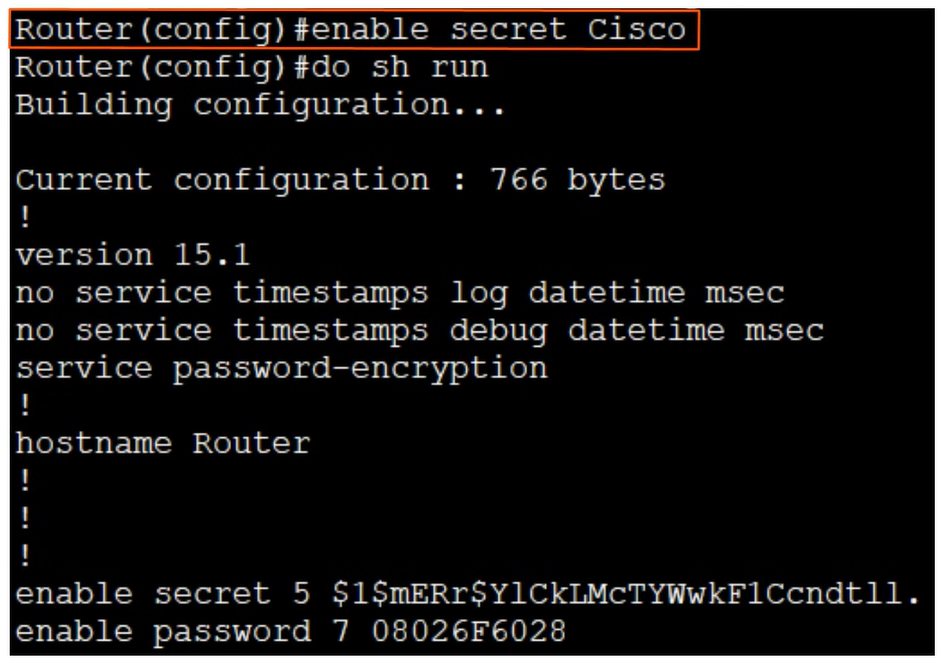

- Type 7 (for line passwords) = reversible, not secure
- Type 5/9 (enable secret) = one‑way hash, can't be reversed

## Canceling commands
Canceling a command in Cisco IOS simply means removing a configuration line by placing no in front of the original command.
IOS treats <b>no 'command'</b> as the inverse of <b>'command'</b>

Example:

ip domain-lookup
is enabled by default, and you disable it with:

no ip domain-lookup
This mechanism works for almost every configuration line in global or interface configuration mode.