# Ethernet LAN Switching

These notes provide a clear, structured overview of Ethernet LAN Switching and how devices communicate inside a local network. They explain how Ethernet frames are built, how switches learn MAC addresses and forward traffic, and how concepts like unicast, unknown unicast flooding, and known unicast forwarding work. The document also covers ARP, showing how IPv4 addresses are resolved to MAC addresses so devices can reach each other within a LAN. In addition, it includes practical commands for viewing and clearing ARP caches and MAC tables, plus a brief explanation of ping and ICMP message types. Overall, it serves as a concise, CCNA‑focused guide to the fundamentals of Ethernet communication and switching.

- **Jeremy's IT Lab** — [Video pt.1](https://www.youtube.com/watch?v=u2n762WG0Vo)
- **Jeremy's IT Lab** — [Video pt.2](https://www.youtube.com/watch?v=5q1pqdmdPjo)

---
## LANs
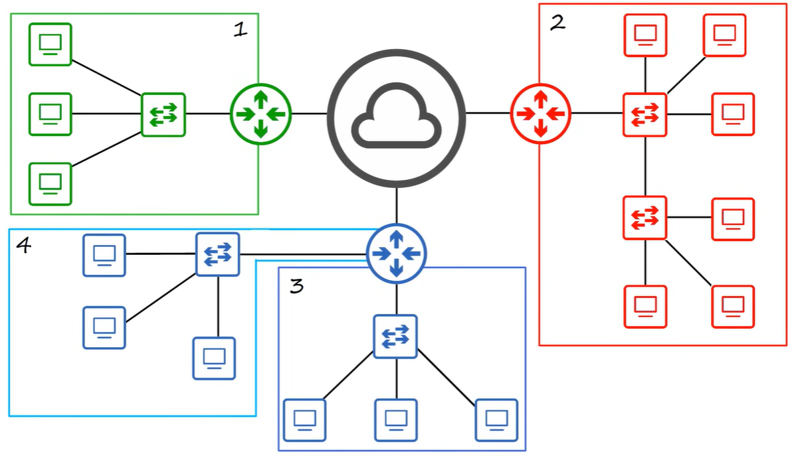
- LAN stands for Local Area Network
- LANs are used to connect devices within a limited area, such as a home, office, or campus
- LANs typically use Ethernet technology for communication
- LANs can be connected to other LANs or to the internet using routers

## OSI Model & Protocol Data Units
Data is encapsulated in different Protocol Data Units (PDUs) at each layer of the OSI model:
- Layer 1 (Physical): Bits
- Layer 2 (Data Link): Frames 
- Layer 3 (Network): Packets
- Layer 4 (Transport): Segments
- Layer 5 (Session): Data
- Layer 6 (Presentation): Data
- Layer 7 (Application): Data

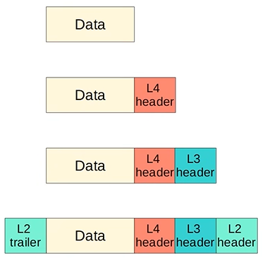
Each header contains control information relevant to its layer (L4, L3, L2). Each of them present the segments, packets, and frames with the data payload. The L2 header contains the source and destination MAC addresses, while the L3 header contains the source and destination IP addresses. The L4 header contains the source and destination port numbers.

L2 trailer contains the Frame Check Sequence (FCS) for error detection.

### Ethernet Frame
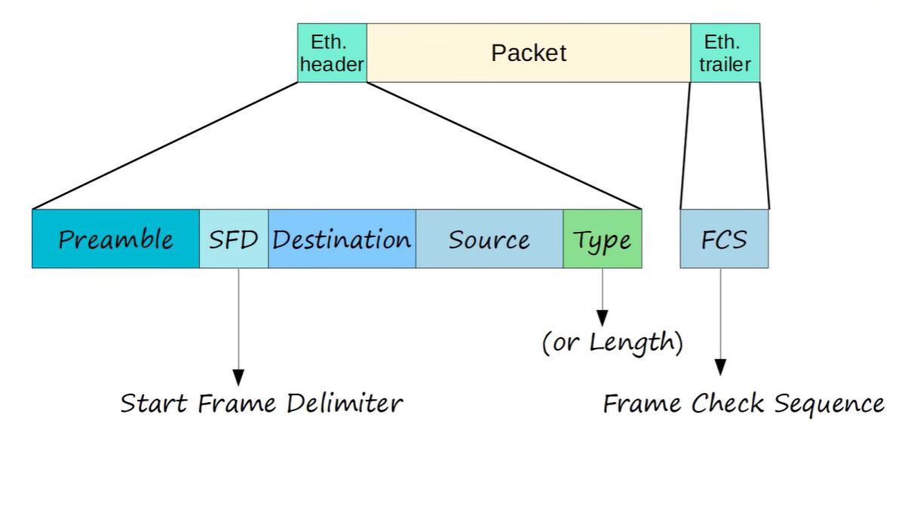
Header → information about where the frame is going
Data → the actual packet (IP packet)
Trailer → a check to see if the frame is not corrupted

1. FCS (Frame Check Sequence)
- Length: 4 bytes (32 bits)
- Purpose: Error detection (FCS is a checksum used to detect errors in the frame.
- Detects corrupted data by running a CRC algorithm over the recieved data.
- CRC (Cyclic Redundancy Check) is a common algorithm used to calculate the FCS value. The sender calculates the FCS value based on the frame's contents and appends it to the end of the frame. The receiver then recalculates the FCS value upon receiving the frame and compares it to the FCS value in the trailer. If they match, the frame is considered error-free; if they do not match, it indicates that an error occurred during transmission, and the frame may be discarded or a request for retransmission may be made.

#### Size
- Payload: 46–1500 bytes
- Header + Trailer: 18 bytes
- Minimum frame: 64 bytes
- Maximum frame: 1518 bytes
- **Frame = Payload + Header + Trailer**

#### Header
1. **Preamble**
A series of bits that says:
“Hey, a frame is coming, get ready!”
    - Length: 7 bytes (56 bits)
    - Pattern: 10101010 (repeated 7 times)
    - Alternating 1s and 0s creates a clock signal for synchronization
    - Purpose: Synchronization (allows the receiver to lock onto the signal and prepare for the incoming frame)

2. **SFD (Start Frame Delimiter)**
A special pattern that says:
“The real frame starts NOW.”
    - Length: 1 byte (8 bits)
    - Pattern: 10101011
    - Purpose: Start frame delimiter (SFD) is a specific byte that indicates the start of the actual frame data. Marks the end of the preamble and the start of the actual frame data

3. **Destination MAC**
The MAC address of the device that should receive the frame.
Like the “address” on an envelope.
    - Example: 00:1A:2B:3C:4D:5E
    - MAC = Media Access Control address, a unique identifier assigned to network interfaces for communications at the data link layer (Layer 2) of the OSI model. It is used to identify devices on a local network and facilitate communication between them.
    - 6 byte (48-bits) address of the physical device (NIC) that should receive the frame
    - Purpose: Destination MAC address is used by switches to determine where to forward the frame within the local network. It is essential for directing the frame to the correct recipient device on the LAN.

4. **Source MAC**
The MAC address of the device sending the frame.
Like the “return address”.
    - Example: 00:1A:2B:3C:4D:5E
    - 6 byte (48-bits) address of the physical device (NIC) that is sending the frame
    - Purpose: Source MAC address identifies the sender of the frame. It is used by the receiving device to know where the frame originated from and can be used for reply frames or for network management purposes.   

5. **Type / Length**
Says what kind of data is inside.
Example: IPv4, IPv6, ARP…
    - Length: 2 bytes (16 bits)
    - A value of 1500 or less indicates the length of the payload data in bytes
    - A value of 1536 (0x0600) or greater indicates the type of payload contained in the frame (e.g., IPv4, IPv6, ARP)
    - Purpose: Indicates the type of payload contained in the frame (e.g., IPv4, IPv6, ARP) or the length of the payload data. This field helps the receiving device understand how to process the frame's data.

IPv4 = 0x0800 (hexadecimal) | 2048 (decimal)
IPv6 = 0x86DD (hexadecimal) | 34525 (decimal)
ARP = 0x0806 (hexadecimal) | 2054 (decimal)

Sequence of the frame:
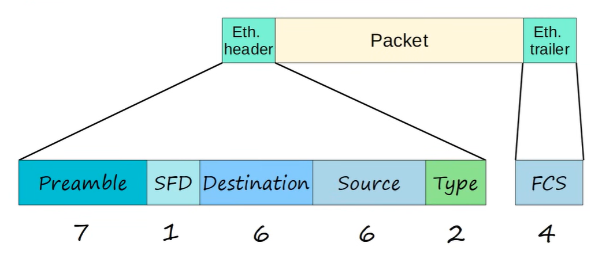

## MAC Address
A MAC address is a unique identifier assigned to network interfaces for communications at the data link layer (Layer 2) of the OSI model. It is used to identify devices on a local network and facilitate communication between them.

- Format: 6 bytes (48 bits), typically represented in hexadecimal format (e.g., 00:1A:2B:3C:4D:5E)
- Uniqueness: Each MAC address is intended to be globally unique, ensuring that no two devices have the same MAC address. This is achieved through a combination of a manufacturer‑assigned Organizationally Unique Identifier (OUI) and a unique device identifier.
- OUI: The first 3 bytes (24 bits) of the MAC address are assigned to the manufacturer by the IEEE and are known as the Organizationally Unique Identifier (OUI). This portion identifies the manufacturer of the network interface card (NIC).
- Device Identifier: The last 3 bytes (24 bits) of the MAC address are assigned by the manufacturer and are unique to each device produced. This portion ensures that each network interface has a unique MAC address.
- Purpose: MAC addresses are used for communication within a local network (LAN). They allow devices to identify each other and facilitate the delivery of frames between devices on the same network segment. Switches use MAC addresses to forward frames to the correct destination within the LAN.

Also known as 'Burned-in address' (BIA)

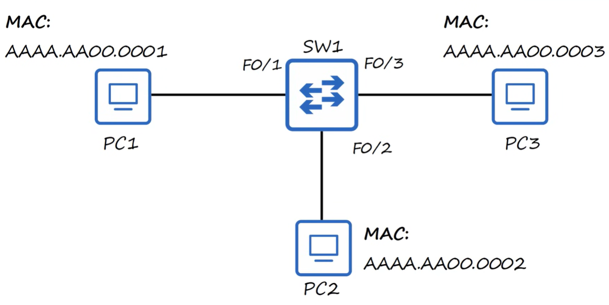

The first 24 bits = OUI (Organizationally Unique Identifier) ​​→ manufacturer

The last 24 bits = Device Identifier → unique number assigned by the manufacturer itself

example:  00:1A:2B:3C:4D:5E
is 00:1A:2B the OUI.

F0/2 is a FastEthernet interface on the switch. Logical interface name is forwarded to the physcial port where the destination MAC address is located. The switch uses its MAC address table to determine which port to forward the frame out of based on the destination MAC address in the frame's header.

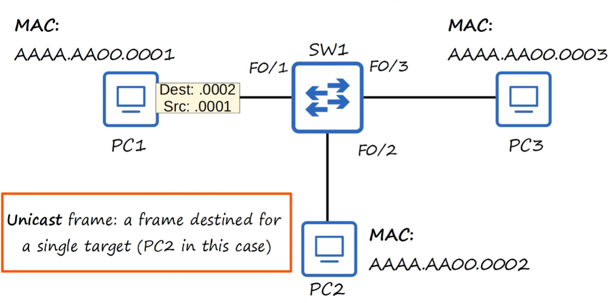

A unicast frame is an Ethernet frame sent from one specific device to one specific destination device, using the destination’s unique MAC address so that only that single intended receiver processes the frame while the switch forwards it only out the port where that destination MAC is located.

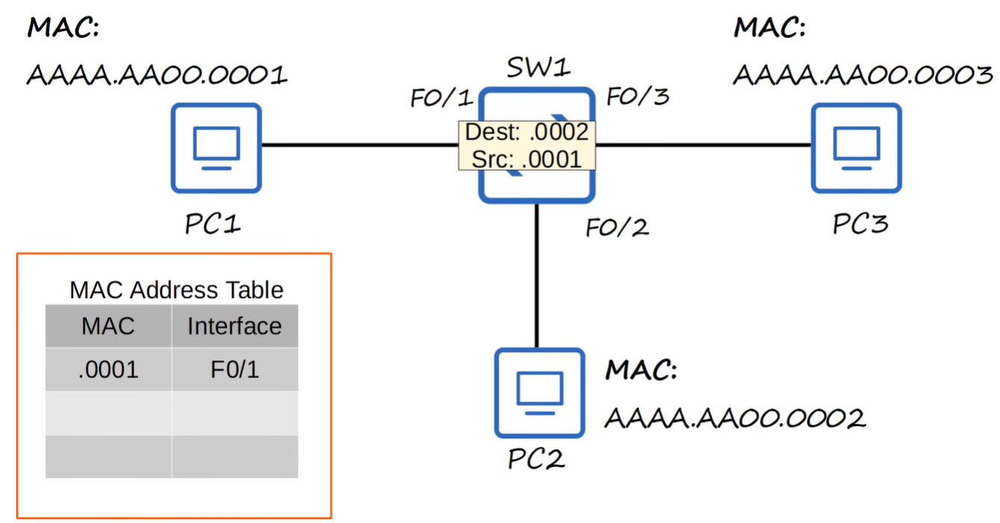

### Unknown unicast / Flooding
An unknown unicast is a unicast frame whose destination MAC address is not yet in the switch’s MAC table.
Because the switch doesn’t know on which port the destination device is located, it cannot forward it normally.

**So the switch does the only safe thing it can do:**
it floods the frame out of all ports except the one it was received on, in an attempt to reach the destination device. This process is called unknown unicast flooding.
If the real destination device is somewhere in the network, it will receive the flooded frame, accept it, and reply. When the switch receives the reply, it learns the destination MAC address and the port it is located on, and updates its MAC table accordingly. This way, future frames destined for that MAC address can be forwarded directly to the correct port without flooding.

### Known unicast / Forwarding
A known unicast is a unicast frame whose destination MAC address is already in the switch’s MAC table, so the switch forwards it directly out the single correct port instead of flooding it.

## ARP
### How it works
1. **Check ARP cache**
The device first checks if it already knowns the MAC address for the target IP.
2. **ARP Request (broadcast)**
If not in cache, it sends a broadcast: "who has IP X.X.X.X? Tell Y.Y.Y.Y"
3. **ARP Reply (unicast)**
The device with the target IP responds with a unicast: "IP X.X.X.X is at MAC AA:BB:CC:DD:EE:FF"
4. **Update cache**
The sender stores the IP-MAC mapping in its ARP cache for future use. Now it can communicate directly with the target IP using the resolved MAC address.
### Key points about ARP
- ARP maps IPv4 → MAC inside a LAN.
- ARP Request = broadcast.
- ARP Reply = unicast.
- ARP operates between Layer 2 and Layer 3 (often called Layer 2.5).
- Required for Ethernet LAN communication.
- IPv6 uses NDP (Neighbor Discovery Protocol) instead of ARP.

### Type messages
- ARP Request: Type = 0x0806 (2054 decimal)
- ARP Reply: Type = 0x0806 (2054 decimal)

### Short
ARP resolves IPv4 addresses to MAC addresses by broadcasting an ARP Request and receiving a unicast ARP Reply, allowing devices in a LAN to communicate.

- MAC is the physical address used on the local network so switches know exactly which device (which NIC) to deliver the frame to.
- IP is the logical address used for identifying devices at Layer 3 so networks can route packets across different subnets.

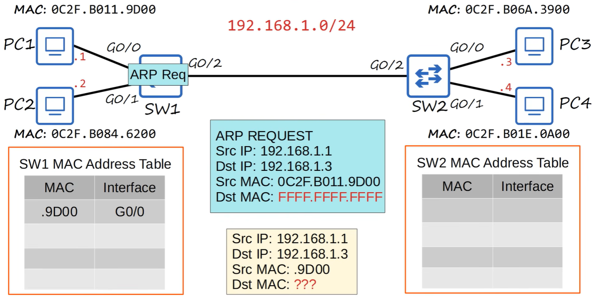
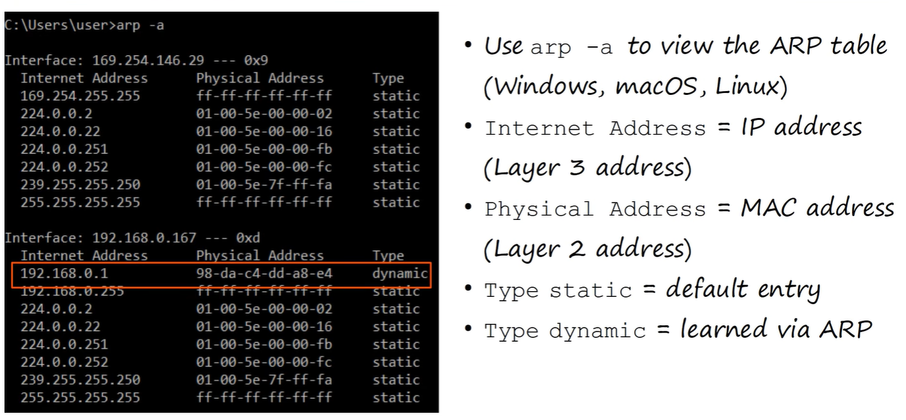
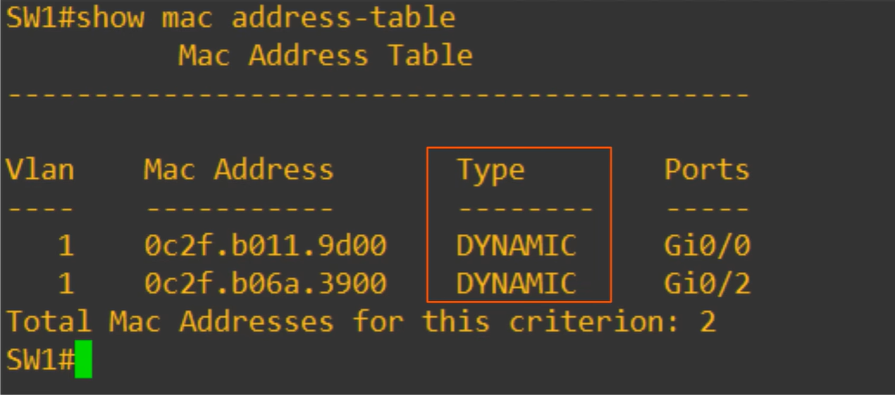

- command: `arp -a` to view the ARP cache on a device.
- command: `show mac address-table` on a switch to view the MAC address table.

#### Clear ARP Cache — CCNA Notes

##### Windows
- `arp -d *`  
  Clears all ARP entries on a Windows client.

##### Linux / Servers
- `ip -s -s neigh flush all`  
  Flushes the entire ARP table.

##### Cisco Router (IOS)
- `clear arp-cache`  
  Clears the router's ARP cache.

##### Cisco Switch
- `clear mac address-table dynamic`  
  Clears the dynamic MAC address table (switches do not have an ARP cache).
- `clear mac address-table dynamic <MAC>`  
  Clears one specific MAC entry.

##### Firewalls (general)
- `clear arp`  
  Clears the ARP cache on firewalls that support this command.

## Ping
A network utility that is used to test reachability of a host on an IP network and to measure the round-trip time.

command: `ping <destination IP>`

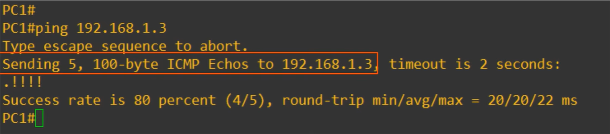
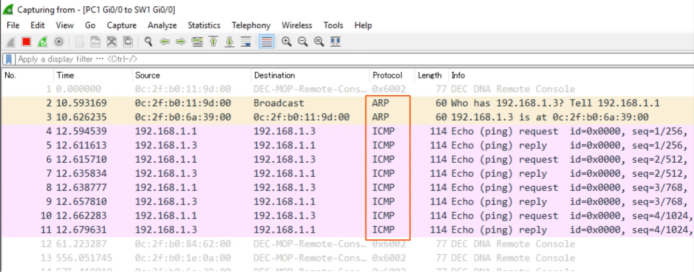

### Type messages
- ICMP Echo Request: Type = 0x0800 (2048 decimal)
- ICMP Echo Reply: Type = 0x0800 (2048 decimal)