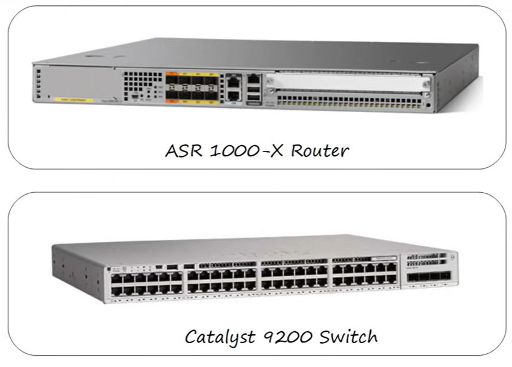
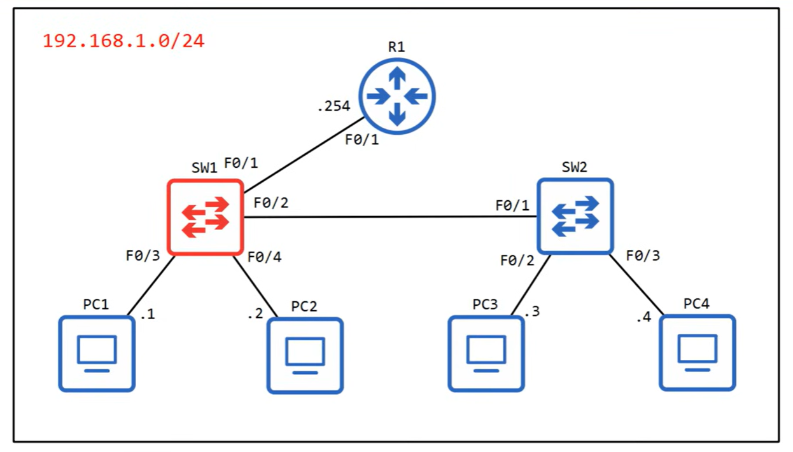
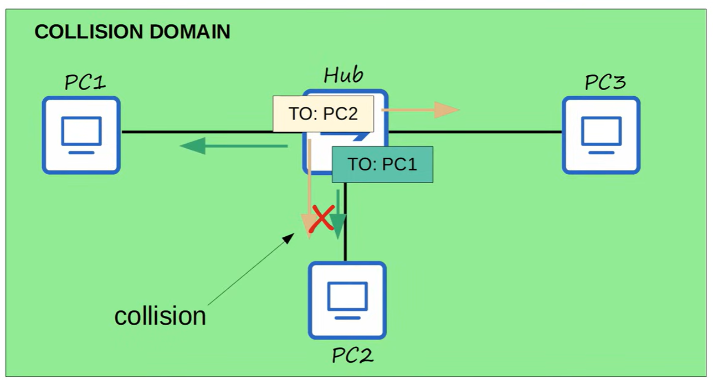
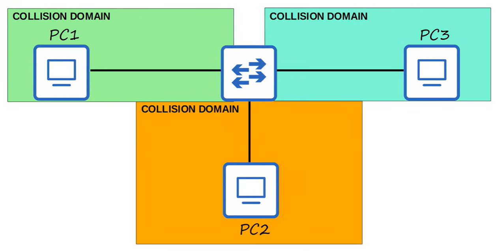
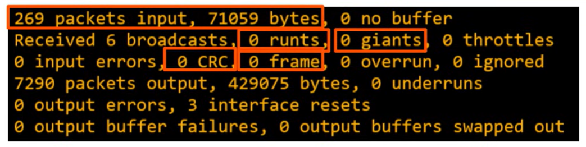

# Switch interfaces

- **Jeremy's IT Lab** — [Video](https://www.youtube.com/watch?v=cCqluocfQe0)

---
## Switches


## Network topology


## Cisco IOS Commands Explained

| Command | Meaning / What It Does |
|--------|-------------------------|
| **show ip interface brief** | Shows a quick summary of all interfaces: IP address, status, protocol. Used for fast troubleshooting. |
| **show interfaces status** | Displays interface status, VLAN, duplex, speed, and type. Great for switch port overview. |
| **configure terminal** (conf t) | Enters global configuration mode to change device settings. |
| **interface FastEthernet0/1** (int f0/1) | Enters interface configuration mode for port F0/1. |
| **speed ?** | Shows available speed options for the interface (e.g., 10/100/1000). |
| **speed 100** | Forces the interface speed to 100 Mbps. |
| **duplex ?** | Shows available duplex modes (auto, half, full). |
| **duplex full** | Sets the interface to full‑duplex mode. |
| **show interfaces status** | Shows port status, VLAN, duplex, speed, and type. Useful after configuration. |
| **interface range f0/5 - 12** | Selects multiple interfaces at once (F0/5 through F0/12). |
| **description \<text\>** | Adds a description to the interface (e.g., “## not in use ##”). Helps with documentation. |
| **shutdown** | Administratively disables the interface. Port goes down/down. |
| **interface range f0/5 - 6, f0/9 - 12** | Selects multiple non‑continuous interface ranges. |
| **no shutdown** | Enables the interface (brings it up). |

## Duplex

### Half Duplex
- Communication flows **one direction at a time**  
- Devices **cannot send and receive simultaneously**  
- Similar to a walkie‑talkie: “you talk, then I talk”  
- Causes **collisions** on shared media (CSMA/CD used on hubs)  
- Used on:  
  - Legacy Ethernet  
  - Hubs  
  - Some older devices or mismatched configurations  

#### LAN Hub

A **hub** is a Layer‑1 device that simply repeats electrical signals.  
It does **not** learn MAC addresses and does **not** forward frames intelligently.

- When one device sends data, the hub **broadcasts it to all ports**  
- All connected devices share **one collision domain**  
- If two devices send at the same time → **collision**  
- Collisions corrupt frames, forcing retransmission (CSMA/CD)  
- Hubs always operate in **half duplex**, never full duplex  
- This makes hubs slow, inefficient, and obsolete in modern networks 

### Full Duplex
- Communication flows **both directions at the same time**  
- Devices **can send and receive simultaneously**  
- **No collisions** (CSMA/CD disabled)  
- Requires:  
  - Switches (not hubs)  
  - Proper speed/duplex negotiation  
- Modern Ethernet always aims for **full duplex**  

### CSMA/CD
**CSMA/CD** stands for **Carrier Sense Multiple Access with Collision Detection**.  
It is the Ethernet access method used in **half‑duplex networks** (such as hubs).

CSMA/CD controls *when* devices are allowed to send data and *what happens* when two devices send at the same time.

#### How CSMA/CD Works
1. **Carrier Sense**  
   The device listens to the wire to check if it is free (no one else is transmitting).

2. **Multiple Access**  
   All devices share the same medium and have equal access to it.

3. **Transmit**  
   If the line is free, the device begins sending its frame.

4. **Collision Detection**  
   If another device transmits at the same time, their signals collide.  
   The device detects this collision by sensing abnormal voltage on the wire.

5. **Jam Signal**  
   The device sends a jam signal to ensure all devices know a collision occurred.

6. **Backoff (Random Delay)**  
   Each device waits a random amount of time before trying again.  
   This prevents repeated collisions.

#### Where CSMA/CD Is Used
- **Hubs**  
- **Half‑duplex Ethernet**  
- **Shared collision domains**

#### Where CSMA/CD Is NOT Used
- **Full‑duplex Ethernet**  
- **Switches**  
- **Modern networks**

Full duplex eliminates collisions entirely, so CSMA/CD becomes unnecessary.

### Collision Domains


### Speed/Duplex Autonegotiation

**Autonegotiation** is an Ethernet feature that allows two connected devices to automatically agree on the best possible **speed** and **duplex mode** supported by both sides.

Modern Ethernet devices (switches, NICs, routers) use autonegotiation by default.

#### What Autonegotiation Decides
Autonegotiation determines two things:

1. **Speed**  
   - 10 Mbps  
   - 100 Mbps  
   - 1 Gbps  
   - (and higher on modern hardware)

2. **Duplex mode**  
   - Half duplex  
   - Full duplex  

The goal is to select the **highest common speed** and **full duplex** whenever possible.

#### How Autonegotiation Works
- Each device advertises its supported speeds and duplex modes  
- They compare capabilities  
- They choose the **best mutual option**  
- If both sides support full duplex → full duplex is chosen  
- If one side does not support autonegotiation → fallback rules apply

#### Fallback Behavior (Important for CCNA)
If **one side is set to autonegotiation** and the **other side is manually configured**, the results depend on the speed:

- **10/100 Mbps links:**  
  - The autonegotiating side **cannot detect duplex**  
  - It defaults to **half duplex**  
  - → This often causes a **duplex mismatch**

- **1 Gbps links:**  
  - Gigabit Ethernet **requires autonegotiation**  
  - If one side is forced to 1000/full, the link may fail or behave unpredictably

#### Duplex Mismatch (Common CCNA Exam Topic)
A duplex mismatch happens when:

- One side = **full duplex**  
- Other side = **half duplex**

This causes:

- Slow speeds  
- Late collisions  
- CRC errors  
- Input errors  
- Output drops  
- Very poor performance  

This is one of the most common real‑world misconfigurations.

#### Best Practices (Cisco Recommended)
- Leave interfaces on **auto speed** and **auto duplex** unless you have a specific reason not to  
- Only hard‑set speed/duplex when connecting to:  
  - Legacy devices  
  - Industrial equipment  
  - Old servers  
  - Devices that do not support autonegotiation  

#### Useful Commands
```
show interfaces status
show interfaces
show running-config
```

To manually configure:
```
interface f0/1
 speed 100
 duplex full
```

To return to autonegotiation:
```
interface f0/1
 speed auto
 duplex auto
```

#### What You Must Know for CCNA
- What autonegotiation does  
- How duplex mismatch happens  
- Symptoms of duplex mismatch  
- Why Gigabit Ethernet requires autonegotiation  
- Why modern networks use full duplex  
- How to verify and configure speed/duplex on Cisco switches  

## Interface Errors


### Runts
**Runts** are Ethernet frames **smaller than the minimum allowed size** (less than 64 bytes).  
They usually indicate:

- **Collisions** (half‑duplex environments, hubs)  
- **Duplex mismatch**  
- **Physical layer issues**  

Runts are almost always a sign of a problem.

### Giants
**Giants** are Ethernet frames **larger than the maximum allowed size** (greater than 1518 bytes, unless jumbo frames are enabled).  
Common causes:

- MTU mismatch  
- Misconfigured jumbo frames  
- Faulty NICs or drivers  
- Corrupted frames on the wire  

### CRC
**CRC errors** occur when the **Cyclic Redundancy Check** fails.  
This means the frame was received but **its contents were corrupted**.

Typical causes:

- Bad cabling  
- Electrical interference  
- Damaged connectors  
- Duplex mismatch  
- Long cable runs  
- Faulty transceivers  

CRC errors are one of the most important counters to monitor.

### Frame
**Frame errors** (sometimes called “alignment errors”) occur when a frame:

- Has an **incorrect length**, or  
- Is **not properly aligned** on byte boundaries  

Often caused by:

- Collisions  
- Duplex mismatch  
- Physical layer issues  
- Bad cabling or connectors  

Frame errors + CRC errors together strongly suggest a **Layer‑1 problem**.