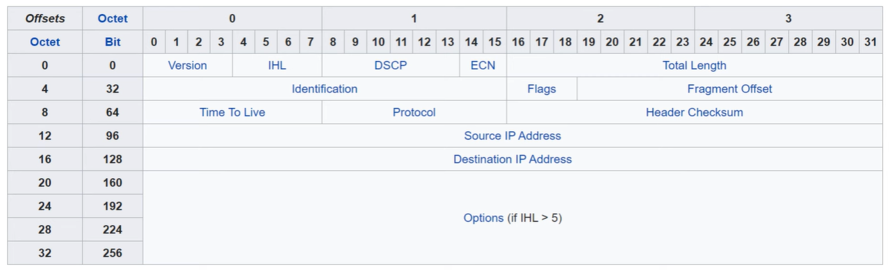

# IPv4 Header

Focus on fields and the header of a IPv4.
Focus on layer 3 (L3 Header)

- **Jeremy's IT Lab** — [Video](https://www.youtube.com/watch?v=aQB22y4liXA)

---

## Fields

 **source: wikipedia*

### Version
- Length: 4 bits
- IPv4 = value 4 (binary 0100)
- IPv6 = value 6 (binary 0110)

**What it is:** Tells routers which IP version the packet uses.  
**Why it exists:** Routers must know how to read the header format.

### IHL — Internet Header Length
- Length: 4 bits
- Minimum value: 5 → 5 × 4 bytes = **20 bytes**
- Maximum value: 15 → 15 × 4 bytes = **60 bytes**
- Binary max example: 1111 → 8 + 4 + 2 + 1 = 15
- Minimum IPv4 header length = **20 bytes**

**What it is:** The size of the IPv4 header.  
**Why it exists:** The header can grow if options are used, so routers need to know where the data starts.

### DSCP — Differentiated Services Code Point
- Length: 6 bits
- Used for QoS (Quality of Service)
- Example: EF (Expedited Forwarding) = 101110

**What it is:** A priority tag for the packet.  
**Why it exists:** Some traffic (voice, video) must be delivered faster than others.

### ECN — Explicit Congestion Notification
- Length: 2 bits
- 00 = Not ECN-capable
- 11 = Congestion encountered

**What it is:** A way to signal congestion without dropping packets.  
**Why it exists:** Helps avoid packet loss and improves performance in congested networks.

### Total Length
- Length: 16 bits
- Minimum: 20 bytes
- Maximum: 65,535 bytes
- Binary max: 1111 1111 1111 1111 = 65,535

**What it is:** The total size of the entire IPv4 packet (header + data).  
**Why it exists:** Routers need to know how long the packet is to process it correctly.

### Identification
- Length: 16 bits
- Unique ID for each packet
- All fragments of the same packet share this ID

**What it is:** A number used to identify which fragments belong together.  
**Why it exists:** Needed for reassembling fragmented packets at the destination.

### Flags
- Length: 3 bits
- Bit 0: Reserved (always 0)
- Bit 1: DF (Don't Fragment)
- Bit 2: MF (More Fragments)

**What it is:** Controls and indicates fragmentation.  
**Why it exists:** Allows the sender to forbid fragmentation or indicate that more fragments follow.

### Fragment Offset
- Length: 13 bits
- Measured in 8‑byte blocks
- Example: offset 100 → 100 × 8 = 800 bytes

**What it is:** The position of a fragment within the original packet.  
**Why it exists:** The receiver needs to know how to reassemble fragments in the correct order.

### TTL — Time To Live
- Length: 8 bits
- Decreases by 1 at each router
- Packet is dropped when TTL reaches 0

**What it is:** A hop counter.  
**Why it exists:** Prevents packets from looping forever in the network.

### Protocol
- Length: 8 bits
- 1 = ICMP  
- 6 = TCP  
- 17 = UDP  

**What it is:** Indicates which Layer 4 protocol is inside the packet.  
**Why it exists:** The receiver must know how to interpret the payload.

### Header Checksum
- Length: 16 bits
- Validates the IPv4 header only
- Recalculated by every router

**What it is:** An error‑checking value for the header.  
**Why it exists:** Ensures the header wasn’t corrupted during transmission.

### Source IP Address
- Length: 32 bits

**What it is:** The sender’s IPv4 address.  
**Why it exists:** The receiver must know where the packet came from.

### Destination IP Address
- Length: 32 bits

**What it is:** The receiver’s IPv4 address.  
**Why it exists:** Routers need to know where to forward the packet.

### Options
- Variable length (0–40 bytes)
- Rarely used
- Makes the header longer than 20 bytes (IHL > 5)

**What it is:** Extra optional features (security, timestamps, etc.).  
**Why it exists:** Allows IPv4 to support special functions, though almost never used today.

## Wireshark demo 
- Packet Sniffing
- watch video (minute: 17:00 - 24:00)