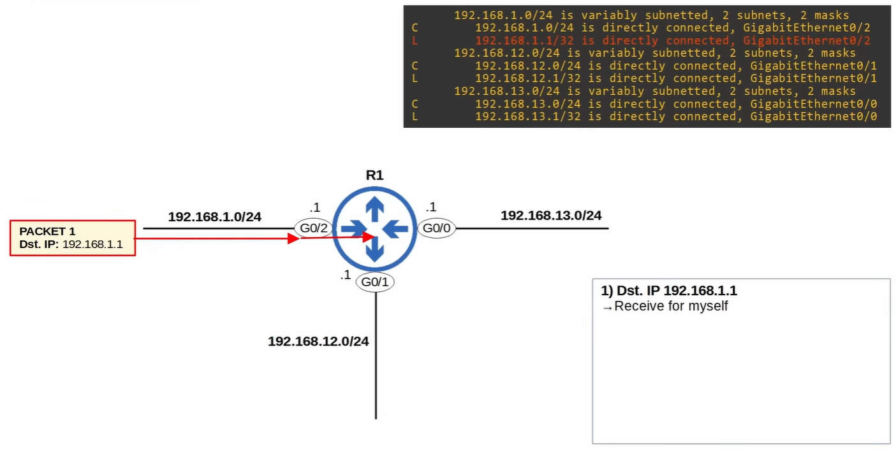
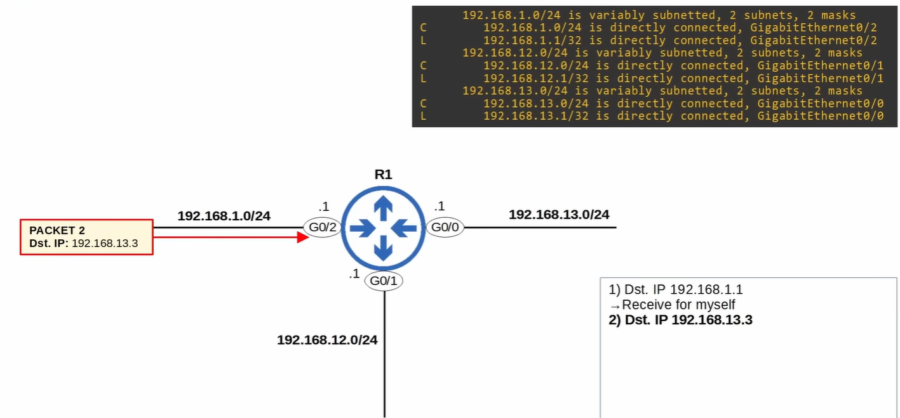
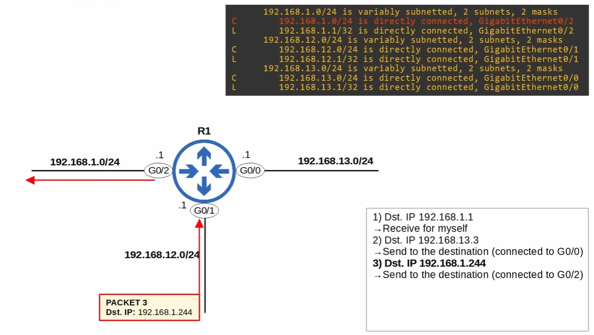
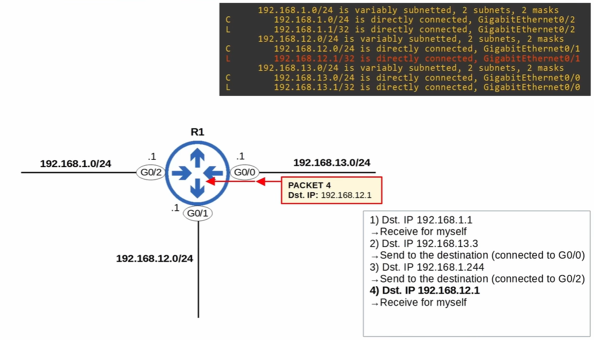

# Routing Fundamentals

- **Jeremy's IT Lab** — [Video routing fundamentals](https://www.youtube.com/watch?v=aHwAm8GYbn8)
- **Jeremy's IT Lab** — [Video static routing](https://www.youtube.com/watch?v=YCv4-_sMvYE)

---
## What is Routing?
Routing is the process of **forwarding packets between different networks**.  
A router looks at the **destination IP address**, checks its **routing table**, and decides the **next hop** to send the packet toward its final destination.

Key points:
- Routers store routes to all known destinations in a **routing table**
- When a router receives a packet, it looks for the **best route** (longest prefix match)
- The router forwards the packet out the interface that leads to the next hop

**Next-hop** = the next router in the path toward the destination.

## Dynamic Routing
Dynamic routing uses **routing protocols** so routers can **learn routes automatically**.

Characteristics:
- Routers exchange routing information
- Automatically adapts to network changes or failures
- Used in **medium and large networks**
- Examples: **OSPF, EIGRP, RIP**

Routers build and update their routing tables based on the protocol’s rules.

## Static Routing
Static routing means routes are **manually configured** by an administrator.

Characteristics:
- Does **not** change automatically
- Simple, predictable, secure
- Used in **small networks** or for **specific paths**
- Requires manual updates if the network changes
- Gives the administrator **full control** over the path traffic takes
- Does **not** generate routing traffic (unlike dynamic protocols)
- Very useful for **stub networks** (networks with only one way out)

### Why use Static Routes?
- To reach **remote networks** when no dynamic routing protocol is used
- To create **backup routes** (floating static routes)
- To define a **default route** toward the internet or upstream router
- To override or influence the path chosen by dynamic routing
- To simplify routing in small or predictable topologies

### How to Configure Static Routes
Static routes use the command:
```ip route <destination-network> <subnet-mask> <next-hop>
ip route <destination-network> <subnet-mask> <exit-interface>
ip route <destination-network> <subnet-mask> <exit-interface> <next-hop>
```
Three valid forms:

1. **Next-hop only**
R1(config)# ip route 10.0.2.0 255.255.255.0 192.168.1.2
Router forwards packets to the next-hop IP.

2. **Exit interface only**
R1(config)# ip route 10.0.2.0 255.255.255.0 GigabitEthernet0/0
Router sends packets directly out the interface.

3. **Exit interface + next-hop**
R1(config)# ip route 10.0.2.0 255.255.255.0 GigabitEthernet0/0 192.168.1.2
Most explicit form; rarely required.

### How Static Routes Appear in the Routing Table
Static routes show up with the code **S**:

S 10.0.2.0/24 [1/0] via 192.168.1.2, GigabitEthernet0/0

- **S** = Static  
- **[1/0]** = Administrative distance / metric  
- **via** = next-hop  
- **GigabitEthernet0/0** = exit interface

### Floating Static Routes
A floating static route is a **backup route** with a **higher administrative distance** than the primary route.

Example:
ip route 10.0.2.0 255.255.255.0 192.168.1.2 200

- AD 200 → only used if the primary route fails  
- Commonly used as a backup for OSPF, EIGRP, or another static route

### Default Static Route
A default route is used when **no other route matches**.
```ip route 0.0.0.0 0.0.0.0 <next-hop>```

Used for:
- Internet access
- Sending all unknown traffic to an upstream router
- Stub networks with only one exit point

### When NOT to Use Static Routes
- In large, dynamic, or frequently changing networks
- When multiple paths exist and automatic failover is needed
- When scalability is required (dynamic routing is better)

### Summary
Static routes are:
- Manual  
- Predictable  
- Lightweight  
- Perfect for small or stable networks  
- Essential for default routes and backup routes  
- Always shown with **S** in the routing table  

## Default Gateway

When a host sends a packet, it first checks whether the destination is in the same subnet.

- **Same subnet** → the host sends the packet directly to the destination.
- **Different subnet** → the host sends the packet to its **default gateway** (usually a router).

### When is a packet dropped?

#### 1. The host has no default gateway
If a host tries to reach a destination outside its own subnet but **no default gateway** is configured:

- The host has no idea where to send the packet  
- There is no router to forward the traffic  
- 👉 **The host drops the packet**

#### 2. The router has no route to the destination
Routers use their **routing table** to decide where to forward packets.

If a router receives a packet and:

- there is **no connected route**
- there is **no static route**
- there is **no dynamic route**
- there is **no default route (0.0.0.0/0)**

then the router has **no matching entry** for the destination.

👉 **The router drops the packet**  
👉 It usually sends an **ICMP Destination Unreachable** message back to the sender

### Why a default route is important
A default route:

```ip route 0.0.0.0 0.0.0.0 <next-hop>```


means:

> “If no other route matches, send the packet to this next-hop router.”

Without a default route:
- Internet traffic will not work  
- Unknown networks are unreachable  
- The router drops all unmatched packets  

With a default route:
- All unknown destinations are forwarded to the next-hop  
- Perfect for small networks or internet uplinks

### Summary
- **Host without default gateway** → drops the packet  
- **Router without a matching route** → drops the packet  
- **Default route** → catches all unknown destinations  
- **Routers never flood packets** (only switches flood unknown MAC addresses)


## Routing Table

Command to view the routing table: *show ip route*

Common route codes:
- **C** — Connected route (network directly attached to an interface)
- **L** — Local route (/32, the exact IP of the router’s interface)
- **S** — Static route
- **O** — OSPF route
- **D** — EIGRP route
- **R** — RIP route

Routers choose routes using:
1. **Longest prefix match** (most specific route wins)
2. **Administrative distance**
3. **Metric**

## Connected and Local Routes

When you configure an IP address on a router interface:

### Connected Route (C)
Represents the **entire network** the interface belongs to.  
Example: C 192.168.1.0/24 is directly connected, GigabitEthernet0/2

### Local Route (L)
Represents the **exact IP address** of the router interface (/32).  
Example: L 192.168.1.1/32 is directly connected, GigabitEthernet0/2


Routers will:
- **Forward** packets that match a Connected route
- **Receive** packets that match a Local route

---
# Route Selection Practice

## Packet 1


### /24 subnet calculation (short & clear)

1. **IPv4 = 32 bits**  
   (4 octets × 8 bits)

2. **/24 = 24 network bits + 8 host bits**  
   (32 − 24 = 8)

3. **Network in binary (192.168.1.0):**  
   11000000.10101000.00000001.00000000

4. **/24 mask in binary:**  
   11111111.11111111.11111111.00000000  
   → 255.255.255.0

5. **Network address:**  
   Host bits = 00000000 → **192.168.1.0**

6. **First host:**  
   Host bits = 00000001 → **192.168.1.1**

7. **Last host:**  
   Host bits = 11111110 → **192.168.1.254**

8. **Broadcast:**  
   Host bits = 11111111 → **192.168.1.255**

### Result
- **Netmask:** 255.255.255.0  
- **Network:** 192.168.1.0  
- **First host:** 192.168.1.1  
- **Last host:** 192.168.1.254  
- **Broadcast:** 192.168.1.255  
- **Total hosts:** 254

## Packet 2


1. **Source network:** 192.168.1.0/24  
   **Destination:** 192.168.13.3

2. The destination network part is **192.168.13**, which is **different** from the source network (192.168.1).  
   → The packet must be forwarded to an **external network**.

3. R1 checks its routing table and sees that **192.168.13.0/24** is directly connected on **G0/0**.

4. **Correct action:** Forward the packet out **G0/0** toward the 192.168.13.0/24 network.

## Packet 3


1. **Destination:** 192.168.1.244  
   **Source network:** 192.168.12.0/24

2. R1 checks the routing table:  
   192.168.1.0/24 is directly connected on **G0/2**.

3. The destination (192.168.1.244) belongs to that network.

4. **Action:** Forward the packet out **G0/2** toward the 192.168.1.0/24 network.

## Packet 4


1. **Source network:** 192.168.13.0/24  
   **Destination:** 192.168.12.1

2. R1 checks the routing table:  
   192.168.12.1/32 is a **local address** of R1 on interface **G0/1**.

3. Because the destination equals the router’s own interface IP, the packet is **received locally**.

4. **Action:** R1 processes the packet itself (no forwarding).

---
## Routing Fundamentals Summary
- Routers forward packets **between networks**
- They use the **routing table** to choose the best path
- **Connected** and **Local** routes appear automatically
- **Static** and **Dynamic** routes are added manually or learned
- Routers always use **longest prefix match**
