# Life of a packet

- **Jeremy's IT Lab** — [Video](https://www.youtube.com/watch?v=4YrYV2io3as)

---

## Network topology
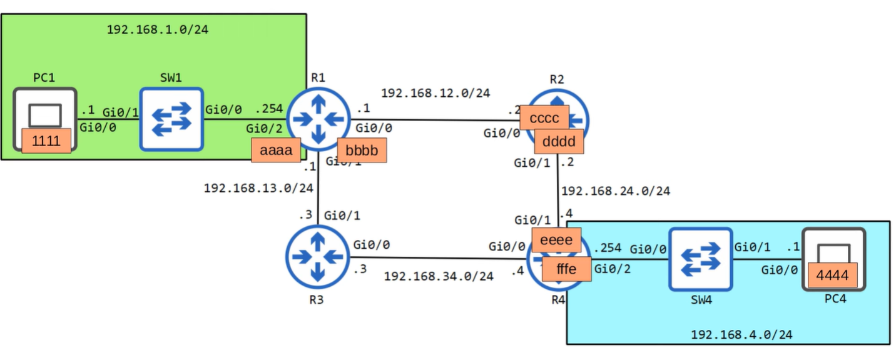

*Orange/black labels are representatives of a MAC address.*

When we send a packet outside the same network, we have to send it through the default gateway.  
For this we use **ARP (Address Resolution Protocol)**.

ARP resolves an IPv4 address to a MAC address by sending a **broadcast ARP Request** and receiving a **unicast ARP Reply**.  
This allows the host to learn the MAC address it needs to place in the Ethernet frame.

A **unicast** is simply one‑to‑one communication:  
a frame sent from one specific device to one specific destination device, using that device’s unique MAC address so only that single receiver gets it.

---

## Example Scenario

### PC1

PC1 wants to communicate with PC4.  
Both are in different networks.

---

## PC1 → R1

PC1 wants to send a packet to **192.168.4.1** (PC4).  
This IP is **not in 192.168.1.0/24**, so PC1 must send the packet to its **default gateway (R1)**.

### PC1 doesn't know R1’s MAC address  
So PC1 sends an **ARP Request (broadcast)**:

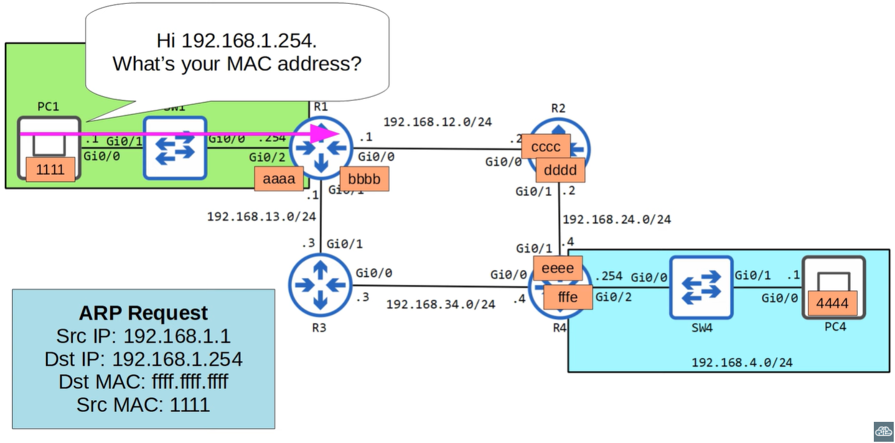

R1 replies with an **ARP Reply (unicast)**:

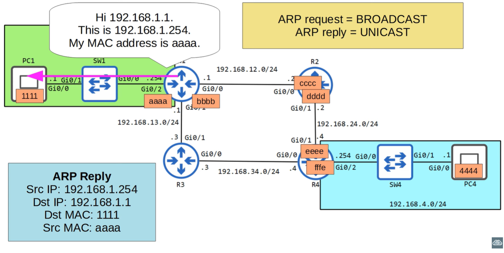

Now PC1 can build an Ethernet frame and send the packet to R1:

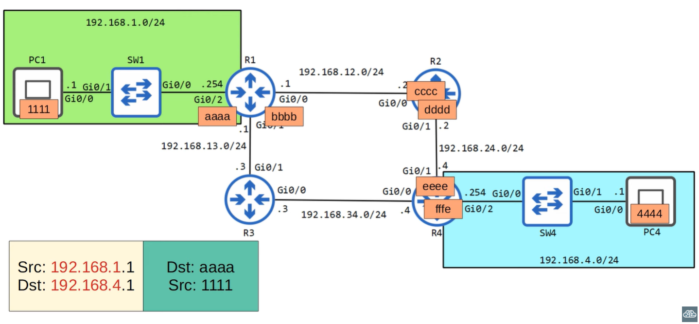

- **Src MAC:** PC1  
- **Dst MAC:** R1  
- **Src IP:** PC1  
- **Dst IP:** PC4  

---

## R1 → R2

R1 receives the frame, removes the Ethernet header, and checks the **destination IP**:

> 192.168.4.1

This IP is **not in any of R1’s directly connected networks**.

### Which router should R1 forward to?

R1 checks its **routing table** and sees:

- 192.168.12.0/24 → via **R2**  
- 192.168.13.0/24 → via R3  
- 192.168.4.0/24 → **reachable through R2**, not R3  

Therefore, R1 forwards the packet to **R2**.

### R1 needs R2’s MAC address  
So R1 sends an ARP Request:

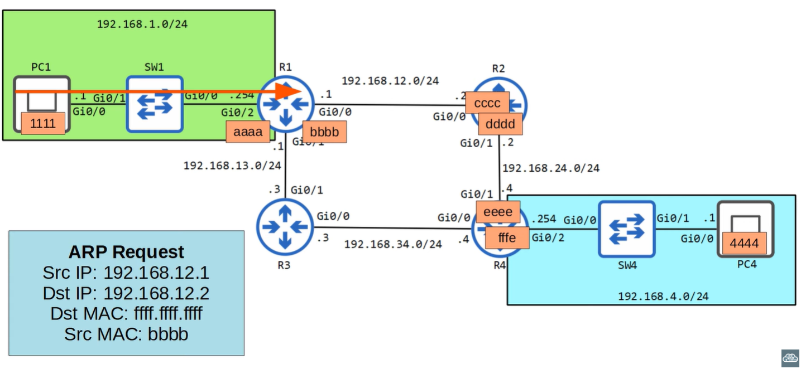

R2 replies:

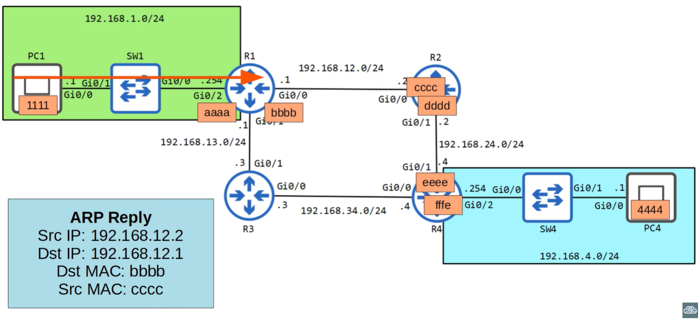

R1 builds a new Ethernet frame:

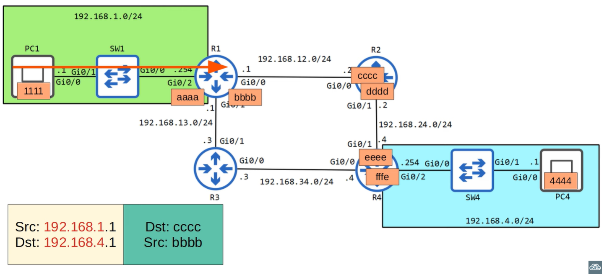

---

## R2 → R4

R2 checks the destination IP: **192.168.4.1**.  
Its routing table says the next hop is **R4**.

### R2 doesn’t know R4’s MAC yet  
So again:

- ARP Request  
- ARP Reply  

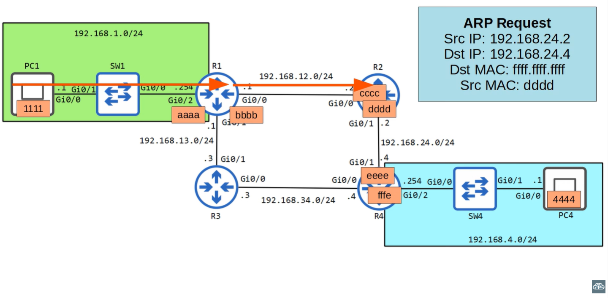  
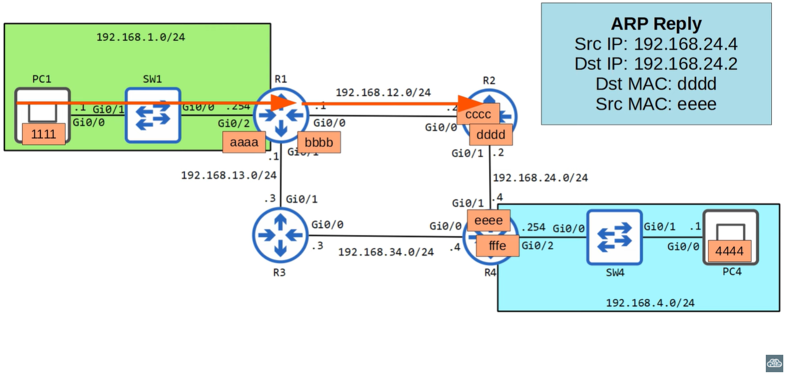

Then R2 sends the packet to R4:

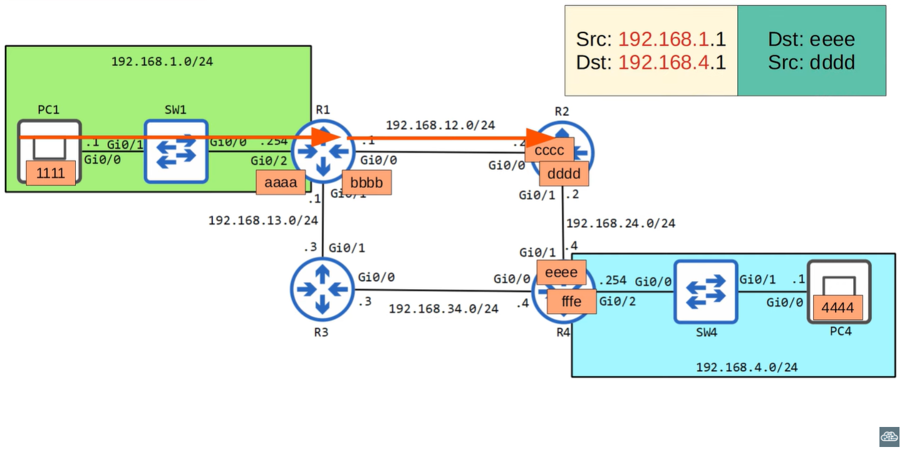

---

## R4 → PC4

R4 receives the packet and checks its routing table:

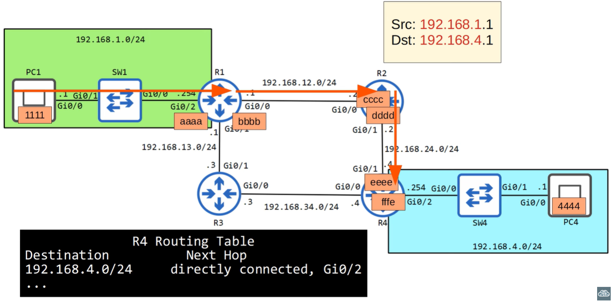

It sees:

> 192.168.4.0/24 is directly connected on Gi0/2

So R4 must deliver the packet directly to PC4.

### But R4 doesn’t know PC4’s MAC address yet  
So R4 sends an ARP Request:

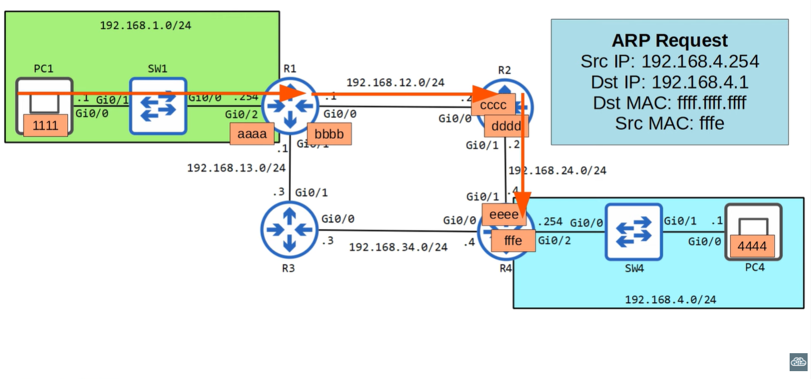  
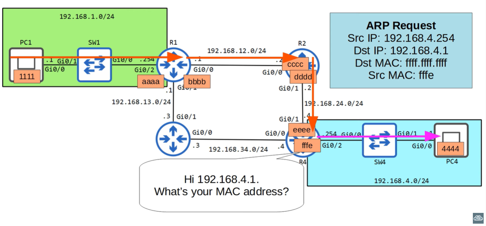

PC4 replies:

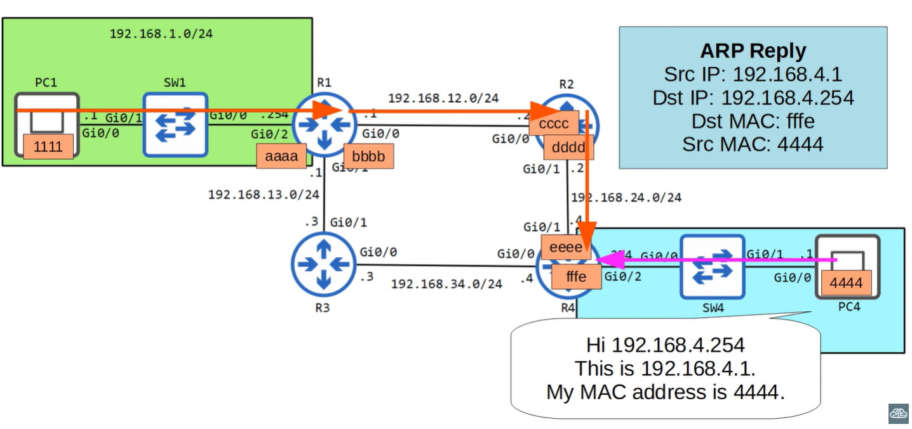

Now R4 can send the packet:

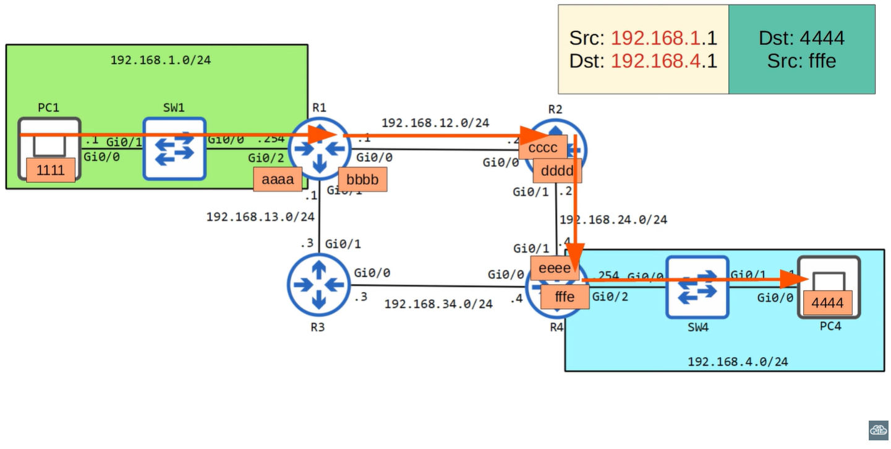

---

## Reply from PC4 → PC1

PC4 now sends a reply back to PC1.  
The entire process happens **in reverse**:

- PC4 → R4  
- R4 → R2  
- R2 → R1  
- R1 → PC1  

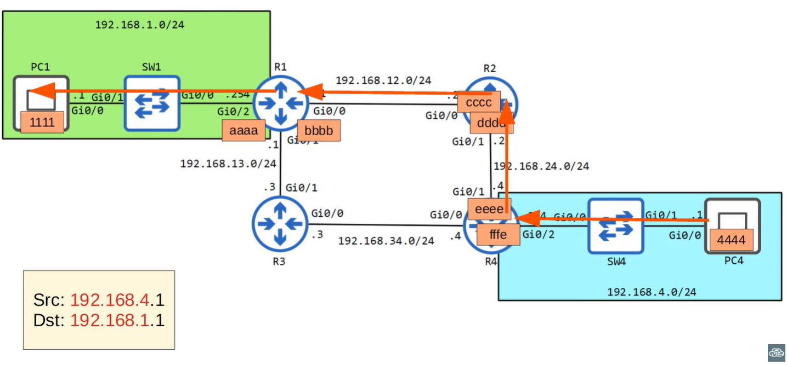

Routers again use ARP if needed, rebuild Ethernet frames hop‑by‑hop,  
and forward the packet until it reaches PC1.