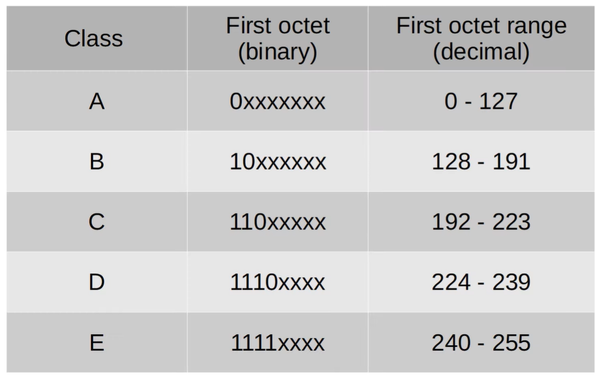
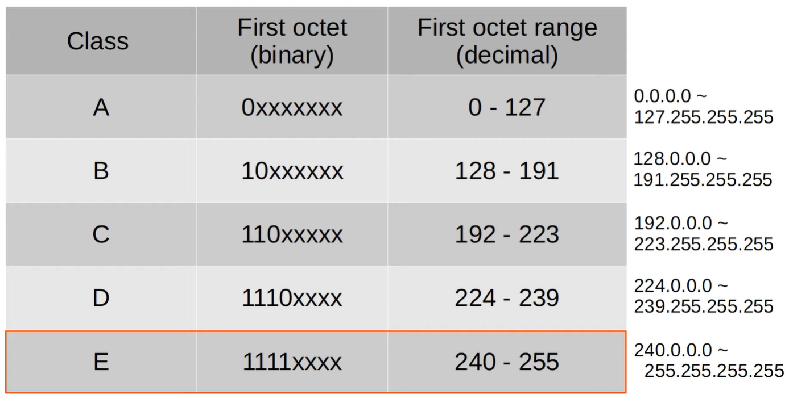
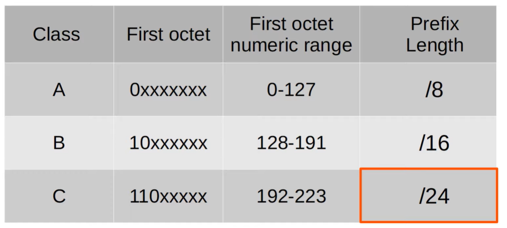
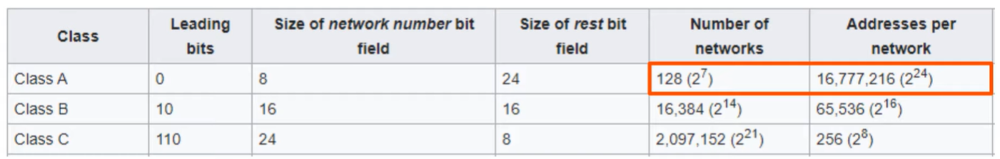
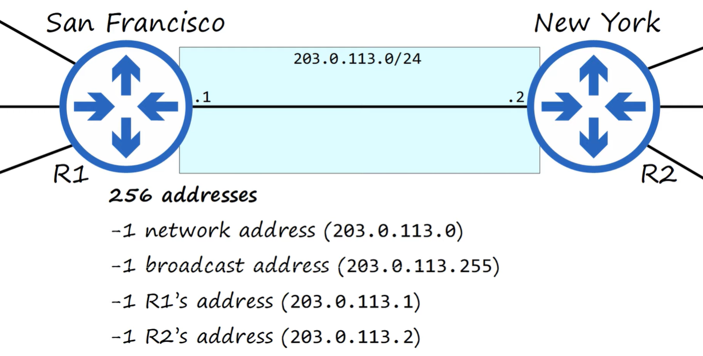
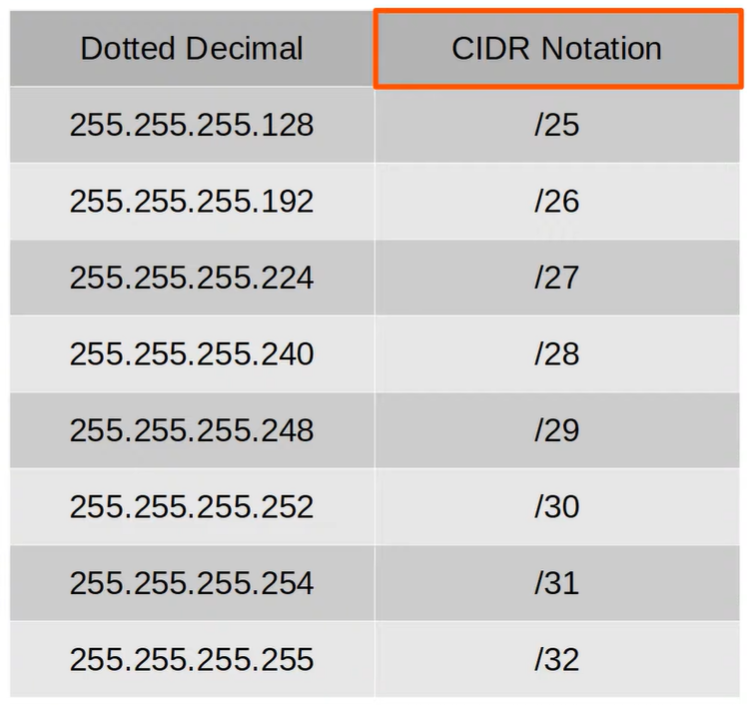
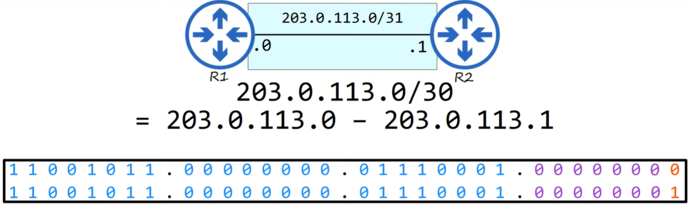
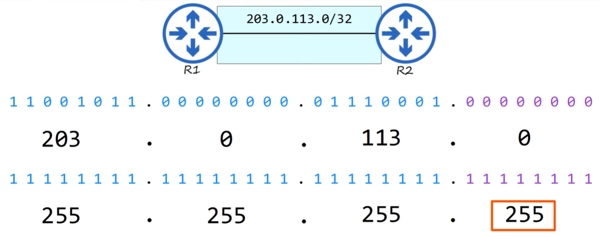
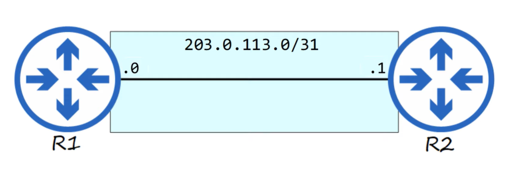

# Subnetting

Subnetting exists to break a large IP network into smaller, more efficient segments. It helps reduce broadcast traffic, improve performance, increase security, and prevent IP address waste. By dividing a network into subnets, you can control how devices communicate, isolate traffic, and design networks that scale cleanly. In short, subnetting lets you create networks that are the right size for the job instead of using one oversized, inefficient network.

- **Jeremy's IT Lab** — [Part 1](https://www.youtube.com/watch?v=bQ8sdpGQu8c)
- **Jeremy's IT Lab** — [Part 2](https://www.youtube.com/watch?v=IGhd-0di0Qo)
- **Jeremy's IT Lab** — [Part 3](https://www.youtube.com/watch?v=z-JqCedc9EI%20)

---
## IPv4 address classes
**classful addressing:**

IPv4 address classes were an early method of dividing the IPv4 address space into fixed‑size blocks. Each class is identified by the first bits of the first octet, which determine how much of the address is used for the network portion versus the host portion.

- **Class A addresses** start with 0 and support very large networks with many hosts.
- **Class B addresses** start with 10 and support medium‑sized networks.
- **Class C addresses** start with 110 and support many small networks.
- **Class D addresses** start with 1110 and are used for multicast, not normal hosts.
- **Class E addresses** start with 1111 and are reserved for experimental use.

Classful addressing is mostly historical today, but understanding it helps with legacy networks and exam topics.

IPv4 address classes divide the address space into fixed‑size blocks based on the first bits of the first octet. Class A uses a leading 0 and covers 0–127 with a default /8 prefix for very large networks, Class B uses 10 and covers 128–191 with a /16 prefix for medium networks, and Class C uses 110 and covers 192–223 with a /24 prefix for small networks. These class boundaries were part of the old classful addressing system, which defined how much of the address identified the network versus the hosts. Although modern networks use CIDR instead of strict classes, understanding these ranges and prefixes remains important for interpreting legacy designs and exam material.

Finally:

### IANA
**IANA stands for Internet Assigned Numbers Authority.** It is the global organization responsible for coordinating and managing the core elements that keep the internet running smoothly. IANA allocates IP address blocks to regional registries, manages the global DNS root zone, and maintains protocol numbers used in internet standards. In short, IANA ensures that IP addresses, domain names, and protocol identifiers remain unique and consistent worldwide so devices can communicate reliably across the internet.

For example, a very large company might receive a class A or class B network, while a small company might receive a class c network.

If company X needs IP addressing for 5000 end hosts, a class C network does not provide enough addresses. Solution seems class B network that must be assigned. BUT this result in about 60.000 addresses being wasted.

---

## CIDR
Stands for classles inter-domain routing.

When the internet was first created, the creators did not predict that the internet would become large as it is today.
This resulted in wasted address space lile the example. 

In 1993, the IETF (internet engineering task force) introduced CIDR to replace the 'classful' addressing system.

In this way, it allows larger networks to be split up into smaller networks, allowing greater efficiency. Smaller networks are called **'subnetworks'** or **'subnets'**.

### Notation

- CIDR = netmask in bits.  
- Netmask = CIDR in decimal.

### CIDR /31 (netmask)

A /31 network uses 31 network bits (from the 32 bits) and leaves only 1 host bit, giving exactly two usable IP addresses. Because a point‑to‑point link connects only two devices, there is no need for a broadcast address and no need for a network address. Both IPs in the /31 range are treated as host addresses.
Use‑case: point‑to‑point router links (serial, fiber, WAN), where only two endpoints exist and address space should not be wasted.

### CIDR /32 (netmask)

A /32 network uses all 32 bits for the network portion, leaving 0 host bits, which means it represents one single IP address. It has no network address, no broadcast address, and no host range — it identifies exactly one device.
Use‑case: loopback interfaces, router IDs (OSPF/BGP), ACLs matching a single IP, and management identifiers.

## Subnetting (TL;TR)

Subnetting is the process of taking one large IP network and dividing it into multiple smaller, more efficient networks. It reduces broadcast traffic, improves performance, increases security, and prevents wasting IP addresses by giving each part of the network exactly the number of hosts it needs. In essence, subnetting lets you design networks that are the right size instead of relying on one oversized, inefficient block.

---
## Modern Subnetting (CIDR)
Modern subnetting uses **prefix lengths** (e.g., /24, /26, /30, /31, /32) instead of fixed address classes.  
Any network can be divided into smaller subnets by choosing how many bits belong to the network portion.  
CIDR is flexible, efficient, and used in all modern networks.

**Example:**  
Splitting **192.168.1.0/24** into four **/26** subnets (each block = 64 addresses):
- 192.168.1.0/26  
- 192.168.1.64/26  
- 192.168.1.128/26  
- 192.168.1.192/26  

CIDR allows subnetting of *any* network, regardless of its original class.

## Classful Subnetting
Classful addressing is the old system where the **first bits of the first octet** determined the network size.  
Each class had a **fixed default subnet mask**, and networks could only be subnetted within their class boundary.  
This system is mostly historical today.

### Class A
- Starts with: **0xxxxxxx**
- Range: **0.0.0.0 – 127.255.255.255**
- Default mask: **/8**
- Total addresses: **16,777,216** 
(32 - 8 = 24 --> 2^24)
- Usable hosts: **16,777,214**
- Lost addresses (network + broadcast): **2**

### Class B
- Starts with: **10xxxxxx**
- Range: **128.0.0.0 – 191.255.255.255**
- Default mask: **/16**
- Total addresses: **65,536**
- Usable hosts: **65,534**
- Lost addresses: **2**

### Class C
- Starts with: **110xxxxx**
- Range: **192.0.0.0 – 223.255.255.255**
- Default mask: **/24**
- Total addresses: **256**
- Usable hosts: **254**
- Lost addresses: **2**

### Class D (Multicast)
- Starts with: **1110xxxx**
- Range: **224.0.0.0 – 239.255.255.255**
- Default mask: **N/A**
- Total addresses: **268,435,456**
- Usable hosts: **N/A (not for hosts)**
- Purpose: **Multicast groups**

### Class E (Experimental / Research)
- Starts with: **1111xxxx**
- Range: **240.0.0.0 – 255.255.255.255**
- Default mask: **N/A**
- Total addresses: **268,435,456**
- Usable hosts: **N/A (not for general use)**
- Purpose: **Reserved for future/experimental use**

---

## VLANs
VLANs (Virtual Local Area Networks) divide a single physical switch into multiple **virtual** networks. Each VLAN is its own **broadcast domain**, which keeps traffic separated, improves security, and reduces unnecessary broadcast traffic. Instead of placing all devices into one large LAN, VLANs allow you to logically segment the network at **Layer 2**.

Without VLANs, every device connected to a switch belongs to the same broadcast domain. Broadcasts reach everyone, departments can see each other’s traffic, and there is no control over segmentation. VLANs solve this by creating isolated Layer 2 segments inside the same physical infrastructure.

### Why VLANs are needed
- **Reduced broadcast traffic** — each VLAN has its own broadcast domain.  
- **Improved security** — departments or roles are logically separated.  
- **Flexibility** — one switch can host many virtual networks.  
- **Cost‑efficient** — no need for separate switches per department.  
- **Scalable** — modern networks rely on many small, well‑defined segments.

### VLANs and Subnets (1:1 relationship)
Each VLAN must be mapped to **exactly one subnet**.  
You cannot place multiple subnets in one VLAN, and you cannot stretch one subnet across multiple VLANs.

Example:

| VLAN | Department | Subnet |
|------|------------|--------|
| 10   | HR         | 192.168.10.0/24 |
| 20   | IT         | 192.168.20.0/24 |
| 30   | Sales      | 192.168.30.0/24 |

**Why 1:1?**  
- VLAN = Layer 2 separation  
- Subnet = Layer 3 separation  
- Together they form a fully isolated network segment

### Access Ports
An **access port** belongs to **one VLAN**.  
Used for end devices such as PCs, printers, and servers.

- Sends **untagged** Ethernet frames  
- The switch internally assigns the frame to the correct VLAN

### Trunk Ports
A **trunk port** carries **multiple VLANs** over a single physical link.  
Used between switches or between a switch and a router.

- Sends **tagged** frames using 802.1Q  
- The tag contains the VLAN ID  
- Tags are removed before frames reach end hosts

### 802.1Q VLAN Tagging
When a frame travels over a trunk, the switch adds an **802.1Q tag**.  
This tag includes:

- The **VLAN ID**  
- Optional priority information  
- A type field indicating the frame is tagged

On access ports, the tag is **removed** before the frame is delivered to the device.

### Inter‑VLAN Routing
Because VLANs are isolated at Layer 2, devices in different VLANs **cannot communicate** directly.  
To allow communication between VLANs, you need **Layer 3 routing**, provided by:

- A **router** (Router‑on‑a‑Stick), or  
- A **Layer 3 switch** using SVI interfaces

These devices route traffic between the subnets assigned to each VLAN.

### Summary
- VLANs split a switch into multiple virtual networks.  
- Each VLAN is its own **broadcast domain**.  
- Each VLAN maps to **one subnet**.  
- Access ports = one VLAN, untagged frames.  
- Trunk ports = multiple VLANs, tagged frames.  
- Inter‑VLAN communication requires a router or Layer 3 switch.
