# VLAN's

VLANs (Virtual Local Area Networks) allow you to divide a single physical switch network into multiple logical networks. They exist to improve security, reduce unnecessary broadcast traffic, and give you precise control over how devices are grouped and communicate. Instead of relying on separate physical switches, VLANs let you isolate departments, functions, or traffic types using software, making networks more flexible, scalable, and easier to manage.

- **Jeremy's IT Lab** — [Part 1](https://www.youtube.com/watch?v=cjFzOnm6u1g)
- **Jeremy's IT Lab** — [Part 2](https://www.youtube.com/watch?v=Jl9OOzNaBDU)
- **Jeremy's IT Lab** — [Part 3](https://www.youtube.com/watch?v=OkPB028l2eE)

---

## What is a LAN?
A **LAN (Local Area Network)** is a network that connects devices within a limited geographic area such as a home, office, school, or building.  
All devices in a LAN can communicate directly with each other using switches, Ethernet, and local IP addressing.

Key characteristics:
- Limited physical area  
- High-speed connections  
- Devices communicate without needing the internet  
- Managed by a single organization or individual  

Examples of LAN devices:
- PCs, laptops, printers  
- Switches, access points  
- Servers inside the building  

## LAN / Broadcast Domains
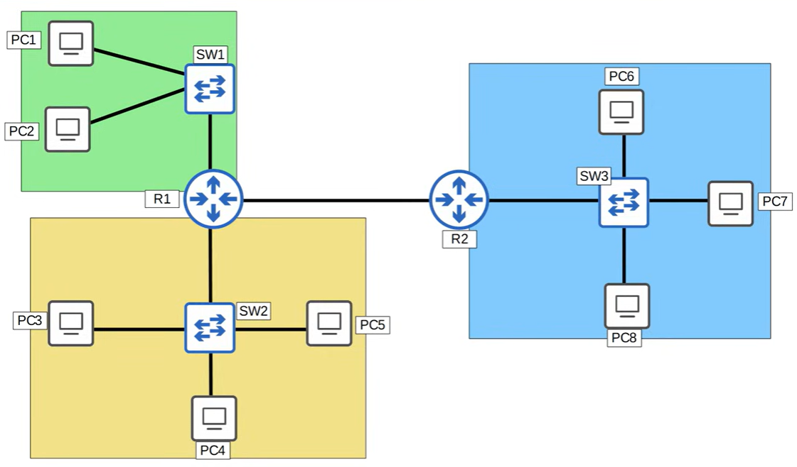
Inside a LAN, devices share something called a **broadcast domain**.  
A broadcast domain is the area in which a broadcast message (e.g., ARP request) is forwarded to **all** devices.

Important points:
- A **switch** forwards broadcasts out all ports (except the one it came from).  
- All devices connected to the same switch (or group of switches) are in the **same broadcast domain**.  
- Too many devices in one broadcast domain causes:
  - Excessive broadcast traffic  
  - Lower performance  
  - Less security (everyone can see Layer 2 traffic)
    - Layer 2 = Data Link Layer  
    - It deals with frames, MAC addresses, and local delivery inside the same LAN/VLAN.

Routers **stop** broadcasts.  
Switches **forward** broadcasts.

## What is a VLAN?
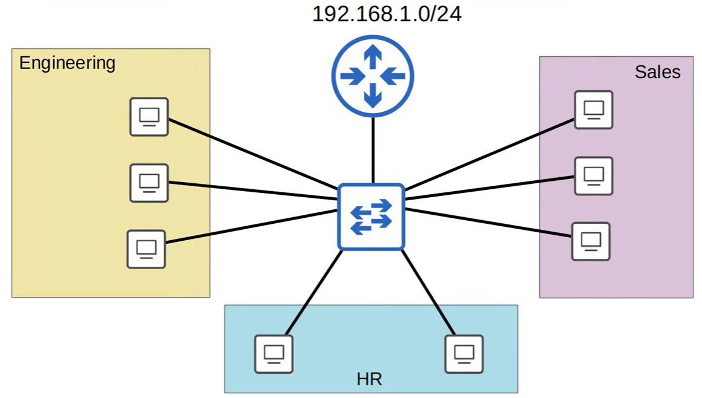
A **VLAN (Virtual Local Area Network)** is a method to split one physical switch into multiple **logical** networks.  
Each VLAN acts like a completely separate LAN, even though the devices are connected to the same physical hardware.

A VLAN creates:
- Its own **broadcast domain**  
- Its own **logical network segment**  
- Separation between groups of devices  

Example:  
One switch → VLAN 10 (HR), VLAN 20 (IT), VLAN 30 (Sales).  
Even though they share the same switch, devices in different VLANs cannot communicate unless a router allows it.

### Purpose
VLANs exist to solve the limitations of a single large broadcast domain.  
Jeremy’s Part 1 explains that modern networks need **logical segmentation**, not just physical separation.

Main purposes of VLANs:
- **Reduce broadcast traffic**  
  Each VLAN has its own broadcast domain, keeping traffic local.
- **Improve security**  
  Devices in different VLANs cannot communicate without routing.
- **Increase flexibility**  
  You can group devices by function (HR, IT, Guests) instead of by physical location.
- **Efficient network design**  
  No need to buy separate switches for each department.
- **Better control**  
  Network admins can manage traffic, apply policies, and isolate devices easily.


### VLANs vs subnets
#### VLANs (Layer 2 segmentation)
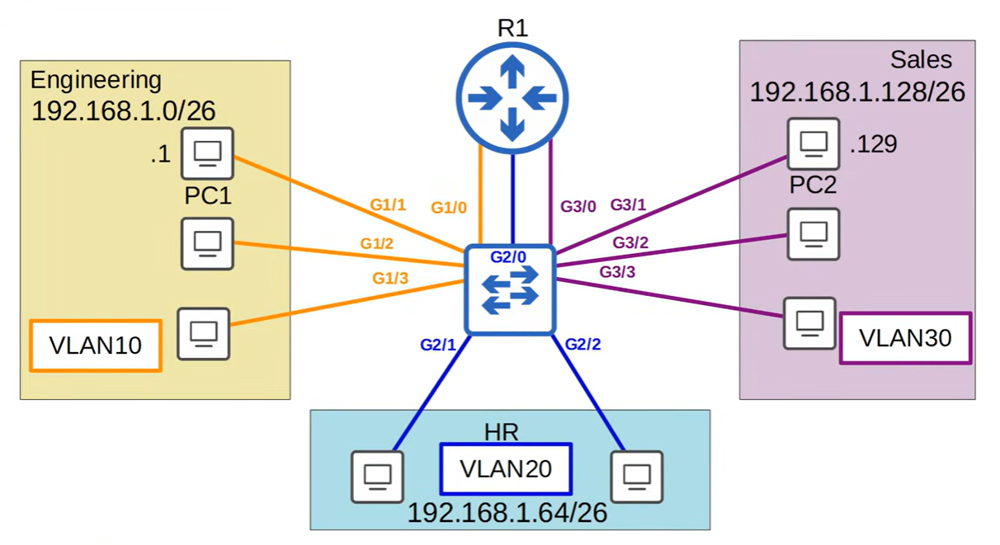
A **VLAN** is a logical separation of devices on a switch.  
It divides one physical switch into multiple **broadcast domains**.

Key points:
- Operates at **Layer 2 (Data Link Layer)**
- Uses **MAC addresses**
- Controls **which devices receive broadcasts**
- Devices in different VLANs **cannot communicate** without a router
- Defines **broadcast domains**, not IP networks**

Layer 2 segmentation means creating **multiple VLANs**, each acting as its own isolated Layer 2 segment.

Benefits:
- **Broadcast containment** (broadcasts stay inside the VLAN)
- **Logical separation** of departments or device groups
- **Better performance** (smaller broadcast domains)
- **Better security** (no L2 communication between VLANs)

Example:
- VLAN 10 = HR  
- VLAN 20 = IT  
- VLAN 30 = Sales  

Each VLAN is a separate Layer 2 segment.

#### Subnets (Layer 3 segmentation)
A **subnet** is a logical division of an IP network.  
It splits an IP range into multiple **Layer 3 networks**.

Key points:
- Operates at **Layer 3 (Network Layer)**
- Uses **IP addresses**
- Controls **routing between networks**
- Devices in different subnets require a **router** to communicate
- Defines **IP networks**, not broadcast domains**

Layer 3 segmentation means creating **multiple IP subnets**, each with its own:
- Network address  
- Broadcast address  
- IP range  
- Default gateway  

Benefits:
- **Traffic isolation** (subnets don’t communicate without routing)
- **Security boundaries**
- **Control over inter‑VLAN routing**
- **Reduced broadcast domains** (each subnet has its own)

Example:
- 192.168.10.0/24  
- 192.168.20.0/24  
- 192.168.30.0/24  

Each subnet is a separate Layer 3 segment.

### How they relate (the important part)
VLANs and subnets are **different technologies**, but they are used **together**:

- Each **VLAN** gets **one subnet**  
- Each **subnet** belongs to **one VLAN**

This creates a **1:1 mapping**:
- VLAN 10 → 192.168.10.0/24
- VLAN 20 → 192.168.20.0/24
- VLAN 30 → 192.168.30.0/24

Why?  
Because a VLAN is a **Layer 2 boundary**, and a subnet is a **Layer 3 boundary**.  
Aligning them keeps broadcast domains and IP networks consistent.

#### TL;DR
- **VLAN = Layer 2 segmentation (broadcast domains)**  
- **Subnet = Layer 3 segmentation (IP networks)**  
- They are **not the same**, but they work **together**  
- Each VLAN should have **its own subnet**  

---
## VLAN configuration
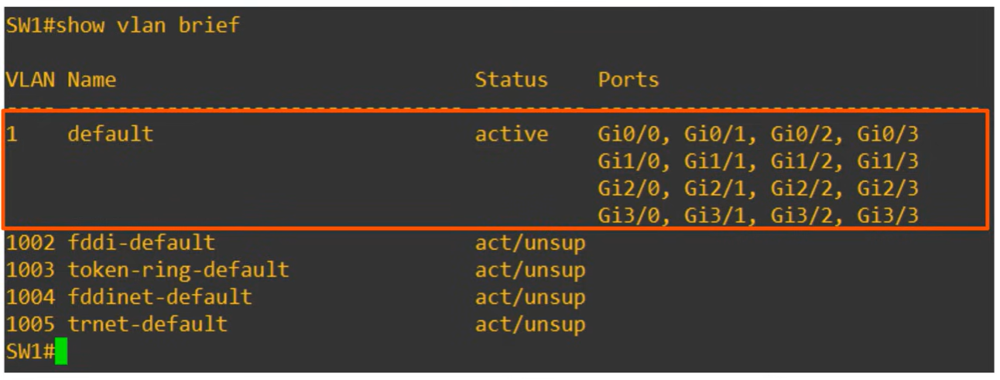
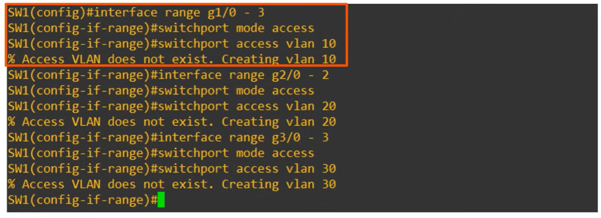

An access port is a switchport which belongs to a single VLAN, and usually connects to end hosts like PCs. 
Switchports which carry multiple VLANs are called 'trunk ports'. 
*(capture from video video part 1, more info in video part 2)*

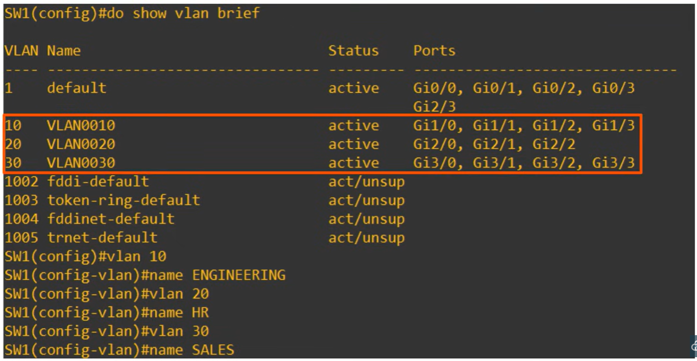

command **vlan 10** creates a VLAN.

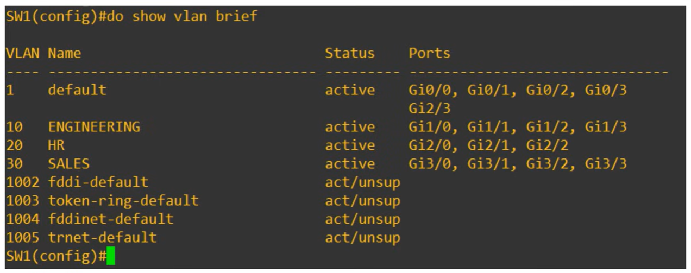
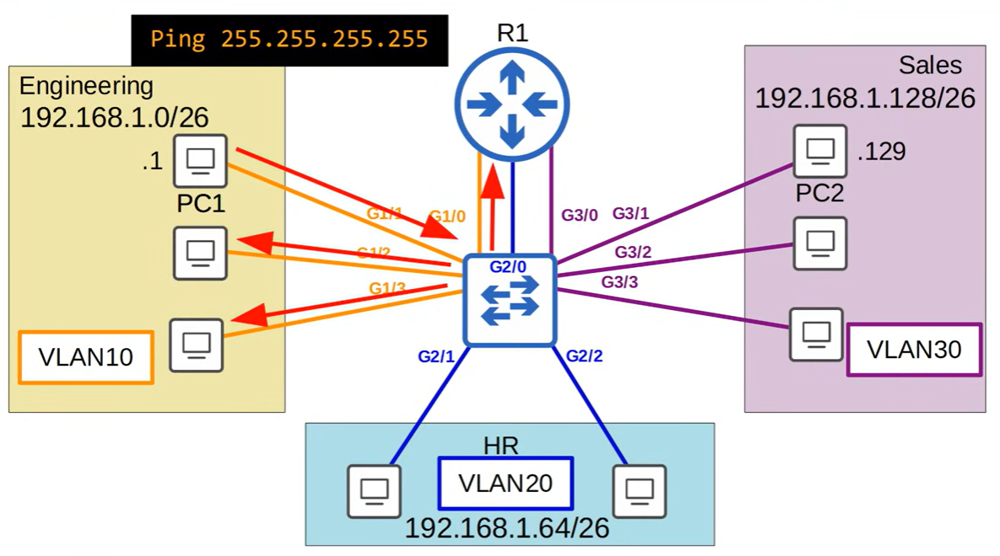

---
## Network Topology
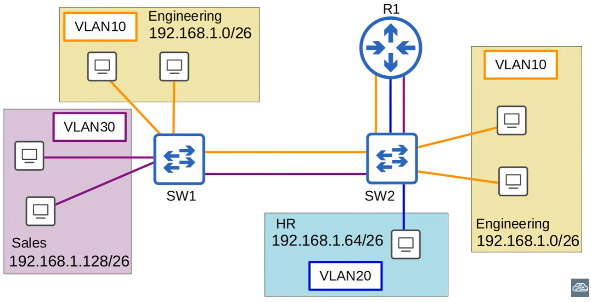
- between SW1 and SW2 are 1 real physical connection
- those lines between switches are trunk links
- LAN10 is shared on both SW1 and SW2
- LAN30 and LAN20 are per switch defined.
- LAN20 has no route towards SW1, only SW1 and R1.

## Trunk Ports

### What is a trunk port?
A trunk port is a switch port that carries multiple VLANs over a single physical connection using 802.1Q tagging.

### Why trunk ports exist
Trunk ports allow switches to share VLANs across a single cable. Without trunks, each VLAN would require its own physical link, which is inefficient and unrealistic.

### How 802.1Q tagging works
Ethernet Frame:
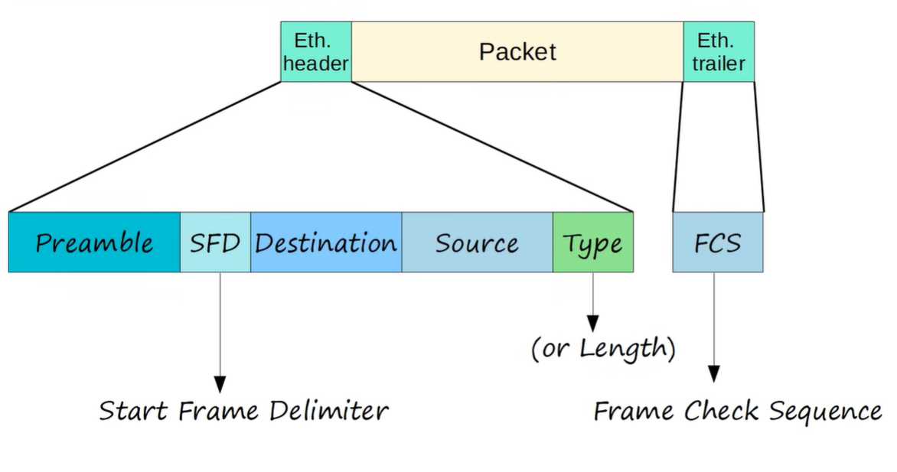
Ethernet Header:
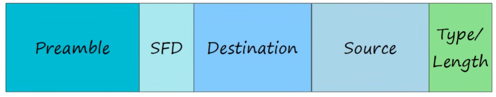
Ethernet Header with 802.1Q:

IEEE 802.1Q inserts a **4‑byte VLAN tag** (32 bits in length) into the Ethernet frame.  
This tag contains the **VLAN ID (0–4095)**, allowing switches to identify which VLAN the frame belongs to and forward it within the correct broadcast domain.  
Because of this tagging mechanism, multiple VLANs can travel over a **single trunk link** while remaining logically separated.

#### Fields (2)

- **Tag Protocol Identifier (TPID)** — 16 bits  
  The TPID identifies the frame as an 802.1Q‑tagged frame.  
  Ethernet frames normally start with an EtherType (e.g., 0x0800 for IPv4).  
  When a switch sees the TPID value **0x8100**, it knows:  
  → “This frame contains a VLAN tag.”

- **Tag Control Information (TCI)** — 16 bits  
  The TCI contains all VLAN‑related control information, including priority, drop eligibility, and the VLAN ID.  
  Switches use the TCI to decide **how** to treat the frame (QoS, congestion handling, VLAN forwarding).

##### TCI fields (3)

- **Priority Code Point (PCP)** — 3 bits  
  Used for QoS (IEEE 802.1p).  
  **QoS (Quality of Service)** means giving certain traffic higher priority, for example voice, video, or critical control traffic.  
  Higher PCP values = higher priority.

- **Drop Eligible Indicator (DEI)** — 1 bit  
  Indicates whether the frame may be dropped during congestion.  
  Frames marked as “eligible” are dropped first when buffers fill up.

- **VLAN Identifier (VID)** — 12 bits  
  Contains the VLAN ID (0–4095).  
  VLAN IDs **0** and **4095** are reserved; usable range is **1–4094**.  
  This value tells switches which VLAN the frame belongs to.


### Access port vs Trunk port
- **Access port** — carries one VLAN, untagged  
- **Trunk port** — carries multiple VLANs, tagged with 802.1Q

Example access port:
```
switchport mode access
switchport access vlan 10
```

Example trunk port:
```
switchport mode trunk
switchport trunk allowed vlan 10,20,30
```


### Trunk ports in this topology
- SW1 and SW2 are connected with **one real physical cable**
- That cable is configured as a **trunk link**
- VLAN10 is shared across both switches, so it is allowed on the trunk
- VLAN20 exists only on SW2, so it is not required on the trunk
- VLAN30 exists only on SW1, so it is not required on the trunk
- Routing between VLANs happens on R1 (router‑on‑a‑stick)

### VLAN Tagging Protocols

- There are two main trunking protocols: **ISL** and **IEEE 802.1Q**.

ISL is an old Cisco‑specific trunking protocol created before the industry standard IEEE 802.1Q.  
You will probably never use ISL in the real world, and even modern Cisco equipment no longer supports it.  
For the CCNA exam, only **IEEE 802.1Q** is relevant.

### Summary
A trunk port is a single physical link that transports multiple VLANs using 802.1Q tagging, allowing switches to extend VLANs across the network while keeping broadcast domains separated.

VLANs can communicate between eachother (VLAN10 on SW1 and VLAN10 on SW2). But VLANs that are both diffrent can't (VLAN20 and VLAN30 will never communicate with eachother).

## VLAN Ranges

The full VLAN range (1–4094) is divided into two sections:

- **Normal VLANs:** 1–1005  
- **Extended VLANs:** 1006–4094  

### Why these two ranges exist

#### Normal VLANs (1–1005)
Normal‑range VLANs exist because early Cisco switches stored VLAN information in a file called **vlan.dat** using **VTP (VLAN Trunking Protocol)**.  
These VLANs were:

- supported on all Cisco switches (old and new)
- synchronized automatically by VTP
- stored in flash memory (vlan.dat)
- used by default in most enterprise networks

Normal VLANs also include the old **Token Ring and FDDI VLANs (1002–1005)**, which are now obsolete but still reserved.

#### Extended VLANs (1006–4094)
Extended‑range VLANs were introduced later to support **larger networks** and **service provider environments**.  
They exist because:

- 1005 VLANs were not enough for large or multi‑tenant networks  
- service providers needed thousands of VLANs for customers  
- IEEE 802.1Q supports up to 4094 VLANs, so Cisco expanded support

Extended VLANs:

- are **not synchronized by VTP** (only VTP transparent mode supports them)
- are stored in the **running‑config / startup‑config**, not vlan.dat
- require modern hardware and IOS versions

### Hardware support

Some older switches cannot use the extended VLAN range because:

- older ASICs only supported VLANs 1–1005  
- older IOS versions did not support extended VLANs  
- VTP server/client mode originally did not allow extended VLANs  

However, **modern switches fully support the extended VLAN range**, so it is safe to expect VLANs 1006–4094 to work on current equipment.

## Native VLAN

The **native VLAN** is a special VLAN used on 802.1Q trunk ports for handling **untagged traffic**.  
It exists to maintain compatibility with older network devices and protocols that do not understand VLAN tags.

### Key Behaviors of the Native VLAN

- **Default = VLAN 1**  
  On all switches, every trunk port uses VLAN 1 as the native VLAN unless manually changed.

- **Frames in the native VLAN are sent *without* an 802.1Q tag**  
  When a switch sends traffic that belongs to the native VLAN, it does **not** insert a VLAN tag into the Ethernet frame.

- **Untagged frames received on a trunk are placed into the native VLAN**  
  If a switch receives a frame on a trunk port with **no VLAN tag**, it automatically assumes:  
  → “This frame belongs to the native VLAN.”

- **Purpose: backward compatibility**  
  Some older devices and protocols cannot process tagged frames.  
  The native VLAN ensures these devices can still communicate across trunk links.

### Why the Native VLAN Matters

- Prevents miscommunication between devices that do not support VLAN tagging.  
- Ensures untagged control traffic (like CDP, STP, VTP) is handled correctly.  
- Must match on both sides of a trunk — otherwise you get a **native VLAN mismatch**, which can cause traffic leaks between VLANs.

### Native VLAN on a Router (ROAS)

#### What ROAS Is
Router‑on‑a‑Stick (ROAS) is a method of inter‑VLAN routing where a router uses one physical interface to route traffic between multiple VLANs. This is done by creating subinterfaces, each representing a different VLAN and tagged with 802.1Q.

Example subinterfaces:  
- g0/0.10 → VLAN 10  
- g0/0.20 → VLAN 20  
- g0/0.30 → VLAN 30  

These subinterfaces are virtual, not physical, but the router treats them as real interfaces for routing. Each subinterface uses encapsulation dot1q <vlan-id> and has its own IP address, which becomes the default gateway for that VLAN.

#### How ROAS Works
1. The switch sends tagged VLAN frames over a trunk to the router.  
2. The router receives the tagged frames on its physical interface.  
3. Each subinterface is configured with an 802.1Q tag and an IP address.  
4. The router removes the tag, routes the packet, and sends it back out with the correct tag.

ROAS allows multiple VLANs to share one cable between switch and router.

#### Native VLAN on a Router

There are two methods to configure the native VLAN in ROAS.

##### Method 1 — Native VLAN on a Subinterface
Use the native keyword on the subinterface.  
This makes that VLAN the native VLAN, meaning its traffic is untagged.

Example:  
```
interface g0/0.10  
encapsulation dot1q 10 native  
ip address 192.168.10.1 255.255.255.0
```
##### Method 2 — Native VLAN on the Physical Interface
Assign the native VLAN’s IP address directly to the physical interface.  
No encapsulation command is needed.  
This automatically makes that VLAN the native VLAN.

Example:  
interface g0/0  
ip address 192.168.10.1 255.255.255.0

All other VLANs still require subinterfaces.

#### Key Points to Remember
- The native VLAN is the VLAN that travels untagged on a trunk.  
- On a router, the native VLAN can be configured on a subinterface using dot1q <id> native, or on the physical interface by assigning the native VLAN’s IP there.  
- Subinterfaces are virtual but fully functional.  
- ROAS requires a trunk between switch and router, 802.1Q encapsulation, and one subinterface per VLAN (except the native VLAN if using method 2).

#### ROAS Configuration Template
```
interface g0/0  
no shutdown  

interface g0/0.10  
encapsulation dot1q 10  
ip address 192.168.10.1 255.255.255.0  

interface g0/0.20  
encapsulation dot1q 20  
ip address 192.168.20.1 255.255.255.0  

interface g0/0.30  
encapsulation dot1q 30  
ip address 192.168.30.1 255.255.255.0  
```

##### Optional: Native VLAN Example
```
interface g0/0.10  
encapsulation dot1q 10 native  
ip address 192.168.10.1 255.255.255.0
```

#### Summary
- ROAS = inter‑VLAN routing using one physical interface with multiple subinterfaces.  
- Subinterfaces are virtual but treated as real by the router.  
- Native VLAN can be configured on a subinterface or on the physical interface.  
- Native VLAN traffic is untagged.  
- All other VLANs require 802.1Q tagging.

## Layer 3 - (multiplayer) switches
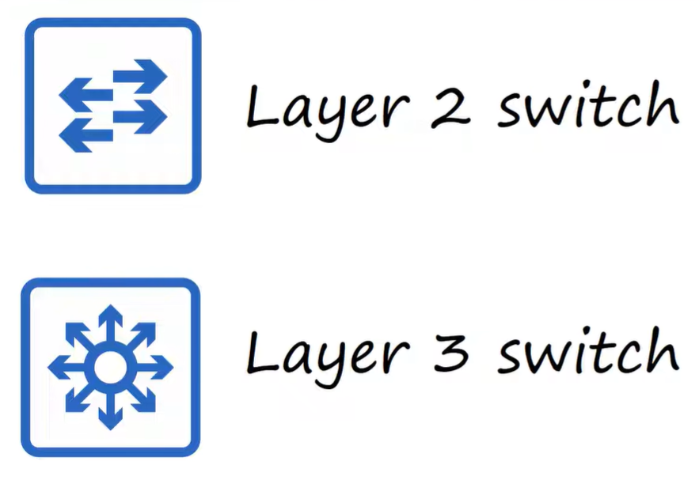
- Layer 2 switch
- layer 3 switch

A multilayer switch is capale of both switching and routing. It is 'Layer 3 aware'.

You can assign IP addresses to its interfaces, like a router. You can create virtual interfaces for each VLAN and assign IP addresses to those interfaces. You can configure routes on it, just like a router.
It can be used for inter-VLAN routing.

inter-VLAN routing is...

### Inter-VLAN routing via SVI
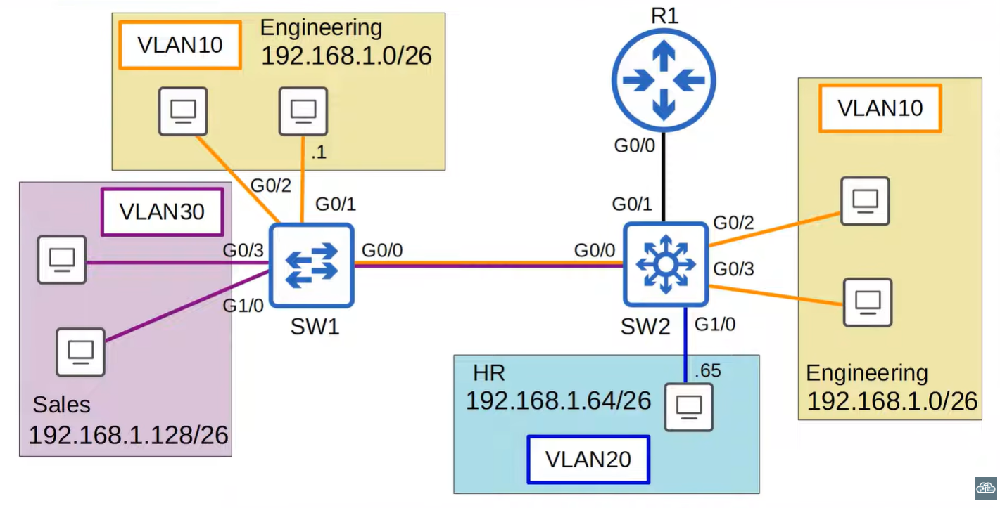

SVIs (switch virtual interfaces) are the virtual interfaces you can assign IP addresses to in a multilayer switch.

Configure each PC to use the SVI (not the router) as their gateway address.

To send traffic to diffrent subnets/VLANs, the PCs will send traffic to the switch, and the switch will route the traffic.

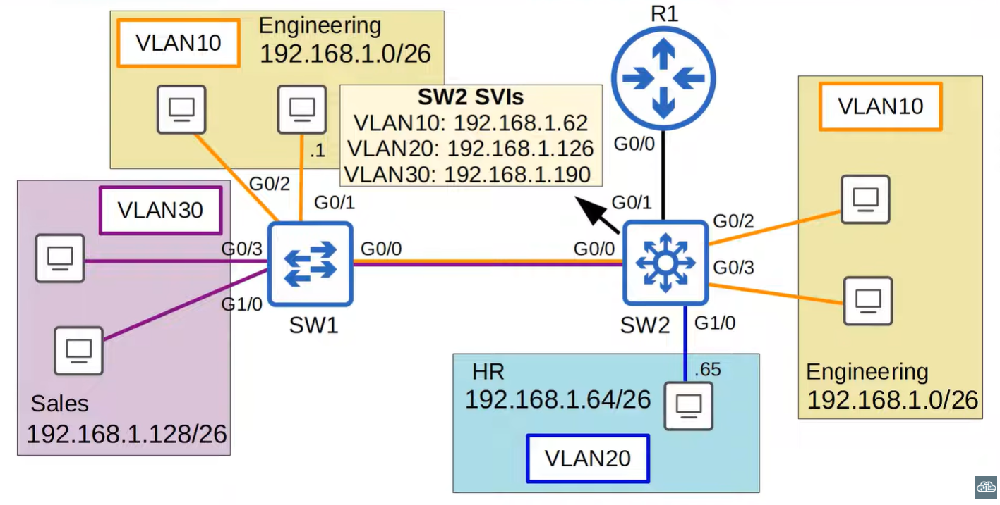
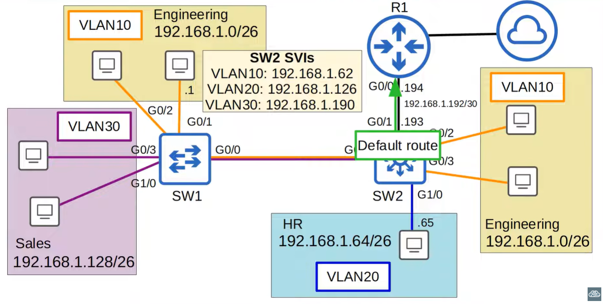

---
## Configuration
### Trunk Configuration
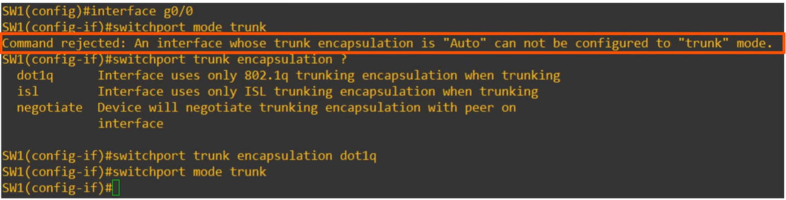
- Many modern switches do not support Cisco's ISL. They only support 802.1Q (dot1q)
- Switches that does support both (like this example) have a trunk encapsulation of 'Auto' by default configured.
- To manually configure the interface as a trunk port, you must first set the encapsulation to 802.1Q or ISL. 
- On switches that only support 802.1Q, this step is not necessary.

[see video part 2 from minute 17:00 to 27:00, for full configuration guide]

### Roas Configuration
[see video part 2 from minute 27:00 to 31:00, for full configuration guide]

### Native VLAN configuration
[see video part 3 from minute 8:00 to 10:00, for full configuration guide]

### Inter-VLAN Routing via SVI

[see video part 3 from minute 16:00 to 23:00, for full configuration guide]

---
## Wireshark
[see video part 3 from minute 4:00 to 8:00, for full wireshark guide]