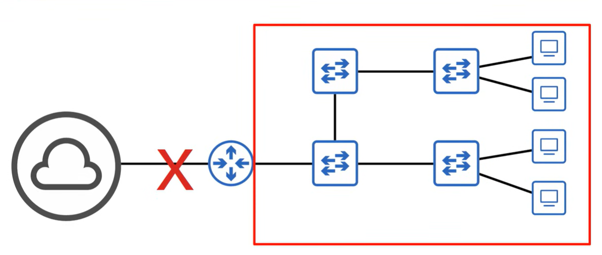
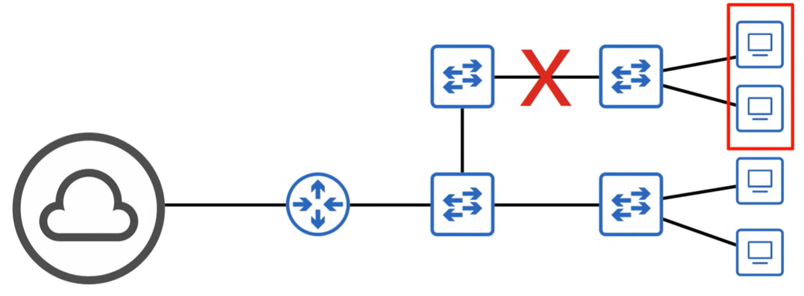
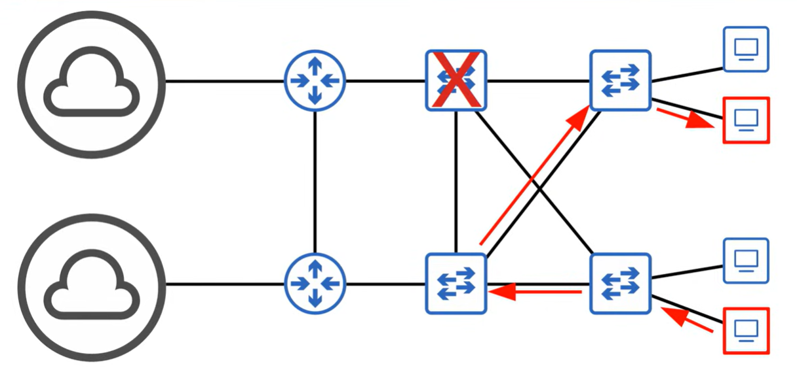
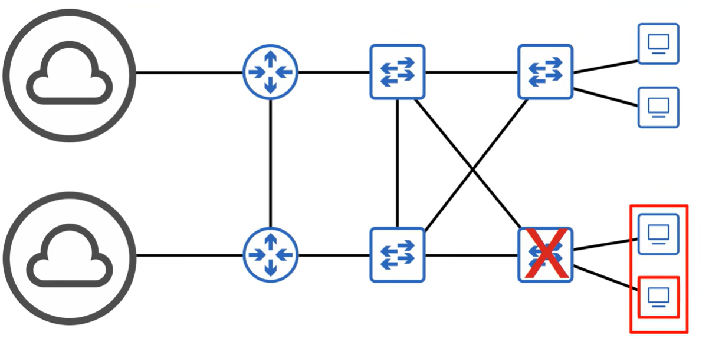
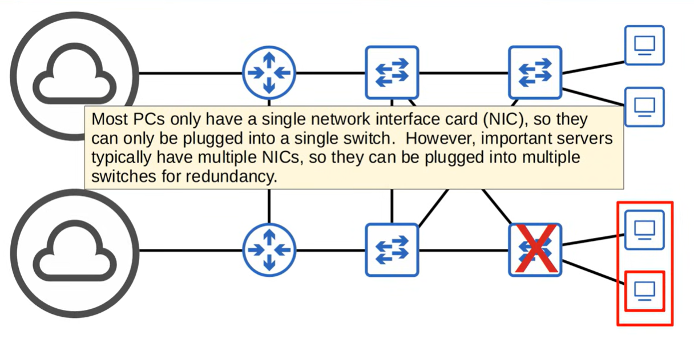
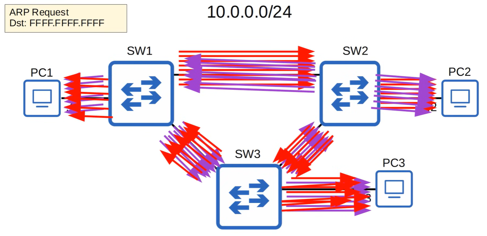
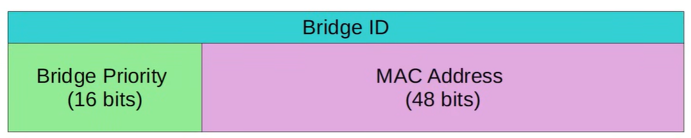
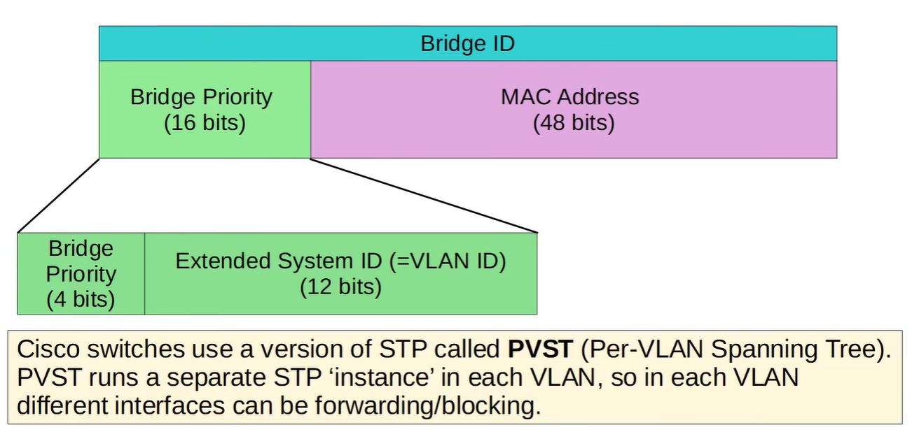
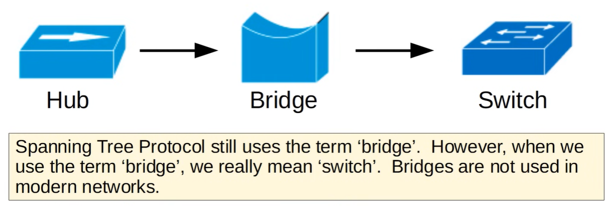
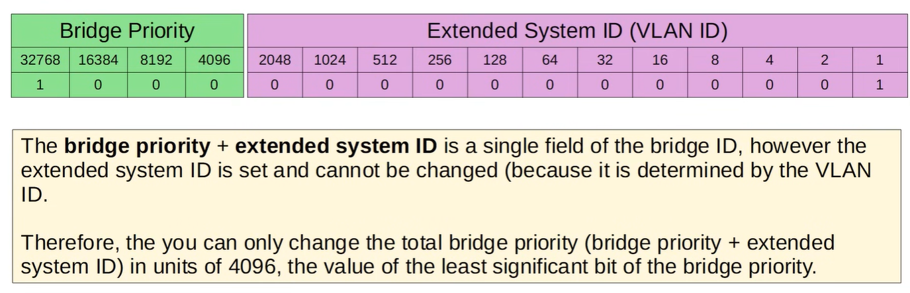

# STP

STP is a Layer 2 protocol that prevents switching loops by blocking redundant paths between switches. For CCNA 200-301, focus on the basics: root bridge election, BPDU messages, and how STP keeps one loop-free path active while still allowing redundancy.

- **Jeremy's IT Lab** — [Part 1 - STP](https://www.youtube.com/watch?v=j-bK-EFt9cY)
- **Jeremy's IT Lab** — [Part 2 - Rappid STP](https://www.youtube.com/watch?v=EpazNsLlPps%20)

---

## Network redunancy
Network redundancy refers to the practice of adding extra links, paths, or devices to ensure the network continues functioning even if one component fails. Instead of relying on a single connection between switches or routers, redundant links provide backup paths. This improves reliability, prevents outages, and allows maintenance without disrupting traffic. However, redundant Layer 2 paths can create switching loops, which is why protocols like STP are required to keep the network stable and loop‑free.



2 images show cases that can happen on you're network if somewhere the network is cut down (network issue or cable doesn't work or ...).



In image above, when 1 switch stops working, traffic can pass trough the other switch. To reach from PC1 to PC2.


If a switch stops working that is closest to a group of PC's, then we have an issue that those PC's cannot communicate with internet or other PC's.



> (!) in this network, there's one major problem!

---

## Why STP Is Needed

- Redundant links create Layer 2 loops
- Broadcast frames loop endlessly → broadcast storms
- Switches relearn MACs on different ports → MAC instability
- Frames duplicate endlessly → network collapse
- STP ensures only one active path exists

## STP Fundamentals
- Standard: **IEEE 802.1D**
- All switches send/receive **BPDUs**
- STP builds a **loop‑free logical tree**
- Redundant links remain available for failover

## Bridge ID (BID)

Each switch has a Bridge ID:

Bridge ID = **Bridge Priority (16 bits) + MAC Address (48 bits)**







### Defaults
- Default priority: **32768**
- Lowest priority wins
- If priorities tie → lowest MAC wins

### Extended System ID
Modern STP includes VLAN ID:

Bridge Priority (4 bits) + VLAN ID (12 bits)

Example: VLAN 1 → 32768 + 1 = **32769**

## Root Bridge Election
- Switches exchange BPDUs
- Lowest Bridge ID becomes Root Bridge
- All ports on the Root Bridge are **Designated Ports**
- Best practice: manually set the root

## STP Path Cost
Each switch chooses the lowest‑cost path to the Root Bridge.

### Cisco Cost Values
- 10 Mbps → 100  
- 100 Mbps → 19  
- 1 Gbps → 4  
- 10 Gbps → 2  

Lower cost = better path.


## STP Port Roles
### Root Port (RP)
- One per non‑root switch
- Lowest‑cost path to Root Bridge
- Always forwarding

### Designated Port (DP)
- One per segment
- Chosen by lowest path cost
- Always forwarding

### Non‑Designated Port
- Redundant port
- Placed in **blocking**

### Disabled Port
- Admin down

## STP Port States (802.1D)
1. **Blocking** — listens for BPDUs, no forwarding  
2. **Listening** — participates in STP, no MAC learning  
3. **Learning** — learns MACs, still not forwarding  
4. **Forwarding** — fully active  
5. **Disabled** — admin down  

### Convergence Time
- Classic STP: **30–50 seconds**

## BPDUs
- Sent every 2 seconds by the Root Bridge
- Used for STP calculations
- TCN BPDUs signal topology changes

## PVST (Cisco)
- Per‑VLAN Spanning Tree
- One STP instance per VLAN
- Allows different VLANs to have different root bridges
- More control, more CPU usage


## Why STP Is Critical
Without STP:
- Broadcast storms occur
- MAC tables constantly change
- Frames loop endlessly
- Network becomes unusable

STP ensures the network stays **stable, predictable, and loop‑free**.

## Industry Standards (IEEE) vs Cisco versions
| Feature | IEEE STP (802.1D) | IEEE RSTP (802.1w) | IEEE MST (802.1s) | Cisco PVST+ | Cisco Rapid PVST+ |
|--------|--------------------|---------------------|--------------------|--------------|---------------------|
| Convergence | Slow | Fast | Fast | Slow | Fast |
| Instances | 1 global | 1 global | Multiple | Per‑VLAN | Per‑VLAN |
| Load Balancing | ❌ | ❌ | ✔️ | ✔️ | ✔️ |
| VLAN Awareness | No | No | Grouped | Yes | Yes |

## Rapid STP (RSTP)

**Rapid Spanning Tree Protocol (RSTP)** — defined in **IEEE 802.1w** — is an improved version of classic STP that provides **much faster convergence** after topology changes.  
Instead of waiting 30–50 seconds like 802.1D, RSTP can reconverge in **a few seconds** by using **handshake-based mechanisms** and simplified port roles/states.

### Key Characteristics
- Backward-compatible with classic STP  
- Converges in **1–3 seconds** (vs 30–50 seconds in STP)  
- Uses **proposals and agreements** instead of timers  
- Reduces port states from 5 → **3**  
- Defines new port roles (Alternate, Backup)  
- Still uses **one STP instance for all VLANs** (no load balancing)

## STP vs RSTP

### Comparison Table

| Feature | STP (802.1D) | RSTP (802.1w) |
|--------|---------------|----------------|
| Convergence | **Slow** (30–50s) | **Fast** (1–3s) |
| Port States | 5 states: Blocking, Listening, Learning, Forwarding, Disabled | 3 states: Discarding, Learning, Forwarding |
| Port Roles | Root, Designated, Non‑Designated | Root, Designated, **Alternate**, **Backup** |
| Topology Change Detection | Relies on timers | Uses handshake (Proposal/Agreement) |
| BPDU Handling | Only root sends BPDUs | Every switch sends BPDUs |
| VLAN Instances | 1 global instance | 1 global instance |
| Load Balancing | ❌ No | ❌ No |
| Backward Compatibility | — | ✔️ Yes (falls back to STP if needed) |

## STP & RSTP Path Cost Values

Spanning Tree Protocol uses **path cost** to determine the best path to the root bridge.  
Higher bandwidth = **lower cost**.

### STP (802.1D) vs RSTP (802.1w) Cost Table

| Speed      | STP Cost | RSTP Cost |
|------------|----------|-----------|
| 10 Mbps    | 100      | 2,000,000 |
| 100 Mbps   | 19       | 200,000   |
| 1 Gbps     | 4        | 20,000    |
| 10 Gbps    | 2        | 2,000     |
| 100 Gbps   | —        | 200       |
| 1 Tbps     | —        | 20        |

### Notes
- RSTP uses **much larger cost values** to support modern high‑speed links.  
- STP values are older and stop at 10 Gbps.  
- Lower cost = preferred path.  
- If multiple links have equal cost, STP/RSTP uses tie‑breakers (port priority, port ID).

## STP Port States (802.1D)

STP uses different port states to prevent loops while allowing the network to converge safely.  
Each state defines whether the port forwards traffic, learns MAC addresses, or participates in BPDU exchange.

### STP Port State Table

| STP Port State | Send/Receive BPDUs | Frame Forwarding | MAC Address Learning | Stable/Transitional |
|----------------|--------------------|-------------------|-----------------------|----------------------|
| **Blocking**   | NO / YES           | NO                | NO                    | Stable               |
| **Listening**  | YES / YES          | NO                | NO                    | Transitional         |
| **Learning**   | YES / YES          | NO                | YES                   | Transitional         |
| **Forwarding** | YES / YES          | YES               | YES                   | Stable               |
| **Disabled**   | NO / NO            | NO                | NO                    | Stable               |

### Quick Notes
- **Blocking** prevents loops; port only listens for BPDUs.  
- **Listening** checks for loops but does not learn MACs.  
- **Learning** builds the MAC table but still does not forward traffic.  
- **Forwarding** is the final active state.  
- **Disabled** means administratively down or error-disabled.

## RSTP Port State Table (802.1w)

RSTP simplifies the classic 5 STP states into **3 functional states**, improving convergence speed while keeping the logic clear and predictable.

### RSTP Port State Table

| RSTP Port State | Send/Receive BPDUs | Frame Forwarding | MAC Address Learning | Stable/Transitional |
|-----------------|--------------------|-------------------|-----------------------|----------------------|
| **Discarding**  | NO / YES           | NO                | NO                    | Stable               |
| **Learning**    | YES / YES          | NO                | YES                   | Transitional         |
| **Forwarding**  | YES / YES          | YES               | YES                   | Stable               |

### Notes
- **Discarding** = STP’s Blocking + Listening combined  
- **Learning** = builds MAC table but still not forwarding  
- **Forwarding** = fully active  
- RSTP reduces convergence time by eliminating unnecessary transitional states

## RSTP Port Roles (802.1w)

RSTP keeps two classic STP roles and introduces two new ones to enable faster convergence.

### Classic Roles (unchanged from STP)

#### **Root Port (RP)**
- The port closest to the root bridge (lowest total path cost).
- Every non‑root switch has exactly **one** root port.
- The root bridge has **no** root port.

#### **Designated Port (DP)**
- The port on a segment that sends the **best BPDU**.
- One designated port per collision domain.
- Always in **Forwarding** state.

### New RSTP Roles

#### **Alternate Port**
- A **backup** to the root port.
- Receives a **superior BPDU** from another switch.
- Always in **Discarding** state.
- If the root port fails, the alternate port can transition to **Forwarding immediately** (no listening/learning delays).

#### **Backup Port**
- A backup to a designated port **on the same switch**.
- Rare in modern switched networks (requires two ports on the same switch connected to the same segment).
- Always in **Discarding** state.

## BackboneFast (STP Enhancement)

**BackboneFast** is a Cisco enhancement for classic STP (802.1D) that speeds up convergence when an **indirect link failure** occurs.

### Why It Exists
Classic STP waits for **max age (20s)** before reacting to certain failures.  
BackboneFast reduces this delay by allowing switches to **query upstream switches** instead of waiting for timers to expire.

### How It Works
- When a switch receives an **inferior BPDU**, it suspects an indirect failure.
- Instead of waiting 20 seconds, it sends a **Root Link Query (RLQ)** upstream.
- If the upstream switch confirms the root path is still valid, the switch **immediately** recalculates STP.
- This reduces convergence time significantly.

### Key Points
- Works only with **classic STP**, not needed in RSTP (RSTP already handles this faster).
- Must be enabled on **all switches** in the STP domain.
- Does **not** require special configuration per‑interface.

### Command
```
spanning-tree backbonefast
```

## UplinkFast (Cisco STP Enhancement)

**UplinkFast** is a Cisco enhancement for classic STP (802.1D) that dramatically speeds up convergence when an **access‑layer switch loses its root port**.

It is designed specifically for **access switches with redundant uplinks** toward the distribution/core layer.

### Why UplinkFast Exists
In classic STP:
- If the **root port fails**, the switch must wait through **Listening (15s) + Learning (15s)** = **30 seconds** before a backup link becomes forwarding.
- This delay is unacceptable for user access networks.

UplinkFast eliminates this delay.

### How It Works
- The switch pre‑identifies **alternate ports** (backup paths to the root).
- When the root port fails:
  - The best alternate port transitions to **Forwarding immediately** (no 30s delay).
  - The switch sends **dummy multicast frames** out all ports to quickly update upstream MAC tables.

### Key Characteristics
- Used on **access switches**, not distribution/core.
- Provides **sub‑second failover** for uplink failures.
- Automatically increases port cost on access ports to avoid becoming a transit switch.
- Works only with **classic STP (802.1D)** — not needed in RSTP.

### Command
```
spanning-tree uplinkfast
```

### When to Use
- Access switches with **two uplinks** to the network.
- Environments still running classic STP (rare today, but still tested on CCNA).

## UplinkFast vs BackboneFast

| Feature | UplinkFast | BackboneFast |
|--------|------------|--------------|
| Purpose | Speeds up recovery from **direct root port failure** | Speeds up recovery from **indirect link failure** |
| Typical Location | **Access-layer switches** with redundant uplinks | **Distribution/core** or anywhere indirect failures occur |
| Trigger | Root port goes down | Switch receives an **inferior BPDU** |
| Mechanism | Immediately activates alternate port; sends dummy frames to update MAC tables | Sends **Root Link Query (RLQ)** to verify root path instead of waiting max-age |
| Convergence | Sub‑second | Faster than STP (skips 20s max-age) |
| Affects | Only local switch | Entire STP domain (must be enabled everywhere) |
| STP Version | Classic STP (802.1D) only | Classic STP (802.1D) only |
| RSTP Needed? | No (RSTP already handles this) | No (RSTP already handles this) |
| Command | `spanning-tree uplinkfast` | `spanning-tree backbonefast` |

## Backup Port Role (RSTP)

The **Backup Port** is one of the two new port roles introduced by RSTP (802.1w).

### What It Is
- A **backup** to a **Designated Port** on the **same switch**.
- Exists only when **two ports on the same switch** connect to the **same collision domain** (rare in modern switched networks).
- Always in the **Discarding** state.

### When It Is Used
- Seen in old hub-based topologies or when two switch ports are bridged together.
- Provides a local fallback if the designated port on the same switch fails.

### Key Points
- Backup Port = backup to **Designated Port**  
- Alternate Port = backup to **Root Port**  
- Backup Port is **rare** today  
- Always **Discarding** until needed

## RSTP Link Types (802.1w)

RSTP uses link types to determine how quickly a port can transition to forwarding.  
Link type detection is automatic but can be manually configured.

### Edge Link
- Equivalent to **PortFast** in STP.
- Connects to **end devices** (PCs, printers, servers).
- Can transition **immediately** to Forwarding.
- Does **not** generate topology changes when going up/down.

**Command:**
```
spanning-tree portfast
```

### Point-to-Point Link
- Full‑duplex link between **two switches**.
- Allows **rapid transitions** using RSTP’s proposal/agreement mechanism.
- Enables fast convergence.

RSTP assumes:
- Full‑duplex = point‑to‑point  
- Half‑duplex = shared  

### Shared Link
- Typically half‑duplex or hub‑based segments.
- RSTP **cannot** use rapid transitions here.
- Behaves more like classic STP (slower convergence).

---
## Configuration
For CLI and Packet Tracer.
See video at minute 21.
https://www.youtube.com/watch?v=EpazNsLlPps

## Wireshark
See video at minute 23:30.
https://www.youtube.com/watch?v=EpazNsLlPps