# EtherChannel

EtherChannel is a technology that bundles multiple physical links into a single logical connection between switches. This increases bandwidth and provides redundancy without requiring STP to block additional ports. For the CCNA 200-301 exam, it is important to understand how EtherChannel works, the protocols used (PAgP and LACP), and how to configure it correctly.

- **Jeremy's IT Lab** — [Video](https://www.youtube.com/watch?v=xuo69Joy_Nc)

---
## What problem does it solve (demo)
**<ins>Network congestion</ins> is a state where a network node or link carries more data than its capacity, leading to reduced quality of service, slower speeds, and packet loss**

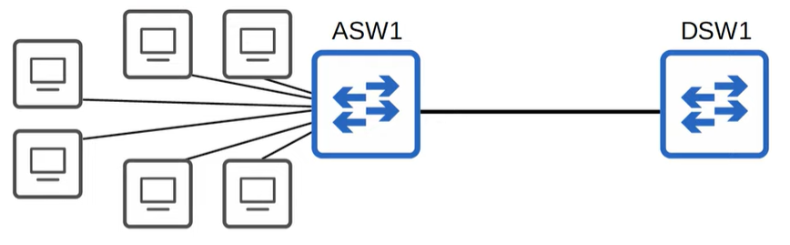
*40 hosts*
- ASW = Acces layer switch (connects end hosts to it)
- DSW = distribution switch (connects acces layer switches to it)

> The connection to DSW1 is congested. I should add another link to increase the banwidth, so it can support all of the end hosts.

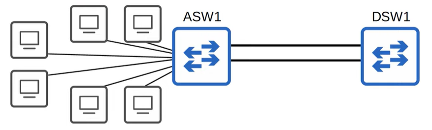

> Connection still is congested. Add a new link extra to it.

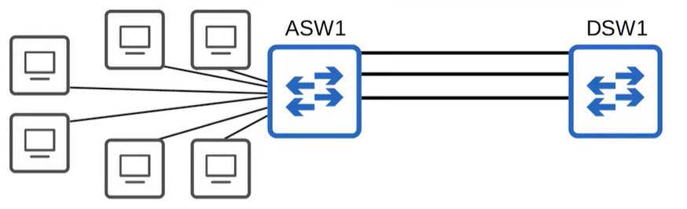

> The total bandwidth of the connections to the endhosts are still greater than the the bandwidth of the connection to DSW1. BUT that's okay, all hosts in the network aren't always in a constant state of sending and receiving internet traffic.

**When the bandwith of the interfaces connected to the end hosts is greater than the bandwith of the connection to the DSW's, this is called <ins>oversubscription.</ins>**

> Some oversubscriptions is acceptable, but too much will cause congestion.

*But in this case the network admin sees that the connection is still congested. Let's add another link.* 

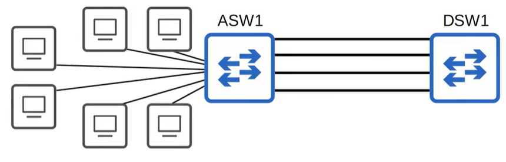

*Network still not have been improved...*

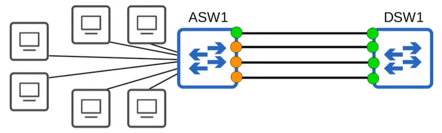

1. **If you connect two switches together with multiple links, all except one will be disabled by spanning tree (STP).**
2. If all of ASW1's interfaces were forwarding, L2 loops would form between ASW1 and DSW1, leading to broadcast storms.
3. Other links will be unused unles the active link fails. In that case, one of the inactive links will start forwarding.

## What is EtherChannel?
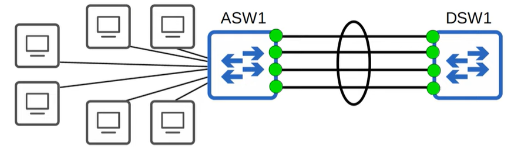

**<ins>EtherChannel</ins> groups multiple interfaces together to act as one single interface. STP will treat this as a single interface.**

> Traffic using the etherChannel will be load balanced among the physical interfaces in the group. An algorithm is used to determine which traffic will use which physical interface. 

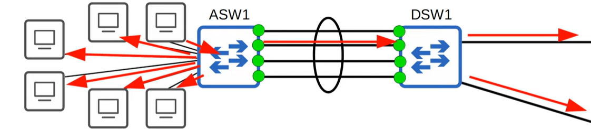

### Load balancing
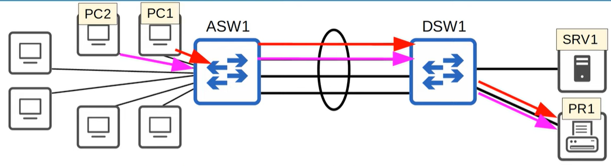

- EtherChannel load balances based on "flows".
- A flow is communication between 2 nodes in the network.
- Frames in the same flow will be forwarded using the same physical interface.
- It frames in the same flow were forwarded using diffrent physical interfaces, some frames may arrive at the destination out of order, which can cause problems.

You can change the inputs used in the interface selection calculation.
Inputs that can be used:
- source MAC
- destination MAC
- both src & dest MAC
- Source IP
- Destination IP
- both src & dest IP

#### CLI
`show etherchannel load-balance`

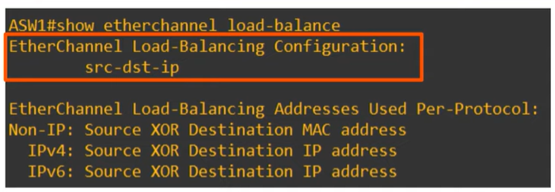
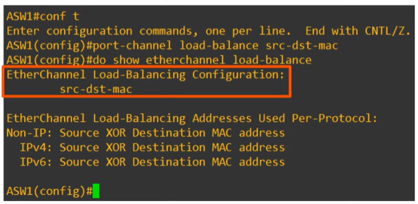
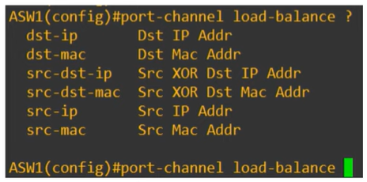

## Layer 3 EtherChannel
Using layer 3 switches, instead layer 2 switches.
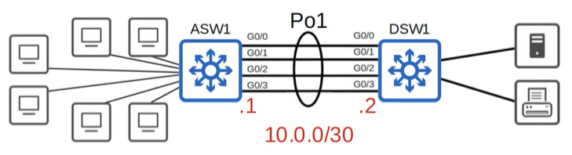
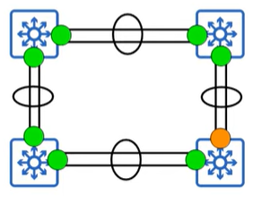

A Layer 3 EtherChannel is a Port‑Channel that operates at Layer 3, meaning it does not act as a switchport but as a routed interface. Instead of forwarding Ethernet frames based on MAC addresses (Layer 2), it forwards IP packets based on routing decisions (Layer 3).

Layer 2 EtherChannel solves oversubscription and STP blocking, but it still behaves like a single Layer 2 link.
In larger networks (distribution ↔ core), you often need:
- Routing between switches
- No STP involvement
- Equal‑cost multipath routing (ECMP)
- High‑bandwidth routed uplinks
- Faster convergence than STP can provide
- Layer 3 EtherChannel gives you all of this.

### L2 vs L3 EtherChannel

| Feature | Layer 2 EtherChannel | Layer 3 EtherChannel |
| --- | --- | --- |
| Operates at | Layer 2 (switchport) | Layer 3 (routed port) |
| IP address | Assigned to SVI | Assigned to Port‑Channel |
| STP | Yes, treated as one link | No STP at all |
| Routing | Uses VLANs + SVIs | Direct routing on Port‑Channel |
| Use case | Access ↔ Distribution | Distribution ↔ Core |
| Load balancing | MAC/IP hashing | Routing ECMP + hashing |

## Commands

| Command | Modes / Extra Info | Description |
| --- | --- | --- |
| port-channel load-balance mode | — | Configures the EtherChannel load‑balancing method on the switch. |
| show etherchannel load-balance | — | Displays the current load‑balancing settings used by the switch. |
| channel-group *number* mode | desirable, auto, active, passive, on | Configures an interface to join an EtherChannel and specifies the negotiation protocol (PAgP, LACP, or static). |
| show etherchannel summary | — | Displays a summary of all EtherChannels on the switch, including status and member interfaces. |
| show etherchannel port-channel | — | Shows detailed information about the virtual Port‑Channel interfaces. |

---

## Configration
See video https://www.youtube.com/watch?v=xuo69Joy_Nc
From minute 15:30 to 27:30

- EtherChannel configuration
- PAgP (Port Aggregation Protocol) configration 
- LACP (Link Aggregation Control Protocol) configuration
- Static EtherChannel configuration
- Manually configure the negotiation protocol
- `show etherchannel summary`
- `show spanning-tree`
- L3 EtherChannel *(topic shows cli commands!)*