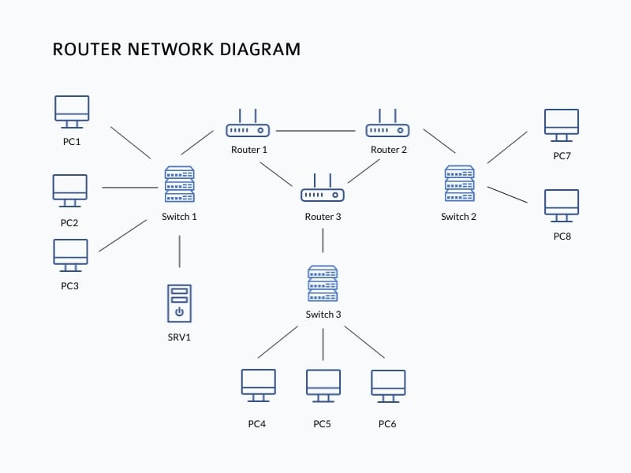
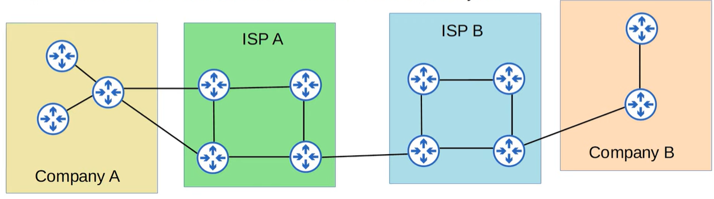
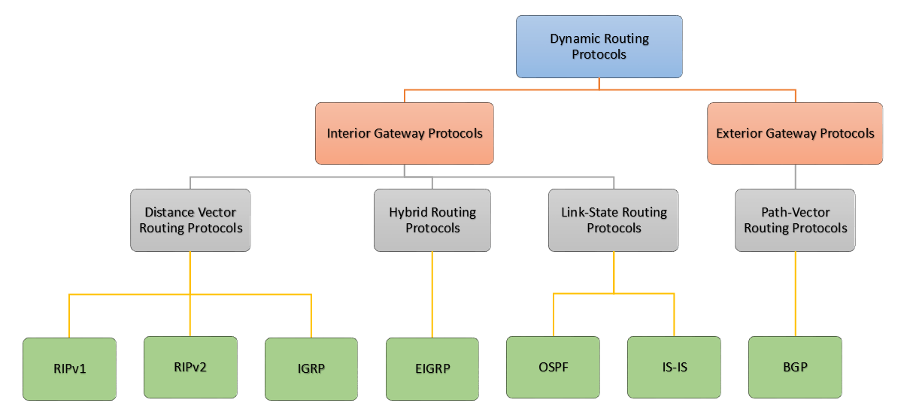

# Dynamic Routing

Dynamic routing is a networking method where routers automatically exchange routing information to find the best path to a destination. For CCNA 200-301, focus on the basic idea, common protocols like OSPF, EIGRP, and RIP, and the fact that routers can adapt when links fail, making the network more scalable and resilient.

- **Jeremy's IT Lab** — [Video](https://www.youtube.com/watch?v=xSTgb8JLkvs)

---

## What is Dynamic Routing?

*Generated by MS Copilot*

**Dynamic routing is the process where routers use routing protocols to share network information and build routing tables automatically.**

- Uses algorithms to determine the best path
- Uses metrics to compare routes
- Supports redundancy and failover
- Scales to large topologies
- Reduces manual configuration

Dynamic routing protocols fall into two main categories:
- **IGP** (Interior Gateway Protocol)
Used to share routes within a single autonomous system (AS), which is a single organisation (ie. company)
- **EGP** (Exterior Gateway Protocol)
Used to share routes between diffrent autonomous systems.



## Static vs Dynamic Routing

### Static Routing
Static routing means the administrator **manually configures** all routes on the router.

#### Characteristics
- Routes do **not change automatically**
- Very **predictable** and **secure**
- No CPU overhead (router doesn’t run a routing protocol)
- Best for **small networks**, **stub networks**, or **backup routes** (floating static routes)

#### Advantages
- Full control over the path  
- No bandwidth used for routing updates  
- Simple to configure in small topologies  

#### Disadvantages
- Does **not adapt** to link failures  
- High administrative effort in larger networks  
- Not scalable  

#### When to use
- Small networks  
- Default routes  
- Backup routes (floating static routes)  
- Point‑to‑point links  

### Dynamic Routing
Dynamic routing uses **routing protocols** so routers can automatically exchange information and learn routes.

#### Characteristics
- Routers share updates with neighbors  
- Automatically adapts to network changes  
- Uses **metrics** to choose the best path  
- Scales well in medium and large networks  

#### Advantages
- **Self‑healing**: recalculates paths when links fail  
- Reduces manual configuration  
- Supports complex topologies  
- More scalable than static routing  

#### Disadvantages
- Uses CPU and bandwidth  
- More complex to configure  
- Convergence time varies by protocol  

#### When to use
- Medium to large networks  
- Networks requiring redundancy  
- Environments where links may fail  

## Key Differences

| Feature | Static Routing | Dynamic Routing |
|--------|----------------|-----------------|
| Configuration | Manual | Automatic |
| Scalability | Low | High |
| Reaction to failures | None | Automatic |
| CPU usage | Very low | Medium to high |
| Best for | Small networks, backup routes | Medium/large networks |
| Knowledge of topology | Only what you configure | Full network view (depends on protocol) | 

## Protocols

*Generated by MS Copilot*

### Intro
Dynamic routing protocols allow routers to exchange information using standardized rules.
Each protocol has:
- A **metric** (how it measures “best path”)
- An **algorithm** (how it calculates routes)
- An **administrative distance** (how trustworthy it is)

#### Distance Vector Protocols
**Distance vector** protocols were invented **before link state** protocols. Early examples are **RIPv1** and Cisco's proprietary protocol **IGRP** (which was updated to **EIGRP**)

Distance vector protocols operate by sending the following to their directly neighbors:
- their known destination networks
- their metric to reach their known destination networks

this method of sharing route information is often called "routing by rumor". This is because the router doesn't know about the network beyond its neighbors. It only knows the information that its neighbors tell it.

#### Link State Protocols
When using a **link state** routing protocol, every router creates a 'connectivity map' of the network.

To allow this, each router advertises information about its interfaces (connected networks) to its neighbors. These advertisements are passed along to other routers, until all routers in the network develop the same map of the network. Each router independently uses this map to calculate the best routes to each destination.

Link state protocols use more resources (CPU) on the router, because more information is shared. However, link  state protocols tend to be faster in reacting to changes in the network than distance vector protocols.

### Protocols
**RIP – Routing Information Protocol**
- Type: Distance‑vector
- Metric: Hop count
- Max hops: 15
- Slow convergence
- Rarely used today

**EIGRP – Enhanced Interior Gateway Routing Protocol**
- Type: Advanced distance‑vector
- Metric: Composite (bandwidth, delay, reliability, load)
- Cisco proprietary (but now partially open)
- Fast convergence

**OSPF – Open Shortest Path First**
- Type: Link‑state
- Metric: Cost (based on bandwidth)
- Builds a topology map
- Very scalable
- **Most important protocol for CCNA*

### Metrics
A metric is how a routing protocol decides which path is “best.”

Common metrics:

- Hop count (RIP)
- Bandwidth (OSPF)
- Delay (EIGRP)
- Reliability
- Load

| IGP | Metric | Explanation |
|-----|--------|-------------|
| **RIP** | Hop count | Each router in the path counts as one ‘hop’. The total metric is the total number of hops to the destination. Links of all speeds are equal. |
| **EIGRP** | Metric based on bandwidth & delay (by default) | Complex formula that can take into account many values. By default, the bandwidth of the slowest link in the route and the total delay of all links in the route are used. |
| **OSPF** | Cost | The cost of each link is calculated based on bandwidth. The total metric is the total cost of each link in the route. |
| **IS-IS** | Cost | The total metric is the total cost of each link in the route. The cost of each link is not automatically calculated by default. All links have a cost of 10 by default. |


Routers choose the path with the lowest metric.

Examples:

- OSPF prefers higher‑bandwidth links
- RIP prefers fewer hops
- EIGRP calculates a composite metric

### Administrative distance
Administrative Distance (AD) is the trustworthiness of a routing source.
Lower = more trusted.

| Source | AD |
|--------|-----|
| **Connected** | 0 |
| **Static** | 1 |
| **External BGP** | 20 |
| **EIGRP** | 90 |
| **IGRP** | 100 |
| **OSPF** | 110 |
| **IS-IS** | 115 |
| **RIP** | 120 |
| **EIGRP External** | 170 |
| **Internal BGP** | 200 |
| **Unusable Route** | 255 |

#### Configuration
See video at minute 31:00
https://www.youtube.com/watch?v=xSTgb8JLkvs

---

## Floating Static Routes

A **floating static route** is a static route that is configured with an **Administrative Distance (AD) higher** than the AD of a dynamic routing protocol.  
This makes the static route **less preferred**, so it will only be used if the dynamic route becomes unavailable.

### Why use a Floating Static Route?
Routers always choose the route with the **lowest AD**.  
By increasing the AD of a static route, you can make it act as a **backup route**.

Example:  
- OSPF AD = 110  
- Static route AD = 200  

The router will prefer OSPF.  
The static route will stay **inactive** until OSPF fails.

### Key Characteristics
- A floating static route is simply a **static route with a higher AD**.  
- It **does not appear in the routing table** while the dynamic route is active.  
- It becomes active only if the dynamic route is removed (e.g., adjacency loss, interface down, neighbor stops advertising).  
- It provides **automatic failover** without needing a dynamic protocol on both sides.

### Example Configuration
```
ip route 10.10.10.0 255.255.255.0 192.168.1.2 200
```

This static route will “float” because its AD (200) is higher than OSPF (110), EIGRP (90), or RIP (120).

### When does it activate?
A floating static route activates when:
- The dynamic protocol loses the route  
- The neighbor goes down  
- The interface carrying the dynamic route fails  

At that moment, the static route becomes the **best available path**.

