# OSPF

OSPF is a dynamic routing protocol that lets routers automatically share routing information and choose the best path to a network. For CCNA 200-301, focus on the basics: it is a link-state protocol, it converges quickly, and it uses a metric called cost to select routes.

- **Jeremy's IT Lab** — [Part 1](https://www.youtube.com/watch?v=pvuaoJ9YzoI)
- **Jeremy's IT Lab** — [Part 2](https://www.youtube.com/watch?v=VtzfTA21ht0)
- **Jeremy's IT Lab** — [Part 3](https://www.youtube.com/watch?v=3ew26ujkiDI%20)

---

## What is OSPF?
OSPF = Open Shortest Path First

Uses tge shortst path first algorithm of dutch computer scientist Edsger Dijkstra. aka **Dijkstra's Algorithm**

3 versions:
- OSPFv1 (1989): old, not in use anymore
- OSPFv2 (1998): used for IPv4
- OSPFv3 (2008): used for IPv6 (can also be used for IPv4, but usually v2 is used)

Routers store information about the network in LSAs (link state advertisements), which are organized in a structure called the LSDB (link state database). Routers will flood LSAs until all routers in the OSPF area develop the same map of the network (LSDB).

### Summary
In OSPF, there are 3 main steps in the process of sharing LSA's and determining the best route to each destination in the network.

1. Become neighbors with other routers connected to the same segment.
2. Exchange LSAs with neigbor routers.
3. Calculate the best routes to each destination, and insert them in the routing table.

## LSA Flooding
LSA flooding is the process OSPF uses to send Link‑State Advertisements to every router in the same area.
The goal is simple: all routers must have the same link‑state database.

How it works:
- A router creates or updates an LSA when something changes (interface up/down, new neighbor, cost change).
- It sends the LSA to all neighbors.
- Each neighbor forwards the LSA to its neighbors.
- This continues until every router in the area has the LSA.

Routers use these LSAs to build the same topology map, then run Dijkstra (SPF) to calculate best paths.

Short version:
**OSPF floods LSAs so every router knows the exact same network topology.**

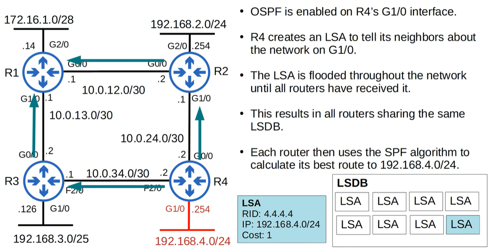

## OSPF LSA Types
**Type 1 (router LSA)**
    - Every OSPF router generates this type of LSA.
    - It indentifies the router using its router ID.
    - It also losts networks attached to the router's OSPF-activated interfaces.

**Type 2 (network LSA)**
    - Generated by the DR of each 'multi-access" network (ie. the broadcast network type). 
    - Lists the routers which are attached tot the multi-access network. 
    
**Type 5 (AS-External LSA)**
    - Generated by ASBRs to describe routes to destinations outside of the AS (OSPF domain)

## OSPF Areas
- OSPF uses areas to divide up the network
- small networks can be single-area without any negative effects on performance.
- In larger networks, a single-area design can have negative effects:
    - the SPF algorithm takes more time to calculate routes
    - the SPF algorithm requires exponentially more processing power on the routers
    - the larger LSDB takes up more memory on the routers
    - any small change in the network causes every router to flood LSAs and run the SPF algorithm again.
- By deviding a large OSPF network into several smaller areas, you can avoid the above negative effects.

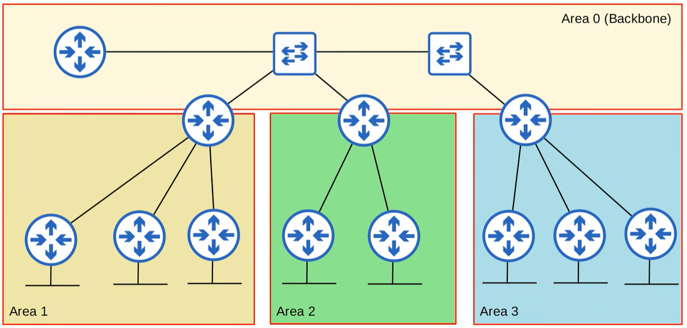
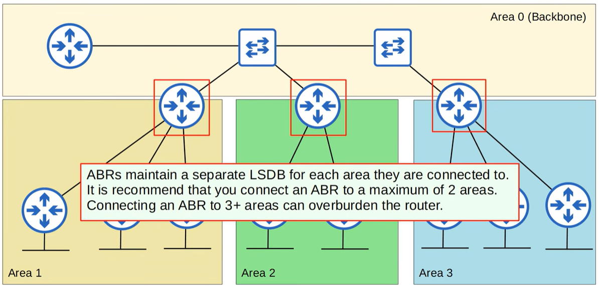

- An area is a set of routers and links that share the same LSDB. 
- The backbone area (area 0) is an area that all other areas must connect to.
- Routers with all interfaces in the same area are called internal routers.
- Routers with interfaces in multiple areas are called **area border routers (ABR's)**
- Routers connected to the backbone area (area 0) are called backbone routers.
- An intra-area route is a route to a destination inside the same OSPF area.
- An interarea route is a route to a destination in a diffrent OSPF area.

Backbone routers:
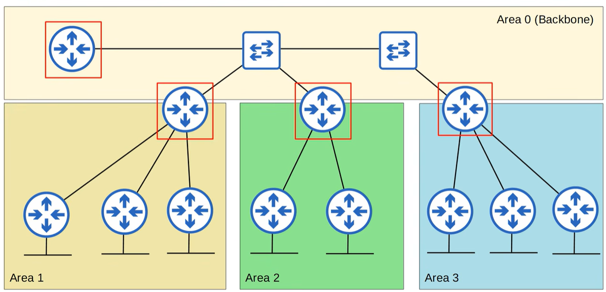

Interarea router:
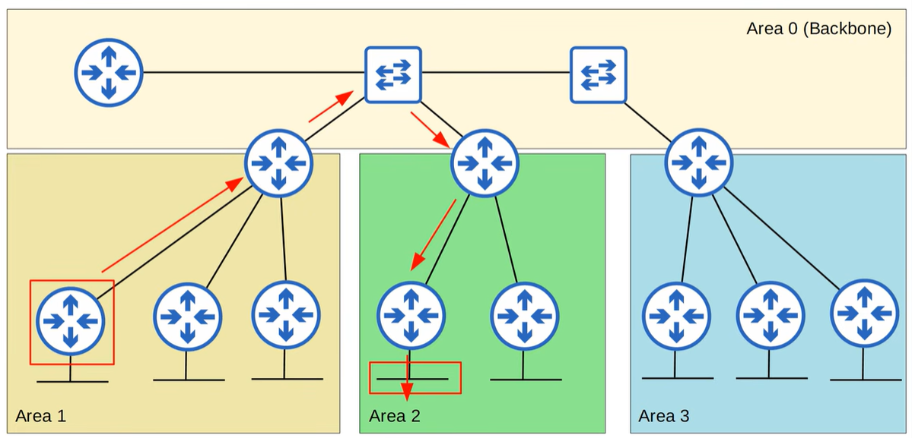

This will not work:
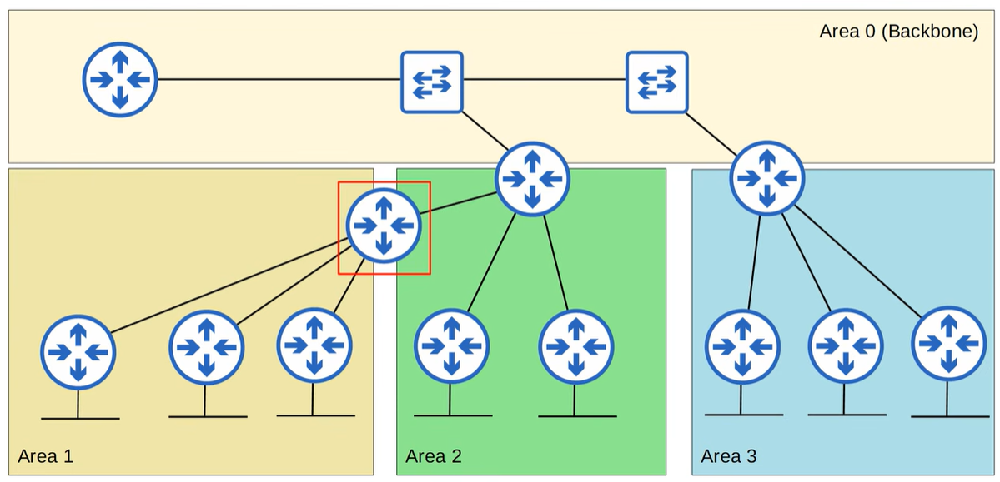

The router highlighted in red connects Area 1 directly to Area 2, but neither of them touches Area 0 at that point.

This creates a backbone bypass, which OSPF does not allow.

OSPF cannot:
- form inter‑area routes between Area 1 and Area 2
- exchange LSAs between them
- build a consistent LSDB

Because all inter‑area traffic must pass through Area 0.

### Sumary of the rules
- OSPF areas should be contiguous
- All OSPF areas must have at least one BR connected to the backbone area.
- OSPF interfaces in the same subnet must be in the same area.

## OSPF Metric (cost)
OSPF's metric is called **cost**

It automatically calculated based on the bandwidth (speed) of the interface. Calculated by dividing a reference bandwidth value by the interface's bandwidth.

The default reference bandwidth is 100mbps.
    - Ref: 100mbps / interface: 10mbps = cost of 10
    - Ref: 100mbps / interface: 100mbps = cost of 1
    - Ref: 100mbps / interface: 1000mbps = cost of 1??
    - Ref: 100mbps / interface: 10000mbps = cost of 1??

ALl values less than 1 will be converted to 1. Therefore FastEthernet, Gigabit Ethernet, 10Gig Ethernet, etc. are equal and all have a cost of 1 by default.

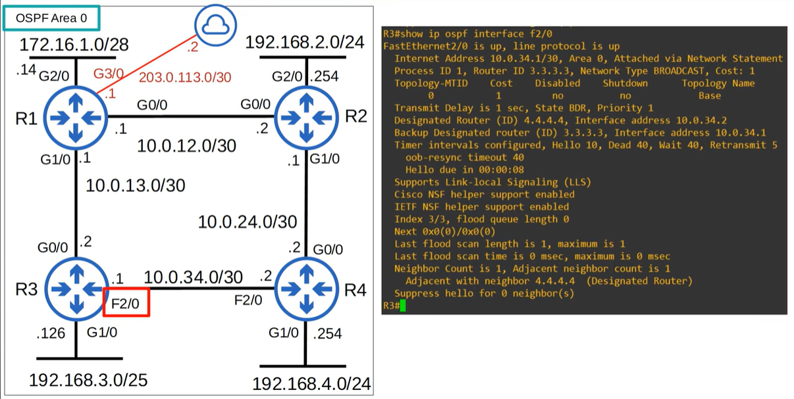

You can (and should) change the reference bandwidth with this command: `R1(config-router)# auto-cost reference-bandwidth *megabits-per-second*`

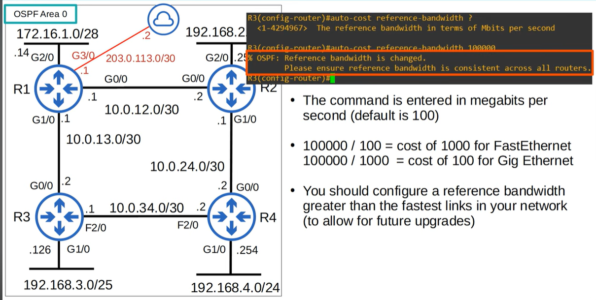

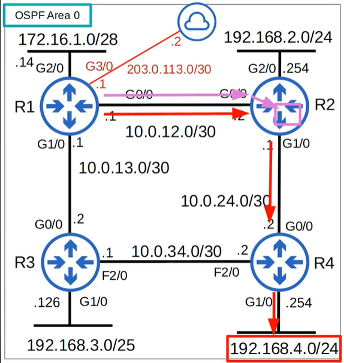

- The OSPF cost to destination is the total cost of the 'outgoing/exit interfaces'
- For example: R1's cost to reach 192.168.4.0/24
is:
100 (R1 G0/0) + 100 (R2 G1/0) + 100 (R4 G1/0) = 300
- Loopback interfaces have cost of 1
- what is R1's cost to reach 2.2.2.2 (R2's loopback0 interface)?
100 (R1 G1/0) + 1 (R2 L0) = 101

**BEFORE (referance bandwidth 100):
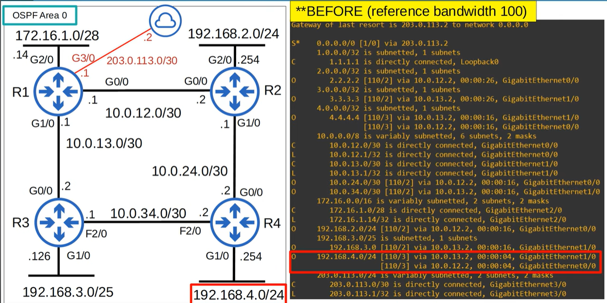

One more option to change the OSPF cost of an interface is to change the bandwidth of the interface with the bandwidth command. The formula to calculate OSPF cost is **reference bandwidth / interface bandwidth**

Altrough the bandwidth matches the interface speed by default, changing the interface bandwidth doesn't actually change the speed at which the interface operates. The bandwidth is just a value that is used to calculate OSPF cost, EIGRP metric etc.

To change the speed at which the interface operates, use the speed command. Because the bandwidth value is used in other calculations, it is not recommended to change this value to alter the interface's OSPF cost.

It is recommended that you change the reference bandwidth, and then use the ip osf cost command to change the cost of individual interfaces if you want.

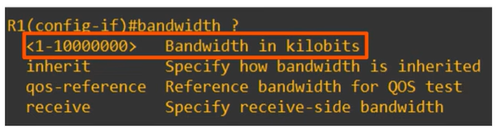

### Modfify the cost
3 ways to modify the OSPF cost:
1. change the reference bandwidth
`R1(config-router)# auto-cost reference-bandwidth *megabits-per-second*`
2. manual configuration
`R1(config-if)# ip ospf cost *cost*`
3. change the interface bandwidth
`R1(config-if)# bandwidth *kilobits-per-second*`

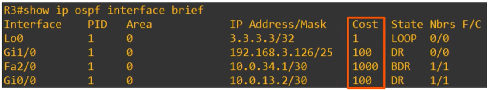

## OSPF Neighbors

- Making sure that routers successfully become OSPF neighbors is the main task in configuring and troubleshooting OSPF.
- Once routers become neighbors, they automatically do the work of sharing network information, calculating routes, etc.
- When OSPF is activated on an interface, the router starts sending OSPF hello messages out of the interface at regular intervals (determined by the hello timer). These are used to introduce the router to potential OSPF neighbors.
- The default hello timer is 10 seconds on an Ethernet connection.
- Hello messages are multicast to 224.0.0.5 (multicast address for all OSPF routers)

R1 (G0/0, .1) — 10.0.12.0/30 — R2 (G0/0, .2)

### States
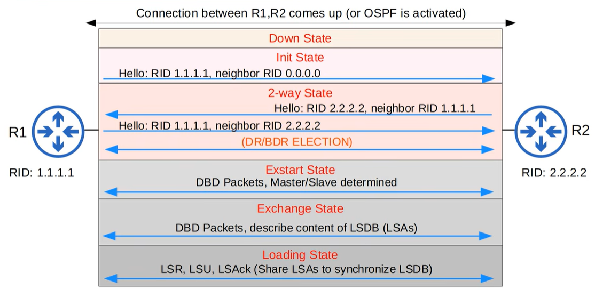
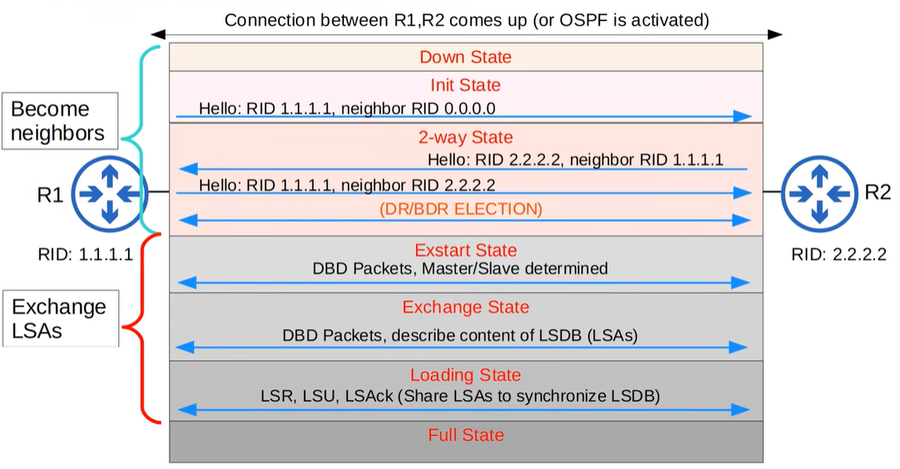

#### Down state
OSPF is activated on R1's G0/0 interface.
it sends an OSPF hello message to 224.0.0.5
It doesn't know about any OSPF neighbors yet, so the current neighbor state is DOWN.
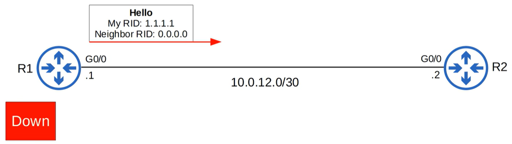

#### Init state
When R2 receives the Hello packet, it will add an entry to R1 to its OSPF neighbor table. In R2's neighbor table, the relationship with R1 is now in the Init state.
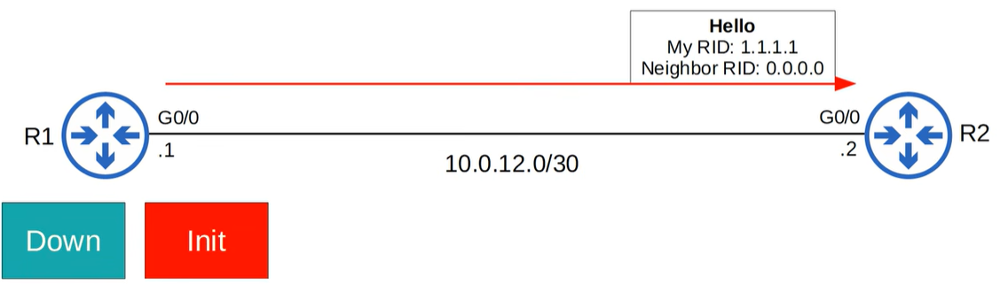

Init state = Hello packet received, but own router ID is not in the Hello packet.

#### 2-way state
The 2-way state means the router has received a Hello packet with its own RID in it.

If both routers reach the 2-way state, it means that all of the conditions have been met for them to become OSPF neighbors. They are now ready to share LSAs to build a common LSDB.

In some network types, a DR (designated router) and BDR (backup designated router) will be elected at this point.

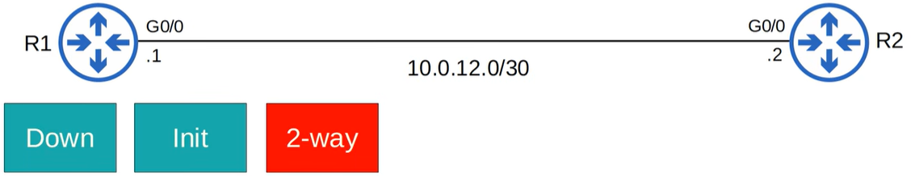

#### Exstart state
The 2 routers will now prepare to exchange information about their LSDB. Before that, they have to choose which one will start the exchange.

They do this in the exstart state.

The router with the higher RID will becole the Master and initiate the exchange. The router with the lower RID will become the Slave. 

To decide the Master and Slave, they exchange DBD (database description) packets.

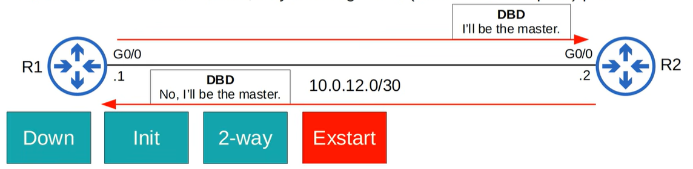

#### Exchange state
Routers exchange DBD's which contains a list of LSAs in their LSDB. These DBD's do not include detailed information about the LSAs, just basic information.

The routers compare information in the DBD they receive to the information in their own LSDB to determine which LSAs they must receive from their neighbor.

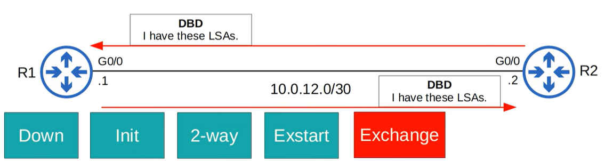

#### Loading state
Routers send Link State Request (LSR) messages to request that their neighbors send them any LSAs they don't have.

LSAs are sent in Link State Update (LSU) messages.
The routers send LSAck messages to acknowledge that they received the LSAs.

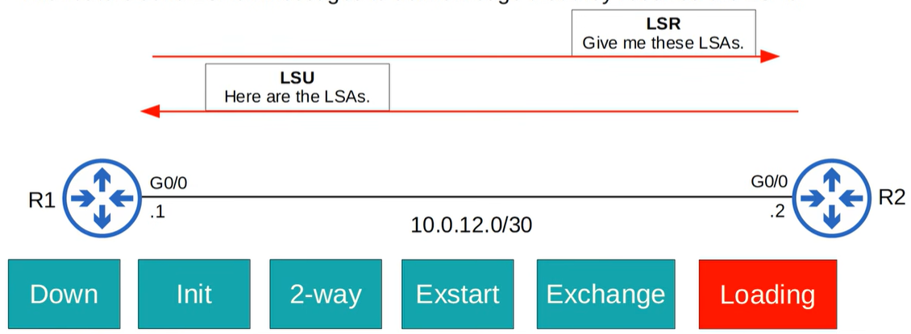

#### Full state
Routers have a full OSPF adjacency and identical LSDBs.

- They continue to send and listen for Hello packets (every 10s by default) to maintain the neighbor adjacency.
- Every time a Hello packet is received, the "dead" timer (40s by default) is reset/
- If the dead timer counts down to 0 and no Hello message is received, the neighbor is removed.
- The routers will continue to share LSAs as the network changes to make sure each router has a complete and accurate map of the network (LSDB).

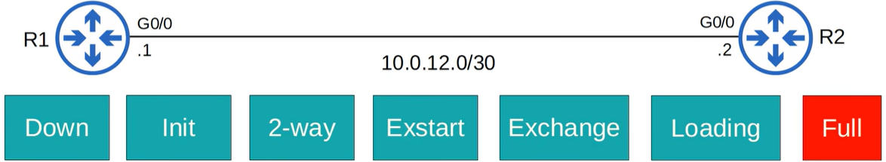

### OSPF overview
| Type | Name | Purpose |
|------|-------|----------|
| 1 | **Hello** | Neighbor discovery and maintenance. |
| 2 | **Database Description (DBD)** | Summary of the LSDB of the router. Used to check if the LSDB of each router is the same. |
| 3 | **Link-State Request (LSR)** | Requests specific LSAs from the neighbor. |
| 4 | **Link-State Update (LSU)** | Sends specific LSAs to the neighbor. |
| 5 | **Link-State Acknowledgement (LSAck)** | Used to acknowledge that the router received a message. |

### OSPF Neighbor requirements
1) Area number must match
2) Interfaces must be in the same subnet
3) OSPF process must not be *shutdown*
4) OSPF router IDs must be unique
5) Hello and Dead timers must match
6) Authentication settings must match
7) IP MTU settings must match
*Can become OSPF neighboprs, but OSPF doesn't operate properly.*
8) OSPF network type must match

*See video (Part 3) at minute 23:15 (to 33:00)
https://www.youtube.com/watch?v=3ew26ujkiDI 

## Loopback Interfaces
Loopback interfaces are **virtual, always‑up interfaces** used in OSPF for stability.

### Key points
- They never go down unless manually shut down.
- OSPF prefers the **highest loopback IP** as the router ID.
- Common uses:
  - Stable router IDs
  - Management access
  - Consistent reachability for testing and routing

## OSPF Network Types
OSPF uses different network types depending on the interface technology.  
These determine how neighbors form, whether DR/BDR elections occur, and how LSAs are exchanged.

### Overview Table
| Network Type | Default On | DR/BDR? | Notes |
|--------------|------------|---------|-------|
| Broadcast | Ethernet, FDDI | Yes | Uses multicast (224.0.0.5/6) |
| Point‑to‑Point | PPP, HDLC | No | Simple, no DR/BDR needed |
| Non‑Broadcast | Frame Relay, X.25 | Yes | No multicast; neighbors must be manually configured |

### Short descriptions
- **Broadcast**  
  Multi‑access networks that support multicast. OSPF elects a DR/BDR.

- **Point‑to‑Point**  
  Only two routers on the link. No DR/BDR. Fast and simple.

- **Non‑Broadcast**  
  Multi‑access but no multicast support. Requires manual neighbor statements.

## Underlying Technologies (Referenced Above)

### FDDI — Fiber Distributed Data Interface
A high‑speed (100 Mbps) **fiber‑optic LAN technology** used before modern Ethernet took over.  
Supports broadcast and multicast → OSPF treats it as a **broadcast network**.

### PPP — Point‑to‑Point Protocol
A **data‑link protocol** used on direct links between two routers (serial links, VPN tunnels).  
No broadcast or multicast → OSPF treats it as **point‑to‑point**.

### HDLC — High‑Level Data Link Control
Cisco’s default **serial encapsulation protocol**.  
Also a direct link between two routers → OSPF treats it as **point‑to‑point**.

### Frame Relay
A legacy **WAN technology** using virtual circuits (PVCs).  
Does not support multicast → OSPF treats it as **non‑broadcast** and requires manual neighbor configuration.

### X.25
An older **packet‑switched WAN protocol** used before Frame Relay.  
Also no multicast → OSPF treats it as **non‑broadcast**.

## Serial Interfaces
Serial interfaces are used on older WAN links and point‑to‑point connections.  
They operate at lower speeds than modern Ethernet and typically use encapsulation protocols such as PPP or HDLC.

### Key characteristics
- Used for **point‑to‑point WAN links**
- Support **PPP** or **HDLC** encapsulation
- Do not support broadcast or multicast natively
- OSPF treats them as **point‑to‑point networks**
- No DR/BDR election occurs

---

## Configuration
See video (Part 1) at minute 18:40
https://www.youtube.com/watch?v=pvuaoJ9YzoI

- basic OSPF configuration
- the `passive-interface` command
- advertise a default route into OSPF
- `show ip` protocols

See video (Part 2) at minute 22:50
https://www.youtube.com/watch?v=VtzfTA21ht0
- OSPF show "tasks"
- OSPF configuration