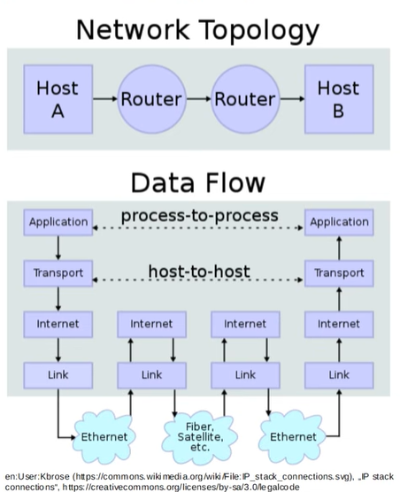
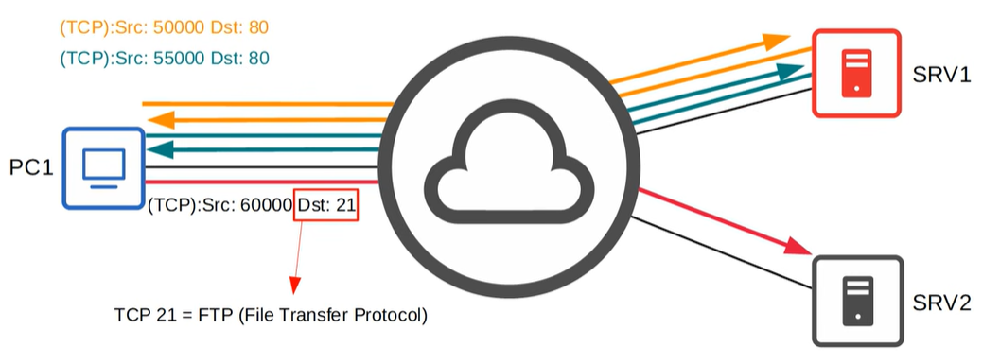
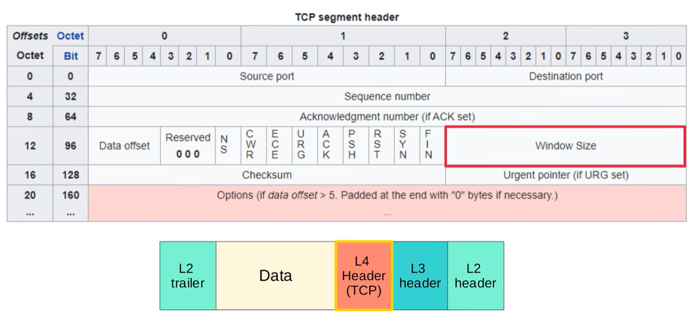
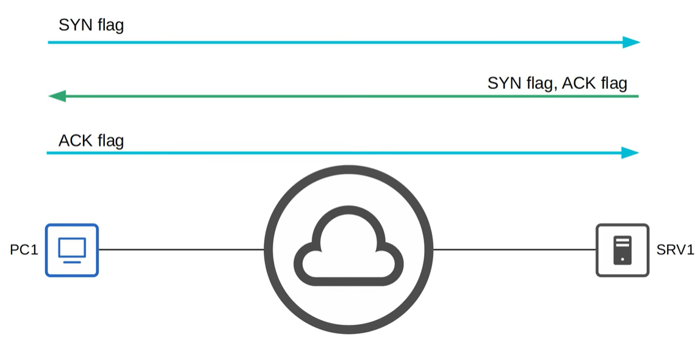
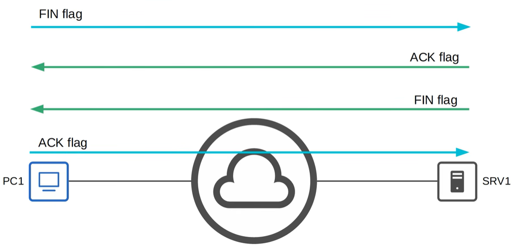
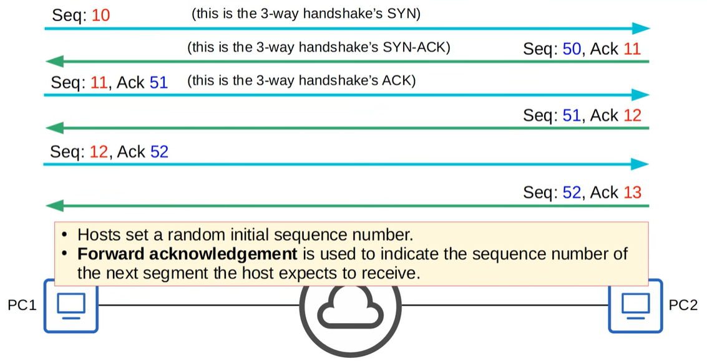
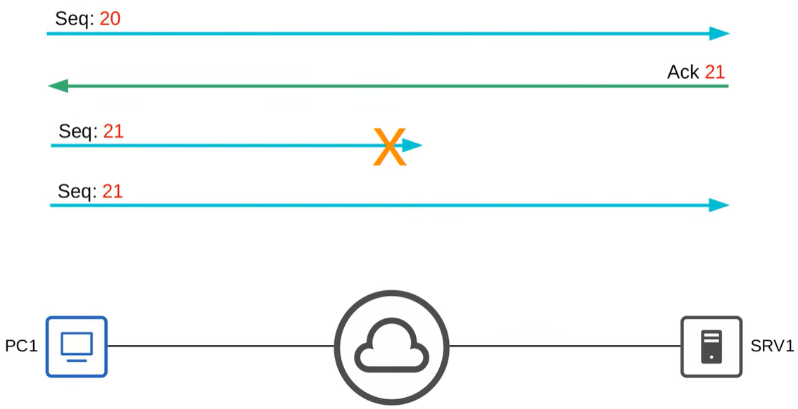
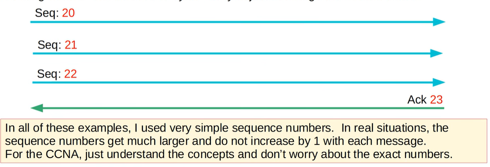
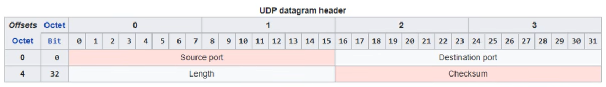

# TCP and UDP

TCP and UDP are transport-layer protocols that handle how data is delivered between devices. For CCNA 200-301, focus on the key difference: TCP is reliable and connection-oriented, while UDP is faster and connectionless.

- **Jeremy's IT Lab** — [Video](https://www.youtube.com/watch?v=LIEACBqlntY)

---
## Functions of the Layer 4 
*(Transport Layer)*

Provides transparant transfer of data between end hosts.



Provides transparant transfer of data between end hosts

Provides (and doesn't provide) various services to applications: 
→ Reliable data transfer
→ Error recovery
→ Data sequencing
→ Flow control

Provides layer 4 addressing (port numbers)
*(not the physical interfaces/ports on network devices)*
→ Identify the application layer protocol
→ Provides session multiplexing

→ The following ranges have been designated by IANA (internet assigned numbers authority)
- **Well-known** port numbers: 0 - 1023
- **registered** port numbers: 1024 - 49151
- **Ephemeral/Private/Dynamic** port numbers: 49152 - 65535

## Port numbers / session multiplexing


A single client can open **multiple TCP sessions** at the same time.  
Each session is uniquely identified by the **4‑tuple**:

```
Source IP  
Source Port  
Destination IP  
Destination Port
```

This allows many parallel connections, even to the **same server** and **same destination port**.

### Example (from diagram)

- To SRV1 (HTTP, port 80)  
  - Src 50000 → Dst 80  
  - Src 55000 → Dst 80  

- To SRV2 (FTP, port 21)  
  - Src 60000 → Dst 21  

Different **source ports** = different sessions.

### Key idea
TCP uses **ephemeral source ports** to multiplex many simultaneous connections.

## TCP

TCP (Transmission Control Protocol) is a **connection‑oriented**, **reliable**, and **ordered** transport protocol.

### Key Characteristics
- **Connection‑oriented**  
  A TCP session is established before data transfer begins (3‑way handshake).

- **Reliable delivery**  
  Every segment must be acknowledged.  
  Lost segments are retransmitted.

- **Sequencing**  
  Sequence numbers allow the receiver to reorder segments correctly.

- **Flow control**  
  The receiver can tell the sender to increase or decrease the sending rate (window size).

### TCP Header


The window size is used for flow control.

### Three-way handshake


TCP uses a three‑way handshake to establish a reliable connection: one host begins by sending a SYN to signal it wants to start a session, the other host replies with a SYN‑ACK to confirm and synchronize sequence numbers, and finally the initiator responds with an ACK, completing the setup so both sides agree on initial sequence values and can begin exchanging data in an ordered, reliable stream.

### Four-way handshake


A TCP connection is closed using a four‑way handshake, where each side independently ends its sending direction. First, one host sends a FIN to signal it has no more data to transmit; the other host acknowledges this but may still have data to send. When it is ready to close its own side, it sends a FIN back, and the original host replies with a final ACK. This orderly exchange ensures both sides agree the session is fully terminated without losing any remaining data.

### TCP: Sequencing / Acknowledgment


TCP sequencing and acknowledgment ensure that both hosts keep track of exactly which bytes have been sent and which are expected next; each side chooses a random initial sequence number during the handshake, then increments it as data is transmitted, while acknowledgments always indicate the next sequence number the receiver expects, allowing both hosts to maintain an ordered, reliable stream even if segments arrive out of order or require retransmission.

### TCP Retransmission


TCP retransmission occurs when a segment sent by the source does not get acknowledged by the destination; TCP detects the missing acknowledgment and automatically resends the exact same segment to ensure reliable delivery. In the example, PC1 sends a segment with sequence number 21, but because it is lost in transit, SRV1 never acknowledges it, triggering PC1 to retransmit the same sequence number so the communication can continue without data loss.

### TCP Flow Control: Window Size
- Acknowledging every single segment, no matter what size, is inefficient.
- The TCP header's Window Size field allows more data to be sent before an acknowledgment is required.
- A 'sliding window' can be used to dynamically adjust how large the window size is.



---

## UDP

UDP (User Datagram Protocol) is a **lightweight, connectionless** transport protocol that sends data with minimal overhead.

### Key Characteristics
- **Not connection‑oriented**  
  Data is sent immediately without establishing a session.

- **No reliability**  
  Segments are sent *best‑effort* — no acknowledgments, no retransmissions.

- **No sequencing**  
  UDP cannot reorder out‑of‑order segments.

- **No flow control**  
  There is no mechanism like TCP’s window size to regulate sending speed.

### When UDP is used
Applications that need **speed over reliability**, such as  
**DNS**, **VoIP**, **streaming**, and **online gaming**.

### UDP Header



---

## TCP vs UDP

| **TCP** | **UDP** |
|--------|---------|
| Connection‑oriented | Connectionless |
| Reliable | Unreliable |
| Sequencing | No sequencing |
| Flow control | No flow control |
| Used for downloads, file sharing, etc | Used for VoIP, live video, etc |

## Port Numbers

Port numbers identify **which application or service** should receive incoming traffic.  
Some ports use **TCP**, some **UDP**, and some use **both**.

### Common TCP Ports
- **20** – FTP Data  
- **21** – FTP Control  
- **22** – SSH  
- **23** – Telnet  
- **25** – SMTP  
- **80** – HTTP  
- **110** – POP3  
- **443** – HTTPS  

### Common UDP Ports
- **67** – DHCP Server  
- **68** – DHCP Client  
- **69** – TFTP  
- **161** – SNMP Agent  
- **162** – SNMP Manager  
- **514** – Syslog  

### TCP & UDP
- **53** – DNS
