# IPv6

IPv6 is the next-generation IP addressing system that uses 128-bit addresses, giving far more address space than IPv4. For CCNA 200-301, focus on the basics: address format, shorthand notation, and common features like link-local, global unicast, and SLAAC.

- **Jeremy's IT Lab** — [Video Part 1](https://www.youtube.com/watch?v=ZNuXyOXae5U%20)
- **Jeremy's IT Lab** — [Video Part 2](https://www.youtube.com/watch?v=BrTMMOXFhDU)
- **Jeremy's IT Lab** — [Video Part 3](https://www.youtube.com/watch?v=rwkHfsWQwy8)

---

## What about IPv5?
'internet stream protocol' was developed in late 1970s, but never actually introduced for public use.
Never called 'IPv5', but it used a value of 5 in the version field of the IP Header.
So when the successor to IPv4 was being developed, it was named IPv6.

## Hexadecimal
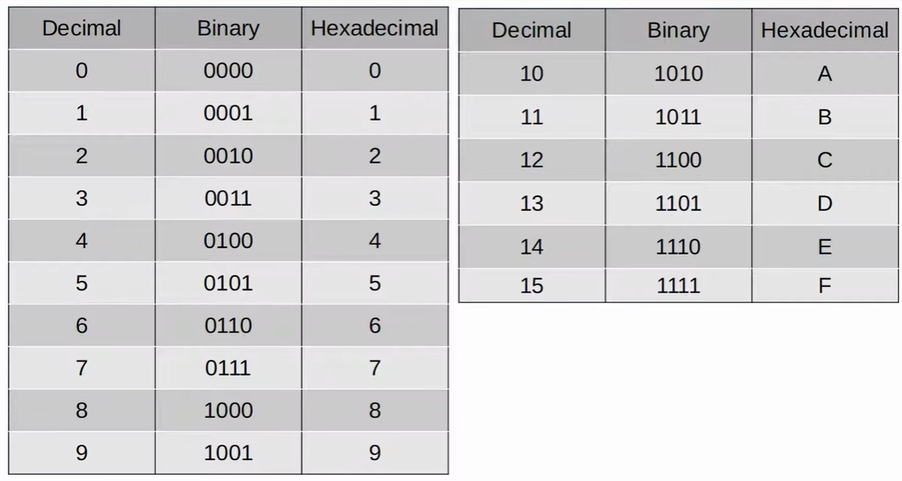

## IPv6
- 128 bits long.
- 4 × the bits of an IPv4 address **does NOT** mean 4 × the number of addresses.
- Every additional bit **doubles** the number of possible addresses.
- There are **≈ 3.4 × 10³⁸ IPv6 addresses**.
- There are **≈ 4.29 × 10⁹ IPv4 addresses**.

### Example IPv6 Address

Full (uncompressed) IPv6 address:
2001:0db8:0000:0000:0000:ff00:0042:8329

Compressed form:
2001:db8::ff00:42:8329

Breakdown:
- 2001:db8 → Global routing prefix
- :: → One or more groups of all-zero blocks
- ff00:42:8329 → Interface ID (64 bits)

### Netmask / Prefix length
IPv6 uses **prefix length** instead of dotted‑decimal masks.
Example: `/64`

- `/64` means **first 64 bits = network prefix**, last 64 bits = host/interface ID.  
- Equivalent to IPv4’s subnet mask concept, but written as a prefix length.  
- Common default for LANs: `/64`  
- Example network: `2001:db8::/64`

### IPv6 Full vs Shortened Notation
*shortening (abbreviating) IPv6 addresses

| Full IPv6 Address                               | Shortened IPv6 Address          |
|--------------------------------------------------|---------------------------------|
| 2000:AB78:0020:01BF:ED89:0000:0000:0001          | 2000:AB78:20:1BF:ED89::1        |
| FE80:0000:0000:0000:0002:0000:0000:FBE8          | FE80::2:0:0:FBE8                |
| AE89:2100:01AC:00F0:0000:0000:0000:020F          | AE89:2100:1AC:F0::20F           |
| 2001:0DB8:8B00:1000:0002:0BC0:0D07:0099          | 2001:DB8:8B00:1000:2:BC0:D07:99 |
| 2001:0DB8:0000:0000:0000:0000:0000:1000          | 2001:DB8::1000                  |

### Finding IPv6 Prefix
2001:0DB8:8B00:0001:FB89:017B:0020:0011/93

| Group | Hex | Bit range |
| --- | --- | --- |
| 1 | 2001 | bits 0–15 |
| 2 | 0DB8 | bits 16–31 |
| 3 | 8B00 | bits 32–47 |
| 4 | 0001 | bits 48–63 |
| 5 | FB89 | bits 64–79 |
| 6 | 017B | bits 80–95 |
| 7 | 0020 | bits 96–111 |
| 8 | 0011 | bits 112–127 |

Prefix = /93, dus:
- first 93 bits = network
- last 35 bits = interface ID

Bits 80–95 → in group 6

```
017B = 0000 0001 0111 1011
       ^^^^ ^^^^ ^^^^ ^^^^
       80   84   88   92
```
 80–92 = 13 bits (13 bits become 1)
2nd bit of last nibble is bit 93.

Network part (1) of 017B: 1111 1111 1111 1000

Full:
1111 1111 1111 1111 1111 1111 1111 1111 1111 1111 1111 1111 1111 1111 1111 1111 1111 1111 1111 1000 0000 0000 0000 0000 0000 0000 0000 0000
- 1 = network
- 0 = interface ID

1111 1111 1111 1000  = FFF8

0000 0001 0111 1011
1111 1111 1111 1000

rules:
- 1 AND 1 = 1
- 1 AND 0 = 0
- 0 AND 1 = 0
- 0 AND 0 = 0

0000 0001 0111 1000 = 
0000 = 0
0001 = 1
0111 = 7
1000 = 8

PREFIX: 2001:0DB8:8B00:0001:FB89:0178:: /93

### Why IPv6 exists?
IPv6 exists because IPv4 ran out of usable public addresses.

- IPv4 address assignments are controlled by IANA (internet assigned numbers authority)
- IANA distributed IPv4 address space to various RIRs (Regional internet registries), which then assign them to companies that need them.

> On 24th of September 2015, ARIN declared exhaustion of the ARIN IPv4 addresses pool.

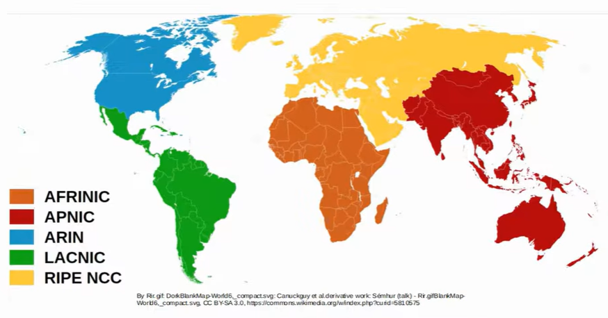

## What is EUI-64?

EUI‑64 (Extended Unique Identifier – 64‑bit) is a method used in IPv6 to automatically generate the **interface ID** (the last 64 bits of an IPv6 address) from a device’s **48‑bit MAC address**.

How it works:
- Split the MAC address into two halves  
- Insert **FFFE** in the middle  
- Flip the **7th bit** (the Universal/Local bit)

This transforms a 48‑bit MAC into a globally unique 64‑bit interface identifier.

### Why do we use this EUI-64?
- **Automatic addressing**  
  Hosts can generate their own IPv6 address without DHCPv6.

- **SLAAC support**  
  EUI‑64 is the mechanism behind Stateless Address Autoconfiguration.

- **Globally unique interface IDs**  
  Because MAC addresses are unique, the resulting EUI‑64 IDs are also unique.

- **Predictable addressing**  
  Network engineers can easily identify which MAC address belongs to which IPv6 interface ID.

- **No manual configuration needed**  
  Reduces administrative overhead and configuration errors.

### Configuring IPv6 address (EUI-64)
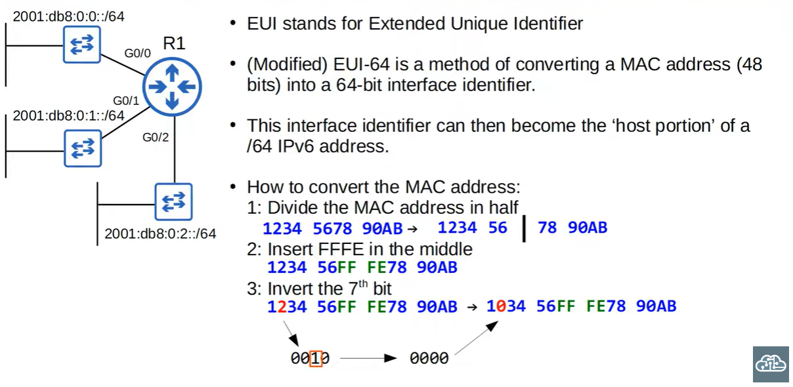
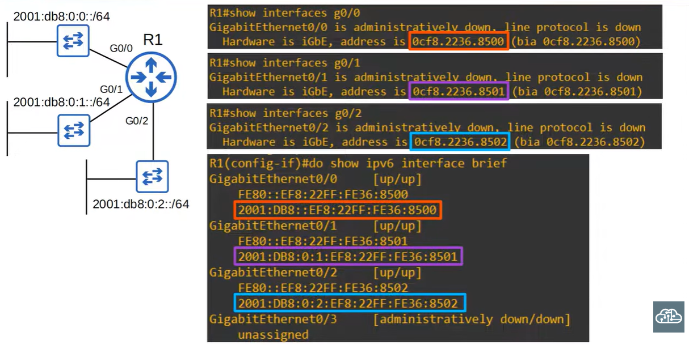

### Why invert the 7th bit?

The 7th bit of the first byte in a MAC address is the **U/L bit** (Universal/Local bit).  
When generating an IPv6 EUI‑64 interface ID, this bit is **inverted** to indicate that the resulting 64‑bit identifier is **not a factory‑assigned MAC address**, but a **modified value** used for IPv6.

#### What the 7th bit means
- **0 = Universally administered address (UAA)**  
  → Assigned by the manufacturer (normal MAC address)

- **1 = Locally administered address (LAA)**  
  → Modified or generated by software

When IPv6 creates an EUI‑64 interface ID, it **must mark it as “locally created”**, not a real hardware MAC.

So IPv6 flips the bit:
- If it was **0**, it becomes **1**  
- If it was **1**, it becomes **0**

#### Why IPv6 does this
- To **avoid confusion** with real MAC addresses  
- To **signal** that the interface ID is **derived**, not burned‑in  
- To comply with IEEE rules for EUI‑64 identifiers  
- To ensure the interface ID is **unique but not hardware‑specific**

#### Example

Take the MAC address:

**AA-BB-CC-DD-EE-FF**

##### 1. Split the MAC into two halves
AA BB CC  |  DD EE FF

##### 2. Insert FFFE in the middle
AA BB CC **FF FE** DD EE FF

##### 3. Convert to IPv6 format (groups of 2 bytes)
AABB:CCFF:FEDD:EEFF

##### 4. Invert the 7th bit (U/L bit)
First byte = **AA** (in hex)

AA = `1010 1010`  
Flip the 7th bit → `1010 1010` becomes `1010 1000`

`1010 1000` = **A8**

So the final EUI‑64 interface ID becomes:

**A8BB:CCFF:FEDD:EEFF**


## Global Unicast Address

A **global unicast address** is an IPv6 address that is globally routable on the public Internet.  
It is the IPv6 equivalent of a public IPv4 address.

### Key characteristics
- **Public** — reachable across the entire Internet  
- **Globally unique** — no two devices share the same address  
- **Assigned by an ISP** — the first 48 bits (global routing prefix) come from the provider  
- **Subnettable** — the next 16 bits are used by the organization to create subnets  
- **Host portion** — the final 64 bits identify the interface (can be manual, random, or EUI‑64)

### Structure
A global unicast IPv6 address typically follows this layout:
`| 48-bit Global Routing Prefix | 16-bit Subnet ID | 64-bit Interface ID |`

Example: 
2001:0DB8:8B00:0001:0000:0000:0000:0001/64


- **2001:0DB8:8B00** → Global routing prefix (from ISP)  
- **0001** → Subnet ID (chosen by the enterprise)  
- **0000:0000:0000:0001** → Interface ID (host portion)

### Relation to EUI‑64
Only the **last 64 bits** (the interface ID) *may* be generated using EUI‑64.  
The rest of the address has **nothing to do with EUI‑64**.

So:
- Global unicast = full IPv6 address structure  
- EUI‑64 = optional method to generate the **interface ID only**

## Unique Local IPv6 Address

Unique Local Addresses (ULA) are private IPv6 addresses designed for local communication. They are the IPv6 equivalent of private IPv4 addresses (like 10.x.x.x or 192.168.x.x).

### Key Characteristics
* **Non-Routable:** These addresses are strictly for internal use and **cannot be used over the Internet**.
* **No Registration:** They can be used freely within internal networks without central registration.
* **Address Block:** Uses the prefix `FC00::/7`.
* **The "FD" Requirement:** Due to a requirement that the 8th bit must be set to **1**, all current Unique Local addresses must start with the hex digits **FD**.
* **Uniqueness:** The Global ID should be randomly generated to minimize address overlaps if two different internal networks (e.g., merging companies) ever connect.

### Address Structure
A standard /64 ULA is divided into four distinct sections:

| Component | Size | Description |
| :--- | :--- | :--- |
| **Prefix** | 8 bits | The first two digits (**FD**), indicating a unique local address. |
| **Global ID** | 40 bits | A randomly generated ID used to ensure the network is locally unique. |
| **Subnet ID** | 16 bits | Used by the administrator to define different subnets within the organization. |
| **Interface ID** | 64 bits | The host portion of the address, identifying the specific device interface. |

## Link-Local IPv6 Address

Link-local addresses are IPv6 addresses that are automatically generated on any IPv6-enabled interface. They are used for communication within a single network segment (link/subnet).

### Key Characteristics
* **Automatic Generation:** These addresses are created automatically once IPv6 is active.
* **Enable Command:** Use the Cisco IOS command `R1(config-if)# ipv6 enable` to turn on IPv6 on a specific interface.
* **Non-Routable:** Routers **will not** route packets that have a link-local destination address; they stay within the local link.
* **Address Block:** Uses the range `FE80::/10` (from `FE80::` to `FEBF:...`).
* **The "FE8" Standard:** According to the standard, the 54 bits following the initial prefix should be all **0**s. Therefore, you will effectively only see link-local addresses starting with **FE8**, not FE9, FEA, or FEB.

### Structure and Generation
* **Interface ID:** The host portion of the address is typically generated using **EUI-64** rules, which involve using the device's MAC address.

### Common Uses
Link-local addresses are fundamental to the operation of IPv6 and are used for:
* **Routing Protocol Peerings:** Protocols like OSPFv3 use these addresses to establish neighbor adjacencies.
* **Next-hop Adressen:** Used as the gateway address for static routes.
* **Neighbor Discovery Protocol (NDP):** IPv6’s replacement for ARP; NDP requires link-local addresses to function (discovering other devices on the same link).

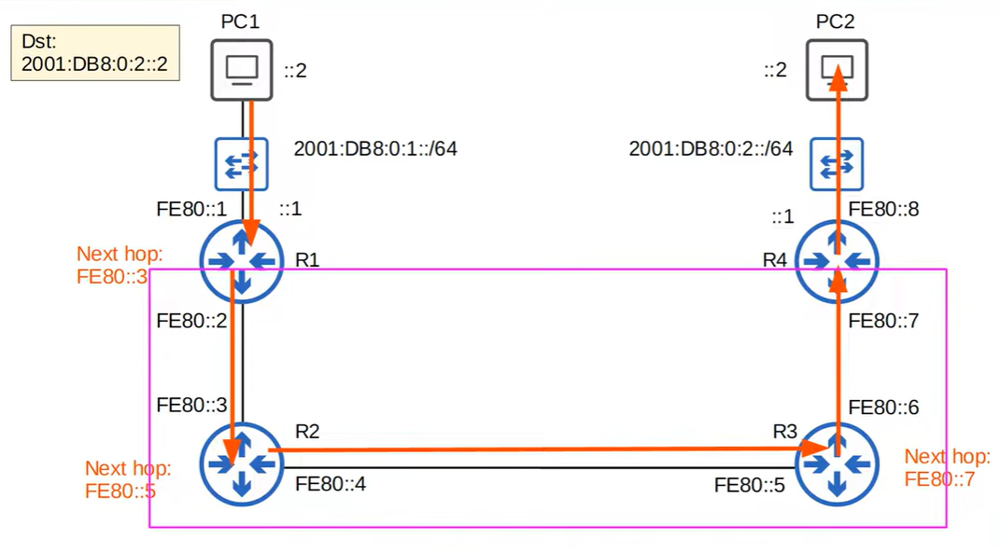

## Multicast address

IPv6 uses multicast as a primary method of communication. Unlike IPv4, which relies heavily on broadcasting, IPv6 has completely eliminated the concept of broadcast addresses.

### Communication Types
* **Unicast:** One-to-one (one source to one specific destination).
* **Broadcast:** One-to-all (one source to all destinations in a subnet). **Note: IPv6 does not use broadcast!**
* **Multicast:** One-to-many (one source to multiple destinations that have joined a specific multicast group).

### Key Characteristics
* **Address Range:** IPv6 multicast addresses use the prefix **`FF00::/8`**.
* **Efficiency:** Only devices that are interested in the traffic (members of the group) process the packets, reducing the load on other hosts.

### Common Multicast Addresses
In IPv6, specific multicast addresses are used to replace traditional broadcast functions. Below is a comparison of common multicast purposes and their respective IPv6 and IPv4 addresses:

| Purpose | IPv6 Address | IPv4 Address (Equivalent) |
| :--- | :--- | :--- |
| **All nodes/hosts** (functions like broadcast) | `FF02::1` | `224.0.0.1` |
| **All routers** | `FF02::2` | `224.0.0.2` |
| **All OSPF routers** | `FF02::5` | `224.0.0.5` |
| **All OSPF DRs/BDRs** | `FF02::6` | `224.0.0.6` |
| **All RIP routers** | `FF02::9` | `224.0.0.9` |
| **All EIGRP routers** | `FF02::A` | `224.0.0.10` |

### Multicast address scopes

IPv6 defines multiple multicast "scopes" which indicate how far a packet should be forwarded within a network. The scope prevents multicast traffic from leaking into parts of the network where it is not needed.

### IPv6 Multicast Scopes
The scope of a multicast address is determined by the 4th hexadecimal digit of the address (e.g., `FF0X`).

| Scope | Prefix | Description |
| :--- | :--- | :--- |
| **Interface-local** | `FF01` | The packet doesn't leave the local device. Used to send traffic to services within the same host. |
| **Link-local** | `FF02` | The packet remains within the local subnet. Routers will **not** forward these packets between subnets. |
| **Site-local** | `FF05` | The packet can be forwarded by routers but is limited to a single physical location (it stays within the site and is not forwarded over a WAN). |
| **Organization-local** | `FF08` | Wider than site-local; encompasses an entire company or organization. |
| **Global** | `FF0E` | No boundaries. These packets can be routed across the entire Internet. |

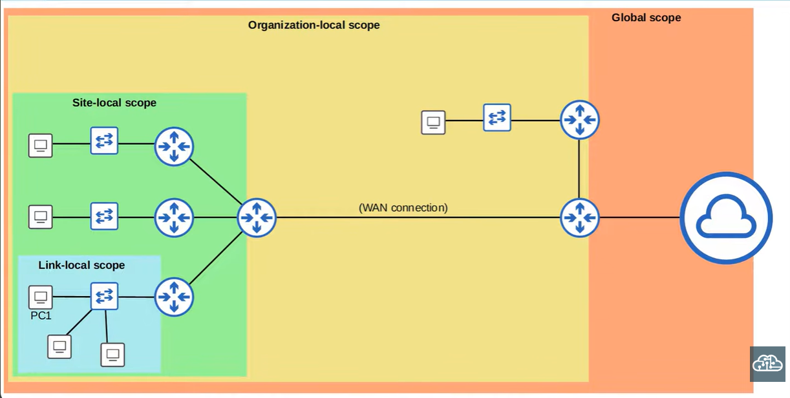

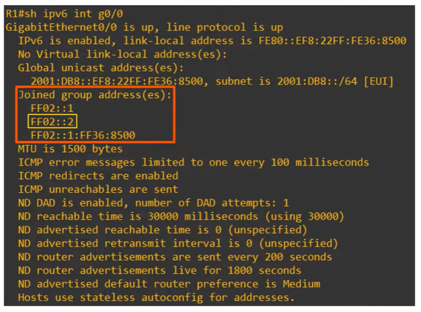

#### Key Takeaway
Most common multicast addresses (like those used for routing protocols) use the **Link-local (FF02)** scope because the communication only needs to happen between devices on the same physical wire or VLAN.

### Solicited-Node Multicast Address
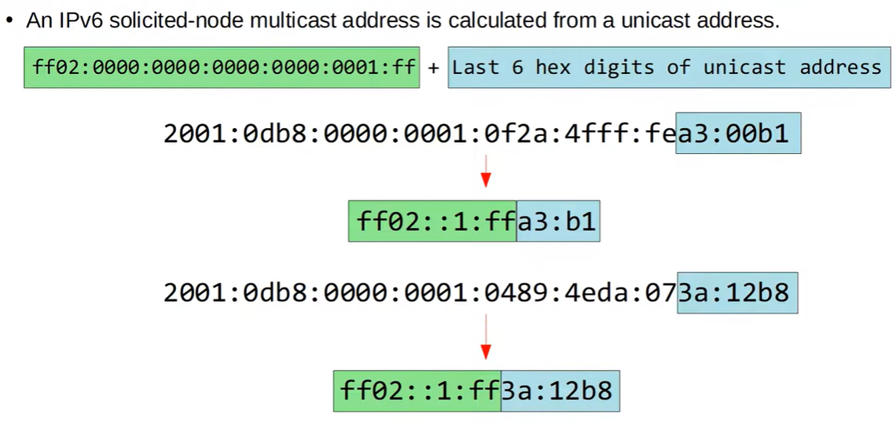
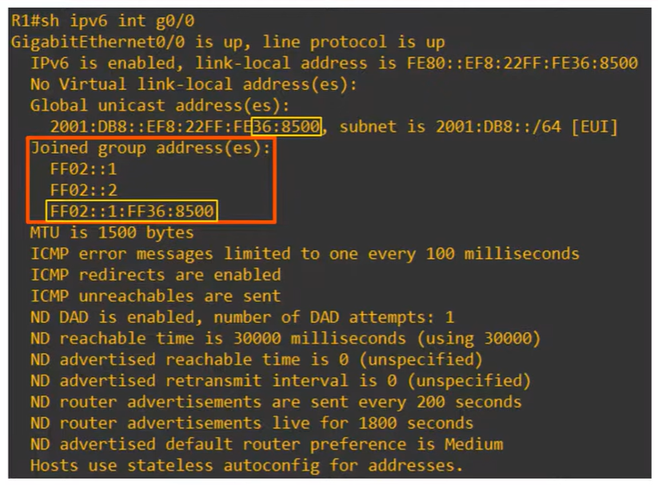

## Anycast Address

Anycast is a specialized routing technique introduced in IPv6 that allows multiple devices (usually routers or servers) to share the exact same IP address.

### Core Concept: "One-to-One-of-Many"
Unlike standard unicast, where an address is unique to one device, Anycast allows a single address to be assigned to multiple nodes.
* **Mechanism:** Multiple routers are configured with the same IPv6 address and advertise it using a routing protocol.
* **Routing:** When a host sends a packet to an Anycast destination, the network routers forward the packet to the **nearest** node configured with that address, based on the routing metric (e.g., lowest hop count or cost).

### Implementation & Identification
* **No Specific Range:** Unlike Multicast (`FF00::/8`) or Link-Local (`FE80::/10`), Anycast does not have a dedicated address block. 
* **Standard Unicast Base:** You use a regular unicast address (Global Unicast or Unique Local) and explicitly define it as Anycast during configuration.
* **Configuration Example:**
  `R1(config-if)# ipv6 address 2001:db8:1:1::99/128 anycast`

### Key Benefits
* **Load Balancing:** Automatically distributes traffic among multiple geographically dispersed nodes.
* **Redundancy:** If the "nearest" node goes down, the routing protocol will automatically direct traffic to the next closest available node.
* **Latency Reduction:** Ensures users are served by the closest possible resource.

### Configuration
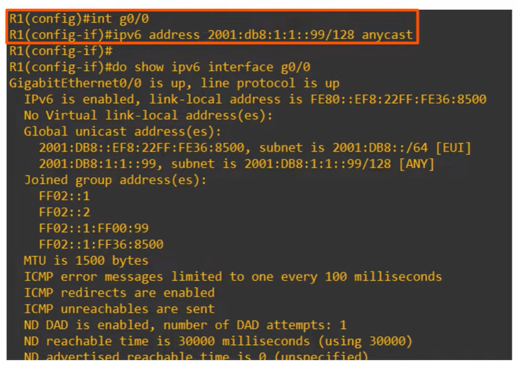

## Other IPv6 Addresses

### 1. Unspecified Address (`::`)
* **Purpose:** Used by a device that does not yet have an assigned IPv6 address.
* **Default Route:** Used to represent the default route (`::/0`).
* **IPv4 Equivalent:** `0.0.0.0`

### 2. Loopback Address (`::1`)
* **Purpose:** Used to test the IP stack on the local device (self-ping).
* **Behavior:** Traffic is processed internally and never leaves the device.
* **IPv4 Equivalent:** `127.0.0.1` (the `127.0.0.0/8` range)

## IPv6 Address Representation (RFC 5952)

Before RFC 5952, IPv6 address formatting was flexible and inconsistent.  
Different systems and engineers could write the same IPv6 address in multiple valid ways, which caused confusion and made documentation harder to read.

RFC 5952 provides a **standardized recommendation** for how IPv6 addresses should be written in text form.

## IPv6 Shortening Rules (RFC 5952 Applied)

When writing IPv6 addresses, several rules ensure a clean, standardized, and consistent format.  
These rules come from RFC 5952 and define how IPv6 addresses **must** be shortened.

### 1. Remove all leading zeros
Leading zeros inside any 16‑bit block must be removed.

Example:  
`2001:0db8:0000:0001:0f2a:4fff:fea3:00b1`  
→ `2001:db8:0:1:f2a:4fff:fea3:b1`


### 2. Use `::` to shorten the **longest** sequence of all‑zero blocks
If multiple zero blocks exist, compress the **longest run** using `::`.

Example:  
`2001:0000:0000:0000:0f2a:0000:0000:00b1`  
→ `2001::f2a:0:0:b1`

If there is **only one** all‑zero block, do **not** use `::`.


### 3. If two zero runs are equal in length, compress the **leftmost** one
Example:  
`2001:0db8:0000:0000:0f2a:0000:0000:00b1`  
→ `2001:db8::f2a:0:0:b1`

### 4. Hexadecimal letters must be lowercase
RFC 5952 requires using lowercase `a`–`f`, not uppercase.

Example:  
Use `fea3`, not `FEA3`.

---## IPv6 Shortening Rules (RFC 5952 Applied)

When writing IPv6 addresses, several rules ensure a clean, standardized, and consistent format.  
These rules come from RFC 5952 and define how IPv6 addresses **must** be shortened.

### 1. Remove all leading zeros
Leading zeros inside any 16‑bit block must be removed.

Example:  
`2001:0db8:0000:0001:0f2a:4fff:fea3:00b1`  
→ `2001:db8:0:1:f2a:4fff:fea3:b1`

### 2. Use `::` to shorten the **longest** sequence of all‑zero blocks
If multiple zero blocks exist, compress the **longest run** using `::`.

Example:  
`2001:0000:0000:0000:0f2a:0000:0000:00b1`  
→ `2001::f2a:0:0:b1`

If there is **only one** all‑zero block, do **not** use `::`.

### 3. If two zero runs are equal in length, compress the **leftmost** one
Example:  
`2001:0db8:0000:0000:0f2a:0000:0000:00b1`  
→ `2001:db8::f2a:0:0:b1`

### 4. Hexadecimal letters must be lowercase
RFC 5952 requires using lowercase `a`–`f`, not uppercase.

Example:  
Use `fea3`, not `FEA3`.

## IPv6 Header
### IPv4 Header Format
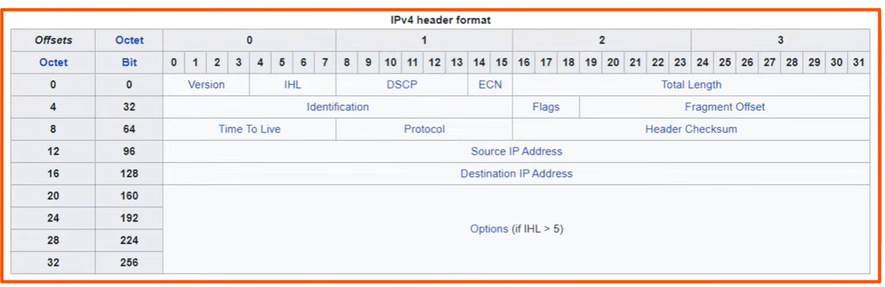

### Fixed (IPv6) Header Format
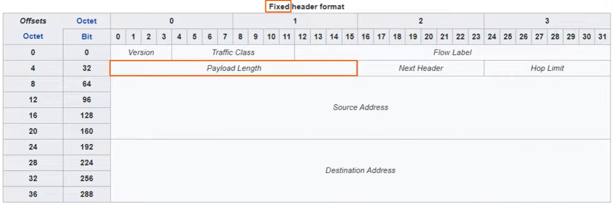

#### Traffic Class
- **Length:** 8 bits  
- Used for **QoS (Quality of Service)** to mark high‑priority traffic.  
- Examples: IP phone calls, live video, real‑time applications.  
- Higher priority traffic receives preferential forwarding treatment.

#### Payload Length
- **Length:** 16 bits  
- Indicates the size (in bytes) of the **payload**, meaning everything **after** the IPv6 header.  
- Does *not* include the fixed 40‑byte IPv6 header itself.  
- Maximum value: 65,535 bytes.

#### Next Header
- **Length:** 8 bits  
- Identifies the **type of header that follows** the IPv6 header.  
- Can indicate:
  - A transport protocol (e.g., TCP = 6, UDP = 17, ICMPv6 = 58)  
  - An extension header (e.g., Routing Header, Fragment Header, Hop‑by‑Hop Options)  
- Similar to the IPv4 “Protocol” field.

#### Hop Limit
- **Length:** 8 bits  
- Prevents packets from looping forever.  
- Decremented by **1** at every router hop.  
- When it reaches **0**, the packet is discarded.  
- Equivalent to IPv4’s TTL (Time To Live).

## NDP (Neighbor Discovery Protocol)

Neighbor Discovery Protocol (NDP) is the IPv6 mechanism used for discovering other devices on the local link, learning their MAC addresses, finding routers, detecting duplicate addresses, and maintaining neighbor reachability.  
It replaces ARP in IPv4 and operates using ICMPv6 messages.

NDP uses **multicast** for discovery and **unicast** for most replies.

### Functions of NDP
- Address resolution — learn MAC addresses of neighbors  
- Router discovery — learn default gateways  
- Prefix discovery — learn network prefixes  
- Duplicate Address Detection (DAD) — ensure an address is unique  
- Neighbor reachability — check if neighbors are still reachable  

### Message Types (ICMPv6)
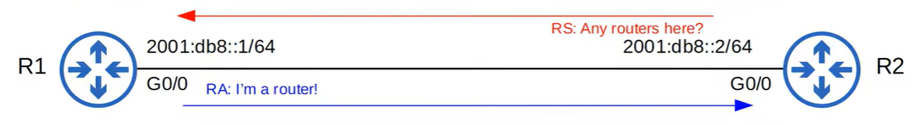

- **Neighbor Solicitation (NS)** — ICMPv6 Type 135  
  - Used to ask: “Who has this IPv6 address?”  
  - Sent to a **solicited‑node multicast address** (FF02::1:FFxx:xxxx)

- **Neighbor Advertisement (NA)** — ICMPv6 Type 136  
  - Reply to an NS  
  - Usually sent **unicast** back to the requester

- **Router Solicitation (RS)** — ICMPv6 Type 133  
  - Hosts ask routers for information  
  - Sent to **FF02::2** (all routers)

- **Router Advertisement (RA)** — ICMPv6 Type 134  
  - Routers announce prefixes, gateways, and SLAAC info  
  - Sent to **FF02::1** (all nodes)

- **Redirect** — ICMPv6 Type 137  
  - Router tells a host about a better next hop  
  - Sent **unicast** to the host

### Multicast vs Unicast in NDP
- **Multicast:** NS, RS, RA  
- **Unicast:** NA (usually), Redirect  

### Summary
NDP is an **independent IPv6 protocol**, but it heavily relies on multicast for discovery and uses unicast for replies.  
It replaces ARP and adds additional functions like router discovery and DAD.

### ICMPv6 messages
ICMPv6 = Internet Control Message Protocol version 6

Is a fundamental, mandatory protocol within IPv6 networks used for diagnostics, error reporting, and managing network communication. It replaces and enhances functions from IPv4 (like ARP and ICMPv4), providing critical tools for neighbor discovery, path optimization, and address configuration.

Includes 5 messages.

#### NS (Neighbor Solicitation)
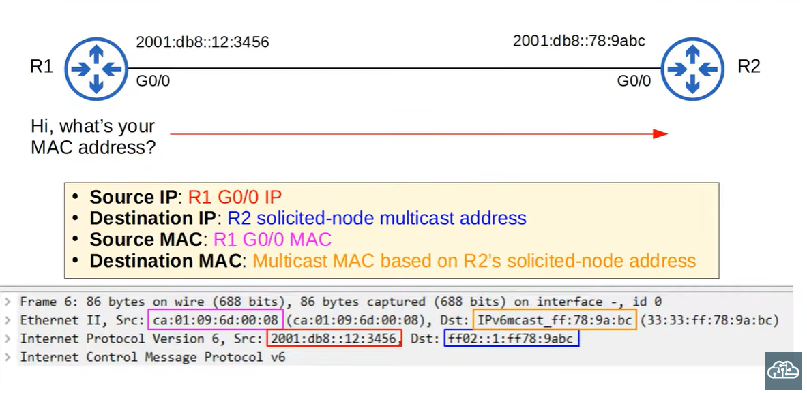

#### NA (Neighbor Advertisement)
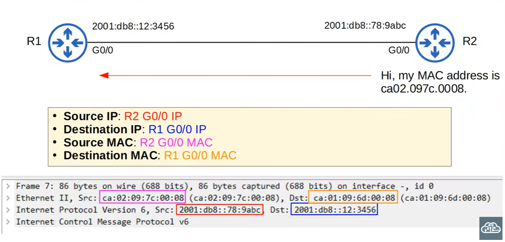

### IPv6 Neighbor Table
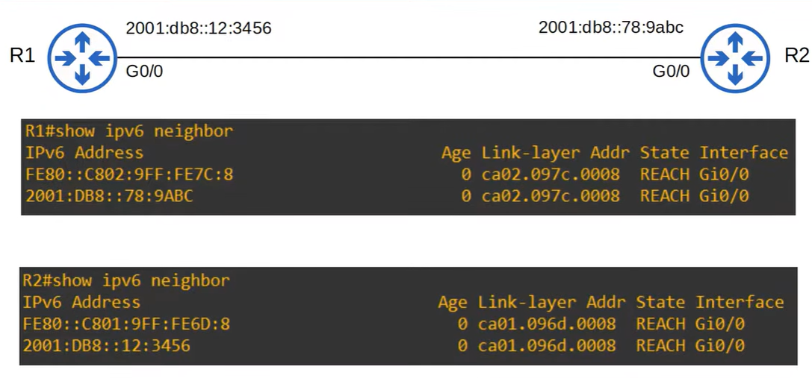

### SLAAC (Stateless Address Autoconfiguration)

SLAAC allows an IPv6 host to automatically configure its own IPv6 address and default gateway using NDP. The host sends a Router Solicitation, receives a Router Advertisement containing the prefix, and then builds its address using either EUI‑64 or a randomly generated interface ID. No DHCPv6 server is required.

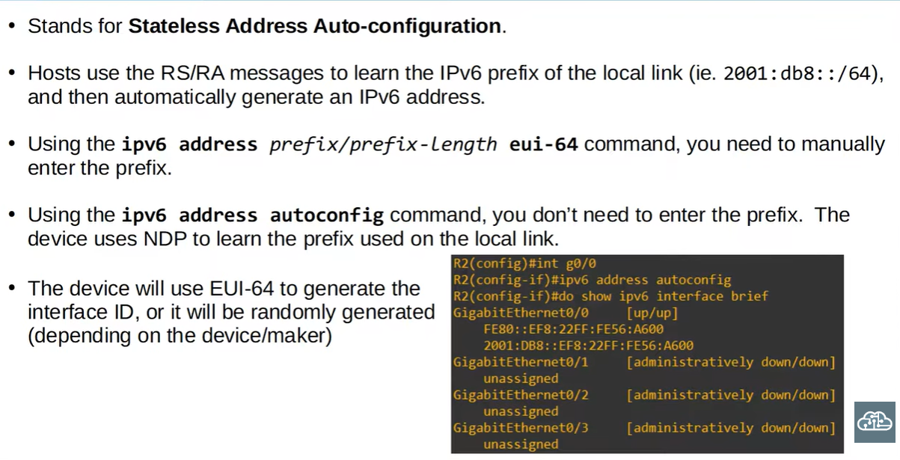

### DAD (Duplicate Address Detection)
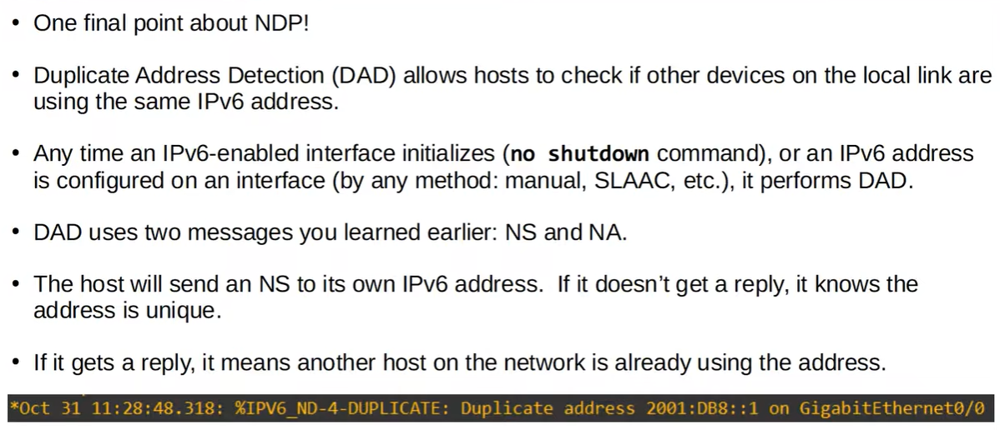

## IPv6 Static Routing
IPv6 static routing works the same way as IPv4, but the routing processes and routing tables are separate. IPv4 routing is enabled by default, while IPv6 routing must be manually enabled with the `ipv6 unicast-routing` command. Without it, a router can send and receive IPv6 traffic but will not forward packets between networks. Static routes are configured in the same way conceptually: you define a destination prefix and either a next-hop IPv6 address or an exit interface.

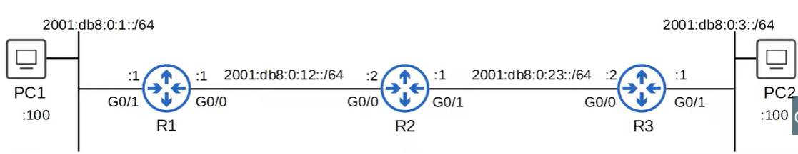

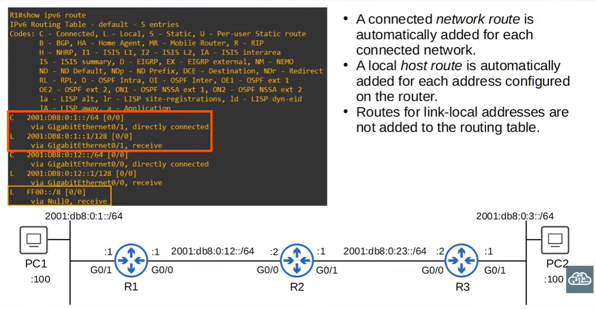

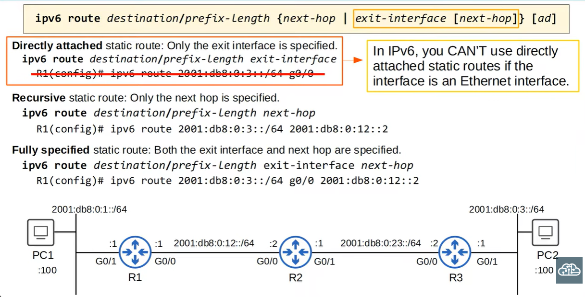

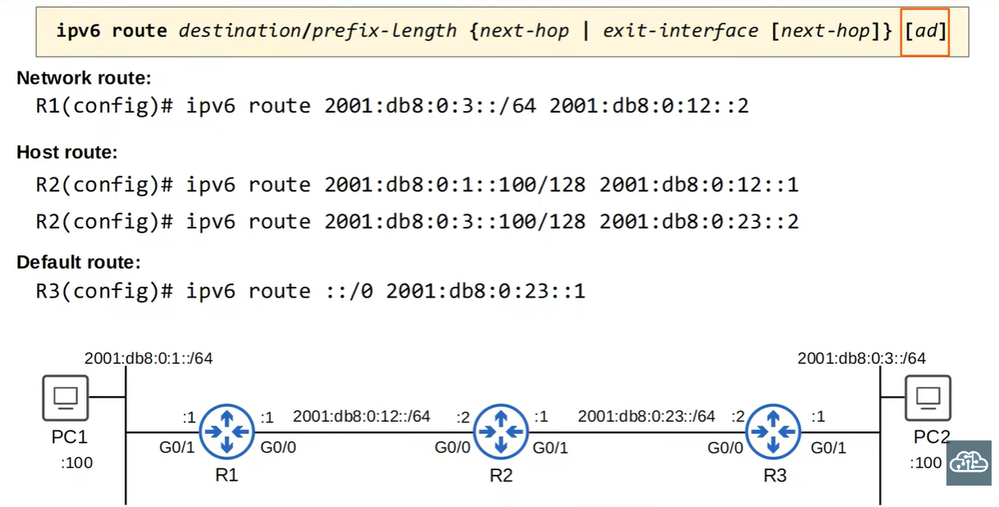

## Link-Local Next-Hops
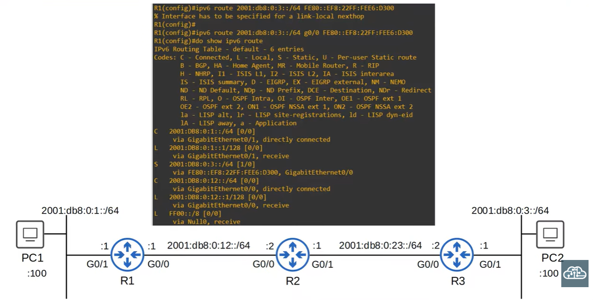

---
## Configuring IPv6 addresses
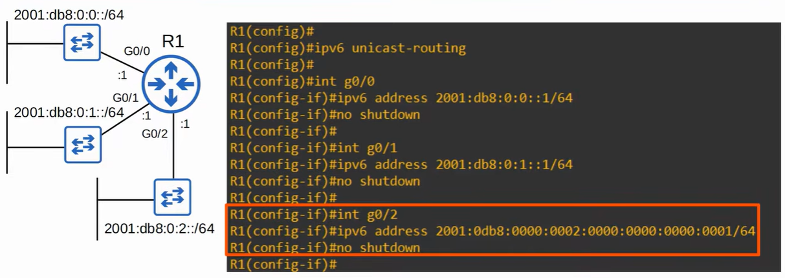
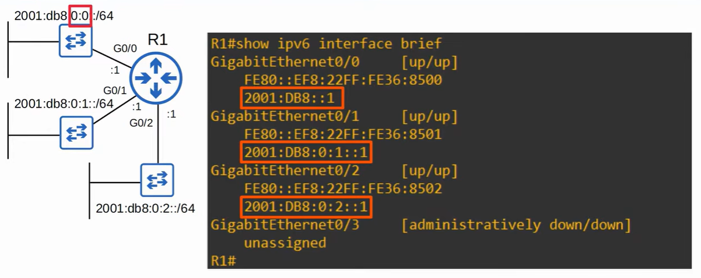

See video (Part 1) at minute 27:50 to 31:00
https://www.youtube.com/watch?v=ZNuXyOXae5U
