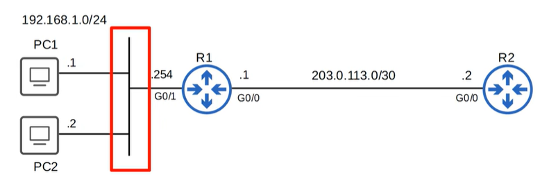
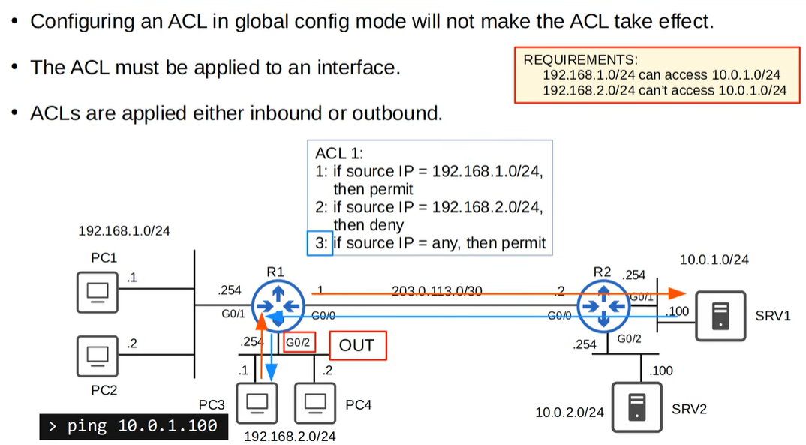
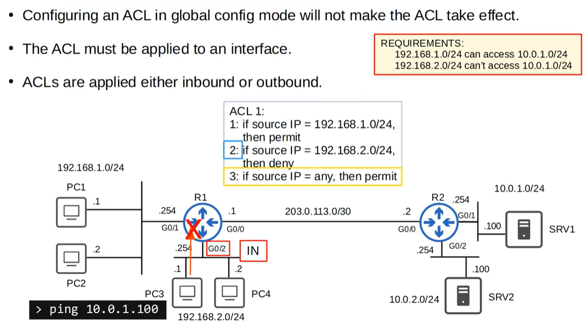
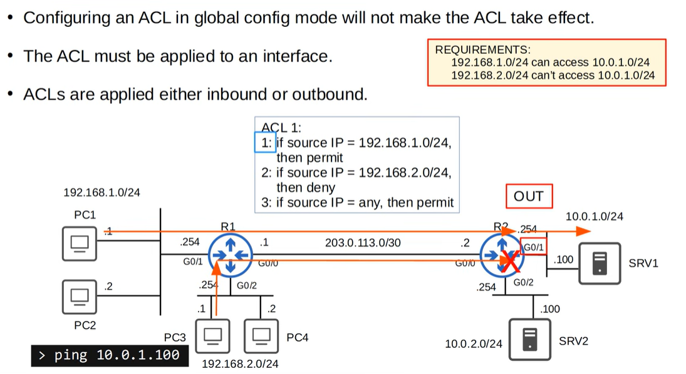
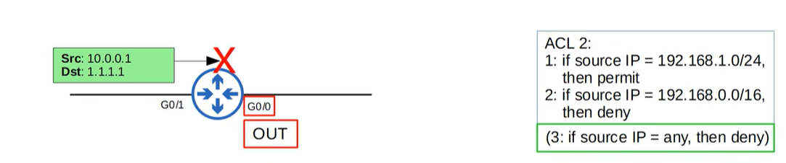

# ACLs

ACLs are a security feature that lets routers and switches permit or deny traffic based on set rules. For CCNA 200-301, focus on the basics: standard vs. extended ACLs, top-down processing, and the implicit deny at the end of every ACL. Focus from security perspective.

- **Jeremy's IT Lab** — [Video - Standard ACLs](https://www.youtube.com/watch?v=z023_eRUtSo)
- **Jeremy's IT Lab** — [Video - Extended ACLs]()

---

## What is ACLs
An Access Control List (ACL) functions as a packet filter, instructing the router to permit or deny specific traffic.
ACLs can filter traffic based on source/destination IP addresses, protocols, and Layer 4 ports.

ACLs are made up of one or more ACEs (Access Control Entries).
An ACE is a single rule that defines what traffic is permitted or denied.

Only one ACL per interface per direction is allowed:

- Inbound: max one ACL 
- Outbound: max one ACL

## How it works

ACLs are made up of one or more ACEs.

> An Access Control Entry (ACE) is an individual rule within an Access Control List (ACL) that defines specific permissions or restrictions for a user, group, or network entity.

> More info at https://www.cisco.com/c/en/us/td/docs/security/asa/asa91/configuration/general/asa_91_general_config/acl_overview.pdf

When a packet arrives at an interface with an ACL applied, the router checks the ACL top‑to‑bottom.
- The first matching ACE determines the action.
- Once a match is found, the router stops processing the ACL.
- All ACEs below the match are ignored.
- If no ACE matches, the packet is implicitly denied (implicit deny any).

Inbound and outbound refer to the direction relative to the router’s interface:

- Inbound: packets entering the router through that interface
- Outbound: packets leaving the router through that interface

## Implicit deny
Will happen if a packet doesn't match any of the entries in an ACL?

There's an implicit deny at the end of all ACLs. It tells the router to deny all traffic that doesn't match any of the configured entries in the ACL.

## ACL types
Standard ACLs
 - **Match based on Source IP address only**
 - Standard numbered ACLs
 - standard named ACLs

Extended ACLs
- **Match based on Source/Destination IP, Source/Destination Port, etc.**
- Extended Numbered ACLs
- Extended Named ACLs

## Standard ACLs
> configuration parts, watch the video "Standard ACLs" from minute 17:50 to 37:40: https://www.youtube.com/watch?v=z023_eRUtSo

Standard ACLs filter traffic **only based on the source IPv4 address**.  
They do not consider destination addresses, protocols, or Layer 4 ports.  
Because of this limited filtering capability, they are simple but less precise than Extended ACLs.

Standard ACLs use the number ranges **1–99** and **1300–1999**.  
Since they only check the source, they should be placed **as close to the destination as possible** to avoid unintentionally blocking traffic from many sources.

A Standard ACL consists of ACEs that permit or deny specific source addresses, often using wildcard masks to match single hosts or address ranges.  
If a packet does not match any ACE, it is blocked by the **implicit deny any** at the end of the ACL.

Standard ACLs can be applied inbound or outbound on an interface, but only **one ACL per direction** is allowed.

### Standard Numbered ACLs
Standard numbered ACLs use the number ranges **1–99** and **1300–1999**.  
They consist of simple permit/deny statements that match only the **source IPv4 address**.

A numbered ACL is created in global configuration mode and applied to an interface in either the inbound or outbound direction.  
Wildcard masks are used to match single hosts or address ranges.

Numbered ACLs are typically placed **as close to the destination as possible** to avoid blocking traffic 

### Standard Named ACLs
Standard named ACLs use a custom name instead of a number.  
They provide the same functionality as numbered ACLs but are easier to read, edit, and manage.

Named ACLs are created using the `ip access-list standard <name>` command, which opens ACL configuration mode.  
Inside this mode, individual ACEs can be added or removed without recreating the entire ACL.

Like all standard ACLs, named ACLs filter **only on the source IPv4 address** and should be placed **near the destination**.

