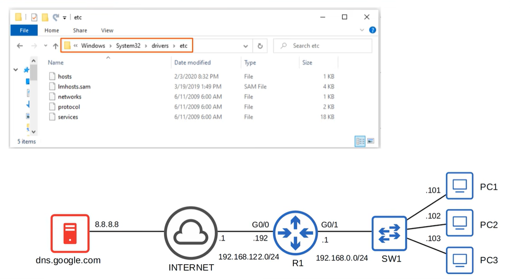

# DNS

DNS (Domain Name System) is a hierarchical naming system that translates human-readable domain names into IP addresses that networks use to route traffic. For CCNA 200-301, focus on the basics: how DNS resolves names through queries and responses, the role of DNS servers, common record types (A, AAAA, CNAME), and how applications rely on DNS to reach services without manually using IP addresses.

- **Jeremy's IT Lab** — [Video](https://www.youtube.com/watch?v=4C6eeQes4cs)

---

## What is DNS?

DNS works by sending a **query** from a client to a DNS server, which returns the **resource record** containing the needed information (usually an IP address).  
If the server does not know the answer, it may perform **recursive** or **iterative** lookups through the DNS hierarchy.

### Key Concepts
- **Name resolution** — converting a domain name into an IP address  
- **Recursive query** — DNS server does all the work on behalf of the client  
- **Iterative query** — DNS server replies with the “best answer it has”  
- **Caching** — speeds up future lookups using TTL values  
- **Record types**  
  - **A** — IPv4 address  
  - **AAAA** — IPv6 address  
  - **CNAME** — alias to another name  
  - **NS** — identifies authoritative name servers  
  - **MX** — mail exchange server  

Applications rely on DNS before any TCP or UDP session is created.

### Common DNS record types
- **A** — IPv4 address  
- **AAAA** — IPv6 address  
- **CNAME** — alias to another hostname  
- **NS** — identifies authoritative name servers for a zone  
- **MX** — mail exchange server for a domain  
- **TXT** — arbitrary text; often used for SPF, DKIM, verification records  
- **PTR** — reverse lookup (IP → name), used in reverse DNS zones  
- **SRV** — service location (host + port for specific services)  
- **SOA** — Start of Authority; primary zone info (primary NS, serial, timers)

## Commands
### Windows
- `nslookup example.com`  
- `ipconfig /displaydns`  
- `ipconfig /flushdns`  
- `Resolve-DnsName example.com` (PowerShell)

### Linux
- `dig example.com`  
- `dig +trace example.com`  
- `host example.com`  
- `systemd-resolve --status`

### Cisco IOS
- `ping example.com` (tests DNS resolution)  
- `show hosts` (DNS cache)  
- `ip name-server <IP>` (configure DNS server)  
- `ip domain-lookup` (enable DNS resolution)

## DNS cache

The DNS cache is a local database that stores recently resolved domain names so your device doesn’t need to query a DNS server every time. This makes name resolution faster, reduces network traffic, and lowers the load on DNS servers.

### Why it matters
- Speeds up repeated lookups  
- Reduces latency for applications  
- Lowers DNS traffic on the network  
- Can cause issues if cached entries become outdated

### Clearing the DNS cache
**Windows:**  
`ipconfig /flushdns`

**Linux:**  
`systemd-resolve --flush-caches`  
or restart the local resolver (e.g., dnsmasq)

**Cisco IOS:**  
`show hosts` (view cache)  
Cache clears automatically when entries expire

## Hostfile

A hosts file is a small local text file on a computer that manually maps specific domain names to IP addresses, bypassing DNS. When a user enters a hostname, the operating system checks the hosts file first; if a match exists, it uses that IP immediately without sending any DNS queries. This makes the hosts file a simple, static override mechanism for name resolution, useful for testing, blocking domains, or forcing a device to resolve a hostname in a specific way.

---
## Configurations and Demo's
See demo's and configuration in the video!
Video: https://www.youtube.com/watch?v=4C6eeQes4cs