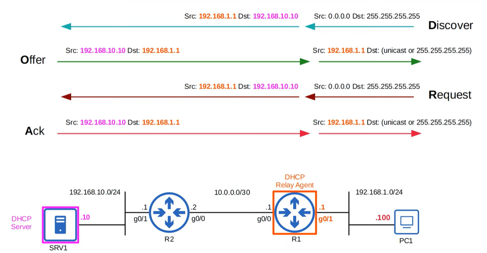

# DHCP

DHCP (Dynamic Host Configuration Protocol) is a network service that automatically assigns IP configuration to devices on a network. For CCNA 200-301, focus on the basics: the DHCP DORA process (Discover, Offer, Request, Acknowledge), how clients obtain IP addresses dynamically, and the role of DHCP servers in centralizing and simplifying network configuration.

- **Jeremy's IT Lab** — [Video](https://www.youtube.com/watch?v=hzkleGAC2_Y)

---

## Purpose of DHCP
DHCP’s purpose is to automatically provide devices with all essential network configuration settings such as IP address, subnet mask, default gateway and DNS server so that hosts can join and operate on the network without manual setup, reducing configuration errors and keeping the network consistent.

## Basic Functions of DHCP
See video from minute 3:45 to 7:30.
https://www.youtube.com/watch?v=hzkleGAC2_Y

DHCP provides four core functions that allow devices to join a network automatically: it assigns an IP address to each host, gives the correct subnet mask so the device knows which network it belongs to, provides the default gateway so traffic can leave the local network, and supplies the DNS server address so hostnames can be resolved. These settings are delivered dynamically from a central DHCP server, which removes the need for manual configuration and ensures consistent, error‑free network setup across all clients.

## DHCP Message Exchange
DHCP D-O-R-A table:

| Message   | Direction           | Broadcast / Unicast |
|-----------|----------------------|----------------------|
| Discover  | Client → Server     | Broadcast            |
| Offer     | Server → Client     | Broadcast or Unicast |
| Request   | Client → Server     | Broadcast            |
| Ack       | Server → Client     | Broadcast or Unicast |

### DHCP Release
The client sends a Release message to inform the DHCP server that it is giving up its assigned IP address. This allows the server to return the address to the available pool.

### DHCP Discover
The client sends a Discover message to search for any available DHCP servers on the network. This message is broadcast because the client does not yet have an IP address.

### DHCP Offer
A DHCP server replies with an Offer message that contains an available IP address and the configuration parameters the client may use. This message can be broadcast or unicast depending on the server and network.

### DHCP Request
The client sends a Request message to indicate that it accepts the offered IP address and wants the server to assign it. This message is broadcast so all servers know which offer was chosen.

### DHCP Ack
The DHCP server sends an Ack message to confirm that the IP address is officially assigned to the client. The message also includes the final configuration settings the client must apply.

### DHCP Relay
A DHCP relay is a device, usually a router or Layer 3 switch, that forwards DHCP messages between clients and a DHCP server when they are not on the same local network. The relay receives the client’s broadcast Discover message, adds its own interface address to indicate the client’s subnet, and sends the request as a unicast packet to the DHCP server. This allows a single central DHCP server to serve multiple remote networks without requiring a server on each subnet.

---
## Configuration
Video DHCP: https://www.youtube.com/watch?v=hzkleGAC2_Y
- DHCP Server Config in IOS [minute 21:35]
- DHCP Relay Agent Config in IOS [minute 25:45]
- DHCP Client Config [minute 26:50]