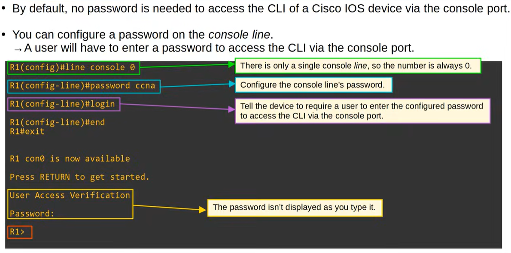
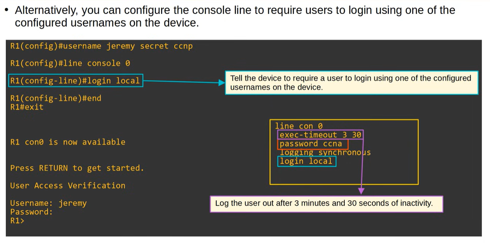
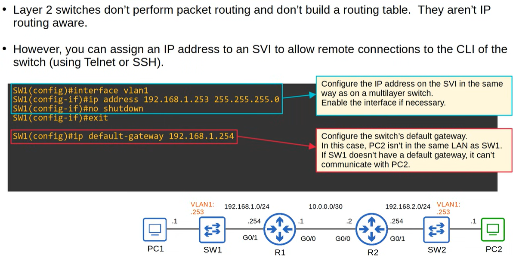
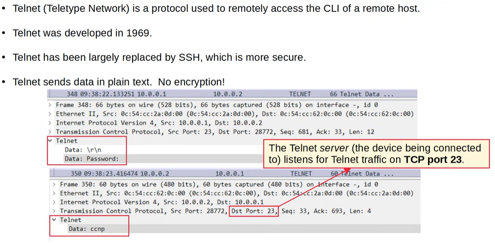
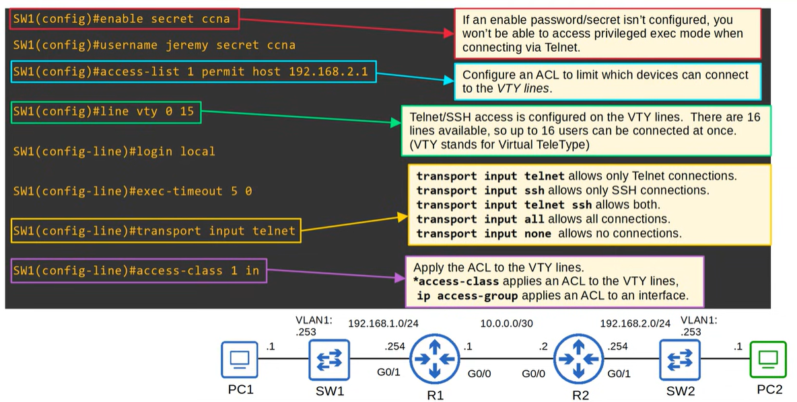
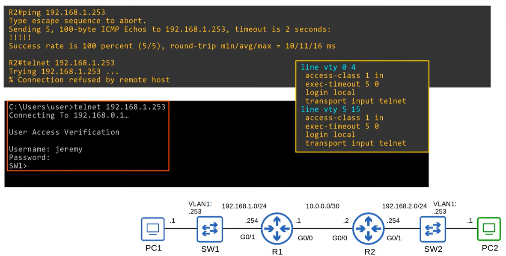

# SSH

SSH (Secure Shell) is a secure network protocol used to remotely access and manage devices over an encrypted connection. For CCNA 200-301, focus on the basics: how SSH provides secure CLI access compared to Telnet, the role of encryption and authentication, and how it is used for remote device configuration and administration in enterprise networks.

- **Jeremy's IT Lab** — [Video](https://www.youtube.com/watch?v=AvgYqI2qSD4)

---
## Console Port Security
### Console Port Security - LOGIN

### Console Port Security - LOGIN LOCAL

## L2 Switch - Management IP

## Telnet

### Telnet Configuration

---

## SSH (Secure Shell)

SSH is a secure remote‑access protocol created in 1995 to replace insecure protocols like Telnet. A shell is a program that exposes operating system functions to a user, either through a command‑line interface or a graphical interface. SSH provides encrypted and authenticated remote access, protecting credentials and data from being intercepted. SSHv2, released in 2006, is the modern and secure version, and devices that support both versions identify themselves as version 1.99. An SSH server listens on TCP port 22, and all traffic between client and server is encrypted, as shown in packet captures where payload data is unreadable.

### Configuration
See video at minute 14:45 to 21:45.
https://www.youtube.com/watch?v=AvgYqI2qSD4
