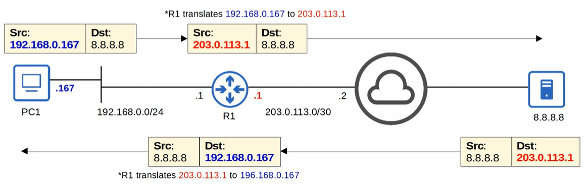
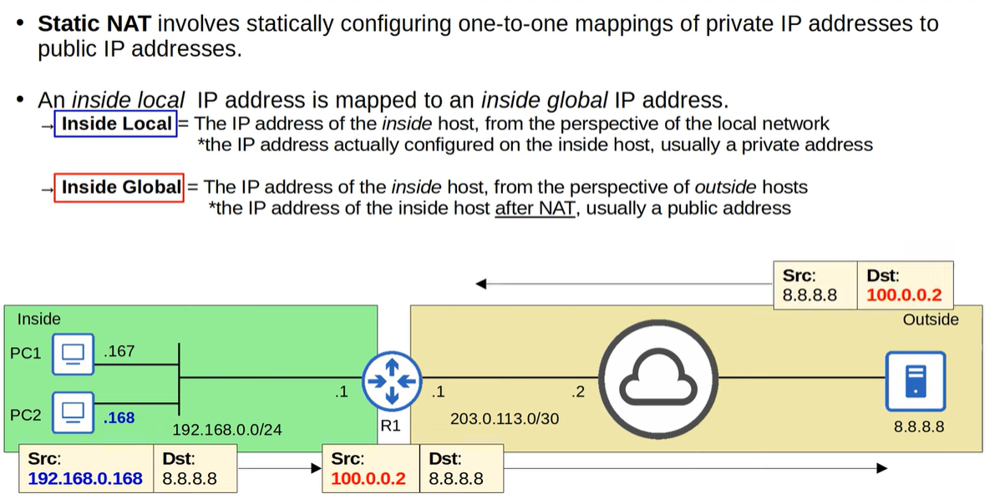
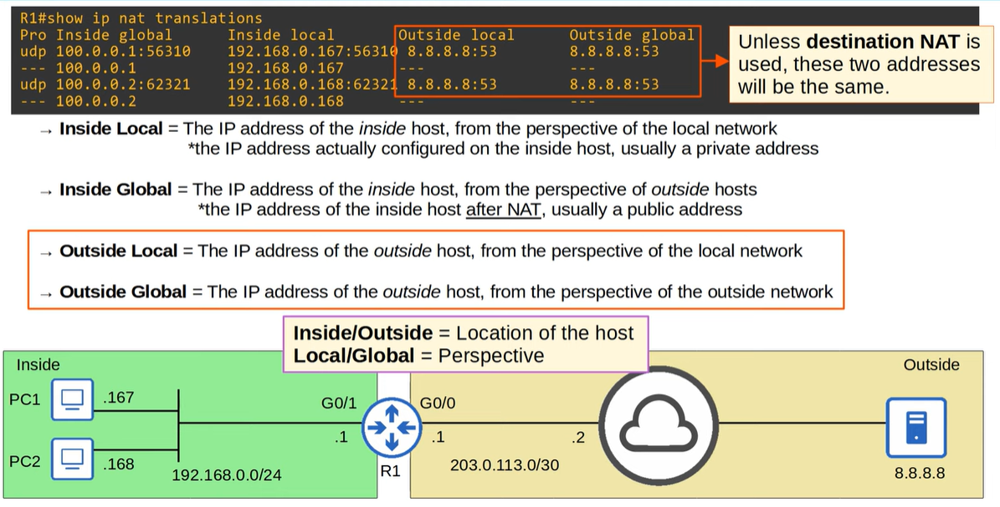
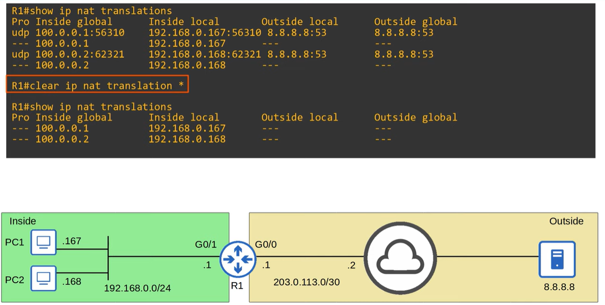
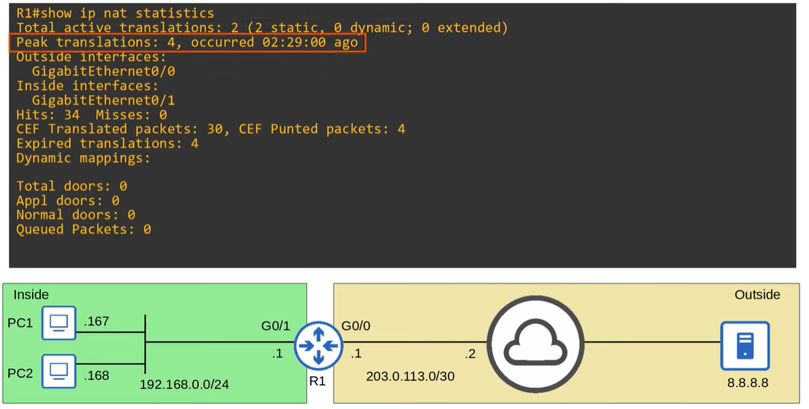
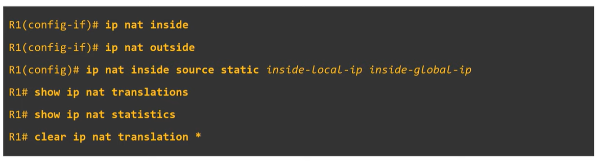
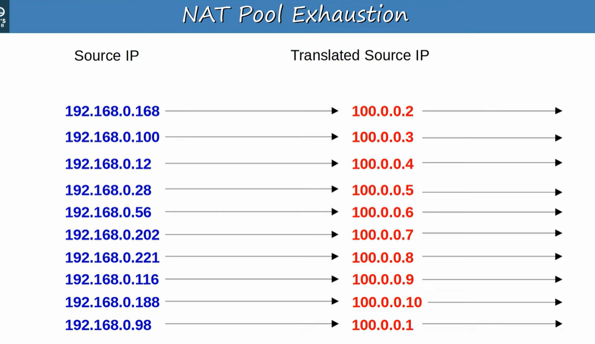
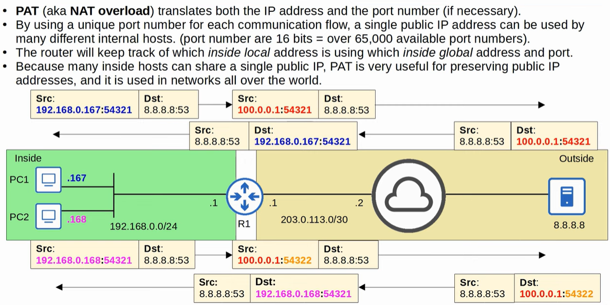

# NAT

Network Address Translation (NAT) is a technique used to translate private IP addresses into public IP addresses so devices inside a local network can access external networks like the internet. For CCNA 200-301, focus on the basics: static NAT, dynamic NAT, and PAT (Port Address Translation), how NAT conserves public IPv4 addresses, and how translation tables map internal to external traffic.

- **Jeremy's IT Lab** — [Video Part 1](https://www.youtube.com/watch?v=2TZCfTgopeg)
- **Jeremy's IT Lab** — [Video Part 2](https://www.youtube.com/watch?v=kILDNs4KjYE)

---
## Private IPv4 Addressing (RFC 1918)

Private IPv4 addresses are special address ranges defined by **RFC 1918** for use inside private networks. These addresses are **not routable on the public Internet**, meaning Internet routers will drop any traffic sourced from them. They allow organizations to build internal networks without consuming globally unique IPv4 space.

### Why private IPv4 exists
IPv4 provides only about **4.3 billion addresses**, which is not enough for all modern devices.  
To slow down IPv4 exhaustion, three short‑term solutions were introduced:

1. **CIDR** – more efficient allocation of IPv4  
2. **Private IPv4 addresses** – reusable internal ranges  
3. **NAT** – translate private ↔ public addresses for Internet access

The long‑term solution remains **IPv6**.

### RFC 1918 Private Address Ranges
These ranges can be used freely inside any private network and do not need to be globally unique:

- **10.0.0.0/8**  
  Range: 10.0.0.0 – 10.255.255.255 (Class A)

- **172.16.0.0/12**  
  Range: 172.16.0.0 – 172.31.255.255 (Class B)

- **192.168.0.0/16**  
  Range: 192.168.0.0 – 192.168.255.255 (Class C)

### Key Characteristics
- Free to use inside private networks  
- Can be reused across companies, homes, labs  
- **Not routable on the Internet**  
- Require **NAT** to reach public networks  
- Often used for LANs, enterprise networks, and home routers

### Problems with private addressing
From the slides:

1. **Duplicate addresses**  
   Different organizations may use the same private ranges, causing conflicts when networks merge (VPNs, acquisitions, etc.).

2. **No direct Internet access**  
   Private IPs cannot be used on the Internet, so devices must use **NAT** to communicate externally.

### Example (from ipconfig output)
A host using a private address:

- IPv4 Address: **192.168.0.167**  
- Subnet Mask: 255.255.255.0  
- Default Gateway: 192.168.0.1  

This is valid inside the LAN but **cannot be routed on the Internet** without NAT.

### Summary
Private IPv4 addressing is essential for conserving IPv4 space, enabling internal networks, and supporting NAT. It solves IPv4 exhaustion in the short term but introduces challenges like duplicate addressing and the need for translation to reach the public Internet.

## Network Address Translation (NAT)

Network Address Translation (NAT) is used to modify the **source** and/or **destination** IP addresses of packets as they pass through a router.  
The most common use case is allowing hosts with **private IPv4 addresses** to communicate with hosts on the **public Internet**.

For the CCNA, you must understand **source NAT** and how to configure it on Cisco routers.

### Why NAT is needed
Devices inside a LAN often use **private IPv4 addresses** (RFC 1918).  
These addresses **cannot be routed on the Internet**, so a router must translate them into a **public IPv4 address** before sending traffic out.

NAT solves:
- Private → Public communication  
- IPv4 address shortage  
- Security through basic hiding of internal addresses  

### Source NAT (SNAT)

Source NAT changes the **source IP address** of outgoing packets.  
When the return traffic comes back, NAT reverses the translation.

### Example Topology
- PC1: **192.168.0.167** (private)  
- R1 inside interface: **192.168.0.1**  
- R1 outside interface: **203.0.113.1** (public)  
- External server: **8.8.8.8**

LAN: **192.168.0.0/24**  
WAN: **203.0.113.0/30**

### Outgoing Packet (LAN → Internet)

**Original packet from PC1:**
- Src: **192.168.0.167**  
- Dst: **8.8.8.8**

**R1 performs source NAT:**
- Translates **192.168.0.167 → 203.0.113.1**

**Packet after NAT:**
- Src: **203.0.113.1**  
- Dst: **8.8.8.8**

This allows the packet to be routed over the Internet.

### Incoming Packet (Internet → LAN)

**Original return packet:**
- Src: **8.8.8.8**  
- Dst: **203.0.113.1**

**R1 reverses the translation:**
- Translates **203.0.113.1 → 192.168.0.167**

**Packet after NAT:**
- Src: **8.8.8.8**  
- Dst: **192.168.0.167**

This sends the reply back to the correct internal host.

### Summary
- NAT modifies IP addresses in packets.  
- Source NAT is used to allow private hosts to reach the Internet.  
- Router keeps a translation table to map private ↔ public addresses.  
- Outgoing packets: private → public  
- Incoming packets: public → private  
- Essential for networks using RFC 1918 private addressing.

## Static NAT

> Static NAT allows devices with private IP addresses to communicate over the internet. However, because it requires a one-to-one IP address mapping, it doesn't help preserve IP addresses.

### Static NAT configuration
See video at minute 15:00
https://www.youtube.com/watch?v=2TZCfTgopeg

## Cisco NAT Termonology
`show ip nat translations`

`clear ip nat translation *`

`show ip nat statistics`

## Overview commands

---

## Dynamic NAT

Dynamic NAT allows a router to **dynamically map** *inside local* addresses to *inside global* addresses **as needed**.  
Unlike static NAT, the mappings are created **on demand** and removed when no longer used.

### How Dynamic NAT Works
- The router checks an **ACL** to determine which inside hosts are allowed to be translated.  
  - If the source IP is **permitted**, NAT will translate it.  
  - If the source IP is **denied**, NAT will **not** translate it — but the traffic is **not dropped**.  
    (It simply goes out without NAT, and will likely be dropped by upstream routers.)

- A **NAT pool** defines the available *inside global* addresses that can be assigned dynamically.

- Even though the assignment is dynamic, the mapping is still **one‑to‑one**:  
  one *inside local* ↔ one *inside global*.

### NAT Pool Exhaustion
If all addresses in the NAT pool are currently in use:

- The router **drops new packets** that require NAT.  
- The inside host **cannot reach outside networks** until a pool address becomes free.  
- Dynamic NAT entries **time out automatically** when idle.  
- You can also clear them manually using  
  `clear ip nat translation *`.

### Example (from the diagram)
Inside network: **192.168.0.0/24**  
NAT pool: **100.0.0.1 – 100.0.0.10**

ACL 1:
- permit 192.168.0.0/24  
- deny any  

If PC1 sends traffic:
- Inside local: **192.168.0.167**  
- Router assigns inside global: **100.0.0.1**  
- Packet becomes:  
  - Src: 100.0.0.1 → Dst: 8.8.8.8  

Return traffic:
- Src: 8.8.8.8 → Dst: 100.0.0.1  
- NAT translates back to:  
  - Dst: **192.168.0.167**

### Summary
- Dynamic NAT uses an **ACL** to match inside hosts.  
- Uses a **pool** of public addresses.  
- Creates **temporary one‑to‑one** mappings.  
- Fails when the pool is exhausted.  
- Entries expire automatically or can be cleared manually.

### NAT Pool Exhaustion

### Dynamic NAT configuration
See video at minute 9:00
https://www.youtube.com/watch?v=kILDNs4KjYE

## PAT (NAT overload)

### PAT configuration
See video at minute 15:40 to 20:20
https://www.youtube.com/watch?v=kILDNs4KjYE

