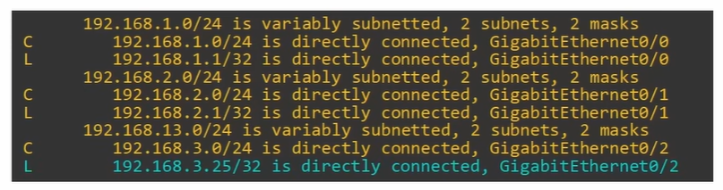
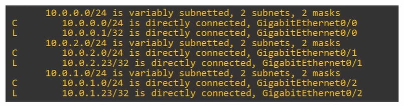

# Quiz: Routing Fundamentals
## Quiz 1
The IP address configured on a router interface will appear in the routing table as what kind of route?

A) static
B) connected
C) local
D) dynamic

### Anwser
anwser is C.

### Explanation
When you configure an IP address on a router interface, the router automatically creates **two routes**:

1. **Connected route (C)**  
   - This represents the *entire network* the interface belongs to.  
   - Example: `192.168.1.0/24 is directly connected`

2. **Local route (L)**  
   - This represents the *exact IP address* assigned to the interface.  
   - Always a **/32** host route.  
   - Example: `192.168.1.1/32 is directly connected`

The question asks specifically about **the IP address configured on the interface**, not the network.  
That exact IP appears as a **local (L)** route.

---
## Quiz 2
Examine R1's routing table. What will it do when it recieives a packet destined for 192.168.3.25?

A) it will drop the packet
B) it will receive the packet for itself.
C) it will forward the packet out of the G0/0 interface.
D) it will forward the packet out of the G0/2 interface.

### Anwser
anwser is B.

### Explanation
In the routing table, the router has two entries for each connected network:

- A **Connected (C)** route for the entire subnet  
  Example: `192.168.3.0/24 is directly connected`
- A **Local (L)** route for the router’s **own interface IP**  
  Example: `192.168.3.25/32 is directly connected`

A **local route (/32)** represents the exact IP address configured on the router’s interface.

Since the destination **192.168.3.25** matches the router’s **local route**, the router does **not** forward the packet.  
It **receives** and processes the packet **locally**, because the packet is addressed **to the router itself**.

/32 is 0 hostbits (32 - 32 = 0)

---

## Quiz 3
Which of the follwing statements about the behaviour of routers and switches are true?
(select two)

A) routers flood packets with an unknown destination
B) switches flood frames with an unknown dest.
C) routers drop packets with an unknown dest.
D) switches drop frames with an unknown dest.

### Anwser
anwser is B and C

### Explanation
- Switches flood unknown **MAC** destinations  
- Routers drop unknown **IP** destinations  
- Routers don't flood and switches don't drop packets

---

## Quiz 4
Which two types of routes are automatically added to the routing table when you configure an IP address on an interface and enable it?

A) C, L  
B) C, S  
C) L, S  
D) L, D  

### Answer
A) **C, L**

### Explanation
When you configure an IP address on a router interface and then enable the interface (`no shutdown`), the router automatically creates **two routes**:

1. **Connected route (C)**  
   - Represents the **entire network** the interface belongs to  
   - Example: `C 192.168.1.0/24 is directly connected`

2. **Local route (L)**  
   - Represents the **exact IP address** assigned to the interface  
   - Always a **/32** host route  
   - Example: `L 192.168.1.1/32 is directly connected`

These two routes appear **without any manual configuration**.  
Static routes (S) and dynamic routes (D) require manual configuration or a routing protocol.

---

## Quiz 5
Examine R1’s routing table. If R1 receives a packet destined for **10.0.1.23**, how many routes match that destination?  
And which is the **most specific** matching route?

A) One matching route: 10.0.1.0/24  
B) One matching route: 10.0.1.23/32  
C) Two matching routes: 10.0.1.0/24, 10.0.1.23/32. Most specific: 10.0.1.23/32  
D) Two matching routes: 10.0.1.0/24, 10.0.1.23/32. Most specific: 10.0.1.0/24  

### Answer
C) **Two matching routes: 10.0.1.0/24 and 10.0.1.23/32. Most specific: 10.0.1.23/32**

### Explanation
When a router receives a packet, it checks the routing table for **all routes that match the destination IP**.  
For destination **10.0.1.23**, two entries match:

1. **Connected route (C)**  
   - `10.0.1.0/24`  
   - Matches all addresses from 10.0.1.0 to 10.0.1.255

2. **Local route (L)**  
   - `10.0.1.23/32`  
   - Matches **exactly one address**: 10.0.1.23  
   - This is the router’s **own interface IP**

Both routes match, but routers always choose the **longest prefix match** — the most specific route.

- /24 → 24 bits match  
- /32 → 32 bits match → **more specific**

Therefore, the router selects **10.0.1.23/32**, meaning the packet is **for the router itself**.

---

# Quiz: Static Routing
## Quiz 6
Which of the following commands configures a default route on a Cisco router?

A) ip route 0.0.0.0 0.0.0.0 10.1.1.255  
B) ip route 0.0.0.0/0 10.1.1.254  
C) ip route 0.0.0.0 255.255.255.255 10.1.1.255  
D) ip route 0.0.0.0/32 10.1.1.255  

### Answer
A

### Explanation
A default route must use:
- **destination:** 0.0.0.0  
- **mask:** 0.0.0.0  

Only option A uses the correct syntax for a Cisco IOS static default route.

## Quiz 7
Examine R1’s routing table. Which interface will it use to forward packets destined for 8.8.8.8?

A) GigabitEthernet0/0  
B) GigabitEthernet0/1  
C) GigabitEthernet0/2  
D) It will drop the packet  

### Answer
C

### Explanation
8.8.8.8 does not match any specific static or connected route.  
Therefore the router uses the **default route (0.0.0.0/0)**, which points **via 203.0.113.2**, located on **GigabitEthernet0/2**.

## Quiz 8
Complete the static routes needed so PC1 and PC4 can communicate.

### R1
- Destination: 192.168.1.0/24 → Connected  
- Destination: 192.168.4.0/24 → Next-hop: 192.168.12.2 (toward R2) **or** 192.168.13.3 (toward R3)

### R2
- Destination: 192.168.1.0/24 → Next-hop: 192.168.12.1  
- Destination: 192.168.4.0/24 → Next-hop: 192.168.24.4  

### R4
- Destination: 192.168.4.0/24 → Connected  
- Destination: 192.168.1.0/24 → Next-hop: 192.168.24.2 (via R2) **or** 192.168.34.3 (via R3)

### Answer
Static routes must be configured on **R1, R2, and R4** so each router knows both end networks (192.168.1.0/24 and 192.168.4.0/24).

### Explanation
Each router must know:
- the network of PC1 (192.168.1.0/24)
- the network of PC4 (192.168.4.0/24)

R3 is not included in the table because the quiz only asked for R1, R2, and R4.

## Quiz 9
Examine the static route in R1’s routing table:

`S 172.20.0.0/16 is directly connected, GigabitEthernet0/1`

Which command configured this route?

A) ip route 172.20.0.0 255.255.255.0 g0/1  
B) interface g0/1 → ip address 172.20.0.0 255.255.0.0  
C) ip route 172.20.0.0 255.255.255.0 g0/1 172.20.0.1  
D) ip route 172.20.0.0 255.255.0.0 g0/1  

### Answer
D

### Explanation
The routing table shows:
- **S** = static route  
- **/16** = 255.255.0.0  
- **directly connected, g0/1** = exit interface only  

Only option D matches all three details.

## Quiz 10
How many static routes must be configured on R3 so it knows all other destination networks?

A) One route  
B) Two routes  
C) Three routes  
D) Four routes  

### Answer
D

### Explanation
R3 already knows its **directly connected** networks:

- 192.168.13.0/24 (R1–R3 link)  
- 192.168.34.0/24 (R3–R4 link)  

R3 must learn **all other networks** in the topology:

1. 192.168.1.0/24 — PC1’s LAN behind R1  
2. 192.168.12.0/24 — R1–R2 link  
3. 192.168.24.0/24 — R2–R4 link  
4. 192.168.4.0/24 — PC4’s LAN behind R4  

That makes **4 remote networks**, so R3 needs **4 static routes**.