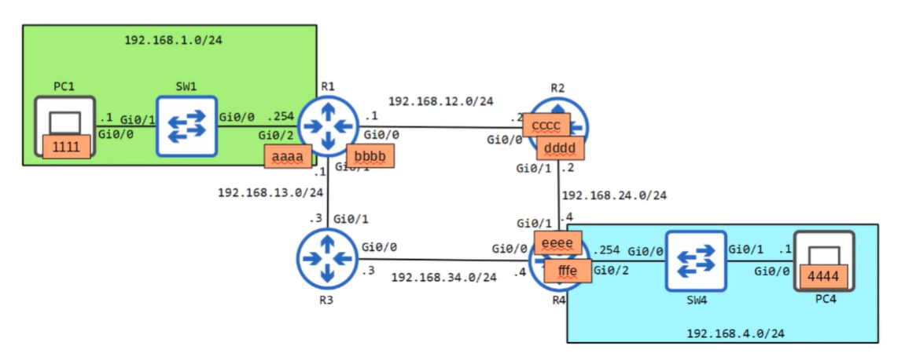

# Quiz
## Quiz 1
PC4 sends a packet to PC1. What is the destination MAC address when it is sent from PC4's network interface?

### Answer
**The destination MAC address is fffe.**
(the one on interface Gi0/2)

### Explanation
PC4 (in network 192.168.4.0/24) wants to send a packet to PC1 (in 192.168.1.0/24).  
Because the destination is **outside the local network**, PC4 must send the frame to its **default gateway**, which is **R4**.

On PC4’s LAN, the router R4 has MAC address **fffe**.  
Therefore:

- **Src MAC:** 4444 (PC4)  
- **Dst MAC:** fffe (**R4**, the default gateway)

A host *always* sends frames for remote networks to the **MAC address of its default gateway**, not to the final destination.

---

## Quiz 2
PC4 sends a packet to PC1. What is the source MAC address when it is received on R1's Gi0/0 interface?

### Answer
**The source MAC address is cccc.**

### Explanation
When PC4 sends a packet to PC1, it travels PC4 → R4 → R2 → R1 → PC1.

On the link between R2 and R1 (192.168.12.0/24):

- R2’s interface has MAC **cccc**
- R1’s interface has MAC **bbbb**

R2 sends the Ethernet frame to R1 with:

- Src MAC: **cccc** (R2)
- Dst MAC: **bbbb** (R1)

So when the frame is received on R1’s interface, the **source MAC address is cccc**.

---

## Quiz 3
PC4 sends a packet to PC1. What is the source MAC address when it is received on SW1's Gi0/1 interface?

### Answer
**The source MAC address is aaaa.**

### Explanation
When the packet travels from PC4 → R4 → R2 → R1 → SW1 → PC1, the frame that arrives on **SW1’s Gi0/1 interface** comes **from R1**.

On the link between R1 and SW1 (192.168.1.0/24):

- R1’s interface (Gi0/0) has MAC **aaaa**
- PC1 has MAC **1111**

R1 sends the frame toward PC1 with:
- **Src MAC:** aaaa (R1)
- **Dst MAC:** 1111 (PC1)

Therefore, when SW1 receives the frame on Gi0/1,  
the **source MAC address is aaaa**.

---
## Quiz 4
PC4 sends a packet to PC1. What is the destination IP address when it is sent from R4's Gi0/1 interface?

### Answer
**The destination IP address is 192.168.1.1 (PC1).**

### Explanation
When R4 forwards the packet out of its Gi0/1 interface toward R2, it builds a new Ethernet frame, but it does **not** change the IP header.

- The **destination MAC address** becomes the MAC of R2 (next hop).
- The **destination IP address** stays the same: **192.168.1.1**, which is PC1.

Routers change **MAC addresses per hop**,  
but the **source and destination IP addresses remain end-to-end** from PC4 to PC1.

---

## Quiz 5
PC4 sends a packet to PC1. What is the source IP address when it is received on R1's Gi0/0 interface?

### Answer
**The source IP address is 192.168.4.1 (PC4).**

### Explanation
Routers change the **MAC addresses** at every hop, but the **IP header stays the same** from the sender to the final destination.

So even when the packet reaches R1’s Gi0/0 interface, the IP header still contains:
- Source IP: **192.168.4.1** (PC4)
- Destination IP: **192.168.1.1** (PC1)

IP addresses do not change during routing.