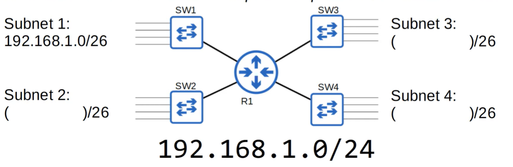
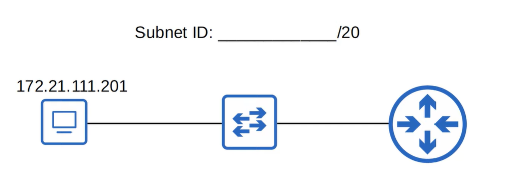
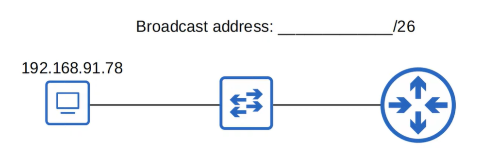

# Quiz: Subnetting
## Quiz 1 (modern subnetting)
The first subnet (subnet 1) is 192.168.1.0/26. What are the remaining subnets?

HINT: Find the broadcast address of subnet 1. The next address is the network address of subnet 2. Repeat the process for subnet 3 and 4.

### Anwser
- Subnet 1: 192.168.1.0/26
- Subnet 2: 192.168.1.64/26
- Subnet 3: 192.168.1.128/26
- Subnet 4: 192.168.1.192/26

### Explanation

- 
/26 means there are 64 IP addresses per subnet (2^6=64).

- Start with Subnet 1: 192.168.1.0/26
- Range: 192.168.1.0–192.168.1.63 → broadcast = 192.168.1.63

The next IP after the broadcast is the next subnet’s network address:
- Subnet 2 network: 192.168.1.64 → range 64–127 → broadcast 127
- Subnet 3 network: 192.168.1.128 → range 128–191 → broadcast 191
- Subnet 4 network: 192.168.1.192 → range 192–255 → broadcast 255

---

## Quiz 2 
You have been given the 172.30.0.0/16 network. Your company requires 100 subnets with at least 500 hosts per subnet. What prefix length should you use?

### Anwser

Prefix is /23

### Explanation
borrowed bits: 6 gives 2^6 = 64 subnets and 7 gives 2^7 = 128 subnets (28 subnets not in use).

32 (total bits) - 16 (network bits) = 16 (host bits)

16 hostbits - 7 bits we take from the 16 hostbits is 9 bits left for hosts.

2^9 = 512 combinations or addresses.
2 addresses goes towards network address and broadcast address.

510 usable addresses are over per subnet. 
We can have 500 hosts per subnet and each subnet has 10 leftover.

prefix is 16 (original amount of bits for the network) + 7 (bits we take for creating subnets) = 23

---
## Quiz 3
What subnet does host 172.21.111.201/20 belong to?

### Anwser
172.21.96.0/20

### Explanation
172.21.111.201
to binary is
10101100.00010101.01101111.11001001

/20 - 4 (bits for netmasks) = /16 (original netmask, 16 is one of the standard netmasks)

network: **10101100.00010101**.00000000.00000000
network + extra 4 bits:
**10101100.00010101.011**00000.00000000
towards dotted decimal is 172.21.96.0

why? Because the subnet address is where hosts are all put on 0's.

---
## Quiz 4
What is the broadcast address of the network?
192.168.91.78/26 belongs to?

### Anwser
192.168.91.127/26

### Explanation
192.168.91.78
to binary is 
11000000.10101000.01011011.01001110

/26 comes close to /24 (one of the standard netmasks)

so 2 bits for subnets are taken.
network: **11000000.10101000.01011011**.00000000
network + subnet = **11000000.10101000.01011011.01**000000

hostbits to 1's all is the broadcast address.
**11000000.10101000.01011011.01**111111
to dotted decimal:
192.168.91.127

---
## Quiz 5
You divide 172.16.0.0/16 network into 4 subnets of equal size.
Identify the network and broadcast addresses of the second subnet.

### Anwser
172.16.64.0

### Explanation
4 subnets means combination of 2^2=4
2 bits for subnets reserved.

172.16.0.0
10101100.00010000.00000000.00000000
network (16 bits): **10101100.00010000**.00000000.00000000
network (16) + subnets (2) = **10101100.00010000.00**000000.00000000

- first subnet:
**10101100.00010000.00**000000.00000000
- second subnet:
**10101100.00010000.01**000000.00000000
to dotted decimal is 172.16.64.0
- third subnet:
**10101100.00010000.10**000000.00000000
- fourth subnet:
**10101100.00010000.11**000000.00000000

---
## Quiz 6
You divide the 172.30.0.0/16 network into subnets of 1000 hosts each. How many subnets are you able to make?

### Anwser

64 subnets

### Explanation
netmask of 16 means 16 bits towards network
32 - 16 = 16 bits towards hosts

Way to look at it is:
16 bits is 2^16 = 65536 hosts
15 bits is 2^15 = ...
...

So, logically:
10 bits is 2^10 = 1022 hosts
(close to 1000 hosts per subnet)

6 bits remaining for subnets meaning:

2^6 = 64 subnets