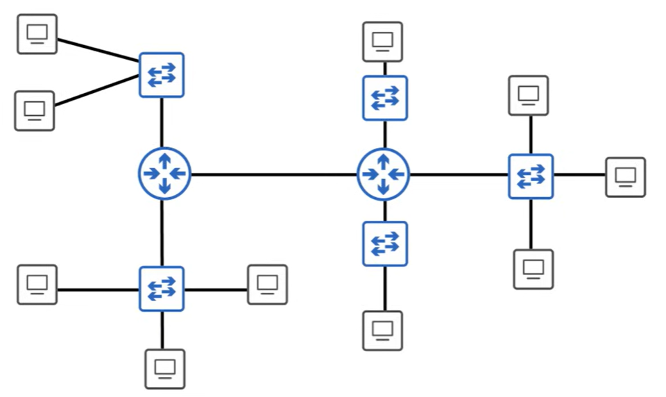
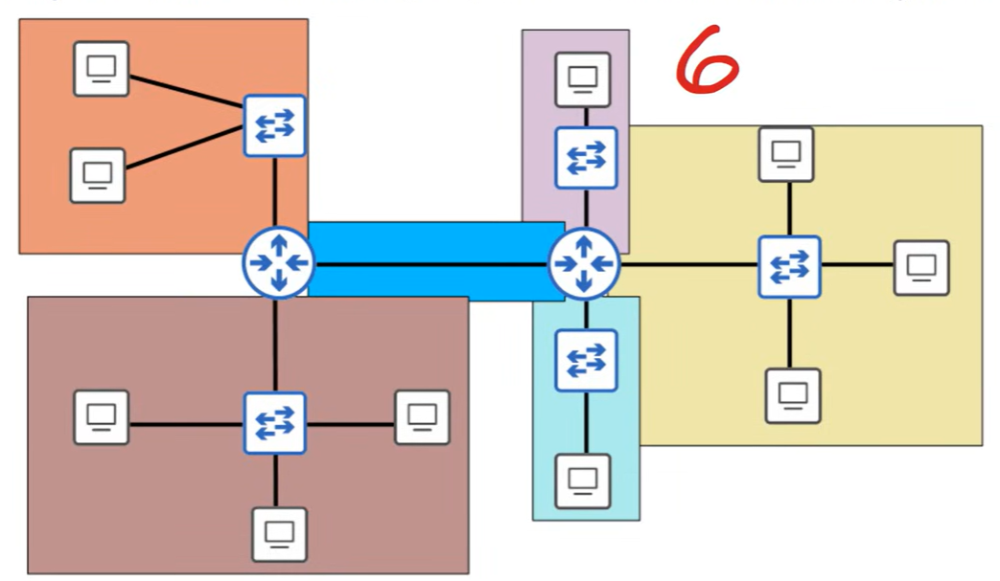
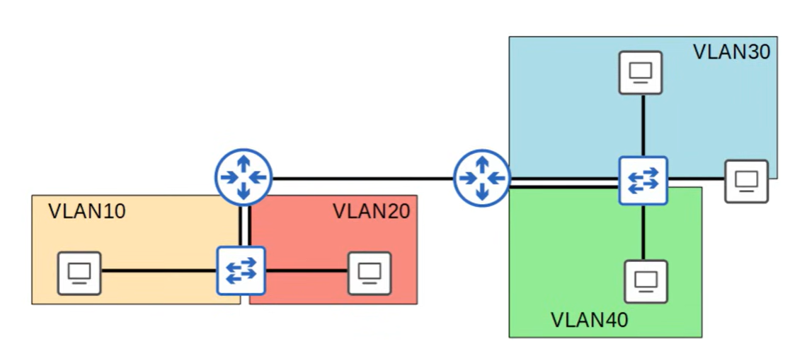
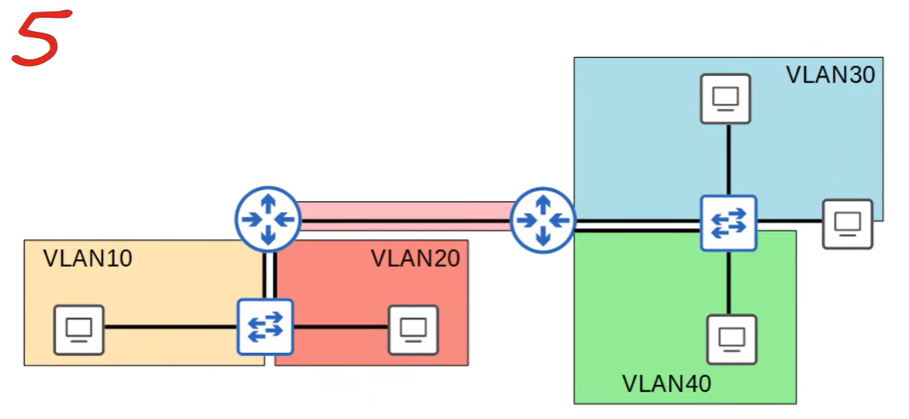
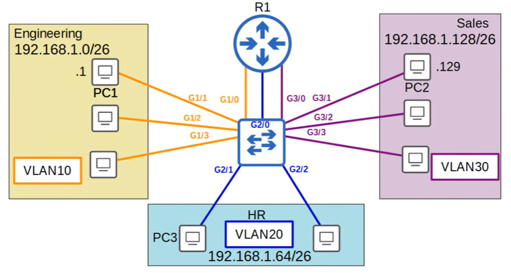
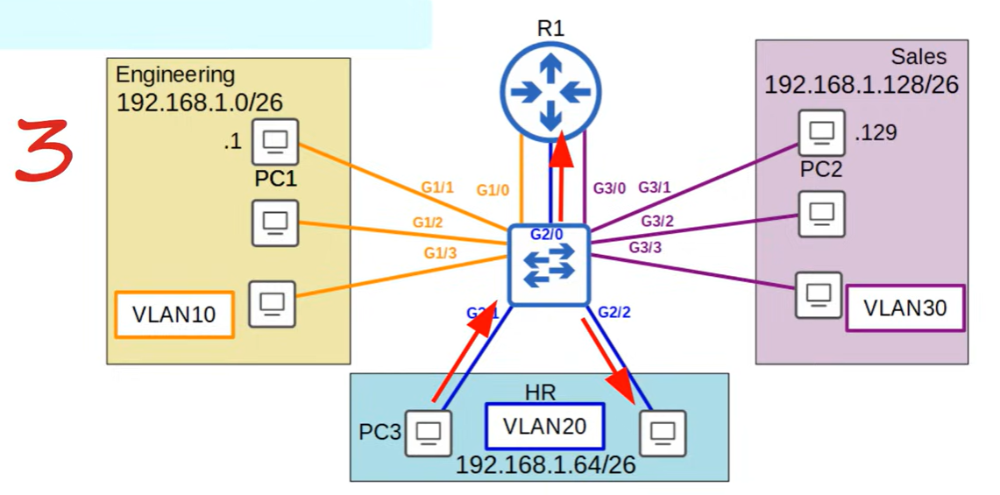

# Quiz: VLAN's
## Quiz 1
How many broadcast domains are shown in this network diagram?


### Anwser 


### Explanation
- A broadcast domain = the area where a Layer 2 broadcast can reach. Routers stop broadcasts.
- One router interface → one broadcast domain
- No VLANs configured

---

## Quiz 2
How many broadcast domains are shown in this network diagram?


### Anwser


### Explanation
- VLAN10 → 1 broadcast domain
- VLAN20 → 1 broadcast domain
- VLAN30 → 1 broadcast domain
- VLAN40 → 1 broadcast domain
- Router‑to‑router link → 1 broadcast domain

---

## Quiz 3
What happens if you try to assign a switch interface to a VLAN that doesn't exist?

A) the command will fail.
B) the switch will create the VLAN.
C) the interface will be disabled until you create the VLAN.
D) ALL VLANs exists by default.

### Anwser
Anwser is B.

### Explanation
When you assign a switchport to a VLAN that does not currently exist in the VLAN database, the switch will automatically create the VLAN. Cisco IOS does not require the VLAN to be pre‑created before assigning interfaces to it. Instead, the switch dynamically adds the VLAN to the VLAN table as soon as the command is entered.

```
switch(config)# interface fa0/1
switch(config-if)# switchport access vlan 50
```

---

## Quiz 4
If PC3 sends a broadcast message, how many devices will receive it?


### Anwser


### Explanation
PC3 is part of a single broadcast domain together with all devices in the same VLAN. When PC3 sends a broadcast frame, the switch will forward that broadcast out all other ports within the same VLAN. Switches do not forward broadcasts to other VLANs, and routers block broadcast traffic entirely.

A router will receive the broadcast if its interface is in the same VLAN/subnet.

---

## Quiz 5
You create VLANs 10, 20 and 30 on a cisco switch. How many VLANs will be displayed in the output of the ```show vlan brief``` command?

A) 3
B) 5
C) 8
D) 10

### Anwser
anwser is C.

### Explanation
There already exists 5 default and legacy VLANs already.
- VLAN 1 – default VLAN
- VLAN 1002 – default FDDI/Token Ring
- VLAN 1003 – default FDDI/Token Ring
- VLAN 1004 – default FDDI/Token Ring
- VLAN 1005 – default FDDI/Token Ring

4 legacy, 1 default and 3 user-created VLANs.

---
## Quiz 6
You want to configure SW1 to send VLAN10 frames untagged over its GigabitEthernet0/1 interface, a trunk. Which command is applied?

A) encapsulation dot1q 10
B) switchport trunk allowed vlan 10
C) switchport trunk allowed vlan add 10
D) switchport trunk native vlan 10

### Anwser
Anwser is D.

---
## Quiz 7
After modifying the list of VLANs allowed on a trunk interface, you want to return it to the default state. Which command will do this?

A) switchport trunk allowed vlan default
B) switchport trunk allowed vlan all
C) switchport trunk allowed vlan none
D) switchport trunk allowed vlan 1,1001-1005

### Anwser
Anwser is B.

### Explanation

The default state of a trunk interface is that **all VLANs are allowed**.  
If you previously restricted the allowed VLAN list (for example: `switchport trunk allowed vlan 10,20,30`), you can return the trunk to its default behavior by allowing **all VLANs** again.

The command that resets the allowed VLAN list to the default is:

**`switchport trunk allowed vlan all`**

This removes any manual restrictions and restores the trunk to its normal state, where VLANs 1–4094 are permitted.

- **A)** Invalid — this command does not exist.
- **C)** Blocks all VLANs, which disables the trunk.
- **D)** Lists only the default *existing* VLANs, not the default *allowed* VLANs.

---
## Quiz 8
You try to configure an interface on a Cisco switch as a trunk port with the command switchport mode trunk, but the command is rejected. Which command fixes this?

A) switch port mode trunk
B) switchport trunk encapsulation 802.1q
C) switchport trunk encapsulation dot1q
D) switchport trunk encapsulation auto

### Anwser 
Anwser is C.

### Explanation

Some Cisco switches require you to manually set the **trunk encapsulation type** before you are allowed to enable trunk mode.  
If the encapsulation is not configured, the command `switchport mode trunk` is rejected.

Older Cisco switches support two encapsulation types:

- ISL (Cisco proprietary)
- 802.1Q (industry standard)

To successfully enable trunking, you must first specify **802.1Q encapsulation** using:

**`switchport trunk encapsulation dot1q`**

After this command, `switchport mode trunk` will be accepted.

#### Why the other answers are incorrect

- **A) switch port mode trunk**  
  Invalid command (syntax error).

- **B) switchport trunk encapsulation 802.1q**  
  Incorrect keyword — Cisco uses **dot1q**, not “802.1q”.

- **D) switchport trunk encapsulation auto**  
  Attempts negotiation but does **not** fix the rejection when the switch requires an explicit encapsulation type.

---
## Quiz 9
Which field of the 802.1Q tag identifies the VLAN ID of the frame?

A) TPID
B) VID
C) PCP
D) VLN

### Anwser
Anwser is B.

### Explanation

The **VID** field (VLAN Identifier) is the part of the 802.1Q tag that specifies **which VLAN the frame belongs to**.  
It is a **12‑bit field**, allowing VLAN IDs from **0–4095**, with usable VLANs in the range **1–4094**.

#### Why the other answers are incorrect

- **A) TPID**  
  Identifies the frame as an 802.1Q‑tagged frame (value 0x8100).  
  It does *not* contain the VLAN ID.

- **C) PCP**  
  Priority Code Point — used for QoS (IEEE 802.1p).  
  Controls traffic priority, not VLAN membership.

- **D) VLN**  
  Not a real field in the 802.1Q tag.

---
## Quiz 10
You configured `switchport trunk allowed vlan add 10` on an interface, but VLAN10 doesn’t appear in the *Vlans allowed and active in management domain* section of the `show interfaces trunk` output. What might be the reason?

A) VLAN10 doesn’t exist on the switch  
B) The command is invalid  
C) The command should be `switchport trunk allowed vlan 10`  
D) VLAN10 is reserved and cannot be used  

### Answer
Anwser is A.

### Explanation
A trunk will only show a VLAN in the **“allowed and active in management domain”** section if:

1. The VLAN is **allowed** on the trunk, **and**  
2. The VLAN **exists** in the switch’s VLAN database.

If VLAN10 was never created with `vlan 10`, it is not considered *active*, so it will not appear in the trunk output, even though the “allowed” command was accepted.

The command itself is valid, and VLAN10 is not a reserved VLAN.

---
## Quiz 11
Which 2 anwser are valid options to configure the native VLAN on a router in a ROAS configuration? (select 2 best anwsers, each anwser is a complete solution)

A) 
R1(config-if)# encapsulation dot1q 122
R1(config-if)# ip address 192.168.1.1 255.255.255.0

B) 
R1(config-subif)# encapsulation dot1q 122 native
R1(config-subif)# ip address 192.168.1.1 255.255.255.0

C) 
R1(config-if)# ip address 192.168.1.1 255.255.255.0

D) 
R1(config-subif)# switchport trunk native vlan 122
R1(config-subif)# ip address 192.168.1.1 255.255.255.0

### Anwer
Anwser is B & C.
### Explanation
- **Option B** is valid because it uses a **router subinterface** with  
  `encapsulation dot1q 122 native`, which explicitly sets **VLAN 122 as the native VLAN** on that subinterface, and then assigns an IP address. This is one of the two correct methods to configure the native VLAN in a ROAS setup.

- **Option C** is valid because it assigns the **IP address directly to the physical interface** without any `encapsulation dot1q` command. In this case, the physical interface itself acts as the **native VLAN interface**, and traffic for that VLAN is **untagged**. This is the second valid method to configure the native VLAN on a router in ROAS.

- **Option A** is **not** valid for native VLAN, because `encapsulation dot1q 122` (without `native`) configures a **tagged VLAN subinterface**, not the native VLAN.

- **Option D** is **invalid** because `switchport trunk native vlan` is a **switchport command**, not a router subinterface command. Routers use `encapsulation dot1q <vlan-id> [native]`, not `switchport trunk ...`.

---
## Quiz 12
You create an SVI for VLAN225 on SW1, assign an IP address, and enable it with no shutdown, but the interface remains down/down. Which 2 options might be causing this? (select 2)

A) VLAN225 doesn't exist on the switch  
B) You didn't issue the switchport mode trunk command on VLAN225's SVI.  
C) You didn't issue the switchport access vlan 225 command on VLAN225's SVI.  
D) No interfaces in VLAN225 are up/up.

### Answer
Answer is **A & D**.

### Explanation
- **A is correct** because an SVI cannot come up unless the VLAN exists in the VLAN database.  
  If VLAN225 has not been created with `vlan 225`, the SVI will stay **down/down**.

- **D is correct** because an SVI only becomes **up/up** when at least one access port (or trunk carrying that VLAN) in that VLAN is **up/up**.  
  If no interfaces assigned to VLAN225 are active, the SVI remains **down/down**.

- **B is incorrect** because SVIs do not use `switchport mode trunk`. That command applies to physical switch interfaces, not SVIs.

- **C is incorrect** because you cannot configure `switchport access vlan` on an SVI. That command is only for physical switchports.

---
## Quiz 13
Which command is used to configure a switch interface as a routed port?

A) no switchport  
B) ip address ip-address subnet-mask  
C) ip routing  
D) switchport mode route  

### Answer
Answer is **A**.

### Explanation
- **A is correct** because `no switchport` converts a Layer 2 switchport into a **Layer 3 routed port**. After this command, the interface behaves like a router interface and can accept an IP address.

- **B is incorrect** because you cannot assign an IP address to a switchport **until** it has been converted to a routed port using `no switchport`.

- **C is incorrect** because `ip routing` enables Layer 3 routing on the switch globally, but it does **not** convert an interface into a routed port.

- **D is incorrect** because `switchport mode route` is **not** a valid IOS command.

---
## Quiz 14
**question from the video as Boson exam envirement.*

You issue the following commands on a Catalyst 2950 switch:

```
SwitchA#configure terminal  
SwitchA(config)#interface fastethernet 0/7  
SwitchA(config-if)#switchport trunk encapsulation dot1q  
SwitchA(config-if)#switchport mode trunk  
SwitchA(config-if)#switchport trunk native vlan 44  
```

Which of the following statements is true regarding VLAN traffic when it is sent over port FastEthernet 0/7? (Select the best answer.)

A) VLAN 1 traffic will be untagged.  
B) VLAN 44 traffic will be untagged.  
C) All VLAN traffic will be tagged.  
D) All VLAN traffic will be untagged.

### Answer
Answer is **B**.

### Explanation
- **B is correct** because VLAN 44 is configured as the **native VLAN**, and native VLAN traffic is always sent **untagged** on a trunk port.
- **A is incorrect** because VLAN 1 is no longer the native VLAN, so VLAN 1 traffic will be **tagged**.
- **C is incorrect** because only non‑native VLANs are tagged; the native VLAN is not.
- **D is incorrect** because only the native VLAN is untagged, not all VLANs.
