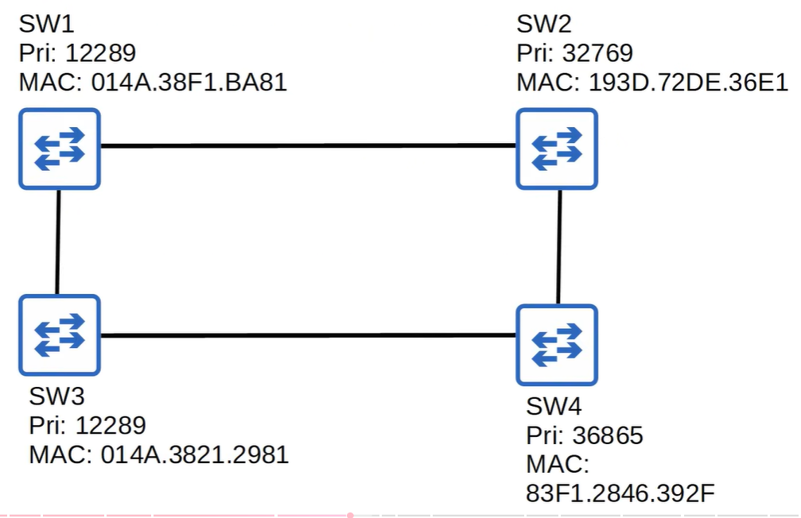
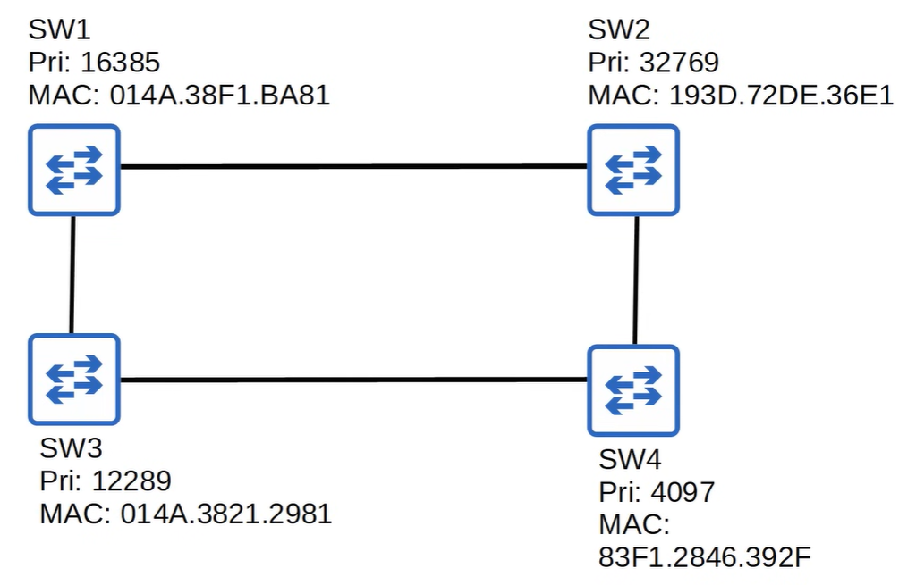
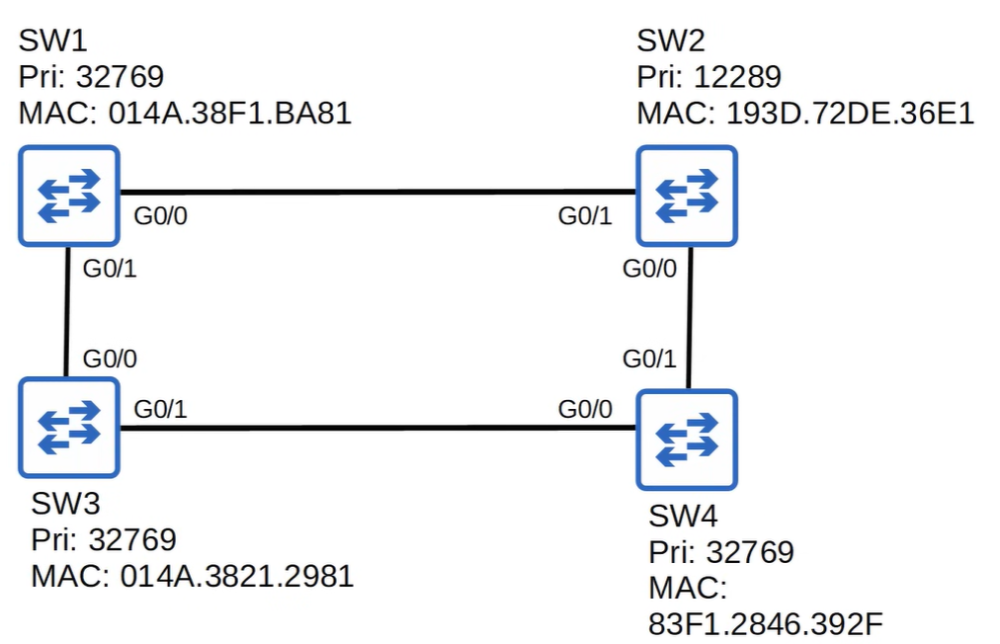
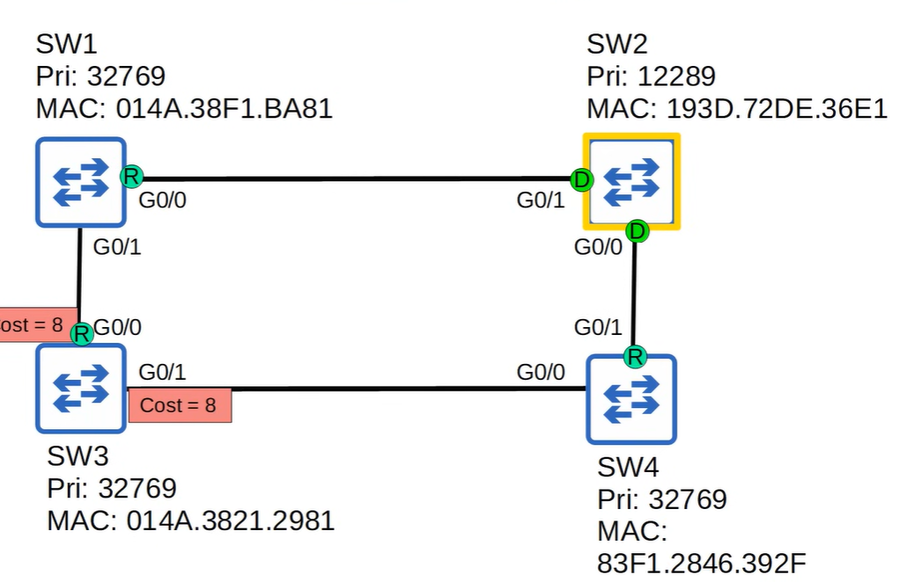
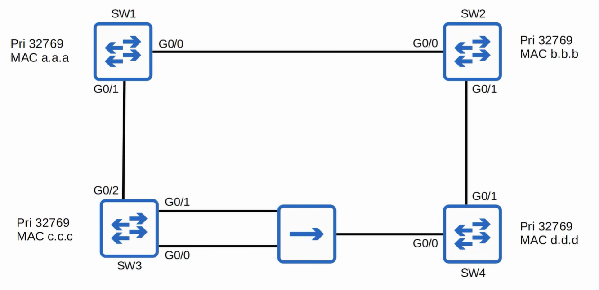
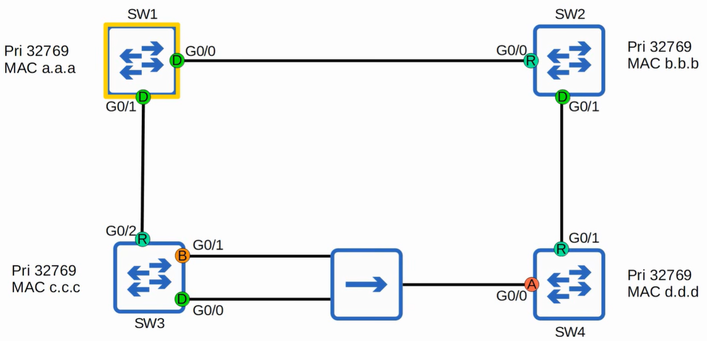

# Quiz: STP
## Quiz 1
Which will become the root bridge?

### Anwser
SW3 is the root bridge.

### Explanation
SW1 and SW3 has both lowest priority of 12289. Both are candidates for being the root bridge.

Compare MAC addresses:
- SW1 MAC → 014A.38F1.BA81
vs
- SW3 MAC → 014A.3821.2981

first part: 014A vs 014A, both same.
second part: 3821 is lower than 38F1.
last part: *ignore*

therefore, SW3 is the root bridge.

---
## Quiz 2
Which will become the root bridge?

### Anwser
SW4 is the root bridge.

### Explanation
SW4 has the lowest Priority number.

---
## Quiz 3
1. which switch is the root bridge?
2. Which ports will become root ports?

### Anwser
1. SW2 --> lowest priority number
2. SW1 = G0/0, SW3 = G0/0, SW4 = G0/1

### Explanation
2. The Root Bridge has no root ports.

Every non‑root switch selects one Root Port: the port with the lowest total path cost to the Root Bridge.

All Gigabit links = cost 4,
Links explicitly marked with cost 8 are slower (or manually set).

2 lines towards SW3 = cost 8 (total = 4+4)
SW1 has lower MAC address than SW4, so the G0/0 port on SW3 is the root port.

## Quiz 4
1. Identify the root bridge.
2. RSTP port for each switch.

> (!) Hubs doesn't particate in STP

### Anwser

### Explanation
*AI improved - MS Copilot*
### 1. Identify the Root Bridge

All switches have the same priority:

- SW1 → 32769, MAC a.a.a  
- SW2 → 32769, MAC b.b.b  
- SW3 → 32769, MAC c.c.c  
- SW4 → 32769, MAC d.d.d  

When priorities are equal, STP/RSTP chooses the **lowest MAC address**.

Order of MACs:  
a.a.a < b.b.b < c.c.c < d.d.d

➡️ **Root Bridge = SW1**

## 2. Determine RSTP Port Roles

### Step 2.1 — What the Root Bridge Does
The root bridge never has a Root Port.  
All its ports become **Designated Ports (DP)**.

**SW1**
- G0/0 → DP  
- G0/1 → DP  

## Step 2.2 — Find the Root Port on Each Non‑Root Switch

A **Root Port (RP)** is the port with the **lowest total path cost** to the root.

All links are Gigabit → cost = **4** per link.

### SW2
Path to SW1:
- SW2 → SW1 = cost 4  
➡️ **SW2 G0/0 = Root Port**

### SW3
Path to SW1:
- SW3 → SW1 = cost 4  
➡️ **SW3 G0/2 = Root Port**

### SW4
Two possible paths:

1. SW4 → SW2 → SW1  
   - 4 + 4 = **8**

2. SW4 → SW3 → SW1  
   - 4 + 4 = **8**

Both paths cost the same.  
So RSTP compares the **upstream switch MACs**:

- SW2 MAC = b.b.b  
- SW3 MAC = c.c.c  

b < c → SW2 is better.

➡️ **SW4 G0/1 = Root Port**

## Step 2.3 — Determine Designated Ports (DP)

A **Designated Port** is the port on a link that sends the **better BPDU**.

A BPDU is “better” when:
1. It advertises a **better root path cost**, or  
2. If costs tie → the switch with the **lower MAC** wins.

### Link SW2 ↔ SW4
- SW2 path to root = 4  
- SW4 path to root = 8  
➡️ SW2 wins → **SW2 G0/1 = DP**

### Link SW3 ↔ SW4
- SW3 path to root = 4  
- SW4 path to root = 8  
➡️ SW3 wins → **SW3 G0/1 = DP**

## Step 2.4 — Determine Alternate Ports (ALT)

An **Alternate Port** is a port that:
- Receives a **better BPDU** from the neighbor,  
- But is **not chosen as the Root Port**.

On SW4:
- G0/1 is already the Root Port  
- G0/0 receives a better BPDU from SW3  
➡️ **SW4 G0/0 = Alternate Port (Discarding)**