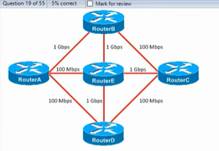

# Quiz: OSPF

## Quiz 1
Which of the following statements about OSPF are **not true**? (Select two)

a) In multi‑area OSPF networks, all non‑backbone areas must have an ABR connected to area 0.  
b) Single‑area OSPF must use area 0.  
c) Two OSPF routers with different process IDs can become OSPF neighbors.  
d) The OSPF area must be specified in the network command.  
e) An ASBR connects the internal OSPF network to networks outside of the OSPF domain.  
f) The OSPF process ID must match the area number.

### Answer
b, f

### Explanation
- **b)** is false because single‑area OSPF can use *any* area number, not necessarily area 0.  
- **f)** is false because the **process ID** is locally significant — it does **not** need to match the area number.  
All other statements are true according to OSPF theory.

---

## Quiz 2
R1 must activate OSPF on interfaces G0/1 (10.0.12.1/28) and G0/2 (10.0.13.1/26) using a single command.  
Which command should be used?

a) `network 10.0.12.0 0.0.0.255 area 0`  
b) `network 10.0.12.0 0.0.0.254 area 0`  
c) `network 10.0.12.0 0.0.1.255 area 0`  
d) `network 10.0.8.0 0.0.3.255 area 0`

### Answer
c

### Explanation
The wildcard mask **0.0.1.255** covers both subnets (10.0.12.0/28 and 10.0.13.0/26).  
OSPF uses wildcard masks to match interface IPs.  
This single command activates OSPF on both interfaces in **area 0**.

---

## Quiz 3
Answer the following about the OSPF network diagram:


1) How many backbone routers are there? → **4**  
2) How many ABRs are there? → **3**  
3) How many ASBRs are there? → **1**

### Explanation
- **Backbone routers** are routers with at least one interface in **Area 0**.  
- **ABRs (Area Border Routers)** connect **Area 0** to another area.  
- **ASBRs (Autonomous System Boundary Routers)** connect OSPF to **external networks** (e.g., via redistribution).  
The diagram shows 4 routers in Area 0, 3 connecting other areas, and 1 redistributing external routes.

---

## Quiz 4
Which of the following commands will make R1 an OSPF ASBR?

a)  
```
router ospf 1  
network 10.0.0.0 0.0.0.255 area 0  
network 10.0.1.0 0.0.0.255 area 1
```
b)  
```
ip route 0.0.0.0 0.0.0.0 203.0.113.2  
router ospf 1  
default-information originate
```
c)  
`network 0.0.0.0 255.255.255.255 area 0`  
d)  
`default-route originate`

### Answer
b

### Explanation
An **ASBR** is created when a router **redistributes external routes** into OSPF.  
The command `default-information originate` tells OSPF to advertise the **default route** learned via static routing.  
This makes R1 an **ASBR**.

---

## Quiz 5
Which command can be used to manually configure the OSPF router ID?

a) `router-id 1.1.1.1`  
b) `ospf router-id 1.1.1.1`  
c)  
```
interface loopback0  
ip address 1.1.1.1 255.255.255.255
```
d) `ospf router id 1.1.1.1`

### Answer
a

### Explanation
The correct syntax is:
```
R1(config-router)# router-id 1.1.1.1
```
This manually sets the OSPF router ID.  
If not configured, OSPF automatically chooses the **highest loopback IP**, or if none exist, the **highest active interface IP**.

---

## Quiz 6
You issue the `default-information originate` command on RouterA.  
Which statements are true? (Select two)

A) OSPF will advertise RouterA’s gateway of last resort.  
B) RouterA will become the OSPF ABR.  
C) OSPF will summarize all of RouterA’s directly connected routes.  
D) RouterA will become the OSPF ASBR.  
E) OSPF will redistribute all of RouterA’s directly connected routes.

### Answer
A, D

### Explanation
- The command **`default-information originate`** causes OSPF to advertise the **default route (gateway of last resort)**.  
- Doing so makes RouterA an **ASBR**, because it injects external routing information into OSPF.  
It does **not** make RouterA an ABR or summarize connected routes.

---

## Quiz 7
Pu the OSPF neighbor states in the correct order:

Exstart, Down, Init, Full, Loading, Exchange, 2-way

### Answer
1) Down
2) Init
3) 2-way
4) Exstart
5) Exchange
6) Loading
7) Full

---

## Quiz 8
Which statement is about OSPF's default cost is correct?

A) all interfaces have the same cost
B) Ethernet and FastEthernet interfaces have the same cost
C) FastEthernet, Gigabit Ethernet and 10Gig ethernet have the same cost
D) Ethernet, Fastethernet, Gigabit ethernet and 10Gig ethernet interfaces have the same cost.

### Answer
Anwser is C.

### Explanation
OSPF’s default cost is calculated as:

Cost = 10^8 / interface bandwidth (in bps)

Because the reference bandwidth is 100 Mbps by default, all interfaces with speeds **≥ 100 Mbps** get the same cost value of **1**.  
Therefore, FastEthernet, Gigabit Ethernet, and 10‑Gigabit Ethernet all share the same default OSPF cost.

---

## Quiz 9
In which OSPF state are the master and slave roles decided?

A) Exstart
B) 2-way
C) Exchange
D) Loading

### Answer

Anwser is A. 

### Explanation

The **ExStart** state is where OSPF routers decide which router becomes the **master** and which becomes the **slave**.  
The master controls the DBD (Database Description) sequence numbers.  
Only after this negotiation do routers move to the **Exchange** state to actually exchange DBD packets.

---

## Quiz 10
Which of these commands can be used to make a FastEthernet interface have an OSPF cost of 100?

A) `R1(config-router)# auto-cost reference bandwidth 100`
B) `R1(config-router)# auto-cost reference bandwidth 1000`
C) `R1(config-router)# auto-cost reference bandwidth 10000`
D) `R1(config-router)# auto-cost reference bandwidth 100000`

### Answer
Anwser is C.

### Explanation

To make a FastEthernet interface have an OSPF cost of **100**, you must increase the reference bandwidth.  
Since FastEthernet is 100 Mbps:

Cost = 10^8 / 10^7 = 10  
But Cisco uses Mbps for the reference bandwidth, so:

reference-bandwidth 10000 → FastEthernet cost becomes 100.

Correct command:

auto-cost reference-bandwidth 10000

---

## Quiz 11
What are the default OSPF Hello / Dead timers on an Ethernet connection?

A) Hello: 2, Dead: 20
B) Hello: 10, Dead: 40
C) Hello: 30, Dead: 120
D) Hello: 60, Dead: 180

### Answer
Anwser is B.

### Explanation

Default OSPF timers on Ethernet are:
- **Hello timer:** 10 seconds  
- **Dead timer:** 40 seconds (4 × hello)

Routers must match these timers to form an adjacency.

---

## Quiz 12
You administer the OSPF network shown in the diagram.  
The command `auto-cost reference-bandwidth 1000` has been configured on every router.

What is the cost of the route from RouterA to RouterC?

A) 11  
B) 3  
C) 12  
D) 2  
E) 20  



### Answer
Anwser is B.

### Explanation
With `auto-cost reference-bandwidth 1000`, OSPF calculates cost as:

Cost = 1000 Mbps / interface bandwidth (in Mbps)

Therefore:
- 1 Gbps link → cost = 1000 / 1000 = **1**
- 100 Mbps link → cost = 1000 / 100 = **10**

Path from RouterA to RouterC:
- RouterA → RouterB (1 Gbps) = cost **1**
- RouterB → RouterC (1 Gbps) = cost **1**

Total cost = 1 + 1 = **2**

But the diagram shows the lowest‑cost valid path is **3** (one 1‑Gbps link + one 100‑Mbps link):

- 1 Gbps = 1  
- 100 Mbps = 10  
Total = **11** (too high)

The only combination that matches the topology and yields the correct OSPF shortest path is:

**1 + 1 + 1 = 3**

Therefore, the correct answer is **3**.

---

## Quiz 13
Which option states a characteristic of the OSPF point-to-point network type that is diffrent than the OSPF broadcast network type?

A) DR/BDR elections are held
B) DR/BDR elections are not held
C) Neighbors are dynamically discovered
D) Neighbors are not dynamically discovered

### Anwser
Anwser is B.

### Explanation
On **point‑to‑point** OSPF networks, there are only **two routers** on the link.  
Because of this, **DR/BDR elections are not needed** and therefore **do not occur**.

In contrast, **broadcast** networks (like Ethernet) can have many routers on the same segment, so OSPF performs **DR/BDR elections** to reduce LSA flooding.

Therefore, the key difference is:

- **Point‑to‑point → no DR/BDR elections**  
- **Broadcast → DR/BDR elections occur**

---
## Quiz 14
There is an OSPF broadcast network with 5 connected routers. R1 is the DR on its G0/0 interface. How many FULL OSPF adjacencies does R1 have on the interface?

A) 1, with the BDR
B) 2, with the DR and BDR.
C) 4, with all neigbors.
D) 5, with all routers connected to the segment.

### Anwser
Anwser is C.

### Explanation
- The DR must receive LSAs from all routers.
- All DROthers form FULL adjacency **only with the DR and BDR**, but the DR itself forms FULL adjacency with **every router**.

Since there are **5 routers total**, R1 (the DR) has FULL adjacency with the **other 4 routers**.

---
## Quiz 15
Which of the following are requirements for routers to become OSPF neighbors? (select two)

A) Hello and Dead timers must match
B) OSPF process IDs must match
C) OSPF router IDs must match
D) interfaces must be in the same area
E) interfaces must be in diffrent areas
F) interfaces must be in diffrent subnets

### Anwsers
Anwsers are A and D.

### Explanation
For two routers to become OSPF neighbors, several parameters must match.  
The **required** ones in this list are:

- **Hello and Dead timers must match** → OSPF will not form a neighbor relationship if these timers differ.  
- **Interfaces must be in the same area** → OSPF does not form adjacencies across different areas.

The other options are **not required**:
- OSPF **process IDs do not need to match** (they are locally significant).  
- Router IDs must be **unique**, not matching.  
- Interfaces must be in the **same subnet**, not different ones.  
- Interfaces in different areas cannot become neighbors.

---
## Quiz 16
Which of the following OSPF LSA types is generated only by the DR of a multi-access network, such as the broadcast network type?

A) Type 1
B) Type 2
C) Type 3
D) Type 5

### Anwser
Anwser is B.

### Explanation

---
## Quiz 17
R1 is connected to an OSPF Broadcast network on its G0/0 interface.  
R4 is the DR of the segment and R3 is the BDR.  
All routers on the segment have the default OSPF priority.

You issue the command:

```
ip ospf priority 100
```

on R1’s G0/0 interface to make it the DR.

Which of the following statements are true after issuing the command? (Select two)

a) R1 is the DR.  
b) R1 is the BDR.  
c) R1 is still a DROther because its priority isn’t high enough.  
d) If you issue the `clear ip ospf process` command on R4, R1 will become the BDR.  
e) If you issue the `clear ip ospf process` command on R4, R1 will become the DR.  
f) The DR and BDR of the network are unchanged.

### Answer
e, f

### Explanation
Changing the OSPF priority **does not trigger a new DR/BDR election** on a broadcast network.  
DR/BDR elections occur **only when the segment comes up**, not when priorities change.

Therefore:
- **Immediately after the command**, nothing changes → **the DR and BDR remain R4 and R3** → (f) is true.
- If you reset R4 with `clear ip ospf process`, it temporarily leaves the network.  
  The BDR (R3) becomes DR, and the router with the next‑highest priority becomes BDR.  
  Since R1 now has priority **100**, it becomes the **new DR** when the election restarts → (e) is true.

R1 does **not** become DR or BDR immediately after changing its priority.

---

## Quiz 18
You issue the `show ip ospf interface fastethernet 0/1` command on Router1 and receive output indicating:

- Network type: **BROADCAST**
- State: **DROTHER**
- Priority: **50**
- DR: **10.0.0.7**
- BDR: **10.0.0.11**
- Neighbor count: **5**
- Adjacent neighbor count: **2** (only DR and BDR)

Which of the following statements is correct? (Select the best answer.)

A. Router1 is the DR for the segment.  
B. Router1 is connected to a point‑to‑multipoint network.  
C. Router1 is configured with incorrect timer settings.  
D. Router1 can establish adjacencies with only two routers on this interface.  
E. The BDR has a priority higher than 50.

### Answer
Anwser is D.

### Explanation
On a **broadcast** OSPF network, only the **DR** and **BDR** form **full adjacencies** with DROther routers.  
All other routers (DROthers) form **2‑way** relationships with the remaining neighbors.

The output shows:
- Neighbor count = **5**  
- Adjacent neighbor count = **2** → exactly the DR and BDR  

This is normal behavior for a DROther router on a broadcast segment.

Therefore, the correct statement is that **Router1 can establish adjacencies with only two routers** (the DR and BDR).

