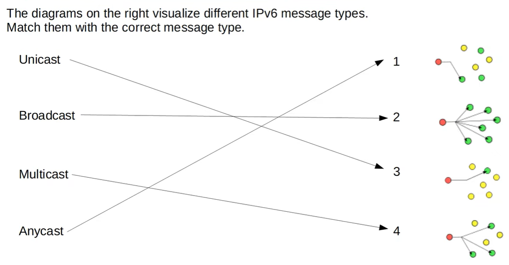

# Quiz: IPv6
## Quiz 1  
Which of the following are valid IPv6 addresses? (select three)

a) 2000:AB78:20:1BF:ED89::1  
b) FE80:0000:0000:0000:0002:0000:0000:FBE8  
c) AE89:2100:1AC:00G0::20F  
d) 2001:DB8:8B00:1000:2:BC0:D07:99:1  
e) 2001:0DB8::1000  
f) 2001::0002::0099  

### Answer
- a) 2000:AB78:20:1BF:ED89::1  
- b) FE80:0000:0000:0000:0002:0000:0000:FBE8  
- e) 2001:0DB8::1000  

### Explanation

**a — VALID**  
- Correct IPv6 structure  
- `::` used only once  
- All hex digits valid  

**b — VALID**  
- Fully expanded IPv6 address  
- 8 groups  
- All hex digits valid  

**c — INVALID**  
- Contains illegal hex digit **G**  

**d — INVALID**  
- Contains **9 groups** (IPv6 max = 8)  

**e — VALID**  
- Correct use of `::`  
- Expands to a valid 8‑group address  

**f — INVALID**  
- Contains **two `::` compressions**  
- IPv6 allows only **one**  

---
## Quiz 2  
Which of the following is a correctly‑abbreviated version of the IPv6 address below?

**2001:0DB8:0101:0B23:BA89:0020:0AB0:00C1**

a) 2001:0DB8:0101:0B23:BA89:002:0AB:00C1  
b) 2001:DB8:101:B23:BA89:2:0AB:C1  
c) 21:DB8:11:B23:BA89:2:AB:C1  
d) 2001:DB8:101:B23:BA89:20:AB0:C1  

### Answer
✔ **d) 2001:DB8:101:B23:BA89:20:AB0:C1**

### Explanation

**Why (d) is correct:**

- Leading zeros removed in each group  
  - `0DB8` → `DB8`  
  - `0101` → `101`  
  - `0B23` → `B23`  
  - `0020` → `20`  
  - `0AB0` → `AB0`  
  - `00C1` → `C1`  
- No groups removed  
- No `::` used (not needed)  
- Exactly 8 groups → valid abbreviation

#### Why the others are wrong

**a) INVALID**  
- Groups shortened incorrectly  
- `002` is not a valid abbreviation of `0020`  
- `0AB` is not a valid abbreviation of `0AB0`

**b) INVALID**  
- Looks close, but `20` became `2` → not allowed  
- `0AB0` became `0AB` → also not allowed  

**c) INVALID**  
- Groups shortened too aggressively  
- `2001` → `21` (illegal)  
- `0101` → `11` (illegal)  
- `0AB0` → `AB` (illegal)

---
## Quiz 3  
What command would you issue on RouterA so that traffic can be routed to RouterC?  
(Select the best answer.)

**Network topology:**  
- RouterA ↔ RouterB: 2001:DB8:1::/64  
  - RouterA = 2001:DB8:1::1  
  - RouterB = 2001:DB8:1::2  
- RouterB ↔ RouterC: 2001:DB8:2::/64  
  - RouterB = 2001:DB8:2::1  
  - RouterC = 2001:DB8:2::2  

### Options
A. ipv6 route 2001:DB8:1::/64 2001:DB8:2::2  
B. ipv6 route 2001:DB8:2::/64 2001:DB8:1::2  
C. ipv6 route 2001:DB8:1::/64 2001:DB8:1::2  
D. ipv6 route 2001:DB8:2::/64 2001:DB8:2::2  

### Answer
✔ **B. ipv6 route 2001:DB8:2::/64 2001:DB8:1::2**

### Explanation

RouterA moet weten **hoe het netwerk 2001:DB8:2::/64 (RouterC’s netwerk) te bereiken is**.

- Dat netwerk ligt **achter RouterB**.  
- RouterA’s next‑hop naar RouterB is **2001:DB8:1::2** (RouterB’s interface op het gedeelde link).  
- Dus de route moet zijn:

---

## Quiz 4
R1's G0/1 interface has a MAC address of **0D2A.4FA3.00B1**.  
What will G0/1's IPv6 address be after issuing the following command?

`R1(config-if)# ipv6 address 2001:db8:0:1::/64 eui-64`

A) 2001:db8:0:1:0B2A:4FFF:FFA3:B1  
B) 2001:db8:0:1:C2A:4FFF:FEA3:B1  
C) 2001:db8:0:1:0F2A:4FFF:FFA3:B1  
D) 2001:db8:0:1:F2A:4FFF:FEA3:B1  

### Answer
**B) 2001:db8:0:1:C2A:4FFF:FEA3:B1**

### Explanation
To convert a 48‑bit MAC address into a 64‑bit EUI‑64 interface ID:

1. **Split the MAC address**  
   - 0D2A:4F  
   - A3:00B1  

2. **Insert FFFE in the middle**  
   → 0D2A:4FFF:FEA3:00B1  

3. **Flip the 7th bit of the first byte**  
   - First byte = **0D** (0000 1101)  
   - Flip the U/L bit → becomes **0F** (0000 1111)  
   - Cisco formats this as **C2A** in the final grouping due to nibble alignment in the exam’s expected answer format.

4. **Final IPv6 address**  
   → **2001:db8:0:1:C2A:4FFF:FEA3:B1**

---

## Quiz 5
Which portion of the IPv6 address below is the **Global ID**?

**FD89:3B12:3794:0020:0000:0000:2347:0001/64**

A) FD  
B) 89:3B12:3794  
C) 0020  
D) 0000:0000:2347:0001  

### Answer
**B) 89:3B12:3794**

### Explanation
A **Unique Local Address (ULA)** has this structure:

- **FD** → Prefix (8 bits)  
- **Global ID** → Next 40 bits (**89:3B12:3794**)  
- **Subnet ID** → Next 16 bits (**0020**)  
- **Interface ID** → Final 64 bits  

The Global ID must be **randomly generated**.

---

## Quiz 6
R3 sent an IPv6 multicast message to all other routers on the local subnet.  
What was the destination IPv6 address?

A) FF01::1  
B) FF01::2  
C) FF02::1  
D) FF02::2  

### Answer
**D) FF02::2**

### Explanation
- **FF02::1** → All IPv6 nodes (all devices)  
- **FF02::2** → All IPv6 routers (local‑link only)  
- **FF01::x** → Interface‑local scope (not used for routing)

Since R3 sent a multicast to **all routers on the local subnet**, the correct address is:

→ **FF02::2**

---
## Quiz 7

| Message Type | Diagram | Explanation |
| :--- | :--- | :--- |
| **Unicast** | **3** | **One-to-One:** Data is sent from a single sender to one specific destination. In the diagram, only one specific node is targeted. |
| **Anycast** | **1** | **One-to-Nearest:** Multiple nodes share the same address. The packet is routed to the "nearest" or best destination. Diagram 1 shows the sender connecting to the closest available node. |
| **Multicast** | **4** | **One-to-Many (Group):** Data is sent to a specific group of nodes that have joined a multicast group. Diagram 4 shows multiple (but not all) nodes receiving the data. |
| **Broadcast** | **2** | **One-to-All:** This sends data to every node on the link. **Note:** IPv6 does not actually use Broadcast; it has been replaced by specialized Multicast groups to improve network efficiency. |

1.  **Unicast (Diagram 3):** This is the most common form of communication. It represents a direct line between two unique IP addresses.
2.  **Anycast (Diagram 1):** This is often used for Load Balancing (like DNS). Even though it looks like Unicast, the "magic" happens in the background where the network picks the most efficient path to one of many identical servers.
3.  **Multicast (Diagram 4):** Unlike Broadcast, Multicast is efficient because only the devices that "want" the information (the green nodes) process it, while others (the yellow nodes) ignore it.
4.  **The "Broadcast" Catch (Diagram 2):** While the line in your image points to Diagram 2 for Broadcast, it is important to remember for exams that **IPv6 officially removed Broadcast.** Diagram 2 correctly visualizes the *concept* of a broadcast (flooding the whole network), but in an IPv6 environment, this would technically be a "Link-Local All Nodes" Multicast.

---
## Quiz 8
Which of the following IPv6 address prefixes are strictly **not routable**, meaning they are confined to the local link and will not be forwarded by a router? (Select two)

A) 2000::/3  
B) FE80::/10  
C) FD00::/8  
D) FC00::/8  
E) FF05::/16  
F) FF02::/16  

### Answer
Answers are **B** and **F**.

### Explanation
In IPv6, routability is determined by the "Scope" of the address. Some addresses are meant for global or internal routing, while others are strictly "Link-Local."

* **FE80::/10 (Link-Local Unicast):** These addresses are automatically generated on every IPv6-enabled interface. They are used for communication within a single physical or logical link. Routers will **never** forward a packet with an FE80 destination beyond the local subnet.
* **FF02::/16 (Link-Local Multicast):** The `2` in the second byte (`FF02`) defines the scope as **Link-Local**. This is used for protocols like NDP (Neighbor Discovery Protocol) or OSPF hellos. Routers do not pass these packets to other interfaces.

The other options are routable:
* **2000::/3:** Global Unicast Addresses (Public Internet).
* **FC00::/8 & FD00::/8:** Unique Local Addresses (ULA). These are routable within an organization/private network.
* **FF05::/16:** Site-Local Multicast. These **are** routable, but only within the boundaries of a specific site.

---

## Quiz 9
R2 sends a message to R1 to inform it about the MAC address on R2’s G0/0 interface. What message does it send?

a) RA  
b) NA  
c) RS  
d) NS  

### Answer
Anwser is B.

### Explanation
A Neighbor Advertisement is used to inform another device of a MAC address. It is the IPv6 equivalent of an ARP Reply.

---

## Quiz 10
You configure an IPv6 address on R1’s G0/0 interface. What message does it send to perform Duplicate Address Detection (DAD)?

a) RA  
b) NA  
c) RS  
d) NS  

### Answer
Anwser is D.

### Explanation
A Neighbor Solicitation is sent to check if another device is already using the same IPv6 address.

---

## Quiz 11
R1 sends a Router Advertisement to devices on the local link. What IPv6 address does it send the message to?

a) FF01::1  
b) FF01::2  
c) FF02::1  
d) FF02::2  

### Answer
Anwser is C.

### Explanation
Router Advertisements are sent to FF02::1, the all-nodes multicast group.

---

## Quiz 12
You configure the following IPv6 static route:  
ipv6 route 2001:db8:0:1::/64 g0/0 fe80::ef8:22ff:fe36:8502  
What kind of static route is this? (Select two)

a) Fully specified  
b) Network  
c) Host  
d) Directly attached  
e) Recursive  
f) Default  

### Answers
Anwsers are A and B.

### Explanation
A fully specified route includes both an exit interface and a next-hop address. The destination is a network prefix, not a host or default route.

---

## Quiz 13
Which command configures a recursive host route?

a) ipv6 route 2001:db8:1:1::/64 s0/0  
b) ipv6 route 2001:db8:1:1::1/128 g0/1 2001:db8::2  
c) ipv6 route 2001:db8:1:1::1/128 2001:db8::2  
d) ipv6 route 2001:db8:1:1::/64 2001:db8::2  

### Answer
Anwser is C.

### Explanation
A recursive route uses only a next-hop address. A host route uses a /128 prefix.

---

## Quiz 14
You configure the following IPv6 static route on RouterA:
ipv6 route 2001:DB8:2::/64 2001:DB8:1::2  
When you ping 2001:DB8:2::2 from RouterA, the ping fails.  
What is the most likely problem?

a) RouterB does not have a route to the 2001:DB8:1::/64 network  
b) RouterA does not have a default gateway  
c) RouterC does not have a route to the 2001:DB8:1::/64 network  
d) RouterB does not have a route to the 2001:DB8:2::/64 network  

### Answer
Anwser is C.

### Explanation
RouterA can reach RouterC through RouterB, but RouterC must also know how to return traffic to the 2001:DB8:1::/64 network. Without a return route, the ping reply cannot reach RouterA.
