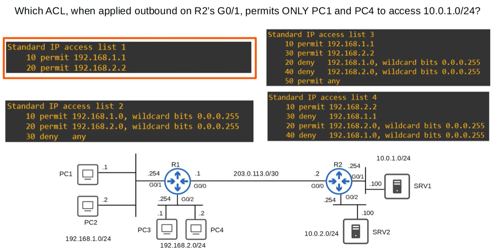
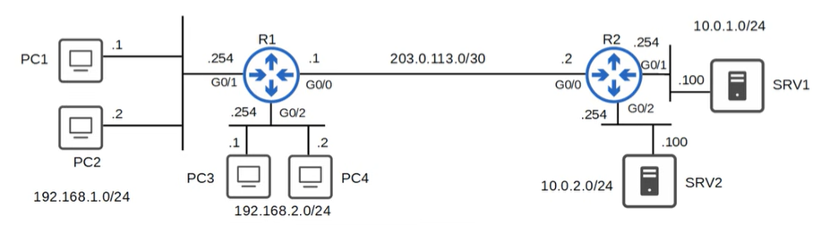
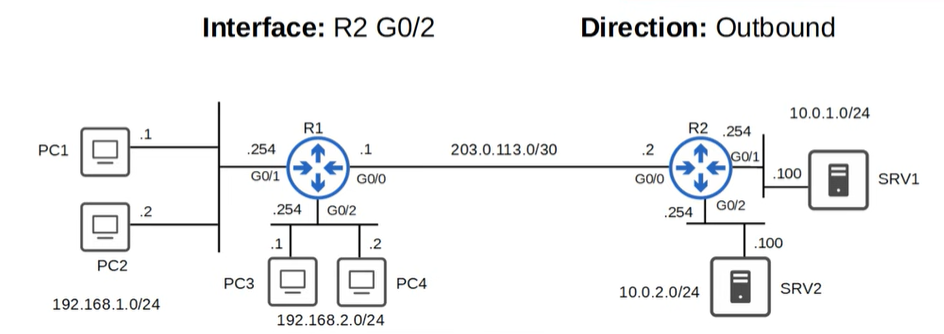
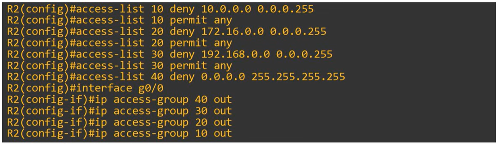
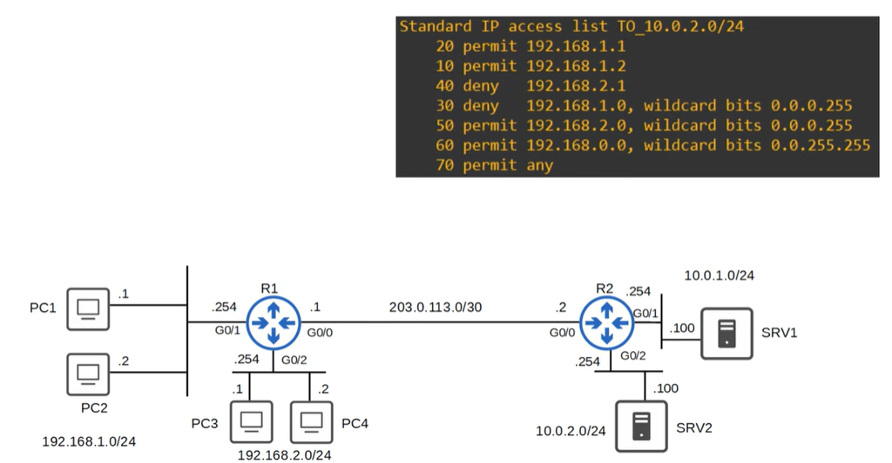

# Quiz: ACLs
## Quiz 1


### Explanation

ACL 1 is the only ACL that **permits exactly the two required hosts** and **blocks all others** through the implicit `deny any`.

- **PC1** → 192.168.1.1  
- **PC4** → 192.168.2.2  

Standard ACLs filter **only on the source IPv4 address**, so the ACL must explicitly permit only these two addresses.

ACL 1 contains:
- `permit 192.168.1.1` → allows PC1  
- `permit 192.168.2.2` → allows PC4  
- No other permit statements → all other sources are denied by the implicit `deny any`

Because the ACL is applied **outbound on R2’s G0/1**, it filters traffic **leaving R2 toward the 10.0.1.0/24 network**, ensuring that only PC1 and PC4 can reach that subnet.

Other ACLs either:
- permit entire subnets (too broad),  
- include `permit any` (too permissive),  
- or have deny/permit entries in an order that does not achieve the required filtering.

---

## Quiz 2
Which interface should the following ACL be applied to, and in which direction, to filfill the requirements?

```
Standard IP access list ALLOW_PC3
    10 permit 192.168.2.1
    20 deny deny
```

Requirements:
- Only PC3 can reach SRV2.



### Anwser



### Explanation
Standard ACLs should be applied as close to the destination as possible.

---

## Quiz 3
You issue the following command on R2. Which statement about the effect of the configurations is correct?


A) All traffic will be denied.
B) Traffic from the 10.0.0.0/24 network will be denied.
C) Traffic from the 172.16.0.0/24 network will be denied.
D) Traffic from the 192.168.0.0/24 network will be denied.

### Anwser
Anwser is B.

### Explanation
Only **one ACL can be active per direction** on an interface.  
Because the router processes the commands in order, the **last applied ACL** becomes the effective one:
`ip access-group 10 out`

ACL 10 contains:
`deny 10.0.0.0 0.0.0.255`
`permit any`

Wildcard: 0.0.0.255
Invert it → 255.255.255.0
And **255.255.255.0 = /24**.
network: 10.0.0.0/24
Which covers:
10.0.0.0 – 10.0.0.255
So the ACE:
deny 10.0.0.0 0.0.0.255
is exactly the same as saying:
deny 10.0.0.0/24

This means:

- Traffic **from 10.0.0.0/24 is denied**  
- Everything else is permitted

---

## Quiz 4
If this ACL is applied inbound on R1 G0/0, which PCs will be able to ping SRV2?



A) PC1 and PC2.
B) PC1, PC2 and PC4.
C) PC1 only.
D) All PCs.
E) PC3 and PC4.

### Anwser
Anwser is B.

### Explanation
Important rule 20 wins from rule 70 as ACLs reads from top to bottom.

- PC1 → 192.168.1.1
Matches rule 20 permit 192.168.1.1

- PC2 → 192.168.1.2
Matches rule 30 permit 192.168.1.2

- PC3 → 192.168.2.1
Matches rule 40 deny  

- PC4 → 192.168.2.2
0.0.0.255 means /24 (+ means all hosts in network)
Matches rule 60 permit 192.168.2.0/24

---

## Quiz 5
What happens if a packet doesn't match any entries of an ACL?

A) the packet will be forwarded to the default gateway.
B) the packet will be checked using the next available ACL.
C) the packet will be dropped.
D) the action of the most specific match will be taken.

### Anwser
Anwser is C.
### Explanation
An ACL is processed top‑down, and the first matching entry determines the action.
If a packet does not match any of the configured ACL entries, it will still be blocked because every ACL ends with an implicit rule:
`deny any`

This rule is not visible, but it is always present at the bottom of every ACL.

if we have:
```
10 permit 10.0.0.1
20 permit 10.0.0.2
```
than packet 10.0.0.3 will be dropped as it belongs to not visually in the list marked "deny any" rule.

---
## Quiz 6

Which of these statements are true regarding to ACLs? (select best anwser)

A) ACLs are processed from the least specific entry in the list to the most specific entry.
B) ACLs are processed from the first entry in the list to the last entry.
C) ACLs are processed from the last entry in the list to the first entry.
D) ACLs are processed from the most specific entry in the list to the least specific entry.

### Anwser
Anwser is B.

### Explanation
**First‑match‑wins:** the router stops processing as soon as a packet matches a rule. So top to bottom in order of entries.

ACLs do not sort themselves by specificity, wildcard size, or subnet length.
They follow only the sequence number order.