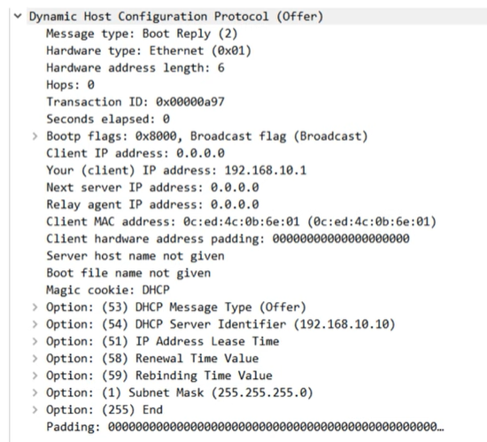

# Quiz: DHCP
## Quiz 1
What is the right order of messages when a DHCP client gets an IP address from a server?

A) Request - Discover - Offer - Ack
B) Discover - Offer - Request - Ack
C) Discover - Ack - Request - Offer
D) Offer - Request - Discover - Ack

### Anwser
Anwser is B.

---
Which of the following windows command prompt commands will cause a PC to broadcast a DHCP Discover message?

A) ipconfig /dhcp
B) ipconfig /dhcpdiscover
C) ipconfig /release
D) ipconfig /renew

### Anwser
Anwser is D.

---

## Quiz 3
Examine the following DHCP offer message that SRV1 sent to R2.
What destination IP address did SRV1 sent it to?

A) 0.0.0.0
B) 192.168.10.1
C) 192.168.10.10
D) 255.255.255.255

### Anwser
Anwser is D.

---
## Quiz 4
Which of the following DHCP messages can be sent using unicast?
(select all that apply)

A) DHCP Ack
B) DHCP Discover
C) DHCP Release
D) DHCP Request
E) DHCP Offer

### Anwsers
Anwsers are A, C and E.

### Explanation
Unicast means that a message is sent directly from one device to a specific destination rather than to all devices on the network. In DHCP, some messages can be unicast because the sender already knows the IP address of the receiver.

**A) DHCP Ack**  
The server can send the Ack as unicast because it already knows the client’s MAC address and the IP address it is assigning.

**C) DHCP Release**  
The client sends a Release directly to the server, and since the client already has a valid IP address at that moment, it can send the message as unicast.

**E) DHCP Offer**  
The server may send the Offer as unicast when it already knows the client’s MAC address and the network supports it. This depends on the implementation and relay behavior.

The other messages are not unicast capable:

- **Discover** is always broadcast because the client does not yet know any server address.  
- **Request** is broadcast so all DHCP servers know which offer the client accepted.

---
## Quiz 5
In which of the following situations would you configure a router as a DHCP relay agent?

A) When the router is not a DHCP server, there are DHCP clients in the router’s connected LAN, and there is no other DHCP server in the connected LAN.  
B) When the router is a DHCP server, there are DHCP clients in the router’s connected LAN, and there is no other DHCP server in the connected LAN.  
C) When the router is not a DHCP server, there are no DHCP clients in the router’s connected LAN, and there is no other DHCP server in the connected LAN.  
D) When the router is a DHCP server, there are DHCP clients in the router’s connected LAN, and there is another DHCP server in the connected LAN.

### Answer
Answer is A.

### Explanation
A DHCP relay agent is needed when clients send broadcast Discover messages but the DHCP server is located on a different network. In option A, the router is not a DHCP server, there are clients that need addresses, and there is no DHCP server on the local LAN. The router must therefore forward the client’s DHCP messages to a remote DHCP server. In the other options, either the router itself is already a DHCP server or there are no clients that require DHCP, so a relay agent is not needed.

---

## Quiz 6
You are the administrator for the network shown above. DHCP services are provided by the DHCP server on NetworkB.  
DHCP is not running on the routers.

Which of the following commands should you issue to enable clients on NetworkA to receive IP addresses from the DHCP server?

A) `RouterB(config-if)#ip helper-address 10.10.1.2` 
B) `RouterB(config-if)#ip helper-address 10.10.1.1` 
C) `RouterA(config-if)#ip helper-address 10.10.1.1` 
D) `RouterA(config-if)#ip helper-address 10.10.1.2` 
E) `RouterB(config-if)#ip helper-address 10.10.3.5` 
F) `RouterA(config-if)#ip helper-address 10.10.3.5`

### Answer
Answer is **F**.

### Explanation
Clients on NetworkA send DHCP Discover messages as broadcasts, but the DHCP server is located on NetworkB. RouterA must therefore act as a DHCP relay agent. The helper address must point to the **actual DHCP server**, which has IP address **10.10.3.5**. The correct configuration is applied on the interface facing the clients, which is RouterA’s LAN interface. 
