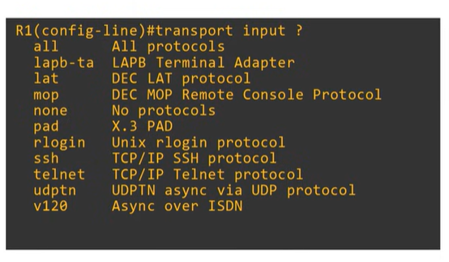
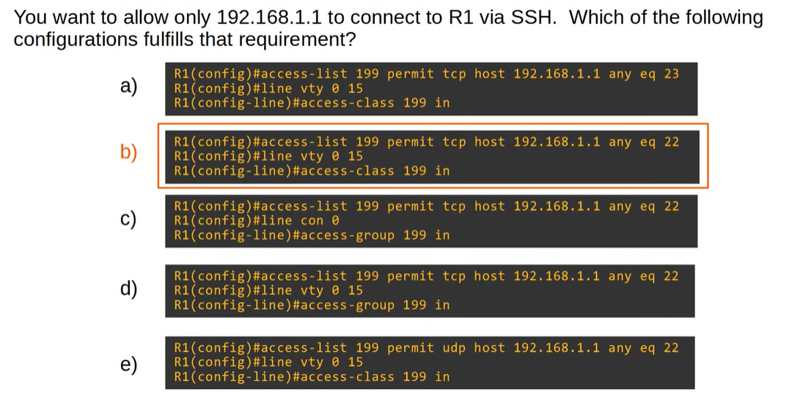

# Quiz: SSH
## Quiz 1
Which of the following are possible reasons why the command `crypto key generate rsa` is rejected on a Cisco router?  
(Select two.)

a) A host name hasn’t been configured  
b) The `ip ssh version 2` command hasn’t been configured  
c) The `transport input ssh` command hasn’t been configured  
d) Only switches can generate RSA keys  
e) A DNS domain name hasn’t been configured  
f) SSH version 1.99 is enabled

### Answer
Answers are **a** and **e**.

### Explanation
A Cisco device cannot generate RSA keys unless it has both a **hostname** and a **DNS domain name** configured. These two values are combined to form the device’s fully qualified domain name, which is required for RSA key creation. The other options do not prevent RSA key generation: SSH version settings and transport input settings are applied **after** keys exist, and routers (not only switches) can generate RSA keys.

---
## Quiz 2
Which of the following commands would allow both Telnet and SSH to be used to connect to the VTY lines of a device?  
(select two, each answer is a complete solution)

a) transport input default  
b) transport input none  
c) transport input telnet ssh  
d) transport input all  



### Answer
Answers are **c** and **d**.

### Explanation
To allow both Telnet and SSH on the VTY lines, the device must accept both protocols as valid input methods.  
The command **transport input telnet ssh** explicitly enables only Telnet and SSH, which satisfies the requirement.  
The command **transport input all** also works because it enables every supported protocol, including Telnet and SSH.  
The other options do not allow both: **default** depends on platform behavior, **none** disables all protocols.

---
## Quiz 3


### Anwser
The correct answer is b.

### Explanation
To allow only 192.168.1.1 to connect to R1 via SSH, the ACL must permit TCP port 22, and it must be applied to the VTY lines using access-class. Option b is the only configuration that uses the correct protocol (TCP), the correct port (22), and applies the ACL in the correct direction on the correct line type.

---
## Quiz 4
Which of the following statements about SSH are true?  
(select two)

a) RSA keys are optional but recommended  
b) K9 IOS images support SSH  
c) SSH version 1.99 was released between version 1 and version 2  
d) SSH sends data in plain text  
e) NPE IOS images support SSH  
f) A key length of at least 768 bits is required for SSHv2

### Answer
Answers are **b** and **f**.

### Explanation
K9 IOS images include strong cryptographic features, which means they support SSH.  
SSHv2 requires RSA keys of at least **768 bits**, so option **f** is also correct.  
The other statements are incorrect: RSA keys are not optional because SSH cannot function without them, SSH does not send data in plain text, version 1.99 is simply a compatibility identifier (not a real version between 1 and 2), and NPE IOS images do not include cryptographic support.

---

## Quiz 5
A network admin using PC1 is remotely configuring SW1 by connecting to the CLI of SW1 via SSH.  
What is the role of SW1 in this situation?

a) SSH peer  
b) SSH server  
c) SSH client  
d) None of the above  

### Answer
Answer is **b**.

### Explanation
When a device is being remotely accessed through SSH, that device acts as the **SSH server** because it listens for incoming SSH connections on TCP port 22. The administrator’s PC initiates the connection, so the PC is the SSH client. Therefore, SW1’s role in this scenario is the SSH server.

---

## Quiz 6
You want to configure SSH for incoming VTY connections on a router with the host name Router1.  
Router1 is running a K9 IOS image but has not yet been configured with a domain name or an RSA key pair.  
The VTY lines are also not yet configured to accept SSH connections.

You issue the command:

```
crypto key generate rsa
```

Which of the following messages will you most likely receive?  
(Select the best answer.)

A) The name for the keys will be:  
B) Please define a domain-name first.  
C) Please create RSA keys to enable SSH.  
D) Please define a hostname other than Router.  
E) Please enable SSH version 2.

### Answer
Answer is **B**.

### Explanation
A Cisco device **cannot generate RSA keys** unless both a **hostname** and a **DNS domain name** are configured.  
In this scenario, the hostname *is* configured (Router1), but the **domain name is missing**, so the router will reject the RSA key generation and display the message:

**“Please define a domain-name first.”**

SSH version settings and VTY configuration do not affect RSA key creation, and the hostname is already valid, so the other options are incorrect.
