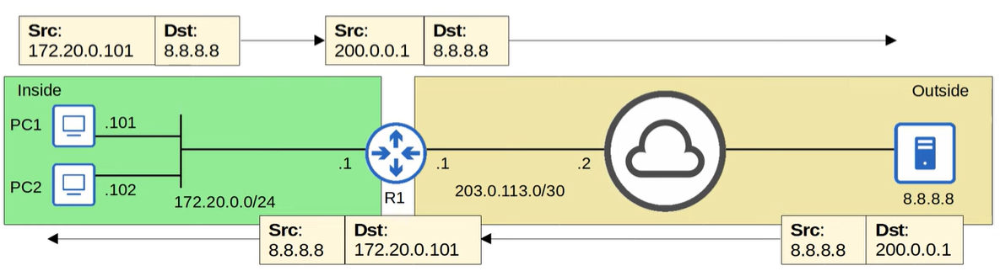

# Quiz: NAT

## Quiz 1
Which command configures a static source NAT mapping of 192.168.10.10 to 203.0.113.10?

A) R1(config)# ip nat inside source static 203.0.113.10 192.168.10.10  
B) R1(config)# ip nat inside static source 192.168.10.10 203.0.113.10  
C) R1(config)# ip nat source inside static 203.0.113.10 192.168.10.10  
D) R1(config)# ip nat inside source static 192.168.10.10 203.0.113.10  

### Answer
D

### Explanation
Static NAT syntax is:

`ip nat inside source static <inside-local> <inside-global>`

- inside-local = 192.168.10.10  
- inside-global = 203.0.113.10  

Option D matches the correct order and syntax.

---

## Quiz 2
You configured:  
`ip nat inside source static 10.0.0.1 20.0.0.1`

What happens if you then configure:  
`ip nat inside source static 10.0.0.2 20.0.0.1` ?

A) 10.0.0.1 and 10.0.0.2 will both be translated to 20.0.0.1  
B) Only 10.0.0.1 will be translated to 20.0.0.1  
C) Only 10.0.0.2 will be translated to 20.0.0.1  
D) 20.0.0.1 will be translated to 10.0.0.1 or 10.0.0.2  

### Answer
B

### Explanation
Static NAT requires **unique inside-global addresses**.  
You cannot map two inside-local addresses to the same inside-global address.

- First mapping (10.0.0.1 → 20.0.0.1) stays active  
- Second mapping (10.0.0.2 → 20.0.0.1) is rejected  

Only **10.0.0.1** will be translated.

---

## Quiz 3
`show ip nat statistics` shows:  
Total active translations: **7** (3 static, 4 dynamic)

How many active translations remain after:  
`clear ip nat translation *` ?

A) 0  
B) 3  
C) 4  
D) 7  

### Answer
B (3)

### Explanation
`clear ip nat translation *` removes **dynamic** translations only.  
Static translations are permanent and cannot be cleared.

- 4 dynamic → removed  
- 3 static → remain  

Total = **3**

---

## Quiz 4
Which of the following are private IPv4 addresses? (select all that apply)

A) 10.254.255.0  
B) 192.169.0.1  
C) 172.32.1.22  
D) 192.191.20.2  
E) 172.20.2.3  
F) 10.11.12.13  

### Answer
A, E, F

### Explanation
Private IPv4 ranges (RFC 1918):

- 10.0.0.0/8 → 10.0.0.0–10.255.255.255  
- 172.16.0.0/12 → 172.16.0.0–172.31.255.255  
- 192.168.0.0/16 → 192.168.0.0–192.168.255.255  

Check each option:

- **A)** 10.254.255.0 → private  
- **B)** 192.169.0.1 → public  
- **C)** 172.32.1.22 → public  
- **D)** 192.191.20.2 → public  
- **E)** 172.20.2.3 → private  
- **F)** 10.11.12.13 → private

---

## Quiz 5
Examine the packet flow below as PC1 pings 8.8.8.8 and receives a reply. Identify each of the following addresses in this situation, from R1's perspective:

Outisde Global: **8.8.8.8**
Outside Local: **8.8.8.8**
Inside Local: **172.20.0.101**
Inside Global: **200.0.0.1**



### Explanation
NAT uses four terms to describe addresses from the router’s point of view:

- **Inside Local**  
  The private IP address of the internal host.  
  → PC1’s private address: **172.20.0.101**

- **Inside Global**  
  The public IP address representing the inside host after NAT translation.  
  → R1 translates PC1 to: **200.0.0.1**

- **Outside Global**  
  The real, public IP address of the external destination host.  
  → The server’s public address: **8.8.8.8**

- **Outside Local**  
  How the external host appears *inside* the network.  
  In most cases (including this one), it is the same as the outside global.  
  → **8.8.8.8**

So the mapping is:

- PC1 (inside local) **172.20.0.101**  
  → translated to inside global **200.0.0.1**

- Server (outside global) **8.8.8.8**  
  → appears internally as outside local **8.8.8.8**

This matches the packet flow shown in the diagram.

---

## Quiz 6
You issue the `show ip nat translations` command on RouterA and see the following entries:

| Pro | Inside global     | Inside local      | Outside local     | Outside global    |
|-----|--------------------|--------------------|--------------------|--------------------|
| udp | 192.0.2.7:49713    | 10.20.30.55:49713  | 203.0.113.9:69     | 203.0.113.9:69     |
| tcp | 192.0.2.8:49716    | 10.20.30.32:49716  | 203.0.113.13:23    | 203.0.113.13:23    |

HostA establishes a TFTP connection with HostB.

What is the IP address of HostA?

A) 203.0.113.9  
B) 192.0.2.8  
C) 10.20.30.32  
D) 203.0.113.13  
E) 192.0.2.7  
F) 10.20.30.55  

### Answer
F (10.20.30.55)

### Explanation
A TFTP connection uses **UDP port 69**, so we look at the **UDP** NAT translation entry.

UDP entry:
- Inside local: **10.20.30.55:49713**  
- Inside global: 192.0.2.7:49713  
- Outside local/global: 203.0.113.9:69  

The **inside local** address represents the **real internal IP** of HostA before NAT translation.

Therefore:
- HostA = **10.20.30.55**

This matches the inside-local field for the UDP/TFTP session.

---
## Quiz 7
Which of the following NAT types best fulfills the goal of preserving public IPv4 address?

A) static NAT
B) source NAT
C) Dynamic NAT
D) NAT overload

### Anwser
Anwser is D.

### Explanation
- **Static NAT** uses a 1:1 mapping → **does NOT save public IPs**.  
- **Source NAT** is a general term and can still be 1:1.  
- **Dynamic NAT** also uses 1:1 mappings from a pool → **still consumes many public IPs**.  
- **NAT overload (PAT)** uses **many inside hosts sharing ONE public IPv4 address**, differentiated by port numbers.

Because it allows **hundreds or thousands of devices** to use **a single public IP**, NAT overload is the most effective method for **preserving public IPv4 address space**.

---

## Quiz 8
Which of the following dynamic NAT configurations will translate inside local addresses from **172.16.1.0/24** to addresses from the subnet **203.0.113.0/25**?

A)
```
access-list 1 deny 172.16.1.0 0.0.0.255
ip nat pool POOL1 203.0.113.0 203.0.113.255 netmask 255.255.255.128
ip nat inside source list 1 pool POOL1
interface g0/0
 ip nat inside
interface g0/1
 ip nat outside
```

B)
```
access-list 1 permit 172.16.1.0 0.0.0.255
ip nat pool POOL1 203.0.113.0 203.0.113.127 netmask 255.255.255.128
ip nat inside source list 1 pool POOL1
interface g0/0
 ip nat inside
interface g0/1
 ip nat outside
```

C)
```
access-list 1 permit 172.16.1.0 255.255.255.0
ip nat pool POOL1 203.0.113.0 203.0.113.127 prefix-length 25
ip nat inside source list 1 pool POOL1
interface g0/0
 ip nat inside
interface g0/1
 ip nat outside
```

### Answer
Answer is **B**.

### Explanation
To correctly configure **dynamic NAT**, three things must be correct:

1. **ACL must permit the inside local subnet**  
   - Option A denies the subnet → ❌  
   - Option B permits it with correct wildcard mask → ✔  
   - Option C uses an incorrect wildcard mask (`255.255.255.0` instead of `0.0.0.255`) → ❌

2. **NAT pool must match the target public subnet**  
   Required: **203.0.113.0/25**  
   - Range for /25 = **203.0.113.0 – 203.0.113.127**  
   - Option B uses exactly this range → ✔  
   - Option A uses /25 mask but wrong end address (255 instead of 127) → ❌  
   - Option C uses correct range but ACL is wrong → ❌

3. **NAT inside/outside interfaces must be configured**  
   All options include this → ✔

Only **Option B** satisfies **all** requirements:
- Correct ACL  
- Correct NAT pool range  
- Correct subnet mask  
- Correct NAT binding  

Therefore, **B is the only valid configuration**.

---
## Quiz 9
R1 is configured for **Dynamic NAT** with a pool of 10 inside global addresses.  
All 10 addresses are currently in use.

What does R1 do when another inside host tries to send a packet to the Internet?

A) It uses PAT to translate the source IP address of the packet.  
B) It discards the packet.  
C) It holds the packet until an inside global address becomes available.  
D) It translates the source IP to the statically mapped inside global address.  

### Answer
**B — It discards the packet.**

### Explanation
Dynamic NAT uses a **one‑to‑one** mapping between inside local and inside global addresses.  
If the NAT pool is exhausted:

- There are **no available inside global addresses** left.  
- Dynamic NAT **cannot create a new translation**.  
- The router **drops the packet immediately**.  
- The host cannot access outside networks until a mapping times out or is cleared.

Dynamic NAT **does NOT**:
- fall back to PAT (A is wrong)  
- queue or buffer packets (C is wrong)  
- use static mappings unless explicitly configured (D is wrong)

Therefore, the correct behavior is to **discard the packet**.

---
## Quiz 10
Which of the following dynamic NAT configurations will translate inside local addresses from **10.0.1.0/27** to use the **IP address of the router’s G0/1 interface**?

A)
```
access-list 1 permit 10.0.1.0 0.0.0.31
ip nat inside source list 1 interface gigabitethernet0/1 overload
interface g0/0
 ip nat inside
interface g0/1
 ip nat outside
```

B)
```
access-list 1 permit 172.16.1.0 0.0.0.31
ip nat inside source list 1 pool gigabitethernet0/1 overload
interface g0/0
 ip nat inside
interface g0/1
 ip nat outside
```

C)
```
access-list 1 permit 172.16.1.0 0.0.0.31
ip nat inside source list 1 interface gigabitethernet0/1 overload
interface g0/0
 ip nat inside
interface g0/1
 ip nat inside
```

D)
```
access-list 1 permit 172.16.1.0 0.0.0.224
ip nat inside source list 1 interface gigabitethernet0/1 overload
interface g0/0
 ip nat inside
interface g0/1
 ip nat outside
```

### Answer
**A**

### Explanation
To configure **NAT overload (PAT)** using the **IP address of the G0/1 interface**, the configuration must include:

1. **Correct ACL**  
   Must match **10.0.1.0/27** → wildcard mask **0.0.0.31**  
   ✔ Only option **A** uses the correct subnet.

2. **Correct NAT command**  
   Must use:  
   `ip nat inside source list 1 interface g0/1 overload`  
   ✔ Option **A** uses the correct syntax.

3. **Correct inside/outside interface roles**  
   - g0/0 = inside  
   - g0/1 = outside  
   ✔ Option **A** is correct.

All other options fail because:
- B, C, D use the **wrong subnet** (172.16.x.x instead of 10.0.1.x)  
- C incorrectly sets g0/1 as **inside**  
- B uses an invalid pool name instead of interface  
- D uses the wrong wildcard mask (**0.0.0.224**)

Therefore, **A is the only valid configuration**.

---
## Quiz 11
After specifying the inside and outside NAT interfaces, you issue the following commands on R1.  
What will happen to hosts from the **192.168.1.0/24** subnet?

```
access-list 1 permit 10.0.1.0 0.0.0.255
access-list 1 deny 192.168.1.0 0.0.0.255
ip nat pool POOL1 203.0.113.0 203.0.113.255 prefix-length 24
ip nat inside source list 1 pool POOL1
```

A) The source IP of their packets will be translated to an address from 203.0.113.0/24.  
B) The packets they send will be discarded by R1.  
C) The packets they send will not be translated by R1.  
D) The packets they send will be discarded until an inside global address is available.  

### Answer
**C — The packets they send will not be translated by R1.**

### Explanation
Dynamic NAT uses an **ACL** to determine which traffic should be translated:

- If the source IP is **permitted** by the ACL → NAT translation occurs.  
- If the source IP is **denied** by the ACL → NAT translation does **not** occur.  
  Importantly, the traffic is **not dropped** — it simply passes through **without translation**.

In this configuration:
- The ACL **permits** 10.0.1.0/24 → translated using pool POOL1.  
- The ACL **denies** 192.168.1.0/24 → packets from this subnet are **not translated**.  
- NAT does **not discard** or **queue** these packets; they just leave with their original private source IPs.

Therefore, hosts in **192.168.1.0/24** will send packets that **are not translated** by R1.

---

## Quiz 12
HostA is initiating an HTTP connection to HostB through RouterA (NAT router).

IP addresses:
- HostA: **10.1.7.7**  
- HostB: **192.0.2.28**  
- RouterA inside interface: **10.1.7.1**  
- RouterA outside interface: **203.0.113.62**

Which NAT translation entry would appear in `show ip nat translations`?

A)
Pro Inside global | Inside local | Outside local | Outside global  
tcp 203.0.113.62:49912 | 10.1.7.1:49912 | 192.0.2.28:80 | 192.0.2.28:80  

B)
Pro Inside global | Inside local | Outside local | Outside global  
tcp 10.1.7.1:49912 | 10.1.7.7:49912 | 192.0.2.28:80 | 192.0.2.28:80  

C)
Pro Inside global | Inside local | Outside local | Outside global  
tcp 203.0.113.62:49912 | 10.1.7.7:49912 | 192.0.2.28:80 | 192.0.2.28:80  

D)
Pro Inside global | Inside local | Outside local | Outside global  
tcp 10.1.7.7:49912 | 10.1.7.1:49912 | 192.0.2.28:80 | 192.0.2.28:80  

### Answer
**C**

### Explanation
To determine the correct NAT translation entry, apply the NAT terminology:

- **Inside local** = the real internal IP  
  → **10.1.7.7** (HostA)

- **Inside global** = the public IP representing the inside host  
  → **203.0.113.62** (RouterA’s outside interface)

- **Outside global** = the real public IP of the external server  
  → **192.0.2.28**

- **Outside local** = how the outside host appears inside the network  
  → also **192.0.2.28** (no translation on the outside host)

Port 49912 is the ephemeral source port chosen by HostA.

So the correct NAT table entry is:

- Inside local: **10.1.7.7:49912**  
- Inside global: **203.0.113.62:49912**  
- Outside local/global: **192.0.2.28:80**

This matches **Option C**.
