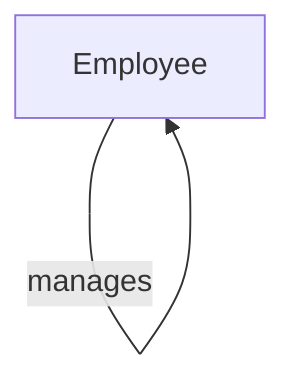
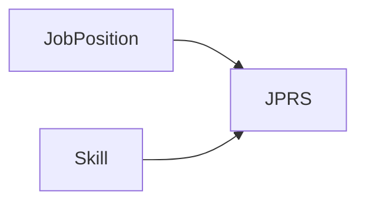
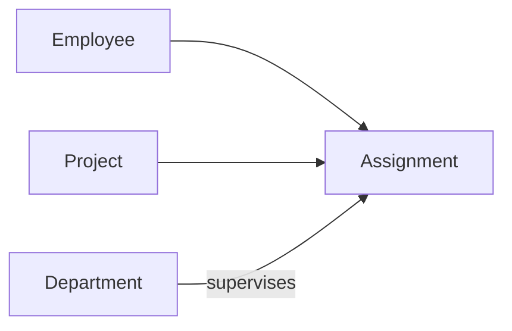
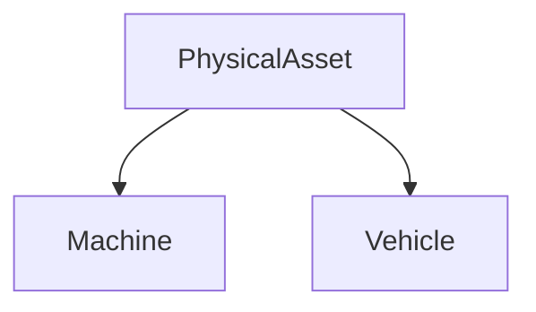

# Data Modelling  
*By Lukas Van der Spiegel (Author)*

This chapter provides a compact recap of data modelling fundamentals: what data models are, why they matter, how they are structured, and how to represent real‑world information using conceptual, logical, and physical models.

---

## Purpose of Data Modelling

Data modelling helps you:

- Understand and structure real‑world information  
- Translate business requirements into database structures  
- Improve data quality, consistency, and maintainability  
- Reduce long‑term system cost and complexity  

A data model is a **design tool** that bridges business needs and technical implementation.

## What Is a Data Model?

A data model describes:

- What data will be stored  
- How data is structured  
- How data relates to other data  

In relational databases, data is organised into **tables**, with **rows**, **columns**, and **relationships**.

Modelling is a **design activity**:  
There is rarely only one correct solution, and choices depend on requirements, constraints, and interpretation.

## Why Data Modelling Matters

A good data model:

- Reduces redundancy  
- Enforces business rules  
- Improves data quality  
- Supports scalability and flexibility  
- Simplifies programming  
- Reduces maintenance cost  

A poor model becomes expensive very quickly.

## Data Modelling in Context

Data modelling plays a role in:

- Enterprise architecture  
- Application development  
- Packaged solutions (ERP, CRM)  
- Data governance  
- Metadata management  
- Business intelligence  
- Master data management  

It is a small part of system design, but with **huge impact**.

## Levels of Abstraction

Conceptual → Logical → Physical

- **Conceptual Data Model (CDM)**  
  High‑level, business‑friendly, technology‑independent  
- **Logical Data Model (LDM)**  
  More detail, attributes, keys, constraints  
- **Physical Data Model (PDM)**  
  Actual implementation in a DBMS (PostgreSQL, SQL Server, etc.)

## Design Stages & Deliverables

1. Gather business requirements  
2. Identify information requirements  
3. Build conceptual data model  
4. Build logical data model  
5. Build physical data model  
6. Apply technology and performance constraints  

## Conceptual Data Model (CDM)

The CDM describes **what** the system must store using:

- Entity classes  
- Relationships  
- Attributes (high‑level)  

Audience: business stakeholders  
Goal: communication and clarity  

Example entities:  
Course, Student, Teacher, Certificate

## Building Models

Approaches:

- **Top‑down**: start from business concepts  
- **Bottom‑up**: start from existing data  
- **Middle‑out**: mix of both  

## CDM Terminology

Three core concepts:

- **Entity Classes** (nouns)  
- **Relationships** (verbs)  
- **Attributes** (properties)  

The process is called **Entity‑Relationship Modelling (ER modelling)**.

## Entity Classes

An entity class represents a category of real‑world things:

- Person  
- Product  
- Order  
- Location  
- Machine  

Rules:

- Name must be singular  
- Represents a collection of entities  
- Usually becomes a table in a database  

Examples of nouns in organisations:

- Who: Customer, Employee  
- What: Product, Material  
- Where: Address, Region  
- When: Fiscal Year  
- Why: Order, Claim  
- How: Invoice, Certificate  

## Entity Definitions

A good definition answers:

1. What distinguishes this entity from others?  
2. What distinguishes one instance from another?  

Example:  
A Customer is a person or organisation who has purchased at least one product and has an active account.

## Relationships (Verbs)

Relationships describe how entities interact.

Example:  
Customer makes Purchase  
Purchase is made by Customer

Every relationship must be defined **in both directions**.

## Cardinality (How Many)

Examples:

- One‑to‑one (1:1)  
- One‑to‑many (1:N)  
- Many‑to‑many (M:N)

Example 1:N:  
Each Department may be responsible for many Projects  
Each Project must belong to one Department

## Optionality (Must or May)

Examples:

- A Customer may make Purchases  
- A Purchase must be made by a Customer  

Optionality defines whether a relationship is mandatory.

## Mermaid Diagrams for Relationships

One‑to‑many example:

Many‑to‑many example:

Recursive hierarchy example:

## Many‑to‑Many Resolution

M:N relationships must be resolved into two 1:N relationships using an **associative entity**.

Example:

Job Position  
Skill  
Job Position Required Skill (associative)

## Aggregation

Aggregation treats a relationship as an entity so it can participate in another relationship.

Example:  
Employee works on Project  
Department supervises that assignment

## Subtypes & Supertypes

Used when:

- Different identifiers  
- Different attributes  
- Different relationships  
- Different rules  

Example:

Physical Asset  
→ Machine  
→ Vehicle

Rules:

- Subtypes must be **non‑overlapping**  
- Subtypes must be **exhaustive**

## Mutually Exclusive Relationships

Example:

A Tax Audit applies to exactly one of:  
- Company  
- Individual  
- Non‑profit organisation  

Represented using an **exclusivity arc**.

## Transferability

Some relationships allow transfer; others do not.

Example:

- Software License may be transferred  
- Shooting License may not  

This affects identifiers, history, and modelling choices.

## Dependent vs Independent Entities

A dependent entity:

- Cannot exist without its parent  
- Cannot be transferred  

Example:  
Order Item depends on Order.

## Attributes

Attributes describe entity properties.

Conceptual model: business‑friendly definitions  
Logical/physical model: data types, constraints, keys

Attribute types:

- Identifier  
- Category  
- Quantifier  
- Text  

Examples:

- Customer Number (identifier)  
- Payment Method (category)  
- Order Quantity (quantifier)  
- Product Name (text)

## Attribute Domains

A domain defines the allowed values and meaning of an attribute.

Rules:

- Only attributes in the same domain can be compared  
- Domains improve consistency and clarity  
- Domains support validation and quality  

## Business Rules

Types:

- **Data rules**  
  Validation, referential integrity, cardinality  
- **Derivation rules**  
  Calculations  
- **Process rules**  
  Behaviour of the system  

Business rules appear in:

- ER diagrams (relationships, cardinality, optionality)  
- CDM definitions  
- Attribute constraints  

## Other Notations (UML)

UML uses:

- Classes  
- Associations  
- Multiplicity (0..1, 1, 1..*, etc.)  
- Association classes  

Example:

Department 1 —— 0..* Project