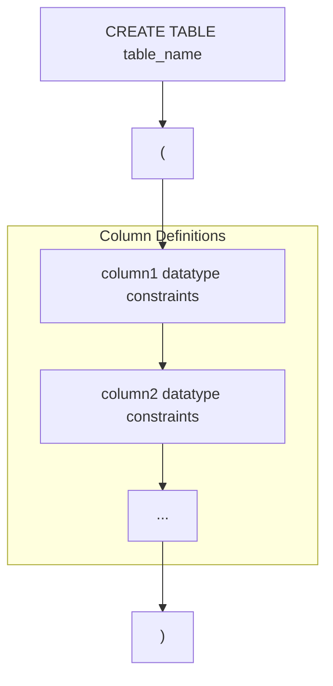
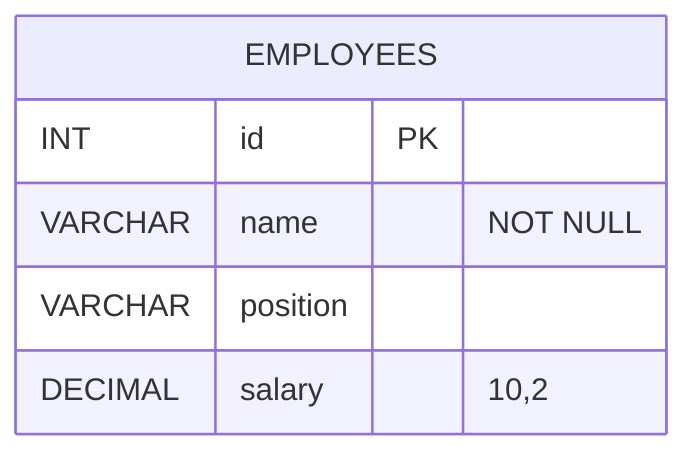

# CREATE
The `CREATE` statement is used to create a new table, view, or other database object in SQL. The syntax for creating a table is as follows:

```sql
CREATE TABLE table_name (
    column1 datatype constraints,
    column2 datatype constraints,
    ...
);
```
- `table_name`: The name of the table you want to create.
- `column1`, `column2`, ...: The names of the columns in the table
- `datatype`: The data type for each column (e.g., `INT`, `VARCHAR(255)`, `DATE`)
- `constraints`: Optional constraints for each column (e.g., `PRIMARY KEY`, `NOT NULL`, `UNIQUE`)



**Example:**
```sql
CREATE TABLE employees (
    id INT PRIMARY KEY,
    name VARCHAR(255) NOT NULL,
    position VARCHAR(255),
    salary DECIMAL(10, 2)
);
```



This example creates a table named `employees` with four columns: `id`, `name`, `position`, and `salary`. The `id` column is an integer and serves as the primary key, while the `name` column is a variable character string that cannot be null. The `position` column is a variable character string, and the `salary` column is a decimal number with a precision of 10 and a scale of 2.