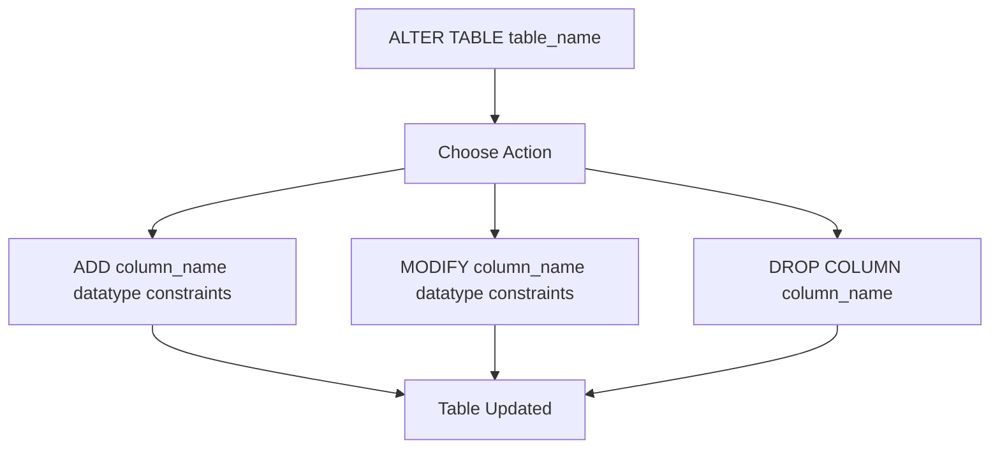
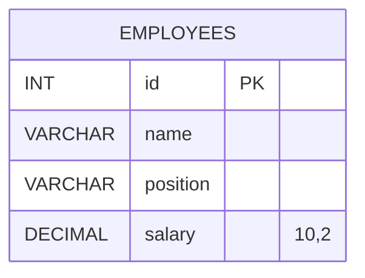
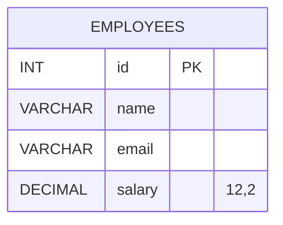

# ALTER

The `ALTER` statement is used to modify an existing table in SQL. The syntax for altering a table is as follows:

```sql
ALTER TABLE table_name
    ADD column_name datatype constraints,
    MODIFY column_name datatype constraints,
    DROP COLUMN column_name;
```



- `table_name`: The name of the table you want to modify.
- `ADD column_name datatype constraints`: Adds a new column to the table.
- `MODIFY column_name datatype constraints`: Modifies the data type or constraints of an existing column.
- `DROP COLUMN column_name`: Removes a column from the table.

**Example:**

```sql
ALTER TABLE employees
    ADD email VARCHAR(255),
    MODIFY salary DECIMAL(12, 2),
    DROP COLUMN position;
```

<table>
  <tr>
    <td>



    </td>
    <td>



    </td>

  </tr>
</table>
