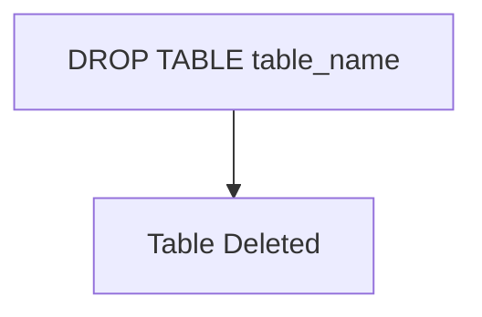

# DROP

The `DROP` statement is used to delete an existing table in SQL. The syntax for dropping a table is as follows:

```sql
DROP TABLE table_name;
```



- `table_name`: The name of the table you want to delete.

**Example:**

```sql
DROP TABLE employees;
```