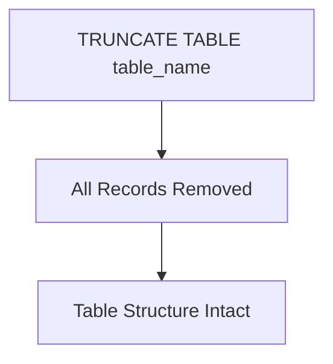

# TRUNCATE
- **Purpose**: Remove all records from a table, but keep the structure
- **Syntax**:
```sql
TRUNCATE TABLE table_name;
```


- `table_name`: The name of the table you want to truncate.
**Example:**
```sql
TRUNCATE TABLE employees;
```
This example removes all records from the `employees` table while keeping the table structure intact. After executing this command, the `employees` table will be empty, but you can still insert new records into it without needing to recreate the table.