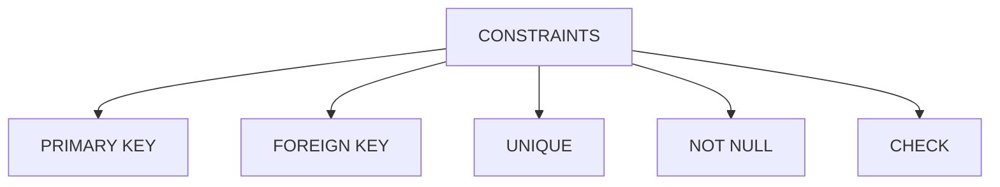

# CONSTRAINTS
A constraint is a rule that limits the type of data that can be stored in a table. Constraints are used to ensure the integrity of the data in the database. There are several types of constraints in SQL, including:

- `PRIMARY KEY`: A primary key is a column or a set of columns that uniquely identifies each row in a table. A table can have only one primary key, and it cannot contain NULL values.
- `FOREIGN KEY`: A foreign key is a column or a set of columns that refers to the primary key of another table. It is used to establish a relationship between two tables.
- `UNIQUE`: A unique constraint ensures that all values in a column are different. It allows NULL values, but only one NULL value is allowed.
- `NOT NULL`: A not null constraint ensures that a column cannot have a NULL value. It is used to enforce that a column must always have a value.
- `CHECK`: A check constraint is used to limit the values that can be placed in a column. It allows you to specify a condition that must be met for the data to be inserted or updated in the table.



**Example:**

```sql
CREATE TABLE employees (
    id INT PRIMARY KEY,
    name VARCHAR(255) NOT NULL,
    email VARCHAR(255) UNIQUE,
    salary DECIMAL(10, 2) CHECK (salary > 0),
    department_id INT,
    FOREIGN KEY (department_id) REFERENCES departments(id)
);
```
This example creates a table named `employees` with several constraints. The `id` column is the primary key, ensuring that each employee has a unique identifier. The `name` column cannot be null, meaning every employee must have a name. The `email` column must contain unique values, preventing duplicate email addresses. The `salary` column has a check constraint that ensures all salaries are greater than 0. Finally, the `department_id` column is a foreign key that references the `id` column in the `departments` table, establishing a relationship between the two tables.